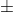
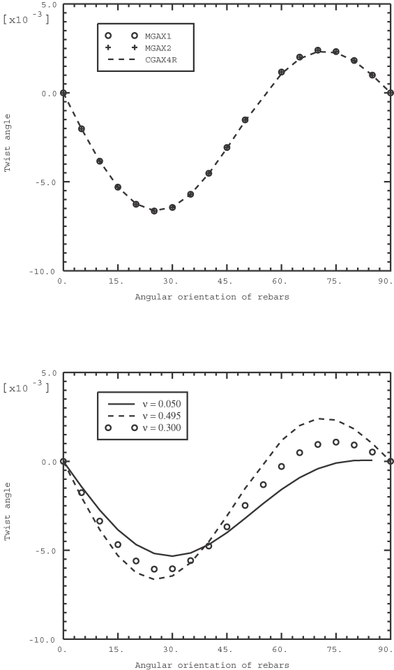

# 1.11.1 Rebar in Abaqus/Standard

**Product: **Abaqus/Standard  

### I. Rebars in membranes

### Elements tested

M3D4    M3D4R    M3D8    M3D8R    

### Problem description

These tests verify the modeling of element reinforcements in membrane elements. The rebar option is tested in the areas of kinematics, prestressing of the rebar, compatibility with material property definitions, and compatibility with prescribed temperatures and field variables. All membranes that allow rebar are tested and compared to continuum and shell elements. Each input file contains tests for membrane, continuum, and shell elements.

Kinematics are tested by applying a uniaxial displacement with various rebar orientations. In the first test rebar are placed along the *x*-axis, and a displacement is prescribed in the *x*-direction. In the second test rebar are oriented at 30 from the *x*-axis. Again, a prescribed displacement is applied along the *x*-axis. In the third test rebar are oriented along the *y*-axis, and a displacement is prescribed in the *x*-direction. The fourth test includes large geometry changes. The rebar are initially defined at 30 from the *x*-axis. A large displacement is prescribed in the *x*-direction and causes the orientation of the rebar to change because of the large shearing strains. The fifth and sixth tests define various rebar orientations. In the seventh test rebar angle output is measured with respect to the second isoparametric direction.

The material test includes five combinations of material definitions for the base element and the rebar. For each combination a single element is loaded with a prescribed uniaxial displacement. Elastic, elastic-plastic, hyperelastic, and hypoelastic material properties are used. The combinations are as follows: elastic base and elastic rebar, elastic base and elastic-plastic rebar, elastic-plastic base and elastic rebar, hyperelastic base and elastic rebar, and elastic base and hypoelastic rebar.

Thermal expansion of the rebar is tested by constraining all the degrees of freedom of the elements and applying a temperature load. The rebar is positioned along the *x*-axis. The base material is dependent on temperature and the first field variable. The rebar properties are dependent on the second field variable. Step 1 uniformly increases the temperature from 0 to 100, with both field variables set to 1. Step 2 increases the first field variable from 0 to 1, and Step 3 increases the second field variable from 0 to 1.

Initial stresses are tested in two ways. The tests consist of a single underlying membrane element with isoparametric rebar. In the first test an initial tensile stress is applied to the rebar, and no initial stresses are applied to the underlying membrane element. Thus, the membrane element will compress, and the initial rebar tensile stress will be reduced until equilibrium with the underlying solid is reached. The second test applies an initial tensile stress to the rebar but forces this initial stress to remain constant by means of holding prestress in rebar. The stress in the rebar remains unchanged, whereas the underlying membrane deforms to equilibrate the rebar stress.

Input file [em_postoutput.inp](../eif/em_postoutput.inp) tests the postprocessing output procedure and ensures that rebar output quantities are written properly to the restart file.

Input file [em_nodalthick.inp](../eif/em_nodalthick.inp) tests variable thickness shells and membranes containing rebar. The nodal thickness procedure specifies a linearly varying element thickness.

### Results and discussion

The results agree with the analytically obtained values.

### Input files

[em_kinematics1.inp](../eif/em_kinematics1.inp)

Rebar, 0 orientation.

[em_kinematics2.inp](../eif/em_kinematics2.inp)

Rebar, 30 orientation.

[em_kinematics3.inp](../eif/em_kinematics3.inp)

Rebar, 90 orientation.

[em_kinematics4.inp](../eif/em_kinematics4.inp)

Rebar, 30 orientation, finite strains.

[em_kinematics5.inp](../eif/em_kinematics5.inp)

Rebar, defined using the ORIENTATION parameter on [*REBAR LAYER](../key/key-link.md#usb-kws-mrebarlayer).

[em_kinematics6.inp](../eif/em_kinematics6.inp)

Rebar, referencing user-defined [*ORIENTATION](../key/key-link.md#usb-kws-morientation).

[em_kinematics6.f](../eif/em_kinematics6.f)

User subroutine [`ORIENT`](../sub/sub-link.md#sub-xsl-orient) used in em_kinematics6.inp.

[em_kinematics7.inp](../eif/em_kinematics7.inp)

Rebar, test of rebar angle output measured with respect to the second isoparametric direction.

[em_material.inp](../eif/em_material.inp)

Rebar, 0 orientation, test of material combinations, perturbation step with [*LOAD CASE](../key/key-link.md#usb-kws-hloadcase).

[em_thermal.inp](../eif/em_thermal.inp)

Rebar, 0 orientation, test of temperature and field variable dependence.

[em_prestress.inp](../eif/em_prestress.inp)

Rebar, 0 orientation, test of initial stresses with and without [*PRESTRESS HOLD](../key/key-link.md#usb-kws-hprestresshold).

[em_prestress.f](../eif/em_prestress.f)

User subroutine [`SIGINI`](../sub/sub-link.md#sub-xsl-sigini) used in em_prestress.inp.

[em_postoutput.inp](../eif/em_postoutput.inp)

Rebar, postprocessing with the [*POST OUTPUT](../key/key-link.md#usb-kws-hpostoutput) option.

[em_nodalthick.inp](../eif/em_nodalthick.inp)

Rebar, variable thicknesses using the [*NODAL THICKNESS](../key/key-link.md#usb-kws-mnodalthickness) option.

### II. Rebars in surface elements

### Elements tested

SFM3D3    SFM3D4    SFM3D4R    SFM3D6    SFM3D8    SFM3D8R    

### Problem description

**Model: **

Similar to the one used for rebars in membranes.

**Material: **

Similar to the one used for rebars in membranes. 

### Results and discussion

The results agree with those for rebars in membranes when the material stiffness for the membranes is set nearly to zero.

### Input files

[ex_kinematics1.inp](../eif/ex_kinematics1.inp)

Rebar, 0 orientation.

[ex_kinematics2.inp](../eif/ex_kinematics2.inp)

Rebar, 30 orientation.

[ex_kinematics3.inp](../eif/ex_kinematics3.inp)

Rebar, 30 orientation, finite strains.

[ex_kinematics4.inp](../eif/ex_kinematics4.inp)

Rebar, defined using the ORIENTATION parameter on [*REBAR LAYER](../key/key-link.md#usb-kws-mrebarlayer).

[ex_kinematics5.inp](../eif/ex_kinematics5.inp)

Rebar, referencing user-defined [*ORIENTATION](../key/key-link.md#usb-kws-morientation).

[ex_kinematics5.f](../eif/ex_kinematics5.f)

User subroutine [`ORIENT`](../sub/sub-link.md#sub-xsl-orient) used in ex_kinematics5.inp.

[ex_material.inp](../eif/ex_material.inp)

Rebar, 0 orientation, test of material combinations.

[ex_thermal.inp](../eif/ex_thermal.inp)

Rebar, 0 orientation, test of temperature and field variable dependence.

[ex_prestress.inp](../eif/ex_prestress.inp)

Rebar, 0 orientation, test of initial stresses with and without [*PRESTRESS HOLD](../key/key-link.md#usb-kws-hprestresshold).

[ex_prestress.f](../eif/ex_prestress.f)

User subroutine [`SIGINI`](../sub/sub-link.md#sub-xsl-sigini) used in ex_prestress.inp.

### III. Rebars in general shells

### Elements tested

S4    S4R    S8R    S8R5    SC8R    

### Problem description

**Model: **

| Planar dimensions | 10 10 |
| --- | --- |
| Thickness | 2.0 (for tensile test), 10.0 (for bending test) |

**Material: **

| Young's modulus of bulk material | 1.0 (for tensile test), 3 106 (for bending test) |
| --- | --- |
| Young's modulus of rebar | 30 106 |
| Poisson's ratio of both materials | 0.0 |
| Reinforcement for tensile test | REBAR1, 1., 2.5, 0., RBMAT, 0, 1 |
|  | REBAR2, 1., 2.5, 0., RBMAT, 90, 1 |
|  | REBAR3, 1., 3.5355, 0., RBMAT, 45, 1 |
|  | REBAR4, 1., 3.5355, 0., RBMAT, 135, 1 |
| Reinforcement for bending test | REBAR, .1, 2.5, 2.5, RBMAT, 0, 1 |

### Results and discussion

The results agree with the analytically obtained values.

### Input files

[ese4sxr4.inp](../eif/ese4sxr4.inp)

S4 elements; tension with rebar; 0 orientation, 45 orientation, 90 orientation, and 135 orientation.

[ese4sxr3.inp](../eif/ese4sxr3.inp)

S4 elements; bending with rebar; 0 orientation.

[esf4sxr4.inp](../eif/esf4sxr4.inp)

S4R elements; tension with rebar; 0 orientation, 45 orientation, 90 orientation, and 135 orientation.

[esf4sxr3.inp](../eif/esf4sxr3.inp)

S4R elements; bending with rebar; 0 orientation.

[es68sxr4.inp](../eif/es68sxr4.inp)

S8R elements; tension with rebar; 0 orientation, 45 orientation, 90 orientation, and 135 orientation.

[es68sxr3.inp](../eif/es68sxr3.inp)

S8R elements; bending with rebar; 0 orientation.

[es58sxrd.inp](../eif/es58sxrd.inp)

S8R5 elements; bending with rebar; 0 orientation; response spectrum.

[esc8sxr4.inp](../eif/esc8sxr4.inp)

SC8R elements; tension with rebar; 0 orientation, 45 orientation, 90 orientation, and 135 orientation.

[esc8sxr3.inp](../eif/esc8sxr3.inp)

SC8R elements; bending with rebar; 0 orientation.

### IV. Rebars in axisymmetric membranes

### Elements tested

MAX1    MAX2    MGAX1    MGAX2    

### Problem description

**Model: **

| Length | 5.0 |
| --- | --- |
| Midsurface radius | 2.0 |
| Thickness | 0.05 |

**Material: **

| Young's modulus of bulk material | 1.0 105 |
| --- | --- |
| Young's modulus of rebar | 1.0 108 |
| Poisson's ratio of both materials | 0.495 |
| Reinforcement for tension and torsion tests | REBAR, 0.005, 0.31416, 0, RBMAT, 50 |

### Results and discussion

If rebars are not axial (rebar angle 0) or circumferential (rebar angle 90), element types MGAX1 and MGAX2 predict twist under axial tension (Step 1 in all the input files). The twist angle is determined by the initial rebar angle and the material properties. If the Poisson's ratio of the material is sufficiently different from zero, the twist angle changes sign at some intermediate rebar angle between 0 and 90. This result is accompanied by a change in sign of the stress in the rebar. This behavior is illustrated in [Figure 1.11.1--1](ch01s11abv129.md#verrebar-twist-v-angle)(a), where results for the twist angle are shown for element types MGAX1, MGAX2, and CGAX4R (axisymmetric continuum element with twist) when both the rebar and the bulk materials are almost incompressible. [Figure 1.11.1--1](ch01s11abv129.md#verrebar-twist-v-angle)(b) shows the evolution of this behavior with the Poisson's ratios of the materials. For  0.05 the twist angle does not change sign as the initial rebar angle changes from 0 to 90.

### Input files

[ema2srri.inp](../eif/ema2srri.inp)

MAX1 elements, tension.

[ema3srri.inp](../eif/ema3srri.inp)

MAX2 elements, tension.

[emg2srri.inp](../eif/emg2srri.inp)

MGAX1 elements, tension and torsion

[emg3srri.inp](../eif/emg3srri.inp)

MGAX2 elements, tension and torsion.

### V. Rebars in axisymmetric surface elements

### Elements tested

SFMAX1    SFMAX2    SFMGAX1    SFMGAX2    

### Problem description

**Model: **

Similar to the one used for rebars in axisymmetric membranes.

**Material: **

Similar to the one used for rebars in axisymmetric membranes.

### Results and discussion

The results agree with those for rebars in axisymmetric membranes when the material stiffness for the membranes is set nearly to zero.

### Input files

[exa2srri.inp](../eif/exa2srri.inp)

SFMAX1 elements, tension.

[exa3srri.inp](../eif/exa3srri.inp)

SFMAX2 elements, tension.

[exg2srri.inp](../eif/exg2srri.inp)

SFMGAX1 elements, tension and torsion

[exg3srri.inp](../eif/exg3srri.inp)

SFMGAX2 elements, tension and torsion.

### Figure

**Figure 1.11.1–1** Variation of twist with rebar angle.

### VI. Rebars in axisymmetric shells

### Elements tested

SAX1    SAX2    

### Problem description

**Model: **

| Length | 10.0 |
| --- | --- |
| Inside radius for hoop test | 5.0 (Flat solid disk for radial test) |
| Thickness | 2.0 |

**Material: **

| Young's modulus of bulk material | 1.0 |
| --- | --- |
| Young's modulus of rebar | 30 106 |
| Poisson's ratio of both materials | 0.0 |
| Reinforcement for hoop test | REBAR1, 1, 2.5, 1, RBMAT, 90 |
|  | REBAR2, 1, 2.5, 1, RBMAT, 90 |
| Reinforcement for radial test | REBAR, 1, 46.245, 0, RBMAT, 0 |

### Results and discussion

The results agree with the analytically obtained values.

### Input files

[esa2sxrh.inp](../eif/esa2sxrh.inp)

SAX1 elements, hoop rebar.

[esa2sxrr.inp](../eif/esa2sxrr.inp)

SAX1 elements, radial rebar using the GEOMETRY=ANGULAR parameter on [*REBAR LAYER](../key/key-link.md#usb-kws-mrebarlayer).

[esa3sxrh.inp](../eif/esa3sxrh.inp)

SAX2 elements, hoop rebar.

[esa3sxrr.inp](../eif/esa3sxrr.inp)

SAX2 elements, radial rebar using the GEOMETRY=ANGULAR parameter on [*REBAR LAYER](../key/key-link.md#usb-kws-mrebarlayer).

### VII. Rebars in general surface elements embedded in three-dimensional solids

### Elements tested

C3D8    C3D20    SFM3D4R    SFM3D8R    

### Problem description

**Model: **

| Cubic dimension | 10.0 10.0 10.0 |
| --- | --- |

**Material: **

| Young's modulus of bulk material | 1.0 |
| --- | --- |
| Young's modulus of rebar | 30 106 |
| Poisson's ratio of both materials | 0.0 |
| Reinforcement | REBAR, 1., 2.5, 0., RBMAT, 0, 1 |

### Results and discussion

The results agree with the analytically obtained values.

### Input files

[ec38sfrg.inp](../eif/ec38sfrg.inp)

C3D8 with SFM3D4R elements, rebar with 0 orientation.

[ec3ksfrg.inp](../eif/ec3ksfrg.inp)

C3D20 with SFM3D8R elements, rebar with 0 orientation.

### VIII. Rebars in axisymmetric surface elements embedded in axisymmetric solids and axisymmetric solids with twist

### Elements tested

CAX4    CAX8    CGAX4    CGAX4R    CGAX4T    CGAX8    CGAX8T    SFMAX1    SFMAX2    SFMGAX1    SFMGAX2    

### Problem description

**Model: **

| Planar dimensions | 10.0 10.0 |
| --- | --- |
| Inside radius | 0.0 |

**Material: **

| Young's modulus of bulk material | 1.0 |
| --- | --- |
| Young's modulus of rebar | 30 106 |
| Poisson's ratio of both materials | 0.0 |
| Reinforcement for hoop test | REBAR1, .04, .3333, 0., RBMAT, 90 |
| Reinforcement for radial test | REBAR2, .04, 46.245, 0., RBMAT, 0 |

### Results and discussion

The results agree with the analytically obtained values.

### Input files

[eca4sfri.inp](../eif/eca4sfri.inp)

CAX4 elements with SFMAX1 elements, hoop rebar, and radial rebar using the GEOMETRY=ANGULAR parameter on [*REBAR LAYER](../key/key-link.md#usb-kws-mrebarlayer).

[eca4sfr2.inp](../eif/eca4sfr2.inp)

CAX4 elements with SFMAX1 elements, radial rebar using the GEOMETRY=ANGULAR parameter on [*REBAR LAYER](../key/key-link.md#usb-kws-mrebarlayer).

[eca4sfrs.inp](../eif/eca4sfrs.inp)

CAX4 elements with SFMAX1 elements, hoop rebar, and radial rebar using the GEOMETRY=ANGULAR parameter on [*REBAR LAYER](../key/key-link.md#usb-kws-mrebarlayer).

[eca8sfri.inp](../eif/eca8sfri.inp)

CAX8 elements with SFMAX2 elements, hoop rebar, and radial rebar using the GEOMETRY=ANGULAR parameter on [*REBAR LAYER](../key/key-link.md#usb-kws-mrebarlayer).

[eca8sfr2.inp](../eif/eca8sfr2.inp)

CAX8 elements with SFMAX2 elements, radial rebar using the GEOMETRY=ANGULAR parameter on [*REBAR LAYER](../key/key-link.md#usb-kws-mrebarlayer).

[eca8sfrs.inp](../eif/eca8sfrs.inp)

CAX8 elements with SFMAX2 elements, hoop rebar, and radial rebar using the GEOMETRY=ANGULAR parameter on [*REBAR LAYER](../key/key-link.md#usb-kws-mrebarlayer).

[eca4gfri.inp](../eif/eca4gfri.inp)

CGAX4 elements with SFMGAX1 elements, hoop rebar, and radial rebar using the GEOMETRY parameter on [*REBAR LAYER](../key/key-link.md#usb-kws-mrebarlayer).

[eca4gfrs.inp](../eif/eca4gfrs.inp)

CGAX4 elements with SFMGAX1 elements, hoop rebar, and radial rebar using the GEOMETRY=ANGULAR parameter on [*REBAR LAYER](../key/key-link.md#usb-kws-mrebarlayer).

[eca4gfr2.inp](../eif/eca4gfr2.inp)

CGAX4 elements with SFMGAX1 elements, radial rebar using the GEOMETRY parameter on [*REBAR LAYER](../key/key-link.md#usb-kws-mrebarlayer).

[eca4hfri.inp](../eif/eca4hfri.inp)

CGAX4T elements with SFMGAX1 elements, hoop rebar, and radial rebar using the GEOMETRY=ANGULAR parameter on [*REBAR LAYER](../key/key-link.md#usb-kws-mrebarlayer).

[eca4hfrs.inp](../eif/eca4hfrs.inp)

CGAX4T elements with SFMGAX1 elements, hoop rebar, and radial rebar using the GEOMETRY parameter on [*REBAR LAYER](../key/key-link.md#usb-kws-mrebarlayer).

[eca4hfr2.inp](../eif/eca4hfr2.inp)

CGAX4T elements with SFMGAX1 elements, radial rebar using the GEOMETRY parameter on [*REBAR LAYER](../key/key-link.md#usb-kws-mrebarlayer). 

[eca8gfri.inp](../eif/eca8gfri.inp)

CGAX8 elements with SFMGAX2 elements, hoop rebar, and radial rebar using the GEOMETRY=ANGULAR parameter on [*REBAR LAYER](../key/key-link.md#usb-kws-mrebarlayer).

[eca8gfrs.inp](../eif/eca8gfrs.inp)

CGAX8 elements with SFMGAX2 elements, hoop rebar, and radial rebar using the GEOMETRY=ANGULAR parameter on [*REBAR LAYER](../key/key-link.md#usb-kws-mrebarlayer).

[eca8gfr2.inp](../eif/eca8gfr2.inp)

CGAX8 elements with SFMGAX2 elements; radial rebar using the GEOMETRY parameter on [*REBAR LAYER](../key/key-link.md#usb-kws-mrebarlayer).

[eca8hfri.inp](../eif/eca8hfri.inp)

CGAX8T elements with SFMGAX2 elements, hoop rebar, and radial rebar using the GEOMETRY=ANGULAR parameter on [*REBAR LAYER](../key/key-link.md#usb-kws-mrebarlayer).

[eca8hfrs.inp](../eif/eca8hfrs.inp)

CGAX8T elements with SFMGAX2 elements, hoop rebar, and radial rebar using the GEOMETRY=ANGULAR parameter on [*REBAR LAYER](../key/key-link.md#usb-kws-mrebarlayer)

[eca8hfr2.inp](../eif/eca8hfr2.inp)

CGAX8T elements with SFMGAX2 elements; radial rebar using the GEOMETRY=ANGULAR parameter on [*REBAR LAYER](../key/key-link.md#usb-kws-mrebarlayer).

### IX. Rebars in plane stress and plane strain solids

### Elements tested

CPE4    CPE8    CPS4    CPS8    

### Problem description

**Model: **

| Planar dimension | 10.0 10.0 |
| --- | --- |
| Thickness | 1.0 |

**Material: **

| Young's modulus of bulk material | 1.0 |
| --- | --- |
| Young's modulus of rebar | 30 106 |
| Reinforcement |  |
| Isoparametric: | Skew: |
| PLANE, .04, .25, 0., .25, 2 | PLANE, .04, .25, 0. |
| PLANE, .04, .25, 0., .50, 2 | .5, .5 |
| PLANE, .04, .25, 0., .75, 2 | PLANE, .04, .25, 0. |
| PLANE, .04, .25, 0., .25, 1 | 0., 1., 0., 1. |
| PLANE, .04, .25, 0., .50, 1 | PLANE, .04, .25, 0. |
| PLANE, .04, .25, 0., .75, 1 | 0., 0., .5, .5 |
|  | PLANE, .04, .25 |
|  | 0., .5, 0., 0., .5 |
|  | PLANE, .04, .25, 0. |
|  | 1., 0., 1. |
|  | PLANE, .04, .25, 0. |
|  | 0., .5, .5 |

### Results and discussion

The results agree with the analytically obtained values.

### Input files

[ece4sfrg.inp](../eif/ece4sfrg.inp)

CPE4 elements, isoparametric and skew rebar.

[ecs4sfrg.inp](../eif/ecs4sfrg.inp)

CPS4 elements, isoparametric and skew rebar.

[ece8sfrg.inp](../eif/ece8sfrg.inp)

CPE8 elements, isoparametric and skew rebar.

[ecs8sfrg.inp](../eif/ecs8sfrg.inp)

CPS8 elements, isoparametric and skew rebar.

[ecs4sfrd.inp](../eif/ecs4sfrd.inp)

CPS4 elements, isoparametric and skew rebar, linear dynamic ([*FREQUENCY](../key/key-link.md#usb-kws-hfrequency), [*STEADY STATE DYNAMICS](../key/key-link.md#usb-kws-hsteadystdyn)).

### X. Single rebars in three-dimensional solids

### Elements tested

C3D8    C3D20    

### Problem description

**Model: **

| Cubic dimension | 10.0 10.0 10.0 |
| --- | --- |

**Material: **

| Young's modulus of bulk material | 1.0 |
| --- | --- |
| Young's modulus of rebar | 30 106 |
| Poisson's ratio of both materials | 0.0 |
| Reinforcement for single rebar test | BRICK, 1., .5, .5, 1 |
|  | BRICK, 1., .5, .5, 2 |
|  | BRICK, 1., .5, .5, 3 |
|  |  |

### Results and discussion

The results agree with the analytically obtained values.

### Input files

[ec38sfr1.inp](../eif/ec38sfr1.inp)

C3D8 elements, single rebar.

[ec3ksfr1.inp](../eif/ec3ksfr1.inp)

C3D20 elements, single rebar

### XI. Single rebar in axisymmetric solids and axisymmetric solids with twist

### Elements tested

CAX4    CAX8    CGAX4    CGAX4R    CGAX4T    CGAX8    CGAX8T    

### Problem description

**Model: **

| Planar dimensions | 10.0 10.0 |
| --- | --- |
| Inside radius | 0.0 |

**Material: **

| Young's modulus of bulk material | 1.0 |
| --- | --- |
| Young's modulus of rebar | 30 106 |
| Poisson's ratio of both materials | 0.0 |
| Reinforcement for single hoop rebar test |  |
| AXSOL, .4, .25, .25 |  |
| AXSOL, .4, .50, .25 |  |
| AXSOL, .4, .75, .25 |  |
| AXSOL, .4, .25, .50 |  |
| AXSOL, .4, .50, .50 |  |
| AXSOL, .4, .75, .50 |  |
| AXSOL, .4, .25, .75 |  |
| AXSOL, .4, .50, .75 |  |
| AXSOL, .4, .75, .75 |  |

### Results and discussion

The results agree with the analytically obtained values.

### Input files

[eca4sfr2.inp](../eif/eca4sfr2.inp)

CAX4 elements, single hoop rebar.

[eca8sfr2.inp](../eif/eca8sfr2.inp)

CAX8 elements, single hoop rebar.

[eca4gfrn.inp](../eif/eca4gfrn.inp)

CGAX4 elements, single hoop rebar.

[eca4gfr2.inp](../eif/eca4gfr2.inp)

CGAX4 elements, single hoop rebar.

[eca4hfrn.inp](../eif/eca4hfrn.inp)

CGAX4T elements, single hoop rebar.

[eca4hfr2.inp](../eif/eca4hfr2.inp)

CGAX4T elements, single hoop rebar.

[eca8gfr2.inp](../eif/eca8gfr2.inp)

CGAX8 elements, single hoop rebar.

[eca8hfr2.inp](../eif/eca8hfr2.inp)

CGAX8T elements, single hoop rebar.

### XII. Rebars in beams

### Element tested

B23

### Problem description

**Model: **

| Length | 10.0 (300.0 in file [eb2arxrd.inp](../eif/eb2arxrd.inp)) |
| --- | --- |
| Cross-section | 10.0 10.0 rectangular |

**Material: **

| Young's modulus of bulk material | 1.0 (for tensile test), 3 106 (for bending test) |
| --- | --- |
| Young's modulus of rebar | 30 106 |
| Reinforcement for tensile test | BEAM, 1., 2.5, 2.5 |
|  | BEAM, 1., 2.5, 2.5 |
| Reinforcement for bending test | BEAM, 1., 2.5, 2.5 |
|  | BEAM, 1., 2.5, 2.5 |

### Results and discussion

The results agree with the analytically obtained values.

### Input files

[eb2arxrt.inp](../eif/eb2arxrt.inp)

B23 elements, tension.

[eb2arxrb.inp](../eif/eb2arxrb.inp)

B23 elements, bending.

[eb2arxrd.inp](../eif/eb2arxrd.inp)

B23 elements, bending, linear dynamic ([*FREQUENCY](../key/key-link.md#usb-kws-hfrequency), [*MODAL DYNAMIC](../key/key-link.md#usb-kws-hmodaldyn)).

### XIII. Rebars with geometry defined by angular spacing and lift equation

### Elements tested

SAX2    MAX2    SFMAX2     S4R     M3D4R     SFM3D4R    

### Problem description

 These tests verify reinforcement with spacing that varies as a function of radial position and reinforcement defined by the tire lift equation. Each input file contains two models; one model contains reinforcement with angular spacing and the other model contains reinforcement defined with the lift equation. Aside from the reinforcement geometry, the two models are identical, consisting of an axisymmetric disk with internal radius of 2.0, external radius of 5.0 and thickness of 0.1. The interior edges of the disks are fully constrained and a prescribed displacement of 1.0  10-4 is applied to the exterior edges. 

One layer of rebar is defined in the model containing rebar with angular spacing. The rebar is oriented along the radial direction. The second model contains 8 layers of rebar, oriented at an angle of 45, 135, 225, 315, 45, 135, 225, 315 respectively in the uncured configuration.

**Material: **

| Young's modulus of bulk material | 1.0 103 |
| --- | --- |
| Young's modulus of rebar | 1.0 108 |
| Poisson's ratio of both materials | 0.3 |

### Results and discussion

The results agree with the analytically obtained values.

### Input files

[exa2srrr.inp](../eif/exa2srrr.inp)

SFMAX2 elements.

[ex34srrr.inp](../eif/ex34srrr.inp)

SFM3D4R elements. Model is generated by revolving the axisymmetric cross-section defined in exa2srrr.inp

[ex34srrl.inp](../eif/ex34srrl.inp)

SFM3D4R elements. Model is generated by reflecting the model defined in ex34srrr.inp

[ema2srrr.inp](../eif/ema2srrr.inp)

MAX2 elements.

[em34srrr.inp](../eif/em34srrr.inp)

M3D4R elements. Model is generated by revolving the axisymmetric cross-section defined in ema2srrr.inp

[em34srp0.inp](../eif/em34srp0.inp)

M3D4R elements. Reference model for import. 

[em34srpx.inp](../eif/em34srpx.inp)

M3D4R elements. Import from standard to explicit. Requires restart file generated from em34srp0.inp

[em34srps.inp](../eif/em34srps.inp)

M3D4R elements. Import from explicit to standard. Requires restart file generated from em34srpx.inp

[esa2srrr.inp](../eif/esa2srrr.inp)

SAX2 elements.

[es34srrr.inp](../eif/es34srrr.inp)

S4R elements. Model is generated by revolving the axisymmetric cross-section defined in esa2srrr.inp

