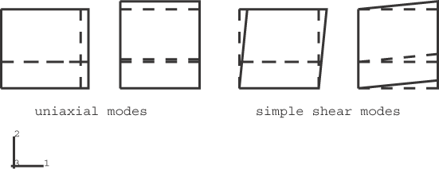

# 1.11.2 Abaqus/Explicit中的钢筋

**产品：**Abaqus/Explicit  

### 测试单元

CPS4R    CPE4R    CAX4R    C3D8    C3D8R    M3D3    M3D4R    SFM3D4R    SAX1    S3R    S3RS    S4    S4R    

SC8R    S4RS    S4RSW    

### 问题描述

本示例问题验证使用基于单元的钢筋过程进行单元加固的建模。加固层定义为单元截面定义的一部分。这些选项在运动学、材料属性定义的兼容性以及规定温度和场变量的兼容性方面进行测试。所有支持钢筋的单元类型都被测试。将定义为单元截面定义一部分的钢筋层的过程用于壳、表面和膜单元。基于单元的钢筋过程用于连续体单元。

### 连续体单元中钢筋的运动学

连续体单元运动学以两种方式进行测试。在第一个测试中，钢筋放置在单元内的各个位置和方向，并对单元施加單軸位移。钢筋位于距单元边缘三分之一处，方向角度为0、45和90。对于平面应变和平面应力单元，使用89.9而不是90，因为这些单元中90度方向的钢筋不提供刚度。钢筋也直接沿单元边缘放置，方向角度为0。第二个测试检查钢筋在各种变形模式下是否产生正确的应变。钢筋位于CPE4R单元下边缘三分之一处。沿钢筋方向和垂直于钢筋方向进行單軸拉伸。使用钢筋平行于运动方向和垂直于运动方向进行简单剪切测试。

### 壳单元中钢筋的运动学

壳中钢筋有三个测试。前两个测试覆盖钢筋放置在壳中面时的运动学。第三个测试覆盖钢筋放置在偏离中面处的壳的弯曲行为。

第一个运动学测试，rebar_*elementtype*.inp，将钢筋放置在单元内的各个方向，并对单元施加單軸位移。钢筋定义为0、30和90度的方向角。此测试对定义节点厚度的单元和复合壳重复进行。

第二个运动学测试，[rebar_modes.inp](../eif/rebar_modes.inp)，验证钢筋在各种变形模式下是否产生正确的应变。沿钢筋方向和垂直于钢筋方向进行單軸拉伸。对于一般壳和膜单元，使用钢筋平行于运动方向和垂直于运动方向进行简单剪切测试。参见图1.11.2-1。

第三个运动学测试，[rebar_bending.inp](../eif/rebar_bending.inp)，验证经历有限膜应变的壳单元的弯曲行为。规定壳中面的有限單軸拉伸，然后是壳单元一端的旋转。此测试对定义节点厚度的壳单元、定义中面位置由偏移量的壳单元和复合壳单元重复进行。

### 膜和表面单元中钢筋的运动学

膜和表面单元中钢筋有两个测试。这两个测试覆盖钢筋放置在膜中和表面单元中面时的运动学，类似于壳单元的前两个测试。

### 钢筋材料测试

材料测试包括基体单元和钢筋的材料定义的五种组合。对于每种组合，CPE4R、M3D4R、S4R和S4RS单元承受规定單軸位移。基体单元和钢筋都使用弹性、弹塑性和超弹性材料属性。组合如下：弹性基体和弹性钢筋、弹性基体和弹塑性钢筋、弹塑性基体和弹性钢筋、超弹性基体和弹性钢筋，以及超弹性基体和超弹性钢筋。

### 连续体单元中钢筋的热膨胀

通过约束单元的所有自由度并施加温度载荷来测试钢筋的热膨胀。钢筋位于单元下边缘三分之一处。下边缘的温度从0升高到20，而上边缘的温度从0升高到80。

### 壳和膜单元中钢筋的热膨胀

通过约束单元的所有自由度并施加温度载荷来测试钢筋的热膨胀。钢筋放置在膜的中面和壳中离底面厚度三分之一处。

膜单元的节点温度均匀地从0升高到40。壳单元的节点温度在整个单元中均匀升高，但沿壳厚度变化。温度以两种方式施加：作为中面温度从0升高到50以及沿壳厚度从0升高到30ΔT的温度梯度，和直接在壳厚度处的截面点施加。

### 温度和场变量依赖的钢筋材料

通过拉伸钢筋直到屈服发生来测试温度和场变量依赖的非弹性材料属性，同时施加均匀的温度或场变量增加。底层单元用弹性材料建模。

### 包含钢筋的单元上的体力

此测试对所有允许钢筋的单元施加体力 和重力载荷。所有自由度都被固定，输出反作用力。重力载荷基于用户提供的重力常数、单元密度和单元体积的大小；体力基于体力大小和单元体积。由于钢筋的质量被考虑在内并添加到单元的总质量中，钢筋将对重力载荷有贡献。然而，钢筋的体积不添加到单元的总体积中，因为钢筋被认为是嵌入底层单元中的。因此，钢筋不会对体力有贡献。

### 包含钢筋的单元中的预应力

此测试由具有等参钢筋的壳、膜和连续体单元组成。向钢筋施加初始拉应力，不向底层单元施加初始应力。因此，底层单元将压缩，初始钢筋拉应力将减小，直到两者之间达到平衡。

### 结果与讨论

所有测试案例的结果与包含在每个输入文件顶部的分析值一致。

### 输入文件

##### **使用基于单元的钢筋过程的输入文件**

[rebar_cpe4r.inp](../eif/rebar_cpe4r.inp)

CPE4R单元的运动学测试。

[rebar_cax4r.inp](../eif/rebar_cax4r.inp)

CAX4R单元的运动学测试。

[rebar_cps4r.inp](../eif/rebar_cps4r.inp)

CPS4R单元的运动学测试。

[rebar_c3d8.inp](../eif/rebar_c3d8.inp)

C3D8单元的运动学测试。

[rebar_c3d8r.inp](../eif/rebar_c3d8r.inp)

C3D8R单元的运动学测试。

##### **使用定义为单元截面定义一部分的钢筋层的过程的输入文件**

[rebar_m3d4r.inp](../eif/rebar_m3d4r.inp)

M3D4R单元的运动学测试。

[rebar_sfm3d4r.inp](../eif/rebar_sfm3d4r.inp)

SFM3D4R单元的运动学测试。

[rebar_sax1.inp](../eif/rebar_sax1.inp)

SAX1单元的运动学测试。

[rebar_s4.inp](../eif/rebar_s4.inp)

S4单元的运动学测试。

[rebar_s4r.inp](../eif/rebar_s4r.inp)

S4R单元的运动学测试。

[rebar_sc8r.inp](../eif/rebar_sc8r.inp)

SC8R单元的运动学测试。

[rebar_s4rs.inp](../eif/rebar_s4rs.inp)

S4RS单元的运动学测试。

[rebar_s4rsw.inp](../eif/rebar_s4rsw.inp)

S4RSW单元的运动学测试。

[rebar_orient.inp](../eif/rebar_orient.inp)

壳和膜的钢筋方向测试。

[rebar_bending.inp](../eif/rebar_bending.inp)

壳钢筋弯曲测试。

##### **同时使用定义为单元截面定义一部分的钢筋层的过程和基于单元的钢筋的输入文件**

[rebar_modes.inp](../eif/rebar_modes.inp)

多种变形模式。

[rebar_material.inp](../eif/rebar_material.inp)

钢筋材料测试。

[rebar_prestress.inp](../eif/rebar_prestress.inp)

初始钢筋应力测试。

[rebar_tempdep.inp](../eif/rebar_tempdep.inp)

温度依赖的钢筋材料测试。

[rebar_fielddep.inp](../eif/rebar_fielddep.inp)

场变量依赖的钢筋材料测试。

[rebar_thermalexp.inp](../eif/rebar_thermalexp.inp)

钢筋热膨胀测试。

[rebar_bodyload.inp](../eif/rebar_bodyload.inp)

钢筋的体力和重力载荷测试。

### 图

**图1.11.2-1** CPE4R、M3D4R和S4R单元中钢筋的变形模式。

