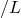

# 1.11.2 Rebar in Abaqus/Explicit

**Product: **Abaqus/Explicit  

### Elements tested

CPS4R    CPE4R    CAX4R    C3D8    C3D8R    M3D3    M3D4R    SFM3D4R    SAX1    S3R    S3RS    S4    S4R    

SC8R    S4RS    S4RSW    

### Problem description

This example problem verifies the modeling of element reinforcements with the element-based rebar procedure. The layers of reinforcement are defined as part of the element section definition. These options are tested in the areas of kinematics, compatibility with material property definitions, and compatibility with prescribed temperatures and field variables. All element types that support reinforcement are tested. The procedure to specify layers of reinforcement defined as part of the element section definition is used for shell, surface, and membrane elements. The element-based rebar procedure is used for continuum elements.

### Kinematics of rebar in continuum elements

Continuum element kinematics are tested in two ways. In the first test rebar are placed at various locations and orientations within an element and a uniaxial displacement is applied to the element. The rebar are located one-third of the distance from the element edge and are given orientation angles of 0, 45, and 90. For plane strain and plane stress elements 89.9 is used instead of 90 since a rebar oriented at 90 for these elements would provide no stiffness. Rebar are also placed directly along the element edges with orientation angles of 0. The second test checks that the rebar yield the correct strains for various deformation modes. Rebar are positioned at one-third of the distance from the lower edge in a CPE4R element. Uniaxial stretching is performed in the direction of the rebar and in the direction perpendicular to the rebar. Simple shear is tested with the rebar parallel to the direction of motion and with the rebar perpendicular to the direction of motion.

### Kinematics of rebar in shell elements

Three tests exist for rebar in shells. The first two tests cover kinematics of rebar placed at the midsurface in shells. The third test covers bending behavior of shells in which rebar are placed away from the midsurface.

The first kinematics test, rebar_*elementtype*.inp, places the rebar at various orientations within an element, and a uniaxial displacement is applied to the element. The rebars are defined at orientation angles of 0, 30, and 90. This test is repeated for elements in which the nodal thicknesses are defined and for composite shells.

The second kinematics test, [rebar_modes.inp](../eif/rebar_modes.inp), verifies that the rebar yield the correct strains for various deformation modes. Uniaxial stretching is performed in the direction of the rebar and in the direction perpendicular to the rebar. For general shell and membrane elements simple shear is tested with the rebar parallel to the direction of motion and with the rebar perpendicular to the direction of motion. See [Figure 1.11.2--1](ch01s11abv130.md#exxrebar-deform-modes).

The third kinematics test, [rebar_bending.inp](../eif/rebar_bending.inp), verifies the bending behavior of shell elements that have undergone finite membrane strains. A finite uniaxial stretch is prescribed at the midsurface of the shell, followed by a rotation at one end of the shell element. This test is repeated for shell elements in which the nodal thicknesses are defined, with shell elements in which the midsurface position is defined by an offset, and with composite shell elements.

### Kinematics of rebar in membrane and surface elements

Two tests exist for rebar in membrane and surface elements. The two tests cover kinematics of rebar placed at the midsurface in membranes and in surface elements and are similar to the first two tests for the shell elements. 

### Rebar material tests

The material test includes five combinations of material definitions for the base element and for the rebar. For each combination CPE4R, M3D4R, S4R, and S4RS elements are loaded with a prescribed uniaxial displacement. Elastic, elastic-plastic, and hyperelastic material properties are used for both the base element and the rebar. The combinations are as follows: elastic base and elastic rebar, elastic base and elastic-plastic rebar, elastic-plastic base and elastic rebar, hyperelastic base and elastic rebar, and hyperelastic base and hyperelastic rebar.

### Thermal expansion of rebar in continuum elements

Thermal expansion of the rebar is tested by constraining all degrees of freedom of the elements and applying a temperature load. The rebar is positioned one-third of the distance from the element's lower edge. The temperature on the lower edge is increased from 0 to 20, while the temperature on the top edge is increased from 0 to 80.

### Thermal expansion of rebar in shell and membrane elements

Thermal expansion of the rebar is tested by constraining all degrees of freedom of the elements and applying a temperature load. The rebar is placed at the midsurface in membranes and at one-third of the thickness from the bottom surface in shells.

The nodal temperatures of membrane elements are increased uniformly from 0 to 40. The nodal temperatures of shell elements are increased uniformly throughout the element but vary through the thickness of the shell. The temperatures are applied in two ways: as a midsurface temperature that is increased from 0 to 50 along with a temperature gradient through the shell thickness that is increased from 0 to 30, and directly at the section points through the shell thickness.

### Temperature- and field-variable-dependent rebar materials

The use of temperature- and field-variable-dependent inelastic material properties is tested by stretching the rebar until yield occurs, while simultaneously applying a uniform temperature or field variable increase. The underlying elements are modeled with an elastic material.

### Body loads on elements containing rebar

This test applies a body force and a gravity load to all elements that allow rebar. All degrees of freedom are fixed, and the reaction forces are output. Gravity loads are based on the magnitude of the user-provided gravity constant, the element density, and element volume; the body forces are based on the body force magnitude and the element volume. Since the mass of the rebar is considered significant and is added to the total mass of the element, the rebar will contribute to the gravity load. The volume of the rebar, however, is not added to the total element volume since the rebars are considered to be embedded in the underlying element. Therefore, rebar will not contribute to body forces.

### Prestress in elements containing rebar

This test consists of shell, membrane and continuum elements with isoparametric rebar. An initial tensile stress is applied to the rebar, and no initial stresses are applied to the underlying elements. Thus, the underlying elements will compress, and the initial rebar tensile stress will be reduced until equilibrium between the two is reached.

### Results and discussion

The results for all the test cases agree with the analytical values that have been included at the top of each input file.

### Input files

##### **Input files that use the element-based rebar procedure**

[rebar_cpe4r.inp](../eif/rebar_cpe4r.inp)

Kinematics test for the CPE4R element.

[rebar_cax4r.inp](../eif/rebar_cax4r.inp)

Kinematics test for the CAX4R element.

[rebar_cps4r.inp](../eif/rebar_cps4r.inp)

Kinematics test for the CPS4R element.

[rebar_c3d8.inp](../eif/rebar_c3d8.inp)

Kinematics test for the C3D8 element.

[rebar_c3d8r.inp](../eif/rebar_c3d8r.inp)

Kinematics test for the C3D8R element.

##### **Input files that use the procedure to specify layers of reinforcement defined as part of the element section definition**

[rebar_m3d4r.inp](../eif/rebar_m3d4r.inp)

Kinematics test for the M3D4R element.

[rebar_sfm3d4r.inp](../eif/rebar_sfm3d4r.inp)

Kinematics test for the SFM3D4R element.

[rebar_sax1.inp](../eif/rebar_sax1.inp)

Kinematics test for the SAX1 element.

[rebar_s4.inp](../eif/rebar_s4.inp)

Kinematics test for the S4 element.

[rebar_s4r.inp](../eif/rebar_s4r.inp)

Kinematics test for the S4R element.

[rebar_sc8r.inp](../eif/rebar_sc8r.inp)

Kinematics test for the SC8R element.

[rebar_s4rs.inp](../eif/rebar_s4rs.inp)

Kinematics test for the S4RS element.

[rebar_s4rsw.inp](../eif/rebar_s4rsw.inp)

Kinematics test for the S4RSW element.

[rebar_orient.inp](../eif/rebar_orient.inp)

Rebar orientation test for shells and membranes.

[rebar_bending.inp](../eif/rebar_bending.inp)

Shell rebar bending test.

##### **Input files that use the procedures to specify layers of reinforcement defined as part of the element section definition as well as element-based rebar**

[rebar_modes.inp](../eif/rebar_modes.inp)

Multiple deformation modes.

[rebar_material.inp](../eif/rebar_material.inp)

Rebar material test.

[rebar_prestress.inp](../eif/rebar_prestress.inp)

Test of initial rebar stresses.

[rebar_tempdep.inp](../eif/rebar_tempdep.inp)

Temperature-dependent rebar material test.

[rebar_fielddep.inp](../eif/rebar_fielddep.inp)

Field-variable-dependent rebar material test.

[rebar_thermalexp.inp](../eif/rebar_thermalexp.inp)

Rebar thermal expansion test.

[rebar_bodyload.inp](../eif/rebar_bodyload.inp)

Body and gravity load test of rebar.

### Figure

**Figure 1.11.2–1** Deformation modes for rebar in a CPE4R, M3D4R, and S4R element.

