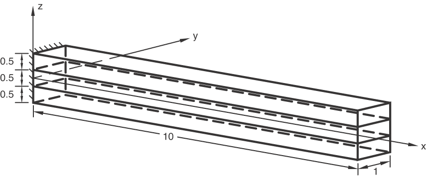

# 1.11.5 剪切柔性壳的横向剪切

**产品：**Abaqus/Standard  

### 测试单元

S4    S4R    S8R    S8RT    

### 测试功能

剪切柔性壳的横向剪切应力输出（TSHR13、TSHR23）和横向剪切截面力及截面应变输出（SF4、SF5、SE4、SE5）。

### 问题描述

模型由长度为10.0、宽度为1.0和厚度为1.5的复合板组成。*y*方向（平行于单位宽度）施加平面应变条件，x=0处的端部被固定，其余自由度施加各种边界条件（参见输入文件）。使用单个壳单元对板进行建模。板具有三层等厚度（0.5），使用复合壳截面或复合一般壳截面定义。每层指定三个积分点，共九个点穿过厚度。

平面应力中的正交各向异性弹性用于定义正交各向异性材料，其中E₁=25×10⁶、E₂=1×10⁶、ν₁₂=0.25、G₁₂=0.5×10⁶和G₂₃=0.2×10⁶。材料方向被指定为：第一层和第三层的局部1方向平行于*x*轴，第二层的局部1方向平行于*y*轴。

截面方向用于一般壳截面测试，使得1方向平行于*y*轴，2方向平行且与*x*轴相反。此截面方向仅改变截面力和截面应变的局部方向。

高斯积分用于S4、S4R和S8R单元的壳横截面。

执行两组测试；所有力都施加在x=10处。

**静态测试：**

步骤1，单轴拉伸：*x*方向的总力为20000。

步骤2，横向剪切：*z*方向的总力为20000。

步骤3，纯弯曲：关于*y*轴的总力矩为20000。

**静态和动力学测试：**

（前两个静态步骤被执行以与频率步骤的特征模态结果密切相关（close）。）

步骤1，静态，横向剪切：x=10边缘处UR₃=1。

步骤2，静态，单轴拉伸：x=10边缘处U₁=1。

步骤3，频率：提取四个最低特征模态。

步骤4，稳态动力学：*z*方向的总力为20000。

步骤5，稳态动力学，直接：*z*方向的总力为20000。

步骤6，模态动态：*z*方向的总力为20000。

步骤7，反应谱。

### 结果与讨论

横向剪切结果的验证基于《Abaqus理论指南》第3.6.8节"复合壳和偏离中面的横向剪切刚度"中描述的公式。

在输入文件[esf4sct2.inp](../eif/esf4sct2.inp)、[esf4slt2.inp](../eif/esf4slt2.inp)和[ese4slt2.inp](../eif/ese4slt2.inp)中请求局部坐标方向。

### 输入文件

[ese4sct1.inp](../eif/ese4sct1.inp)

S4单元，静态步骤，[*SHELL SECTION](../key/key-link.md#usb-kws-mshellsection)，COMPOSITE。

[ese4sct2.inp](../eif/ese4sct2.inp)

S4单元，静态、频率、稳态动力学、模态动态和反应谱步骤，[*SHELL SECTION](../key/key-link.md#usb-kws-mshellsection)，COMPOSITE。

[ese4slt2.inp](../eif/ese4slt2.inp)

S4单元，静态、频率、稳态动力学、模态动态和反应谱步骤，带[*SHELL GENERAL SECTION](../key/key-link.md#usb-kws-mshellgensect)，COMPOSITE。

[esf4sct1.inp](../eif/esf4sct1.inp)

S4R单元，静态步骤，[*SHELL SECTION](../key/key-link.md#usb-kws-mshellsection)，COMPOSITE。

[esf4sct2.inp](../eif/esf4sct2.inp)

S4R单元，静态、频率、稳态动力学、模态动态和反应谱步骤，[*SHELL SECTION](../key/key-link.md#usb-kws-mshellsection)，COMPOSITE。

[esf4slt2.inp](../eif/esf4slt2.inp)

S4R单元，静态、频率、稳态动力学、模态动态和反应谱步骤，带[*SHELL GENERAL SECTION](../key/key-link.md#usb-kws-mshellgensect)，COMPOSITE。

[es68sct1.inp](../eif/es68sct1.inp)

S8R单元，静态步骤，[*SHELL SECTION](../key/link.md#usb-kws-mshellsection)，COMPOSITE。

[es68sct2.inp](../eif/es68sct2.inp)

S8R单元，静态、频率、稳态动力学、模态动态和反应谱步骤，[*SHELL SECTION](../key/key-link.md#usb-kws-mshellsection)，COMPOSITE。

[es68slt2.inp](../eif/es68slt2.inp)

S8R单元，静态、频率、稳态动力学、模态动态和反应谱步骤，带[*SHELL GENERAL SECTION](../key/key-link.md#usb-kws-mshellgensect)，COMPOSITE。

[es38tct1.inp](../eif/es38tct1.inp)

S8RT单元，带静态载荷的耦合温度-位移步骤，[*SHELL SECTION](../key/key-link.md#usb-kws-mshellsection)，COMPOSITE。

