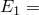
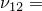
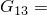
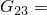

# 1.11.5 Transverse shear for shear-flexible shells

**Product: **Abaqus/Standard  

### Elements tested

S4    S4R    S8R    S8RT    

### Features tested

Transverse shear stress output (TSHR13, TSHR23) and transverse shear section force and section strain output (SF4, SF5, SE4, SE5) for shear-flexible shells.

### Problem description

The model consists of a composite plate with a length of 10.0, width of 1.0, and thickness of 1.5. Plane strain conditions are imposed in the *y*-direction (parallel to the unit width), the end at  0 is fixed, and various boundary conditions are applied to the remaining degrees of freedom (refer to input files). A single shell element is used to model the plate. The plate has three layers of equal thickness (0.5) defined using a composite shell section or a composite general shell section. Three integration points are specified in each layer for a total of nine points through the thickness.

Orthotropic elasticity in a plane stress is used to define an orthotropic material with  25  106,  1  106,  0.25,  0.5  106 and  0.2  106. The material orientation is specified such that the local 1-direction for layers 1 and 3 is parallel to the *x*-axis, and the local 1-direction for layer 2 is parallel to the *y*-axis.

A section orientation is used with the general shell section tests such that the 1-direction is parallel to the *y*-axis and the 2-direction is parallel and opposite to the *x*-axis. This section orientation only changes local directions for the section forces and section strains.

Gauss integration is used for the shell cross-section for elements S4, S4R, and S8R.

Two groups of tests are performed; all forces are applied at  10. 

**Static tests:**

Step 1, uniaxial tension: total force of 20000 in the *x*-direction.

Step 2, transverse shear: total force of 20000 in the *z*-direction.

Step 3, pure bending: total moment of 20000 about the *y*-axis.

**Static and dynamics tests:**

(The first two static steps are performed to correlate (closely) with the eigenmode results of the frequency step.)

Step 1, static, transverse shear:  1 at the  10 edge.

Step 2, static, uniaxial tension:  1 at the  10 edge.

Step 3, frequency: extract four lowest eigenmodes.

Step 4, steady-state dynamics: total force of 20000 in the *z*-direction.

Step 5, steady-state dynamics, direct: total force of 20000 in the *z*-direction.

Step 6, modal dynamic: total force of 20000 in the *z*-direction.

Step 7, response spectrum.

### Results and discussion

The verification of the transverse shear results is based on the formulation described in ["Transverse shear stiffness in composite shells and offsets from the midsurface," Section 3.6.8 of the Abaqus Theory Guide](../stm/stm-link.md#stm-elm-transshearshells).

Local coordinate directions are requested in the input files [esf4sct2.inp](../eif/esf4sct2.inp), [esf4slt2.inp](../eif/esf4slt2.inp), and [ese4slt2.inp](../eif/ese4slt2.inp).

### Input files

[ese4sct1.inp](../eif/ese4sct1.inp)

S4 elements, static steps, [*SHELL SECTION](../key/key-link.md#usb-kws-mshellsection), COMPOSITE.

[ese4sct2.inp](../eif/ese4sct2.inp)

S4 elements, static, frequency, steady-state dynamics, modal dynamic, and response spectrum steps, [*SHELL SECTION](../key/key-link.md#usb-kws-mshellsection), COMPOSITE.

[ese4slt2.inp](../eif/ese4slt2.inp)

S4 elements, static, frequency, steady-state dynamics, modal dynamic, and response spectrum steps with [*SHELL GENERAL SECTION](../key/key-link.md#usb-kws-mshellgensect), COMPOSITE.

[esf4sct1.inp](../eif/esf4sct1.inp)

S4R elements, static steps, [*SHELL SECTION](../key/key-link.md#usb-kws-mshellsection), COMPOSITE.

[esf4sct2.inp](../eif/esf4sct2.inp)

S4R elements, static, frequency, steady-state dynamics, modal dynamic, and response spectrum steps, [*SHELL SECTION](../key/key-link.md#usb-kws-mshellsection), COMPOSITE.

[esf4slt2.inp](../eif/esf4slt2.inp)

S4R elements, static, frequency, steady-state dynamics, modal dynamic, and response spectrum steps with [*SHELL GENERAL SECTION](../key/key-link.md#usb-kws-mshellgensect), COMPOSITE.

[es68sct1.inp](../eif/es68sct1.inp)

S8R elements, static steps, [*SHELL SECTION](../key/key-link.md#usb-kws-mshellsection), COMPOSITE.

[es68sct2.inp](../eif/es68sct2.inp)

S8R elements, static, frequency, steady-state dynamics, modal dynamic, and response spectrum steps, [*SHELL SECTION](../key/key-link.md#usb-kws-mshellsection), COMPOSITE.

[es68slt2.inp](../eif/es68slt2.inp)

S8R elements, static, frequency, steady-state dynamics, modal dynamic, and response spectrum steps with [*SHELL GENERAL SECTION](../key/key-link.md#usb-kws-mshellgensect), COMPOSITE.

[es38tct1.inp](../eif/es38tct1.inp)

S8RT elements, coupled temperature-displacement steps with static loading, [*SHELL SECTION](../key/key-link.md#usb-kws-mshellsection), COMPOSITE.

