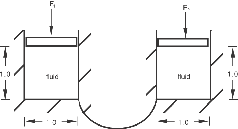

# 1.11.6 流体连接的线性动态分析

**产品：**Abaqus/Standard  

### 测试单元

FLINK    F2D2    

### 测试功能

流体连接单元的线性动态分析。

### 问题描述

流体连接单元用于在充满气动流体的两个容器之间传输流体，如图1.11.6-1所示。容器通过施加载荷P₁和P₂承受内部压力。

每个容器使用二维流体块建模，尺寸为1×1，厚度为单位厚度，如图1.11.6-2所示。节点1和11是两个流体腔的腔参考节点。作用在第一个流体腔上的向下力作为集中载荷施加到节点4的*y*方向。节点3和4被约束为在*y*方向等位移。节点13和14也被约束为在*y*方向等位移。最后，非常小刚度的接地弹簧附着在节点4和14的*y*方向上，以防止求解器问题。

**材料：**

**气动流体**

| 环境压力，p₀=14.7 |
| --- |
| 绝对零温度，T₀=460 |
| 参考密度，ρ₀=10.0 |
| 密度参考压力，p₀ᴿ=0 |
| 密度参考温度，T₀ᴿ=200 |
| 初始温度，Tᵢ=200 |

**流体连接**

| κ=10 |

**载荷：**

流体温度在所有步骤中保持在200.0。第一步中，第一个腔承受集中谐波载荷P₁=10.0×sin(0.1t)×cos(0.1t)，其中P₀=0。第二步与第一步类似，只是忽略了流体连接刚度矩阵中的虚部，因此仅计算稳态系统的实部响应。第三步施加载荷以在两个腔中引起10.0单位的内压力。第四步和第五步与第一和第二步类似，只是第三步中施加了10.0的压力预载荷。在每个稳态分析步骤结束时报告结果。

### 结果与讨论

| 步骤 | MFL | PHMFL | MFLT | PHMFT | PCAV1 | PPOR1 |
| --- | --- | --- | --- | --- | --- | --- |
| 1 | 1.028 | 0.3699 | 1.635 | 90.37 | 10.28 | 0.3699 |
| 2 |  |  |  |  | 10.28 |  |
| 4 | 1.010 | 0.2163 | 1.607 | 90.22 | 10.10 | 0.2163 |
| 5 |  |  |  |  | 10.10 |  |

### 输入文件

[efl2sfxd.inp](../eif/efl2sfxd.inp)

分析输入文件。

### 图

**图1.11.6-1** 流体连接模型。

**图1.11.6-2** 二维流体块模型。

