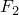
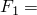
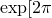
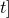
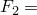

# 1.11.6 Linear dynamic analysis with fluid link

**Product: **Abaqus/Standard  

### Elements tested

FLINK    F2D2    

### Feature tested

Linear dynamic analysis with fluid link elements.

### Problem description

A fluid link element is used to transfer fluid between two vessels filled with pneumatic fluid, as shown in [Figure 1.11.6--1](ch01s11abv134.md#verlindynflink-prob). The vessels are subjected to internal pressures by applying loads  and , respectively.

Each vessel is modeled using a two-dimensional fluid block that measures 1  1 with unit thickness as shown in [Figure 1.11.6--2](ch01s11abv134.md#verfluidlink-model). Nodes 1 and 11 are the cavity reference nodes for the two fluid cavities. The downward force on the first fluid cavity is applied as a concentrated load to node 4 in the *y*-direction. Nodes 3 and 4 are constrained to displace equally in the *y*-direction. Nodes 13 and 14 are also constrained to displace equally in the *y*-direction. Finally, grounded springs of very small stiffness acting in the *y*-direction are attached to nodes 4 and 14 to prevent solver problems in the solution.

**Material: **

**Pneumatic fluid**

| Ambient pressure, =14.7. |
| --- |
| Absolute zero temperature, =460. |
| Reference density, =10.0. |
| Reference pressure for density, =0. |
| Reference temperature for density, =200. |
| Initial temperature, =200. |

**Fluid link**

| =10. |
| --- |

**Loading: **

The fluid temperature is kept constant at 200.0 in all of the steps. In the first step, the first cavity is subjected to a concentrated harmonic load of  10.0 (0.1) with  0. The second step is similar to the first, except that the imaginary terms in the stiffness matrix for the fluid link are ignored, so that the response is calculated only for the real components of the steady-state system. In the third step loads are applied to induce an internal pressure of 10.0 units in both cavities. The fourth and fifth steps are similar to the first and second steps except for the pressure preload of 10.0, which is applied to the fluid elements in the third step. Results are reported at the end of each steady-state analysis step.

### Results and discussion

| Step | MFL | PHMFL | MFLT | PHMFT | PCAV1 | PPOR1 |
| --- | --- | --- | --- | --- | --- | --- |
| 1 | 1.028 | 0.3699 | 1.635 | 90.37 | 10.28 | 0.3699 |
| 2 |  |  |  |  | 10.28 |  |
| 4 | 1.010 | 0.2163 | 1.607 | 90.22 | 10.10 | 0.2163 |
| 5 |  |  |  |  | 10.10 |  |

### Input file

[efl2sfxd.inp](../eif/efl2sfxd.inp)

Analysis input file.

### Figures

**Figure 1.11.6–1** Fluid link model.

**Figure 1.11.6–2** Two-dimensional fluid block model.

