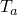
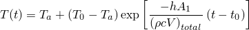
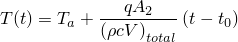
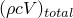
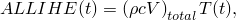
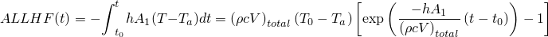
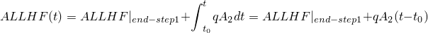

# 1.11.7 Rigid bodies with temperature DOFs, heat capacitance, and nodal-based thermal loads

**Products: **Abaqus/Standard  Abaqus/Explicit  

### I. Rigid bodies with temperature DOFs

### Elements tested

CAX3T    CAX4HT    CAX4RT    CAX4T    CAX6MT    CAX8HT    

CPE3T    CPE4RT    CPE4T    CPE6MT    CPE8T    

CPS3T    CPS4RT    CPS4T    CPS6MT    CPS8T    

C3D4T    C3D6T    C3D8HT    C3D8RT    C3D8T    C3D10MT    

SC8RT    SC6RT    

S3RT    S4RT    

### Problem description

Most of the verification tests in this section are based on the recommendations of the National Agency for Finite Element Methods and Standards (U.K.). Rigid body constraints and isothermal rigid body constraints are tested in these problems.

The test problems are: 

1. One-dimensional heat transfer with radiation.
2. One-dimensional transient heat transfer.
3. Two-dimensional heat transfer with convection.
4. Patch test for heat transfer elements.
5. Temperature-dependent film condition.
6. One-element lumped model.

Detailed descriptions of problems (a)–(e) can be found in 
- ["T2: One-dimensional heat transfer with radiation," Section 4.3.2 of the Abaqus Benchmarks Guide](../bmk/bmk-link.md#bmk-nfm-t2);
- ["T3: One-dimensional transient heat transfer," Section 4.3.3 of the Abaqus Benchmarks Guide](../bmk/bmk-link.md#bmk-nfm-t3);
- ["T4: Two-dimensional heat transfer with convection," Section 4.3.4 of the Abaqus Benchmarks Guide](../bmk/bmk-link.md#bmk-nfm-t4);
- ["Patch test for heat transfer elements," Section 1.5.8](ch01s05abv76.md); and
- ["Temperature-dependent film condition," Section 1.3.41](ch01s03abv44.md), respectively.

The models presented here are the same as the models described in these sections, but the elements are now assigned to rigid bodies.

The one-element lumped model tests the isothermal rigid body constraints. The simulation consists of two steps. In the first step the rigid body is cooled by convection from an initial temperature of =100 to the ambient temperature =20. In the second step the body is heated by a prescribed flux, *q*. All the thermal properties are equal to unity. In addition to its own thermal capacitance, a second capacitance is lumped into the model using a HEATCAP element.

### Results and discussion

The target solutions are reproduced accurately for all the problems tested. For the one-element model the analytical solution is

Step 1:

Step 2:

In the above equation *h* is the heat transfer coefficient,  is the heat capacitance,  is the area associated with the convective flux,  is the time at the end of previous step, and  denotes the area on which the prescribed flux is applied. The temperatures at the nodes are the same because the rigid body is isothermal; therefore, the temperature varies only in time.

In Abaqus/Explicit the internal heat energy ALLIHE and the external heat energy through the external fluxes ALLHF are available. The analytical solutions for the energies are

Step 1:

Step 2:

The energies are in good agreement with the analytical solutions, and the heat energy balance is respected.

### Input files

##### **Abaqus/Standard input files**

#### One-dimensional heat transfer with radiation:

[rbisono_1dhtrd_std_cax4t.inp](../eif/rbisono_1dhtrd_std_cax4t.inp)

CAX4T elements.

[rbisono_1dhtrd_std_cps4t.inp](../eif/rbisono_1dhtrd_std_cps4t.inp)

CPS4T elements.

[rbisono_1dhtrd_std_c3d8t.inp](../eif/rbisono_1dhtrd_std_c3d8t.inp)

C3D8T elements.

#### One-dimensional transient heat transfer:

[rbisono_1dhtcdc_std_cax4t.inp](../eif/rbisono_1dhtcdc_std_cax4t.inp)

CAX4T elements, coarse mesh.

[rbisono_1dhtcdf_std_cax8ht.inp](../eif/rbisono_1dhtcdf_std_cax8ht.inp)

CAX8HT elements, fine mesh.

[rbisono_1dhtcdc_std_cpe4t.inp](../eif/rbisono_1dhtcdc_std_cpe4t.inp)

CPE4T elements, coarse mesh.

[rbisono_1dhtcdf_std_cpe8t.inp](../eif/rbisono_1dhtcdf_std_cpe8t.inp)

CPE8T elements, fine mesh.

#### Two-dimensional heat transfer with convection:

[rbisono_2dhtcvc_std_cps4t.inp](../eif/rbisono_2dhtcvc_std_cps4t.inp)

CPS4T elements, coarse mesh.

[rbisono_2dhtcvf_std_cps8t.inp](../eif/rbisono_2dhtcvf_std_cps8t.inp)

CPS8T elements, fine mesh.

[rbisono_2dhtcvc_std_c3d8t.inp](../eif/rbisono_2dhtcvc_std_c3d8t.inp)

C3D8T elements, coarse mesh.

#### Patch test for heat transfer:

[rbisono_htpatch_std_cax4ht.inp](../eif/rbisono_htpatch_std_cax4ht.inp)

CAX4HT elements.

[rbisono_htpatch_std_c3d8ht.inp](../eif/rbisono_htpatch_std_c3d8ht.inp)

C3D8HT elements.

#### Temperature-dependent film condition:

[rbisono_tempdep_std_cpe4t.inp](../eif/rbisono_tempdep_std_cpe4t.inp)

CPE4T elements.

[rbisono_tempdepfm_std_cps4t.inp](../eif/rbisono_tempdepfm_std_cps4t.inp)

CPS4T elements and the user subroutine [*FILM](../key/key-link.md#usb-kws-hfilm).

#### One-element lumped model:

[rbisoyes_heatcap_std_cax4t.inp](../eif/rbisoyes_heatcap_std_cax4t.inp)

CAX4T elements.

[rbisoyes_heatcap_std_cpe4t.inp](../eif/rbisoyes_heatcap_std_cpe4t.inp)

CPE4T elements.

[rbisoyes_heatcap_std_c3d8t.inp](../eif/rbisoyes_heatcap_std_c3d8t.inp)

C3D8T elements.

##### **Abaqus/Explicit input files**

#### One-dimensional heat transfer with radiation:

[rbisono_1dhtrd_xpl_cax3t.inp](../eif/rbisono_1dhtrd_xpl_cax3t.inp)

CAX3T elements.

[rbisono_1dhtrd_xpl_cax4rt.inp](../eif/rbisono_1dhtrd_xpl_cax4rt.inp)

CAX4RT elements.

[rbisono_1dhtrd_xpl_cax6mt.inp](../eif/rbisono_1dhtrd_xpl_cax6mt.inp)

CAX6MT elements.

[rbisono_1dhtrd_xpl_cpe3t.inp](../eif/rbisono_1dhtrd_xpl_cpe3t.inp)

CPE3T elements.

[rbisono_1dhtrd_xpl_cpe4rt.inp](../eif/rbisono_1dhtrd_xpl_cpe4rt.inp)

CPE4RT elements.

[rbisono_1dhtrd_xpl_cpe6mt.inp](../eif/rbisono_1dhtrd_xpl_cpe6mt.inp)

CPE6MT elements.

[rbisono_1dhtrd_xpl_cps3t.inp](../eif/rbisono_1dhtrd_xpl_cps3t.inp)

CPS3T elements.

[rbisono_1dhtrd_xpl_cps4rt.inp](../eif/rbisono_1dhtrd_xpl_cps4rt.inp)

CPS4RT elements.

[rbisono_1dhtrd_xpl_cps6mt.inp](../eif/rbisono_1dhtrd_xpl_cps6mt.inp)

CPS6MT elements.

[rbisono_1dhtrd_xpl_c3d4t.inp](../eif/rbisono_1dhtrd_xpl_c3d4t.inp)

C3D4T elements.

[rbisono_1dhtrd_xpl_c3d6t.inp](../eif/rbisono_1dhtrd_xpl_c3d6t.inp)

C3D6T elements.

[rbisono_1dhtrd_xpl_c3d8rt.inp](../eif/rbisono_1dhtrd_xpl_c3d8rt.inp)

C3D8RT elements.

[rbisono_1dhtrd_xpl_c3d8t.inp](../eif/rbisono_1dhtrd_xpl_c3d8t.inp)

C3D8T elements.

#### One-dimensional transient heat transfer:

[rbisono_1dhtcdc_xpl_cax3t.inp](../eif/rbisono_1dhtcdc_xpl_cax3t.inp)

CAX3T elements, coarse mesh.

[rbisono_1dhtcdc_xpl_cax4rt.inp](../eif/rbisono_1dhtcdc_xpl_cax4rt.inp)

CAX4RT elements, coarse mesh.

[rbisono_1dhtcdc_xpl_cax6mt.inp](../eif/rbisono_1dhtcdc_xpl_cax6mt.inp)

CAX6MT elements, coarse mesh.

[rbisono_1dhtcdc_xpl_cpe3t.inp](../eif/rbisono_1dhtcdc_xpl_cpe3t.inp)

CPE3T elements, coarse mesh.

[rbisono_1dhtcdc_xpl_cpe4rt.inp](../eif/rbisono_1dhtcdc_xpl_cpe4rt.inp)

CPE4RT elements, coarse mesh.

[rbisono_1dhtcdc_xpl_cpe6mt.inp](../eif/rbisono_1dhtcdc_xpl_cpe6mt.inp)

 CPE6MT elements, coarse mesh.

[rbisono_1dhtcdc_xpl_cps3t.inp](../eif/rbisono_1dhtcdc_xpl_cps3t.inp)

CPS3T elements, coarse mesh.

[rbisono_1dhtcdc_xpl_cps4rt.inp](../eif/rbisono_1dhtcdc_xpl_cps4rt.inp)

CPS4RT elements, coarse mesh.

[rbisono_1dhtcdc_xpl_cps6mt.inp](../eif/rbisono_1dhtcdc_xpl_cps6mt.inp)

CPS6MT elements, coarse mesh.

[rbisono_1dhtcdc_xpl_s4rt.inp](../eif/rbisono_1dhtcdc_xpl_s4rt.inp)

S4RT elements, coarse mesh.

[rbisono_1dhtcdf_xpl_cax3t.inp](../eif/rbisono_1dhtcdf_xpl_cax3t.inp)

CAX3T elements, fine mesh.

[rbisono_1dhtcdf_xpl_cax4rt.inp](../eif/rbisono_1dhtcdf_xpl_cax4rt.inp)

CAX4RT elements, fine mesh.

[rbisono_1dhtcdf_xpl_cpe3t.inp](../eif/rbisono_1dhtcdf_xpl_cpe3t.inp)

CPE3T elements, fine mesh.

[rbisono_1dhtcdf_xpl_cpe4rt.inp](../eif/rbisono_1dhtcdf_xpl_cpe4rt.inp)

CPE4RT elements, fine mesh.

[rbisono_1dhtcdf_xpl_cps3t.inp](../eif/rbisono_1dhtcdf_xpl_cps3t.inp)

CPS3T elements, fine mesh.

[rbisono_1dhtcdf_xpl_cps4rt.inp](../eif/rbisono_1dhtcdf_xpl_cps4rt.inp)

CPS4RT elements, fine mesh.

[rbisono_1dhtcdf_xpl_s3rt.inp](../eif/rbisono_1dhtcdf_xpl_s3rt.inp)

S3RT elements, fine mesh.

#### Two-dimensional heat transfer with convection:

[rbisono_2dhtcvc_xpl_cpe3t.inp](../eif/rbisono_2dhtcvc_xpl_cpe3t.inp)

CPE3T elements, coarse mesh.

[rbisono_2dhtcvc_xpl_cpe4rt.inp](../eif/rbisono_2dhtcvc_xpl_cpe4rt.inp)

CPE4RT elements, coarse mesh.

[rbisono_2dhtcvc_xpl_cpe6mt.inp](../eif/rbisono_2dhtcvc_xpl_cpe6mt.inp)

CPE6MT elements, coarse mesh.

[rbisono_2dhtcvc_xpl_cps3t.inp](../eif/rbisono_2dhtcvc_xpl_cps3t.inp)

CPS3T elements, coarse mesh.

[rbisono_2dhtcvc_xpl_cps4rt.inp](../eif/rbisono_2dhtcvc_xpl_cps4rt.inp)

CPS4RT elements, coarse mesh.

[rbisono_2dhtcvc_xpl_cps6mt.inp](../eif/rbisono_2dhtcvc_xpl_cps6mt.inp)

CPS6MT elements, coarse mesh.

[rbisono_2dhtcvc_xpl_c3d6t.inp](../eif/rbisono_2dhtcvc_xpl_c3d6t.inp)

C3D6T elements, coarse mesh.

[rbisono_2dhtcvc_xpl_c3d8rt.inp](../eif/rbisono_2dhtcvc_xpl_c3d8rt.inp)

C3D8RT elements, coarse mesh.

[rbisono_2dhtcvc_xpl_c3d8t.inp](../eif/rbisono_2dhtcvc_xpl_c3d8t.inp)

C3D8T elements, coarse mesh.

[rbisono_2dhtcvc_xpl_c3d6t.inp](../eif/rbisono_2dhtcvc_xpl_c3d6t.inp)

C3D6T elements, coarse mesh.

[rbisono_2dhtcvf_xpl_cpe3t.inp](../eif/rbisono_2dhtcvf_xpl_cpe3t.inp)

CPE3T elements, fine mesh.

[rbisono_2dhtcvf_xpl_cpe4rt.inp](../eif/rbisono_2dhtcvf_xpl_cpe4rt.inp)

CPE4RT elements, fine mesh.

[rbisono_2dhtcvf_xpl_cps3t.inp](../eif/rbisono_2dhtcvf_xpl_cps3t.inp)

CPS3T elements, fine mesh.

[rbisono_2dhtcvf_xpl_cps4rt.inp](../eif/rbisono_2dhtcvf_xpl_cps4rt.inp)

CPS4RT elements, fine mesh.

[rbisono_2dhtcvf_xpl_c3d6t.inp](../eif/rbisono_2dhtcvf_xpl_c3d6t.inp)

C3D6T elements, fine mesh.

[rbisono_2dhtcvf_xpl_c3d8rt.inp](../eif/rbisono_2dhtcvf_xpl_c3d8rt.inp)

C3D8RT elements, fine mesh.

[rbisono_2dhtcvf_xpl_sc8rt.inp](../eif/rbisono_2dhtcvf_xpl_sc8rt.inp)

SC8RT elements, fine mesh.

#### Patch test for heat transfer:

[rbisono_htpatch_xpl_cax3t.inp](../eif/rbisono_htpatch_xpl_cax3t.inp)

CAX3T elements.

[rbisono_htpatch_xpl_cax4rt.inp](../eif/rbisono_htpatch_xpl_cax4rt.inp)

CAX4RT elements.

[rbisono_htpatch_xpl_cax6mt.inp](../eif/rbisono_htpatch_xpl_cax6mt.inp)

CAX6MT elements.

[rbisono_htpatch_xpl_cpe3t.inp](../eif/rbisono_htpatch_xpl_cpe3t.inp)

CPE3T elements.

[rbisono_htpatch_xpl_cpe4rt.inp](../eif/rbisono_htpatch_xpl_cpe4rt.inp)

CPE4RT elements.

[rbisono_htpatch_xpl_cpe6mt.inp](../eif/rbisono_htpatch_xpl_cpe6mt.inp)

CPE6MT elements.

[rbisono_htpatch_xpl_cps3t.inp](../eif/rbisono_htpatch_xpl_cps3t.inp)

CPS3T elements.

[rbisono_htpatch_xpl_cps4rt.inp](../eif/rbisono_htpatch_xpl_cps4rt.inp)

CPS4RT elements.

[rbisono_htpatch_xpl_cps6mt.inp](../eif/rbisono_htpatch_xpl_cps6mt.inp)

CPS6MT elements.

[rbisono_htpatch_xpl_c3d4t.inp](../eif/rbisono_htpatch_xpl_c3d4t.inp)

C3D4T elements.

[rbisono_htpatch_xpl_c3d6t.inp](../eif/rbisono_htpatch_xpl_c3d6t.inp)

C3D6T elements.

[rbisono_htpatch_xpl_c3d8rt.inp](../eif/rbisono_htpatch_xpl_c3d8rt.inp)

C3D8RT elements.

[rbisono_htpatch_xpl_c3d8t.inp](../eif/rbisono_htpatch_xpl_c3d8t.inp)

C3D8T elements.

[rbisono_htpatch_xpl_sc8rt.inp](../eif/rbisono_htpatch_xpl_sc8rt.inp)

SC8RT elements.

#### Temperature-dependent film condition:

[rbisono_tempdep_xpl_cpe3t.inp](../eif/rbisono_tempdep_xpl_cpe3t.inp)

CPE3T elements.

[rbisono_tempdep_xpl_cpe4rt.inp](../eif/rbisono_tempdep_xpl_cpe4rt.inp)

CPE4RT elements.

[rbisono_tempdep_xpl_cpe6mt.inp](../eif/rbisono_tempdep_xpl_cpe6mt.inp)

CPE6MT elements.

[rbisono_tempdep_xpl_cps3t.inp](../eif/rbisono_tempdep_xpl_cps3t.inp)

CPS3T elements.

[rbisono_tempdep_xpl_cps4rt.inp](../eif/rbisono_tempdep_xpl_cps4rt.inp)

CPS4RT elements.

[rbisono_tempdep_xpl_cps6mt.inp](../eif/rbisono_tempdep_xpl_cps6mt.inp)

CPS6MT elements.

[rbisono_tempdep_xpl_s4rt.inp](../eif/rbisono_tempdep_xpl_s4rt.inp)

S4RT elements.

#### One-element lumped model:

[rbisoyes_heatcap_xpl_cax4rt.inp](../eif/rbisoyes_heatcap_xpl_cax4rt.inp)

CAX4RT elements.

[rbisoyes_heatcap_xpl_cax6mt.inp](../eif/rbisoyes_heatcap_xpl_cax6mt.inp)

CAX6MT elements.

[rbisoyes_heatcap_xpl_cpe4rt.inp](../eif/rbisoyes_heatcap_xpl_cpe4rt.inp)

CPE4RT elements.

[rbisoyes_heatcap_xpl_cpe6mt.inp](../eif/rbisoyes_heatcap_xpl_cpe6mt.inp)

CPE6MT elements.

[rbisoyes_heatcap_xpl_cps6mt.inp](../eif/rbisoyes_heatcap_xpl_cps6mt.inp)

CPS6MT elements.

[rbisoyes_heatcap_xpl_c3d8rt.inp](../eif/rbisoyes_heatcap_xpl_c3d8rt.inp)

C3D8RT elements.

[rbisoyes_heatcap_xpl_c3d8t.inp](../eif/rbisoyes_heatcap_xpl_c3d8t.inp)

C3D8T elements.

[rbisoyes_heatcap_xpl_c3d10mt.inp](../eif/rbisoyes_heatcap_xpl_c3d10mt.inp)

C3D10MT elements.

[rbisoyes_heatcap_xpl_sc8rt.inp](../eif/rbisoyes_heatcap_xpl_sc8rt.inp)

SC8RT elements.

[rbisoyes_heatcap_xpl_s4rt.inp](../eif/rbisoyes_heatcap_xpl_s4rt.inp)

S4RT elements.

### II. Heat capacitance

### Elements tested

DCAX4    DC2D4    DC2D8    DC3D6    DC3D8    DC3D8    

CAX4T    CPS4T    CPS8RT    C3D8T    

DCAX4E    DC2D4E    DC2D8E    DC3D8E    

CAX4RT    CAX6MT    CPE4RT    CPE6MT    CPEG4T    CPEG8T    CPS6MT    C3D8RT    C3D8T    C3D10MT    SC8RT    

### Problem description

The test is based on the one-element lumped model described in the previous section.

### Results and discussion

The results match the analytical solution.

### Input files

##### **Abaqus/Standard input files**

[heatcapcfilm_std_dcax4.inp](../eif/heatcapcfilm_std_dcax4.inp)

DCAX4 elements.

[heatcapcfilm_std_dc2d4.inp](../eif/heatcapcfilm_std_dc2d4.inp)

DC2D4 elements.

[heatcapcfilm_std_dc2d8.inp](../eif/heatcapcfilm_std_dc2d8.inp)

DC2D8 elements.

[heatcapcfilm_std_dc3d6.inp](../eif/heatcapcfilm_std_dc3d6.inp)

DC3D6 elements.

[heatcapcfilm_std_dc3d8.inp](../eif/heatcapcfilm_std_dc3d8.inp)

DC3D8 elements.

[heatcapcfilm_std_cax4t.inp](../eif/heatcapcfilm_std_cax4t.inp)

CAX4T elements.

[heatcapcfilm_std_cpeg4t.inp](../eif/heatcapcfilm_std_cpeg4t.inp)

CPEG4T elements.

[heatcapcfilm_std_cpeg8t.inp](../eif/heatcapcfilm_std_cpeg8t.inp)

CPEG8T elements.

[heatcapcfilm_std_cps4t.inp](../eif/heatcapcfilm_std_cps4t.inp)

CPS4T elements.

[heatcapcfilm_std_cps8rt.inp](../eif/heatcapcfilm_std_cps8rt.inp)

CPS8RT elements.

[heatcapcfilm_std_c3d8t.inp](../eif/heatcapcfilm_std_c3d8t.inp)

C3D8T elements.

[heatcapcfilm_std_dcax4e.inp](../eif/heatcapcfilm_std_dcax4e.inp)

DCAX4E elements.

[heatcapcfilm_std_dc2d4e.inp](../eif/heatcapcfilm_std_dc2d4e.inp)

DC2D4E elements.

[heatcapcfilm_std_dc2d8e.inp](../eif/heatcapcfilm_std_dc2d8e.inp)

DC2D8E elements.

[heatcapcfilm_std_dc2d8e_post.inp](../eif/heatcapcfilm_std_dc2d8e_post.inp)

[*POST OUTPUT](../key/key-link.md#usb-kws-hpostoutput) analysis.

[heatcapcfilm_std_dc3d8e.inp](../eif/heatcapcfilm_std_dc3d8e.inp)

DC3D8E elements.

##### **Abaqus/Explicit input files**

[rbisoyes_heatcap_xpl_cax4rt.inp](../eif/rbisoyes_heatcap_xpl_cax4rt.inp)

CAX4RT elements.

[rbisoyes_heatcap_xpl_cax6mt.inp](../eif/rbisoyes_heatcap_xpl_cax6mt.inp)

CAX6MT elements.

[rbisoyes_heatcap_xpl_cpe4rt.inp](../eif/rbisoyes_heatcap_xpl_cpe4rt.inp)

CPE4RT elements.

[rbisoyes_heatcap_xpl_cpe6mt.inp](../eif/rbisoyes_heatcap_xpl_cpe6mt.inp)

CPE6MT elements.

[rbisoyes_heatcap_xpl_cps6mt.inp](../eif/rbisoyes_heatcap_xpl_cps6mt.inp)

CPS6MT elements.

[rbisoyes_heatcap_xpl_c3d8rt.inp](../eif/rbisoyes_heatcap_xpl_c3d8rt.inp)

C3D8RT elements.

[rbisoyes_heatcap_xpl_c3d8t.inp](../eif/rbisoyes_heatcap_xpl_c3d8t.inp)

C3D8T elements.

[rbisoyes_heatcap_xpl_c3d10mt.inp](../eif/rbisoyes_heatcap_xpl_c3d10mt.inp)

C3D10MT elements.

[rbisoyes_heatcap_xpl_sc8rt.inp](../eif/rbisoyes_heatcap_xpl_sc8rt.inp)

SC8RT elements.

### III. Node-based radiation conditions

### Elements tested

DC1D2    DC1D3    DCAX3    DCAX4    DCAX6    DCAX8    DC2D3    DC2D4    

DC2D6    DC2D8    DC3D8    

CAX8HT    CPE4T    CPEG4T    CPEG8T    C3D8HT    T2D2T    

DCAX6E    DC1D2E    DC2D3E    DC3D8E    

CAX3T    CAX4RT    CPE4RT    CPE6MT    CPS4RT    C3D6T    C3D8RT    

### Problem description

The tests are based on the problem presented in ["T2: One-dimensional heat transfer with radiation," Section 4.3.2 of the Abaqus Benchmarks Guide](../bmk/bmk-link.md#bmk-nfm-t2). In the tests presented here, element-based radiation conditions are replaced by node-based radiation conditions.

### Results and discussion

The results are in good agreement with the target temperature of 653.85C. For the second-order elements tested in Abaqus/Standard, the radiative loads at the nodes are weighted appropriately to apply consistent nodal loads. For the coupled temperature-displacement and coupled thermal-electrical elements, dummy mechanical and electrical properties are used, respectively, since only the heat transfer analysis is of interest.

### Input files

##### **Abaqus/Standard input files**

[onedht_crad_std_dc1d2.inp](../eif/onedht_crad_std_dc1d2.inp)

DC1D2 elements.

[onedht_crad_std_dc1d3.inp](../eif/onedht_crad_std_dc1d3.inp)

DC1D3 elements.

[onedht_crad_std_dcax3.inp](../eif/onedht_crad_std_dcax3.inp)

DCAX3 elements.

[onedht_crad_std_dcax4.inp](../eif/onedht_crad_std_dcax4.inp)

DCAX4 elements.

[onedht_crad_std_dcax6.inp](../eif/onedht_crad_std_dcax6.inp)

DCAX6 elements.

[onedht_crad_std_dcax8.inp](../eif/onedht_crad_std_dcax8.inp)

DCAX8 elements.

[onedht_crad_std_dc2d3.inp](../eif/onedht_crad_std_dc2d3.inp)

DC2D3 elements.

[onedht_crad_std_dc2d4.inp](../eif/onedht_crad_std_dc2d4.inp)

DC2D4 elements.

[onedht_crad_std_dc2d6.inp](../eif/onedht_crad_std_dc2d6.inp)

DC2D6 elements.

[onedht_crad_std_dc2d8.inp](../eif/onedht_crad_std_dc2d8.inp)

DC2D8 elements.

[onedht_crad_std_dc3d8.inp](../eif/onedht_crad_std_dc3d8.inp)

DC3D8 elements.

[onedht_crad_std_cax8ht.inp](../eif/onedht_crad_std_cax8ht.inp)

CAX8HT elements.

[onedht_crad_std_cpe4t.inp](../eif/onedht_crad_std_cpe4t.inp)

CPE4T elements.

[onedht_crad_std_cpeg4t.inp](../eif/onedht_crad_std_cpeg4t.inp)

CPEG4T elements.

[onedht_crad_std_cpeg8t.inp](../eif/onedht_crad_std_cpeg8t.inp)

CPEG8T elements.

[onedht_crad_std_c3d8ht.inp](../eif/onedht_crad_std_c3d8ht.inp)

C3D8HT elements.

[onedht_crad_std_t2d2t.inp](../eif/onedht_crad_std_t2d2t.inp)

T2D2T elements.

[onedht_crad_std_dc1d2e.inp](../eif/onedht_crad_std_dc1d2e.inp)

DC1D2E elements.

[onedht_crad_std_dc2d3e.inp](../eif/onedht_crad_std_dc2d3e.inp)

DC2D3E elements.

[onedht_crad_std_dcax6e.inp](../eif/onedht_crad_std_dcax6e.inp)

DCAX6E elements.

[onedht_crad_std_dc3d8e.inp](../eif/onedht_crad_std_dc3d8e.inp)

DC3D8E elements.

##### **Abaqus/Explicit input files**

[cradiate_1dhtrd_xpl_cax4rt.inp](../eif/cradiate_1dhtrd_xpl_cax4rt.inp)

CAX4RT elements.

[cradiate_1dhtrd_xpl_cpe6mt.inp](../eif/cradiate_1dhtrd_xpl_cpe6mt.inp)

CPE6MT elements.

[cradiate_1dhtrd_xpl_cpe4rt.inp](../eif/cradiate_1dhtrd_xpl_cpe4rt.inp)

CPE4RT elements.

[cradiate_1dhtrd_xpl_c3d8rt.inp](../eif/cradiate_1dhtrd_xpl_c3d8rt.inp)

C3D8RT elements.

### IV. Node-based film conditions and concentrated heat fluxes

### Elements tested

DCAX4    DC2D4    DC2D8    DC3D6    DC3D8    CAX3T    CPS4RT    C3D6T    

CAX4T    CPS4T    CPS8RT    C3D8T    

DCAX4E    DC2D4E    DC2D8E    DC3D8E    

CAX3T    CAX6MT    CPE6MT    CPEG4T    CPEG8T    CPS4RT    CPS6MT    C3D6T    C3D10MT    SC6RT    

### Problem description

The tests are based on the one-element lumped model described earlier. The nodal thermal loads node-based film conditions and concentrated heat fluxes are used for cooling and heating the body, respectively. As with the node-based radiation conditions tests described earlier, in Abaqus/Standard the nodal loads are weighted appropriately for the second-order elements; dummy mechanical and electrical properties are used for the coupled temperature-displacement and coupled thermal-electrical analyses, respectively.

### Results and discussion

The temperature values are in good agreement with the analytical solution.

### Input files

##### **Abaqus/Standard input files**

[heatcapcfilm_std_dcax4.inp](../eif/heatcapcfilm_std_dcax4.inp)

DCAX4 element.

[heatcapcfilm_std_dc2d4.inp](../eif/heatcapcfilm_std_dc2d4.inp)

DC2D4 element.

[heatcapcfilm_std_dc2d8.inp](../eif/heatcapcfilm_std_dc2d8.inp)

DC2D8 element.

[heatcapcfilm_std_dc3d6.inp](../eif/heatcapcfilm_std_dc3d6.inp)

DC3D6 element.

[heatcapcfilm_std_dc3d8.inp](../eif/heatcapcfilm_std_dc3d8.inp)

DC3D8 element.

[heatcapcfilm_std_cax4t.inp](../eif/heatcapcfilm_std_cax4t.inp)

CAX4T element.

[heatcapcfilm_std_cpeg4t.inp](../eif/heatcapcfilm_std_cpeg4t.inp)

CPEG4T elements.

[heatcapcfilm_std_cpeg8t.inp](../eif/heatcapcfilm_std_cpeg8t.inp)

CPEG8T elements.

[heatcapcfilm_std_cps4t.inp](../eif/heatcapcfilm_std_cps4t.inp)

CPS4T element.

[heatcapcfilm_std_cps8rt.inp](../eif/heatcapcfilm_std_cps8rt.inp)

CPS8RT element.

[heatcapcfilm_std_c3d8t.inp](../eif/heatcapcfilm_std_c3d8t.inp)

C3D8T element.

[heatcapcfilm_std_dcax4e.inp](../eif/heatcapcfilm_std_dcax4e.inp)

DCAX4E element.

[heatcapcfilm_std_dc2d4e.inp](../eif/heatcapcfilm_std_dc2d4e.inp)

DC2D4E element.

[heatcapcfilm_std_dc2d8e.inp](../eif/heatcapcfilm_std_dc2d8e.inp)

DC2D8E element.

[heatcapcfilm_std_dc3d8e.inp](../eif/heatcapcfilm_std_dc3d8e.inp)

DC3D8E element.

##### **Abaqus/Explicit input files**

[cfilm_cflux_xpl_cax3t.inp](../eif/cfilm_cflux_xpl_cax3t.inp)

CAX3T element.

[cfilm_cflux_xpl_cax6mt.inp](../eif/cfilm_cflux_xpl_cax6mt.inp)

CAX6MT element.

[cfilm_cflux_xpl_cpe6mt.inp](../eif/cfilm_cflux_xpl_cpe6mt.inp)

CPE6MT element.

[cfilm_cflux_xpl_cps4rt.inp](../eif/cfilm_cflux_xpl_cps4rt.inp)

CPS4RT element.

[cfilm_cflux_xpl_cps6mt.inp](../eif/cfilm_cflux_xpl_cps6mt.inp)

CPS6MT element.

[cfilm_cflux_xpl_c3d6t.inp](../eif/cfilm_cflux_xpl_c3d6t.inp)

C3D6T element.

[cfilm_cflux_xpl_c3d10mt.inp](../eif/cfilm_cflux_xpl_c3d10mt.inp)

C3D10MT element.

[cfilm_cflux_xpl_sc6rt.inp](../eif/cfilm_cflux_xpl_sc6rt.inp)

SC6RT element.

### V. Thermal contact between rigid bodies

### Elements tested

CPE4T    CPS4T    

CPE4RT    CPS4RT    CPE6MT    

### Problem description

The tests are based on the problems presented in ["Thermal surface interaction," Section 1.7.1](ch01s07abv108.md), and ["Coupled temperature-displacement analysis: one-dimensional gap conductance and radiation," Section 1.6.3 of the Abaqus Benchmarks Guide](../bmk/bmk-link.md#bmk-anl-coupledtempdisp). In the first set of tests only the temperature variation in the rigid bodies involved in contact is considered, since the deformations are not of interest. In Abaqus/Explicit two types of thermal contact are considered: thermal contact between a rigid body and an analytical rigid surface and thermal contact between two rigid bodies.

The second test is done in Abaqus/Standard to test the friction dependency on field variables. The test is described in ["Coupled temperature-displacement analysis: one-dimensional gap conductance and radiation," Section 1.6.3 of the Abaqus Benchmarks Guide](../bmk/bmk-link.md#bmk-anl-coupledtempdisp); however, here we release the constraints in the tangential direction of contact.

### Results and discussion

The temperature values match the results obtained with deformable elements for the first set of tests. In the second set of tests the results obtained using the field variable-dependent friction agree exactly with the results obtained without field variable dependence.

### Input files

##### **Abaqus/Standard input files**

[rb_rb_thcontactc_std_cpe4t.inp](../eif/rb_rb_thcontactc_std_cpe4t.inp)

CPE4T elements as rigid bodies; [*GAP CONDUCTANCE](../key/key-link.md#usb-kws-mgapconduct) test.

[rb_rb_thcontactr_std_cps4t.inp](../eif/rb_rb_thcontactr_std_cps4t.inp)

CPS4T elements as rigid bodies; [*GAP RADIATION](../key/key-link.md#usb-kws-mgapradiation) test.

[field_contactp_std_cps4t.inp](../eif/field_contactp_std_cps4t.inp)

CPS4T elements, with field variable-dependent friction; pressure-dependent [*GAP CONDUCTANCE](../key/key-link.md#usb-kws-mgapconduct).

[field_contactp_std_cps4t_po.inp](../eif/field_contactp_std_cps4t_po.inp)

[*POST OUTPUT](../key/key-link.md#usb-kws-hpostoutput) analysis.

[nofield_contactp_std_cps4t.inp](../eif/nofield_contactp_std_cps4t.inp)

CPS4T elements, without field variable-dependent friction; pressure-dependent [*GAP CONDUCTANCE](../key/key-link.md#usb-kws-mgapconduct).

##### **Abaqus/Explicit input files**

[rb_ar_thcontactc_xpl_cps4rt.inp](../eif/rb_ar_thcontactc_xpl_cps4rt.inp)

CPS4RT elements and an analytical rigid surface; [*GAP CONDUCTANCE](../key/key-link.md#usb-kws-mgapconduct) test.

[rb_rb_thcontactc_xpl_cpe4rt.inp](../eif/rb_rb_thcontactc_xpl_cpe4rt.inp)

CPE4RT elements as rigid bodies; [*GAP CONDUCTANCE](../key/key-link.md#usb-kws-mgapconduct) test.

[rb_rb_thcontactc_xpl_cpe6mt.inp](../eif/rb_rb_thcontactc_xpl_cpe6mt.inp)

CPE6MT elements as rigid bodies; [*GAP CONDUCTANCE](../key/key-link.md#usb-kws-mgapconduct) test.

[rb_ar_thcontactr_xpl_cpe4rt.inp](../eif/rb_ar_thcontactr_xpl_cpe4rt.inp)

CPE4RT elements and an analytical rigid surface; [*GAP RADIATION](../key/key-link.md#usb-kws-mgapradiation) test.

[rb_ar_thcontactr_xpl_cpe6mt.inp](../eif/rb_ar_thcontactr_xpl_cpe6mt.inp)

CPE6MT elements and an analytical rigid surface; [*GAP RADIATION](../key/key-link.md#usb-kws-mgapradiation) test.

[rb_rb_thcontactr_xpl_cps4rt.inp](../eif/rb_rb_thcontactr_xpl_cps4rt.inp)

CPS4RT elements as rigid elements; [*GAP RADIATION](../key/key-link.md#usb-kws-mgapradiation) test.

