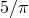

# 1.11.8 Analysis of unbounded acoustic regions

**Products: **Abaqus/Standard  Abaqus/Explicit  

### I. Analysis of an acoustic duct

### Elements tested

ACIN2D2    ACIN2D3    ACIN3D3    ACIN3D4    ACIN3D6    ACIN3D8    ACINAX2    ACINAX3    

### Features tested

Steady-state and transient dynamic analysis using acoustic infinite elements.

### Problem description

The problem of propagation of plane waves in a duct is used to verify the behavior of acoustic infinite elements. The duct is 10 units long and is excited at one end. The duct itself is modeled with acoustic finite elements of appropriate dimension and interpolation order. At the opposite end acoustic infinite elements are used to simulate the infinite continuation of the duct. In each input file another duct model using the exact plane-wave absorbing impedance boundary condition is supplied for comparison. Although the infinite elements are not exact for the duct case, they should give comparable results to the plane wave impedance case.

The axisymmetric elements are studied using an annular duct terminated with axisymmetric acoustic infinite elements. The comparison duct is identical but oriented in the opposite direction and terminated with the plane wave impedance condition.

**Material: **

Acoustic fluid:

| Acoustic bulk modulus, =1.28E5 |
| --- |
| Acoustic mass density, =1.25 |
| Speed of sound, =320.0. |

**Loading: **

In the Abaqus/Standard verification files, a two-step analysis is performed. In the first step a steady-state dynamic analysis is performed at two frequencies: 1 and 10. In the second step the fluid in the duct is initially quiescent and is forced at one end using a uniform sinusoidal excitation at a frequency of . In every case except the ACIN3D6 and ACIN3D8 verification files, the excitation is supplied as a concentrated load; for ACIN3D6 and ACIN3D8 the excitation is supplied as a boundary condition. The reference solution is found using an identical acoustic finite element mesh, with the plane wave impedance condition applied.

In the Abaqus/Explicit verification files, a single-step transient dynamic analysis is performed.  The fluid in the duct is initially quiescent and is forced at one end using a uniform sinusoidal excitation at a frequency of . In every case the excitation is supplied using the concentrated load procedure. The reference solution is found using an identical acoustic finite element mesh, with the plane wave impedance condition applied.

### Results and discussion

In each step the solutions using infinite elements produce results comparable to those obtained in the companion plane wave impedance case.

### Input files

##### **Abaqus/Standard input files**

[duct_acin2d2.inp](../eif/duct_acin2d2.inp)

Duct mesh made up of AC2D4 elements, terminated with an ACIN2D2 element.

[duct_acin2d3.inp](../eif/duct_acin2d3.inp)

Duct mesh made up of AC2D8 elements, terminated with an ACIN2D3 element.

[duct_acin3d3.inp](../eif/duct_acin3d3.inp)

Duct mesh made up of AC3D6 elements, terminated with an ACIN3D3 element.

[duct_ac3d5_acin3d4.inp](../eif/duct_ac3d5_acin3d4.inp)

Duct mesh made up of AC3D5 elements, terminated with an ACIN3D4 element.

[duct_acin3d4.inp](../eif/duct_acin3d4.inp)

Duct mesh made up of AC3D8 elements, terminated with an ACIN3D4 element.

[duct_acin3d6.inp](../eif/duct_acin3d6.inp)

Duct mesh made up of AC3D10 elements, terminated with ACIN3D6 elements.

[duct_acin3d8.inp](../eif/duct_acin3d8.inp)

Duct mesh made up of AC3D20 elements, terminated with an ACIN3D8 element.

[duct_acinax2.inp](../eif/duct_acinax2.inp)

Duct mesh made up of ACAX4 elements, terminated with an ACINAX2 element.

[duct_acinax3.inp](../eif/duct_acinax3.inp)

Duct mesh made up of ACAX8 elements, terminated with an ACINAX3 element.

##### **Abaqus/Explicit input files**

[duct_acin2d2_xpl.inp](../eif/duct_acin2d2_xpl.inp)

Duct mesh made up of AC2D4R elements, terminated with an ACIN2D2 element.

[duct_acin3d3_xpl.inp](../eif/duct_acin3d3_xpl.inp)

Duct mesh made up of AC3D8R elements, terminated with an ACIN3D3 element.

[duct_acin3d4_xpl.inp](../eif/duct_acin3d4_xpl.inp)

Duct mesh made up of AC3D8R elements, terminated with an ACIN3D4 element.

[duct_acinax2_xpl.inp](../eif/duct_acinax2_xpl.inp)

Duct mesh made up of ACAX4R elements, terminated with an ACINAX2 element.

### II. Coupling to solid elements

### Elements tested

ACIN2D2    ACIN2D3    ACIN3D3    ACIN3D4    ACIN3D6    ACIN3D8    ACINAX2    ACINAX3    

### Problem description

A simple transient problem is studied to verify the coupling of acoustic infinite elements directly to structural elements. Acoustic infinite elements are coupled to solid elements using a surface-based tie constraint. Accelerations are imposed on the solid elements using boundary conditions. To check these results, similar acceleration profiles are imposed as concentrated loads on acoustic infinite elements of the same geometry. The acceleration time histories are described using the amplitude procedure.

### Results and discussion

The time histories for acoustic pressure are in agreement for the two cases for the elements tested. There is a small numerical difference in the method in which accelerations and loads are imposed in Abaqus, which accounts for the small differences observed.

### Input files

##### **Abaqus/Standard input files**

[surf_acin2d2.inp](../eif/surf_acin2d2.inp)

ACIN2D2 element.

[surf_acin2d3.inp](../eif/surf_acin2d3.inp)

ACIN2D3 element.

[surf_acin3d3.inp](../eif/surf_acin3d3.inp)

ACIN3D3 element.

[surf_acin3d4.inp](../eif/surf_acin3d4.inp)

ACIN3D4 element.

[surf_acin3d6.inp](../eif/surf_acin3d6.inp)

ACIN3D6 element.

[surf_acin3d8.inp](../eif/surf_acin3d8.inp)

ACIN3D8 element.

[surf_acinax2.inp](../eif/surf_acinax2.inp)

 ACINAX2 element.

[surf_acinax3.inp](../eif/surf_acinax3.inp)

ACINAX3 element.

##### **Abaqus/Explicit input files**

[surf_acin2d2_xpl.inp](../eif/surf_acin2d2_xpl.inp)

ACIN2D2 element.

[surf_acin3d3_xpl.inp](../eif/surf_acin3d3_xpl.inp)

ACIN3D3 element.

[surf_acin3d4_xpl.inp](../eif/surf_acin3d4_xpl.inp)

ACIN3D4 element.

[surf_acinax2_xpl.inp](../eif/surf_acinax2_xpl.inp)

 ACINAX2 element.

