# 2.2.2 粘弹性材料

**产品：**Abaqus/Standard  Abaqus/Explicit  

### I. 与超弹性结合的大应变时域粘弹性

### 测试单元

B31    CAX4R    CPE4    CPE4H    CPE4HT    CPE4RH    CPS4    CPS4R    C3D8RH    C3D8RHT    M3D4    

### 问题描述

**材料1：**

| 多项式系数（N=1）： = 8.， = 2. |
| --- |
| 可压缩情况： = 0.1。 |
| Prony级数系数（N=1）：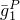 = 0.， = 0.5， = 3. |

**材料2：**

| 多项式系数（N=1）： = 8.， = 2. |
| --- |
| 可压缩情况： = 0.1。 |
| Prony级数系数（N=1）： = 0.5， = 0.， = 3. |
| 耦合分析的热传递特性：导热系数 = 0.01，密度 = 1.， |
| 比热 = 1。 |

**材料3：**

| 多项式系数（N=1）： = 1.5×10^6， = 0.5×10^6。 |
| --- |
| 可压缩情况： = 1.×10^7。 |
| Prony级数系数（N=2）： |
|  = 0.5， = 0.， = 0.2。 |
| 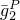 = 0.49，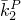 = 0.， = 0.5。 |

**材料4：**

| 多项式系数（N=1）： = 27.02， = 1.42。 |
| --- |
| 可压缩情况： = 0.000001。 |
| Prony级数系数（N=2）： |
|  = 0.25， = 0.25， = 5. |
|  = 0.25， = 0.25， = 10. |
| 从上述Prony级数生成的蠕变柔量测试数据。 |
| 从上述Prony级数生成的应力松弛测试数据。 |

**材料5：**

| 多项式系数（N=1）： = 8.， = 2. |
| --- |
| 可压缩情况： = 0.001。 |
| Prony级数系数（N=2）： |
|  = 0.5， = 0.， = 1. |
|  = 0.49， = 0.， = 2. |

**材料6：**

| 多项式系数（N=1）： = 550.53， = 275.265。 |
| --- |
| 可压缩情况： = 7.×10^7。 |
| Prony级数系数（N=6）： |
|  = 0.1986， = 0.， = 0.281×10^7。 |
|  = 0.1828， = 0.， = 0.281×10^5。 |
| 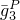 = 0.1388，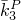 = 0.，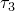 = 0.281×10^3。 |
| 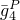 = 0.2499，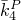 = 0.，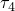 = 0.281×10^1。 |
| 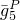 = 0.1703，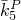 = 0.，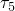 = 0.281×10^1。 |
| 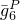 = 0.0593，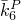 = 0.，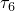 = 0.281×10^3。 |

**材料7：**

| Ogden系数（N=2）： = 16.， = 2.， = 4.， = 2. |
| --- |
| Prony级数系数（N=1）： = 0.5， = 0.， = 3。 |

**材料8：**

| Arruda-Boyce系数： = 20.， = 7. |
| --- |
| Prony级数系数（N=1）： = 0.5， = 0.， = 3。 |

**材料9：**

| Van der Waals系数： = 20.， = 10.，*a* = 0.1， = 0.02。 |
| --- |
| Prony级数系数（N=1）： = 0.5， = 0.， = 3。 |

**材料10：**

| Neo-Hookean系数：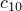 = 1， = 0.1。 |
| --- |
| Prony级数系数（N=1）： = 0.5， = 0， = 0.1。 |

**材料11：**

| Ogden系数（N=3）： = 64.26， = 1.8， = 25.， = 2.，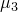 = 18.76，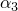 = 7。 |
| --- |
| Prony级数系数（N=1）： = 0.72， = 0.， = 17.5。 |
| 耦合分析的热传递特性：导热系数 = 1×10^6，密度 = 7800，比热 = 10，非弹性热分数 = 0.8。 |

### 结果与讨论

结果与精确分析解或近似解高度吻合。

已经从频率相关模量中校准了Prony级数参数，反之亦然，针对材料1、材料4和材料6在各种松弛和稳态动态分析中进行了测试。数据转换在Abaqus中自动执行。在下面描述的测试中，一些时域分析使用频率相关模量数据重复进行，一些频域（稳态动态）分析使用时相关模量数据重复进行。重复分析的结果与原始结果高度吻合。

### 输入文件

#### 材料1：

[mvhcdo2ahc.inp](../eif/mvhcdo2ahc.inp)

可压缩，体积压缩，CPS4单元。

[mvhcdo2sr2.inp](../eif/mvhcdo2sr2.inp)

可压缩，体积压缩，CPS4单元；从频率相关模量校准的Prony级数参数。

[mvhcdo2ssd.inp](../eif/mvhcdo2ssd.inp)

可压缩，体积压缩，CPS4单元；稳态动态，从指定的Prony级数参数导出的频率相关模量数据。

[mvhcdo2ss2.inp](../eif/mvhcdo2ss2.inp)

可压缩，体积压缩，CPS4单元；稳态动态，直接指定频率相关模量数据。

[mvhcdo2zzz.inp](../eif/mvhcdo2zzz.inp)

包含在mvhcdo2sr2.inp和mvhcdo2ss2.inp中的表格化频率相关模量数据。

[mvhcdo3ahc.inp](../eif/mvhcdo3ahc.inp)

可压缩，体积压缩，CPE4单元。

#### 材料2：

[mvccoo3hut.inp](../eif/mvccoo3hut.inp)

不可压缩，单轴拉伸，耦合分析，CPE4HT单元。

[mvhcoo2rre.inp](../eif/mvhcoo2rre.inp)

不可压缩，单轴拉伸松弛，CPS4单元。

[mvhcoo3hut.inp](../eif/mvhcoo3hut.inp)

不可压缩，单轴拉伸，CPE4H单元。

[mvhcoo3ltr.inp](../eif/mvhcoo3ltr.inp)

不可压缩，三轴，CPE4H单元。

#### 材料3：

[mvhcdo3rre.inp](../eif/mvhcdo3rre.inp)

可压缩，单轴拉伸松弛，CPE4单元。

#### 材料4：

[mvhcdo3srs.inp](../eif/mvhcdo3srs.inp)

可压缩，单轴拉伸，静态和松弛，CPE4H单元。

[mvhtdo3srs.inp](../eif/mvhtdo3srs.inp)

蠕变和松弛测试数据，单轴拉伸，静态和松弛，2个CPE4RH单元。

[mvhtdo3sr2.inp](../eif/mvhtdo3sr2.inp)

可压缩，单轴拉伸，静态和松弛，2个CPE4RH单元；从频率相关模量校准的Prony级数参数。

[mvhtdo3ssd.inp](../eif/mvhtdo3ssd.inp)

蠕变和松弛测试数据，可压缩，单轴拉伸，稳态动态，2个CPE4RH单元。

[mvhtdo3ss2.inp](../eif/mvhtdo3ss2.inp)

可压缩，单轴拉伸，稳态动态，2个CPE4RH单元；在mvhtdo3ssd.inp中校准的Prony级数参数的直接指定。

[mvhtdo3ss3.inp](../eif/mvhtdo3ss3.inp)

可压缩，单轴拉伸，稳态动态，2个CPE4RH单元；从剪切松弛和蠕变测试数据校准的Prony级数参数导出的频率相关模量数据，用于mvhtdo3ssd.inp中。

[mvhtdo3zzz.inp](../eif/mvhtdo3zzz.inp)

包含在mvhtdo3ss3.inp中的表格化频率相关模量数据。

[mvhtdo3srs1.inp](../eif/mvhtdo3srs1.inp)

组合测试数据，单轴拉伸，静态和松弛，2个CPE4RH单元。

[mvhcdo2srs.inp](../eif/mvhcdo2srs.inp)

可压缩，单轴拉伸和旋转，静态和松弛，CPS4单元。

[mvhcdo2vlp.inp](../eif/mvhcdo2vlp.inp)

可压缩，单轴拉伸和旋转，包含静态线性扰动步的静态和松弛[*LOAD CASE](../key/key-link.md#usb-kws-hloadcase)，CPS4R单元。

#### 材料5：

[mvhcdo2rre.inp](../eif/mvhcdo2rre.inp)

可压缩，单轴拉伸松弛，M3D4单元。

#### 材料6：

[mvhcdo3kct.inp](../eif/mvhcdo3kct.inp)

可压缩，双轴压缩拉伸，CAX4R单元。

[mvhcdo3kc2.inp](../eif/mvhcdo3kc2.inp)

可压缩，双轴压缩拉伸，CAX4R单元；从频率相关模量校准的Prony级数参数。

[mvhcdo3ssd.inp](../eif/mvhcdo3ssd.inp)

可压缩，双轴压缩拉伸，CAX4R单元；稳态动态，从指定的Prony级数参数导出的频率相关模量数据。

[mvhcdo3ss2.inp](../eif/mvhcdo3ss2.inp)

可压缩，双轴压缩拉伸，CAX4R单元；稳态动态，直接指定频率相关模量数据。

[mvhcdo3zzz.inp](../eif/mvhcdo3zzz.inp)

在mvhcdo3kc2.inp和mvhcdo3ss2.inp中作为[*INCLUDE](../key/key-link.md#usb-kws-minclude)文件使用的表格化频率相关模量数据。

#### 材料7：

[mvhcoo3rre.inp](../eif/mvhcoo3rre.inp)

不可压缩，单轴拉伸松弛，Ogden模型，CPE4H单元。

[mvhcoo3vlp.inp](../eif/mvhcoo3vlp.inp)

不可压缩，包含静态线性扰动步的单轴拉伸，Ogden模型，CPE4H单元。

#### 材料8：

[mvacoo3rre.inp](../eif/mvacoo3rre.inp)

不可压缩，单轴拉伸松弛，Arruda-Boyce模型，CPE4H单元。

[mvacoo3vlp.inp](../eif/mvacoo3vlp.inp)

不可压缩，包含[*LOAD CASE](../key/key-link.md#usb-kws-hloadcase)的静态线性扰动步的单轴拉伸，Arruda-Boyce模型，CPE4H单元。

#### 材料9：

[mvvcoo3rre.inp](../eif/mvvcoo3rre.inp)

不可压缩，单轴拉伸松弛，Van der Waals模型，CPE4H单元。

[mvvcoo3vlp.inp](../eif/mvvcoo3vlp.inp)

不可压缩，包含静态线性扰动步的单轴拉伸，Van der Waals模型，CPE4H单元。

#### 材料10：

[neoh_ve_unicyclic_b31.inp](../eif/neoh_ve_unicyclic_b31.inp)

不可压缩，带neo-Hookean模型的单轴循环测试，B31和C3D8RH单元。

[neoh_ve_creep_b31.inp](../eif/neoh_ve_creep_b31.inp)

带neo-Hookean模型的蠕变测试（可压缩和不可压缩），B31和C3D8RH单元。

[neoh_ve_relax_b31.inp](../eif/neoh_ve_relax_b31.inp)

带neo-Hookean模型的松弛测试（可压缩和不可压缩），B31和C3D8RH单元。

#### 材料11：

[ogden_ve_ssh_cyclic.inp](../eif/ogden_ve_ssh_cyclic.inp)

带粘性耗散作为热源的耦合温度-位移分析，不可压缩，循环简单剪切测试，Ogden模型，C3D8RHT单元。

### II. 与超泡沫材料结合的大应变时域粘弹性

### 测试单元

CPE4

### 问题描述

**材料1：**

| 超泡沫系数（N=3）： |
| --- |
|  = 17.4， = 1.22， = 548.2， = 17.3， = 10.47， = 1.775， =  =  = 0。 |
| Prony级数系数（N=1）： = 0.5， = 0.， = 3。 |

**材料2：**

| 超泡沫系数（N=3）：单轴测试数据，压缩，泊松比 = 0。 |
| --- |
| Prony级数系数（N=1）： = 0.5， = 0.5， = 3。 |

### 结果与讨论

结果与精确分析解或近似解高度吻合。

### 输入文件

#### 材料1（系数输入）：

[mvfcdo3rre.inp](../eif/mvfcdo3rre.inp)

可压缩，单轴拉伸松弛，CPE4单元。

[mvfcdo3vlp.inp](../eif/mvfcdo3vlp.inp)

可压缩，包含[*LOAD CASE](../key/key-link.md#usb-kws-hloadcase)静态线性扰动步的单轴拉伸，CPE4单元。

#### 材料2（测试数据输入）：

[mvftdo3rre.inp](../eif/mvftdo3rre.inp)

可压缩，单轴拉伸松弛，CPE4单元。

[mvftdo3rre_stbil_adap.inp](../eif/mvftdo3rre_stbil_adap.inp)

可压缩，单轴拉伸松弛，CPE4单元；带自适应稳定。

### III. 与线性弹性结合的小应变时域粘弹性

### 测试单元

CPS4

### 问题描述

**材料：**

| 弹性模量 = 30。 |
| --- |
| 泊松比 = 0.4。 |
| Prony级数系数（N=2）： |
|  = 0.25， = 0.25， = 5。 |
|  = 0.25， = 0.25， = 10。 |
| 从上述Prony级数生成的蠕变柔量测试数据。 |
| 从上述Prony级数生成的应力松弛测试数据。 |

### 结果与讨论

结果与精确分析解或近似解高度吻合。

### 输入文件

[mvliso2srs.inp](../eif/mvliso2srs.inp)

时域粘弹性，弹性，CPS4单元。

### IV. 与各向异性弹性结合的小应变时域粘弹性

### 测试单元

C3D8R    CPE4R    CPS4R    S4R    M3D4R    

### 问题描述

本节中的验证测试包括带粘弹性材料的单元元素松弛测试。这些单元承受拉伸或剪切加载，然后在恒定应变下松弛。

### 结果与讨论

结果与精确分析解或近似解高度吻合。

### 输入文件

[visco_ortho_relax.inp](../eif/visco_ortho_relax.inp)

带正交各向异性弹性的时域粘弹性。

[visco_ortho_creep.inp](../eif/visco_ortho_creep.inp)

带正交各向异性弹性的时域粘弹性。

[visco_aniso_relax.inp](../eif/visco_aniso_relax.inp)

带各向异性弹性的时域粘弹性。

[visco_aniso_creep.inp](../eif/visco_aniso_creep.inp)

带各向异性弹性的时域粘弹性。

### V. 与牵引-分离弹性结合的小应变时域粘弹性

### 测试单元

COH2D4    COH3D8    

### 问题描述

本节包括与带牵引-分离弹性的粘性单元组合的时域粘弹性验证测试。一组验证测试包括松弛测试，其中粘性单元在法向或剪切方向上加载，然后在恒定分离下松弛。另一组验证测试包括粘弹性与牵引-分离弹性和渐进损伤的组合。在这些测试中，粘性单元单调加载直至失效点。

### 结果与讨论

结果与精确分析解或近似解高度吻合。

### 输入文件

[visco_coh2d.inp](../eif/visco_coh2d.inp)

带牵引-分离弹性的时域粘弹性，COH2D4单元。

[visco_coh3d.inp](../eif/visco_coh3d.inp)

带牵引-分离弹性的时域粘弹性，COH3D8单元。

[visco_dmg_coh2d.inp](../eif/visco_dmg_coh2d.inp)

带牵引-分离弹性和损伤的时域粘弹性，COH2D4单元。

[visco_dmg_coh3d.inp](../eif/visco_dmg_coh3d.inp)

带牵引-分离弹性和损伤的时域粘弹性，COH3D8单元。

### VI. 频域粘弹性

### 测试单元

C3D8    CPS4    

### 问题描述

**材料1：**

| 弹性模量 = 200 GPa。 |
| --- |
| 泊松比 = 0.3。 |
| 密度 = 8000 kg/m³。 |
| 傅里叶变换系数（表格）： |
| 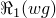 = 1.161×10^2，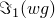 = 3.21×10^2，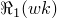 = 0，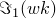 = 0， = 1。 |
| 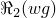 = 7.849×10^3，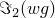 = 2.222×10^2，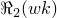 = 0，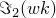 = 0， = 15.8。 |
| 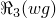 = 5.354×10^3，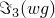 = 1.533×10^2，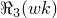 = 0，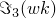 = 0， = 25.1。 |
| 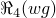 = 3.639×10^3，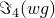 = 1.062×10^2，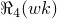 = 0，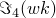 = 0，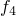 = 39.8。 |
| 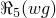 = 2.543×10^3，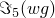 = 7.382×10^3，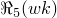 = 0，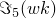 = 0，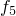 = 63.1。 |
| 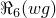 = 1.775×10^3，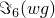 = 5.116×10^3，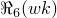 = 0，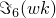 = 0，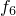 = 100。 |

**材料2：**

| 弹性模量 = 200 GPa。 |
| --- |
| 泊松比 = 0.3。 |
| 密度 = 8000 kg/m³。 |
| 傅里叶变换系数（公式）： |
| 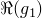 = 2.3508×10^3，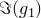 = 6.5001×10^3，*a* = 1.38366，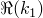 = 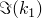 = *b* = 0。 |

**材料3：**

| 多项式系数（N=1）： = 33.333333×10^9， = 0， = 12.0×10^-12。 |
| --- |
| 傅里叶变换系数（表格）： |
|  = 1.161×10^2， = 3.21×10^2， = 0， = 0， = 1。 |
|  = 7.849×10^3， = 2.222×10^2， = 0， = 0， = 15.8。 |
|  = 5.354×10^3， = 1.533×10^2， = 0， = 0， = 25.1。 |
|  = 3.639×10^3， = 1.062×10^2， = 0， = 0， = 39.8。 |
|  = 2.543×10^3， = 7.382×10^3， = 0， = 0， = 63.1。 |
|  = 1.775×10^3， = 5.116×10^3， = 0， = 0， = 100。 |

**材料4：**

| 多项式系数（N=1）： = 33.333333×10^9， = 0， = 12.0×10^-12。 |
| --- |
| 傅里叶变换系数（公式）： |
|  = 2.3508×10^3， = 6.5001×10^3，*a* = 1.38366， =  = *b* = 0。 |

**材料5：**

| 多项式系数（N=1）： = 33.333333×10^9， = 0， = 12.0×10^-12。 |
| --- |
| 傅里叶变换系数（公式）： |
|  = 2.3508×10^3， = 6.5001×10^3，*a* = 0， =  = *b* = 0。 |

**材料6：**

| Arruda-Boyce系数： = 66.6666×10^9， = 5.，*D* = 12.0×10^-12。 |
| --- |
| 傅里叶变换系数（表格）： |
|  = 1.161×10^2， = 3.21×10^2， = 0， = 0， = 1。 |
|  = 7.849×10^3， = 2.222×10^2， = 0， = 0， = 15.8。 |
|  = 5.354×10^3， = 1.533×10^2， = 0， = 0， = 25.1。 |
|  = 3.639×10^3， = 1.062×10^2， = 0， = 0， = 39.8。 |
|  = 2.543×10^3， = 7.382×10^3， = 0， = 0， = 63.1。 |
|  = 1.775×10^3， = 5.116×10^3， = 0， = 0， = 100。 |

**材料7：**

| Arruda-Boyce系数： = 66.6666×10^9， = 5.，*D* = 12.0×10^-12。 |
| --- |
| 傅里叶变换系数（公式）： |
|  = 2.3508×10^3， = 6.5001×10^3，*a* = 1.38366， =  = *b* = 0。 |

**材料8：**

| Van der Waals系数： = 66.6666×10^9， = 10.，*a* = 0.1， = 0.，*D* = 12.0×10^-12。 |
| --- |
| 傅里叶变换系数（表格）： |
|  = 1.161×10^2， = 3.21×10^2， = 0， = 0， = 1。 |
|  = 7.849×10^3， = 2.222×10^2， = 0， = 0， = 15.8。 |
|  = 5.354×10^3， = 1.533×10^2， = 0， = 0， = 25.1。 |
|  = 3.639×10^3， = 1.062×10^2， = 0， = 0， = 39.8。 |
|  = 2.543×10^3， = 7.382×10^3， = 0， = 0， = 63.1。 |
|  = 1.775×10^3， = 5.116×10^3， = 0， = 0， = 100。 |

**材料9：**

| Van der Waals系数： = 66.6666×10^9， = 10.，*a* = 0.1， = 0.，*D* = 12.0×10^-12。 |
| --- |
| 傅里叶变换系数（公式）： |
|  = 2.3508×10^3， = 6.5001×10^3，*a* = 1.38366， =  = *b* = 0。 |

### 结果与讨论

该问题涉及直接积分稳态动态过程，其中振幅为1.0 GPa的谐波压力施加到悬臂梁的顶面。随后进行若干基于子空间的稳态动态过程。最感兴趣的结果是悬臂端部的垂直位移和指定频率的位移相位角。

### 输入文件

#### 材料1：

[mveft02the.inp](../eif/mveft02the.inp)

表格化频域粘弹性，弹性，CPS4单元。

[mveft03the.inp](../eif/mveft03the.inp)

表格化频域粘弹性，弹性，C3D8单元。

#### 材料2：

[mveff02the.inp](../eif/mveff02the.inp)

公式化频域粘弹性，弹性，CPS4单元。

[mveff03the.inp](../eif/mveff03the.inp)

公式化频域粘弹性，弹性，C3D8单元。

#### 材料3：

[mvyft02the.inp](../eif/mvyft02the.inp)

表格化频域粘弹性，超弹性，CPS4单元。

[mvyft03the.inp](../eif/mvyft03the.inp)

表格化频域粘弹性，超弹性，C3D8单元。

#### 材料4：

[mvyff02the.inp](../eif/mvyff02the.inp)

公式化频域粘弹性，超弹性，CPS4单元。

[mvyff03the.inp](../eif/mvyff03the.inp)

公式化频域粘弹性，超弹性，C3D8单元。

#### 材料5：

[mvyfn02the.inp](../eif/mvyfn02the.inp)

公式化频域粘弹性，超弹性，CPS4单元。

[mvyfn03the.inp](../eif/mvyfn03the.inp)

公式化频域粘弹性，超弹性，C3D8单元。

#### 材料6：

[mvxft02the.inp](../eif/mvxft02the.inp)

表格化频域粘弹性，超弹性，CPS4单元。

[mvxft03the.inp](../eif/mvxft03the.inp)

表格化频域粘弹性，超弹性，C3D8单元。

#### 材料7：

[mvxfn02the.inp](../eif/mvxfn02the.inp)

公式化频域粘弹性，超弹性，CPS4单元。

[mvxfn03the.inp](../eif/mvxfn03the.inp)

公式化频域粘弹性，超弹性，C3D8单元。

#### 材料8：

[mvzft02the.inp](../eif/mvzft02the.inp)

表格化频域粘弹性，超弹性，CPS4单元。

[mvzft03the.inp](../eif/mvzft03the.inp)

表格化频域粘弹性，超弹性，C3D8单元。

#### 材料9：

[mvzfn02the.inp](../eif/mvzfn02the.inp)

公式化频域粘弹性，超弹性，CPS4单元。

[mvzfn03the.inp](../eif/mvzfn03the.inp)

公式化频域粘弹性，超弹性，C3D8单元。

### VII. 直接以存储模量和损耗模量形式定义的频域粘弹性

### 测试单元

C3D8R    C3D8RH    

### 问题描述

除了在前面子节验证问题中采用的方法外，Abaqus还允许直接以存储模量和损耗模量（而不是以涉及长期弹性剪切模量和体积模量的比值形式）定义频域中的粘弹性行为。粘弹性行为可以使用直接从单轴拉伸测试获得的存储模量和损耗模量数据来定义。如果体积松弛很重要，也可以以体积存储模量和损耗模量的形式定义，这可以直接从体积测试中获得。在两种情况下，粘弹性特性都可以作为频率和预载荷水平的函数以表格形式定义。本子节中描述的问题使用了这种方法。

基本测试设置包括参考单元和测试单元。对于参考单元，粘弹性行为使用前面子节中使用的方法定义（即，以涉及长期弹性模量比值的形式）。对于测试单元，粘弹性行为直接以单轴存储和损耗模量（在某些情况下是体积存储和损耗模量）定义。然而，在后一种情况下，单轴（和体积）存储/损耗模量的值是根据为参考单元指定的比例和（预载荷相关的）长期弹性模量手动计算的。在计算测试用例的存储和损耗模量时，假设为参考用例指定的比例与预载荷水平无关。由于本节问题的目的只是验证实现是否正确，上述假设不应被视为限制。参考单元和测试单元都承受关于无载荷状态以及若干水平的单轴和体积预应变的基于位移的谐波激励。在每种情况下获得稳态动态响应。

### 结果与讨论

根据设计，参考单元和测试单元预计会产生相同的实数和虚数应力。这是当前方法实现的验证。

### 输入文件

[frq_visco_prldu_ab.inp](../eif/frq_visco_prldu_ab.inp)

仅指定单轴粘弹性数据，长期弹性行为使用Arruda-Boyce超弹性模型定义。

[frq_visco_prldu_marlow.inp](../eif/frq_visco_prldu_marlow.inp)

仅指定单轴粘弹性数据，长期弹性行为使用Marlow超弹性模型定义。

[frq_visco_prldu_poly1.inp](../eif/frq_visco_prldu_poly1.inp)

仅指定单轴粘弹性数据，长期弹性行为使用Mooney-Rivlin超弹性模型定义。

[frq_visco_prldu_ogden.inp](../eif/frq_visco_prldu_ogden.inp)

仅指定单轴粘弹性数据，长期弹性行为使用三阶Ogden超弹性模型定义。

[frq_visco_prldu_poly3.inp](../eif/frq_visco_prldu_poly3.inp)

仅指定单轴粘弹性数据，长期弹性行为使用三阶多项式超弹性模型定义。

[frq_visco_prldu_vdw.inp](../eif/frq_visco_prldu_vdw.inp)

仅指定单轴粘弹性数据，长期弹性行为使用Van der Waals超弹性模型定义。

[frq_visco_prldu_hfoam.inp](../eif/frq_visco_prldu_hfoam.inp)

仅指定单轴粘弹性数据，长期弹性行为使用二阶超泡沫模型定义。

[frq_visco_prlduv_poly1.inp](../eif/frq_visco_prlduv_poly1.inp)

同时指定单轴和体积粘弹性数据，长期弹性行为使用Mooney-Rivlin超弹性模型定义。

[frq_visco_prlduv_poly3.inp](../eif/frq_visco_prlduv_poly3.inp)

同时指定单轴和体积粘弹性数据，长期弹性行为使用三阶多项式超弹性模型定义。

[frq_visco_prlduv_hfoam.inp](../eif/frq_visco_prlduv_hfoam.inp)

同时指定单轴和体积粘弹性数据，长期弹性行为使用二阶超泡沫模型定义。

[frq_visco_interp.inp](../eif/frq_visco_interp.inp)

材料特性插值的基本测试。

