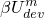
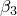

# 2.2.3 Mullins effect and permanent set

**Products: **Abaqus/Standard  Abaqus/Explicit  

### I. Mullins effect in elastomers

### Elements tested

SAX1    CPS4R    CPE4R    CPE4RH    C3D8R    C3D8RH    T2D2    

### Problem description

The problems in this set can be broadly classified under three categories. The first category of problems consists of simple displacement- or load-controlled cyclic tests to verify the Mullins effect, with the primary response defined by different strain energy potential functions. The tests consist of a single element that is cyclically loaded to a maximum strain (stress) level, then unloaded to zero strain (stress). This is followed by further reloading to levels of strain (stress) that are higher than those reached during the loading segment of the first cycle, followed again by unloading to zero strain (stress). The tests in this section use parts and assemblies.

The second category of problems is intended for testing the calibration capabilities for determining the Mullins effect coefficients. The problems use unloading test data that were generated by running a model with specified values of the Mullins effect coefficients. The calibration capability is meant to recover the specified values of the Mullins effect coefficients. These tests use different loading states, such as uniaxial tension, biaxial tension, and planar tension.

The third category of problems tests the import capability with the Mullins effect. All tests in this section are set up with a uniaxial stress state. The tests consist of first loading a single element in Abaqus/Standard and unloading it. The results are then imported into Abaqus/Explicit, where the element is loaded to deformation levels higher than the original loading and then unloaded. These results are again imported back into Abaqus/Standard, where the element is loaded to deformation levels higher than the prior loading and then unloaded. Finally, the last set of results are imported from Abaqus/Standard to Abaqus/Standard, and the element is further deformed and unloaded. The above series of tests includes problems that import both the state and the reference configuration, problems that import only the state, and problems that import neither the state nor the reference configuration.

**Material: **

The following material data are used for the first category of tests:

| Strain energypotential form | Primary hyperelastic coefficients | Mullins effect parameters |
| --- | --- | --- |
| Compressible Arruda-Boyce |  = 200.0,  = 5.0,  = 0.001 | *r* = 1.1, *m* = 100.0,  = 0.1 |
| Compressible Ogden |  = 160.0,  = 2.0,  = 40.0,  = --2.0,  = 0.001 | *r* = 5.0, *m* = 220.0,  = 0.1 |
| Incompressible Ogden |  = 160.0,  = 2.0,  = 40.0,  = --2.0 | *r* = 5.0, *m* = 220.0 |
| User-defined hyperelastic material | Same as the compressible Yeoh model |
| Compressible Van der Waals |  = 200.0,  = 10.0,  = 0.1,  = 0.0, *D* = 0.001 | *r* = 3.0, *m* = 100.0,  = 0.1 |
| Compressible Yeoh |  = 1.326,  = --0.326,  = 0.1319,  = 0.000725 | *r* = 1.1, *m* = 100.0,  = 0.1 |
| Incompressible Yeoh |  = 1.326,  = --0.326,  = 0.1319 | *r* = 1.1, *m* = 100.0 |

For the second and third category of tests the primary material response is defined using the incompressible Yeoh potential with the deviatoric coefficients as given above. For the second category of tests the unloading test data are generated for uniaxial, biaxial, and planar stress states using the following values for the Mullins effect parameters: *r* = 1.25, *m* = 0.01, and  = 0.9. These parameters are also used to define the Mullins effect in the third category of tests.

**Loading: **

The first category of problems includes both displacement- and force-controlled loading. The second and third categories of problems are carried out under only displacement-controlled loading.

### Results and discussion

For the first category of problems the results of the Abaqus/Standard and Abaqus/Explicit numerical simulations are in good agreement with the analytical results.

For the second category of problems, which tests the calibration of the Mullins effect parameters, it is observed that the parameters *r* and  are always captured accurately. A good fit for *m* is obtained in situations where the deformation level leads to a relatively large value of maximum deviatoric strain energy density, , such that the value of  dominates over the value of *m*. 

For the final category of problems, which tests the import capability, the response after each import of results is as expected. When the state is imported, further deformation upon import shows the appropriate level of stress softening. On the other hand, when the state is not imported, no stress softening is observed.

### Input files

[mmecdo2cut_arruda.inp](../eif/mmecdo2cut_arruda.inp)

Compressible Arruda-Boyce model, CPE4RH element, cyclic uniaxial tension.

[mmecdo2cut_vdw.inp](../eif/mmecdo2cut_vdw.inp)

Compressible Van der Waals model, CPE4RH element, cyclic uniaxial tension.

[mmecdo2cut_yeoh.inp](../eif/mmecdo2cut_yeoh.inp)

Compressible Yeoh model, SAX1 element, cyclic uniaxial tension.

[mmecdo2cut.inp](../eif/mmecdo2cut.inp)

Compressible Yeoh model, CPS4R element, cyclic uniaxial tension, tests temperature- and field-variable-dependent Mullins effect material properties.

[mmecdo2cut_po.inp](../eif/mmecdo2cut_po.inp)

Tests the [*POST OUTPUT](../key/key-link.md#usb-kws-hpostoutput) capability for the damage-related output variables. This job needs the restart file from the job mmecdo2cut.inp.

[mmecoo2cut_yeoh.inp](../eif/mmecoo2cut_yeoh.inp)

Incompressible Yeoh model, SAX1 element, cyclic uniaxial tension.

[mmecoo2cut_user.inp](../eif/mmecoo2cut_user.inp)

Incompressible Yeoh model, CPS4R element, cyclic uniaxial tension. The Mullins effect is implemented with user subroutine [`UMULLINS`](../sub/sub-link.md#sub-xsl-umullins); the use of solution- dependent state variables in [`UMULLINS`](../sub/sub-link.md#sub-xsl-umullins) is also tested (the solution-dependent state variables are used to provide a nonzero initial value of ).

[mmecdo3cut_ogden.inp](../eif/mmecdo3cut_ogden.inp)

Compressible Ogden model, C3D8RH element, cyclic uniaxial tension.

[mmecoo3cut_ogden.inp](../eif/mmecoo3cut_ogden.inp)

Incompressible Ogden model, C3D8RH element, cyclic uniaxial tension.

[mmecdo3cut_user.inp](../eif/mmecdo3cut_user.inp)

Compressible user-defined hyperelastic material, C3D8RH element, cyclic uniaxial tension, user subroutine [`UHYPER`](../sub/sub-link.md#sub-xsl-uhyper) provided in the file mmecdo3cut_user.f.

[mmecdo3cut_yeoh.inp](../eif/mmecdo3cut_yeoh.inp)

Compressible Yeoh model, C3D8RH element, cyclic uniaxial tension.

[mmecdo3cut_yeoh_load.inp](../eif/mmecdo3cut_yeoh_load.inp)

Compressible Yeoh model, C3D8RH element, cyclic uniaxial tension with load control.

[mmecdo3ctu.inp](../eif/mmecdo3ctu.inp)

Compressible Yeoh model, C3D8RH element, triaxial tension followed by unloading, further loading in uniaxial tension, and unloading. The purpose of this test is to demonstrate that a purely volumetric deformation does not result in any damage. This problem also tests a static linear perturbation analysis about a damaged base state.

[mmecoo3cut_yeoh.inp](../eif/mmecoo3cut_yeoh.inp)

Incompressible Yeoh model, C3D8RH element, cyclic uniaxial tension.

[mmecdo2cut_arruda_visco.inp](../eif/mmecdo2cut_arruda_visco.inp)

Compressible Arruda-Boyce model with viscoelasticity, CPE4RH element, cyclic uniaxial tension.

[mmecdo3cut_ogden_visco.inp](../eif/mmecdo3cut_ogden_visco.inp)

Compressible Ogden model with viscoelasticity, C3D8RH element, cyclic uniaxial tension.

[mmecoo2cut_yeoh_visco.inp](../eif/mmecoo2cut_yeoh_visco.inp)

Incompressible Yeoh model with viscoelasticity, SAX1 element, cyclic uniaxial tension.

[mmecoo3cut_ogden_visco.inp](../eif/mmecoo3cut_ogden_visco.inp)

Incompressible Ogden model with viscoelasticity, C3D8RH element, cyclic uniaxial tension.

[neoh_mullins_ve.inp](../eif/neoh_mullins_ve.inp)

Neo-Hookean model with viscoelasticity and Mullins effect; C3D8R, CPE4R, and CPS4R elements; uniaxial loading-unloading at different strain levels.

[x_mmecdo2cut_arruda.inp](../eif/x_mmecdo2cut_arruda.inp)

Explicit dynamic test with compressible Arruda-Boyce model, CPE4RH element, cyclic uniaxial tension.

[x_mmecdo2cut_vdw.inp](../eif/x_mmecdo2cut_vdw.inp)

Explicit dynamic test with compressible Van der Waals model, CPE4RH element, cyclic uniaxial tension.

[x_mmecdo3cut_ogden.inp](../eif/x_mmecdo3cut_ogden.inp)

Explicit dynamic test with compressible Ogden model, C3D8RH element, cyclic uniaxial tension.

[x_mmecdo2cut_yeoh.inp](../eif/x_mmecdo2cut_yeoh.inp)

Explicit dynamic test with compressible Yeoh model, SAX1 element, cyclic uniaxial tension.

[x_mmecdo3cut_yeoh.inp](../eif/x_mmecdo3cut_yeoh.inp)

Explicit dynamic test with compressible Yeoh model, C3D8RH element, cyclic uniaxial tension.

[x_mmecdo2cut_visarruda.inp](../eif/x_mmecdo2cut_visarruda.inp)

Explicit dynamic test with compressible Arruda-Boyce model and viscoelasticity, CPE4RH element, cyclic uniaxial tension.

[x_mmecdo2cut_visvdw.inp](../eif/x_mmecdo2cut_visvdw.inp)

Explicit dynamic test with compressible Van der Waals model and viscoelasticity, CPE4RH element, cyclic uniaxial tension.

[x_mmecdo3cut_visogden.inp](../eif/x_mmecdo3cut_visogden.inp)

Explicit dynamic test with compressible Ogden model and viscoelasticity, C3D8RH element, cyclic uniaxial tension.

[x_mmecdo3cut_visyeoh.inp](../eif/x_mmecdo3cut_visyeoh.inp)

Explicit dynamic test with compressible Yeoh model and viscoelasticity, C3D8RH element, cyclic uniaxial tension.

[x_mmecdo3cut_user.inp](../eif/x_mmecdo3cut_user.inp)

Explicit dynamic test with compressible Yeoh model and viscoelasticity, C3D8RH element, cyclic uniaxial tension. The Mullins effect is implemented with user subroutine [`VUMULLINS`](../sub/sub-link.md#sub-xsl-vumullins).

[mmetdo3cut.inp](../eif/mmetdo3cut.inp)

Calibration test with uniaxial unloading test data, C3D8RH element, cyclic uniaxial tension.

[mmetdo3cut_marlow.inp](../eif/mmetdo3cut_marlow.inp)

Calibration test with uniaxial unloading test data, C3D8RH element, cyclic uniaxial tension, Marlow model.

[mmetdo3cbt.inp](../eif/mmetdo3cbt.inp)

Calibration test with biaxial unloading test data, C3D8RH element, cyclic biaxial tension.

[mmetdo3cpt.inp](../eif/mmetdo3cpt.inp)

Calibration test with planar unloading test data, C3D8RH element, cyclic planar tension.

[mmetdo3cpt_mult.inp](../eif/mmetdo3cpt_mult.inp)

Calibration test with unloading test data from uniaxial, biaxial, and planar tests; C3D8RH element; cyclic planar tension.

[mmetdo3cpt_r.inp](../eif/mmetdo3cpt_r.inp)

Calibration test with unloading test data from uniaxial, biaxial, and planar tests and with the value of the parameter *r* fixed; C3D8RH element; cyclic planar tension.

[mmetdo3cpt_m.inp](../eif/mmetdo3cpt_m.inp)

Calibration test with unloading test data from uniaxial, biaxial, and planar tests and with the value of the parameter *m* fixed; C3D8RH element; cyclic planar tension.

[mmetdo3cpt_beta.inp](../eif/mmetdo3cpt_beta.inp)

Calibration test with unloading test data from uniaxial, biaxial, and planar tests and with the value of the parameter  fixed; C3D8RH element; cyclic planar tension.

[sx_s_mullins.inp](../eif/sx_s_mullins.inp)

Base problem for carrying out import from Abaqus/Standard to Abaqus/Explicit, C3D8RH element, cyclic uniaxial tension.

[sx_x_mullins_y_y.inp](../eif/sx_x_mullins_y_y.inp)

Explicit dynamic continuation of sx_s_mullins.inp with both the reference configuration and the state imported, C3D8RH element, cyclic uniaxial tension.

[sx_x_mullins_n_y.inp](../eif/sx_x_mullins_n_y.inp)

Explicit dynamic continuation of sx_s_mullins.inp with only the state imported, C3D8RH element, cyclic uniaxial tension.

[sx_x_mullins_n_n.inp](../eif/sx_x_mullins_n_n.inp)

Explicit dynamic continuation of sx_s_mullins.inp without importing the state or the reference configuration, C3D8RH element, cyclic uniaxial tension.

[xs_s_mullins_y_y.inp](../eif/xs_s_mullins_y_y.inp)

Import into Abaqus/Standard from sx_x_mullins_y_y.inp with both the state and the reference configuration imported, C3D8RH element, cyclic uniaxial tension.

[xs_s_mullins_n_y.inp](../eif/xs_s_mullins_n_y.inp)

Import into Abaqus/Standard from sx_x_mullins_n_y.inp with only the state imported, C3D8RH element, cyclic uniaxial tension.

[xs_s_mullins_n_n.inp](../eif/xs_s_mullins_n_n.inp)

Import into Abaqus/Standard from sx_x_mullins_n_n.inp without importing the state or the reference configuration, C3D8RH element, cyclic uniaxial tension.

[ss_mullins_y_y.inp](../eif/ss_mullins_y_y.inp)

Abaqus/Standard to Abaqus/Standard import from xs_s_mullins_y_y.inp with both the state and the reference configuration imported, C3D8RH element, cyclic uniaxial tension.

[ss_mullins_n_y.inp](../eif/ss_mullins_n_y.inp)

Abaqus/Standard to Abaqus/Standard import from xs_s_mullins_n_y.inp with only the state imported, C3D8RH element, cyclic uniaxial tension.

[ss_mullins_n_n.inp](../eif/ss_mullins_n_n.inp)

Abaqus/Standard to Abaqus/Standard import from xs_s_mullins_n_n.inp without importing the state or the reference configuration, C3D8RH element, cyclic uniaxial tension.

[mmecdo1cut_marlow.inp](../eif/mmecdo1cut_marlow.inp)

Compressible Marlow model, T2D2 element, cyclic uniaxial tension, tests temperature- and field-variable-dependent Mullins effect material properties.

[mmecdo2cut_marlow.inp](../eif/mmecdo2cut_marlow.inp)

Compressible Marlow model, CPS4R element, cyclic uniaxial tension, tests temperature- and field-variable-dependent Mullins effect material properties.

[mmecdo3cut_marlow.inp](../eif/mmecdo3cut_marlow.inp)

Compressible Marlow model, C3D8RH element, cyclic uniaxial tension.

### II. Permanent set in elastomers

### Elements tested

C3D8    C3D8H    C3D8R    C3D8RH    CAX4R    CGAX4RH    CPS3    CPS4R    CPS6M    CPS8    S3R    S4R    SC8R    M3D4R    

### Problem description

All problems in this section verify hyperelastic behavior with Mullins effect and plasticity.  Comparison of finite element results can be made against the original test data (stress versus total strain) supplied with the input files. Most problems use test data as input for hyperelastic behavior and Mullins effect in a stress-free configuration. Similarly, plasticity is defined using a suitable hardening function.

The problems in this set can be broadly classified under two categories. The first category of problems consists of displacement- or load-controlled cyclic tests in modes such as uniaxial tension, biaxial tension, and simple shear with or without orientation. These problems verify simulation of permanent set with Mullins effect for various hyperelastic models.

The second category of problems is intended for testing the import capability with permanent set. Various combinations of elements and modes of deformation are verified for import from Abaqus/Standard to  Abaqus/Explicit, from Abaqus/Standard to Abaqus/Standard, and from Abaqus/Explicit to Abaqus/Standard.

**Material: **

Refer to the input files for test data and material properties used.

**Loading: **

Both displacement- and load-controlled loading are used to verify uniaxial and biaxial tension. Only displacement-controlled loading is used to verify simple shear mode.

### Results and discussion

The results of the finite element simulation can be compared with the original test data input provided in separate files, and the agreement is very good.

### Input files

[heplmu_matprops_calibrate.inp](../eif/heplmu_matprops_calibrate.inp)

Original test data that include loading and unloading data, showing permanent set in uniaxial and biaxial modes.

[heplmu_matprops_bi.inp](../eif/heplmu_matprops_bi.inp)

Original test data that include loading and unloading data, showing permanent set in biaxial mode.

[heplmu_matprops_uni.inp](../eif/heplmu_matprops_uni.inp)

Original test data that include loading and unloading data, showing permanent set in uniaxial mode.

[heplmu_matprops.inp](../eif/heplmu_matprops.inp)

Uniaxial and biaxial test data for hyperelasticity and Mullins effect in stress-free configuration, plasticity hardening data.

[heplmu_matprops_bi.inp](../eif/heplmu_matprops_bi.inp)

Biaxial test data for hyperelasticity and Mullins effect in stress-free configuration, plasticity hardening data.

[heplmu_matprops_uni.inp](../eif/heplmu_matprops_uni.inp)

Uniaxial test data for hyperelasticity and Mullins effect in stress-free configuration, plasticity hardening data.

[heplmu_marlow_c3d8h_bi.inp](../eif/heplmu_marlow_c3d8h_bi.inp)

Incompressible Marlow model with biaxial test data, C3D8H element, load-controlled cyclic biaxial tension.

[heplmu_marlow_c3d8rh_uniori.inp](../eif/heplmu_marlow_c3d8rh_uniori.inp)

Incompressible Marlow model with uniaxial test data, C3D8RH element with orientation, load-controlled cyclic uniaxial tension.

[heplmu_ogden_biori.inp](../eif/heplmu_ogden_biori.inp)

Incompressible Ogden model with uniaxial and biaxial test data, C3D8RH element with orientation, strain-controlled cyclic biaxial tension.

[heplmu_ogden_ssori.inp](../eif/heplmu_ogden_ssori.inp)

Incompressible Ogden model with uniaxial and biaxial test data, C3D8H element with orientation, strain-controlled cyclic simple shear.

[heplmu_ogden_uni.inp](../eif/heplmu_ogden_uni.inp)

Incompressible Ogden model with uniaxial and biaxial test data, C3D8RH element, strain-controlled cyclic uniaxial tension.

[heplmu_yeoh_cgax4rh.inp](../eif/heplmu_yeoh_cgax4rh.inp)

Compressible Yeoh model, CGAX4RH element, uniaxial tension followed by linear perturbation about the prestressed state.

[heplmu_marlow_2d_bi.inp](../eif/heplmu_marlow_2d_bi.inp)

Incompressible Marlow model with biaxial test data; CPS4R, CPS3, CPS6M, CPS8, S3R, S4R, SC8R, and M3D4R elements; load-controlled cyclic biaxial tension.

[heplmu_marlow_2d_uniori.inp](../eif/heplmu_marlow_2d_uniori.inp)

Incompressible Marlow model with uniaxial test data; CPS3, CPS4R, CPS6M, CPS8, S3R, S4R, SC8R, and M3D4R elements with orientation; load-controlled cyclic uniaxial tension.

[heplmu_ogden_2d_biori.inp](../eif/heplmu_ogden_2d_biori.inp)

Incompressible Ogden model with uniaxial and biaxial test data; CPS3, CPS4R, CPS6M, CPS8, S3R, S4R, SC8R, and M3D4R elements with orientation; strain-controlled cyclic biaxial tension.

[heplmu_ogden_2d_ssori.inp](../eif/heplmu_ogden_2d_ssori.inp)

Incompressible Ogden model with uniaxial and biaxial test data; CPS3, CPS4R, CPS6M, CPS8, S3R, and S4R elements with orientation; strain-controlled cyclic simple shear.

[heplmu_ogden_2d_uni.inp](../eif/heplmu_ogden_2d_uni.inp)

Incompressible Ogden model with uniaxial and biaxial test data; CPS3, CPS4R, CPS6M, CPS8, S3R, and S4R elements; strain-controlled cyclic uniaxial tension.

[heplmu_polycomp_2d_biori.inp](../eif/heplmu_polycomp_2d_biori.inp)

Compressible polynomial model with uniaxial test data; CPS3, CPS4R, CPS6M, CPS8, S3R, S4R, SC8R, and M3D4R elements with orientation; strain-controlled cyclic biaxial tension.

[x_heplmu_marlow_c3d8r_uniori.inp](../eif/x_heplmu_marlow_c3d8r_uniori.inp)

Explicit dynamic test of compressible Marlow model with uniaxial test data, C3D8R element with orientation, load-controlled cyclic uniaxial tension.

[x_heplmu_marlow_c3d8_bi.inp](../eif/x_heplmu_marlow_c3d8_bi.inp)

Explicit dynamic test of compressible Marlow model with biaxial test data, C3D8 element with orientation, load-controlled cyclic biaxial tension.

[x_heplmu_ogden_biori.inp](../eif/x_heplmu_ogden_biori.inp)

Explicit dynamic test of compressible Ogden model with uniaxial and biaxial test data, C3D8R element with orientation, strain-controlled cyclic biaxial tension.

[x_heplmu_ogden_ssori.inp](../eif/x_heplmu_ogden_ssori.inp)

Explicit dynamic test of compressible Ogden model with uniaxial and biaxial test data, C3D8 element with orientation, simple shear.

[x_heplmu_ogden_uni.inp](../eif/x_heplmu_ogden_uni.inp)

Explicit dynamic test of compressible Ogden model with uniaxial and biaxial test data, C3D8 element, strain-controlled cyclic uniaxial tension.

[x_heplmu_yeoh_cax4r.inp](../eif/x_heplmu_yeoh_cax4r.inp)

Explicit dynamic test of compressible Yeoh model, CAX4R element, load-controlled cyclic uniaxial tension.

[ss_s1_heplmu_uniori.inp](../eif/ss_s1_heplmu_uniori.inp)

Base problem for Abaqus/Standard to Abaqus/Standard import, C3D8R element with compressible Marlow model in cyclic uniaxial tension.

[ss_s2_heplmu_uniori.inp](../eif/ss_s2_heplmu_uniori.inp)

Imported from ss_s1_heplmu_uniori.inp(Abaqus/Standard) with state and original reference configuration, C3D8R element with compressible Marlow model in cyclic uniaxial tension.

[ss_s1_fefp2d_biori.inp](../eif/ss_s1_fefp2d_biori.inp)

Base problem for Abaqus/Standard to Abaqus/Standard import, S4R and CPS4R elements with orientation, compressible Marlow model in cyclic biaxial tension.

[ss_s2_fefp2d_biori.inp](../eif/ss_s2_fefp2d_biori.inp)

Imported from ss_s1_fefp2d_biori.inp (Abaqus/Standard) with state and original reference configuration, S4R and CPS4R elements with orientation, compressible Marlow model in cyclic biaxial tension.

[ss_s1_fefp2d_ssori.inp](../eif/ss_s1_fefp2d_ssori.inp)

Base problem for Abaqus/Standard to Abaqus/Standard import, S4R and CPS4R elements with orientation, compressible Marlow model in simple shear mode.

[ss_s2_fefp2d_ssori.inp](../eif/ss_s2_fefp2d_ssori.inp)

Imported from ss_s1_fefp2d_ssori.inp (Abaqus/Standard) with state and original reference configuration, S4R and CPS4R elements with orientation, compressible Marlow model in simple shear mode.

[sx_s_c3d8r_ssori.inp](../eif/sx_s_c3d8r_ssori.inp)

Base problem for Abaqus/Standard to Abaqus/Explicit import, with subsequent import to both Abaqus/Standard and Abaqus/Explicit, C3D8R element with orientation, compressible Marlow model in simple shear mode.

[sx_x_c3d8r_ssori.inp](../eif/sx_x_c3d8r_ssori.inp)

Imported from sx_s_c3d8r_ssori.inp (Abaqus/Standard) with state and original reference configuration, base problem for Abaqus/Explicit to Abaqus/Standard import, C3D8R element with orientation, compressible Marlow model in simple shear mode.

[xs_s_c3d8r_ssori.inp](../eif/xs_s_c3d8r_ssori.inp)

Imported from sx_x_c3d8r_ssori.inp (Abaqus/Explicit) with state and original reference configuration, C3D8R element with orientation, compressible Marlow model in simple shear mode.

[xx_x2_c3d8r_ssori.inp](../eif/xx_x2_c3d8r_ssori.inp)

Imported from sx_x_c3d8r_ssori.inp (Abaqus/Explicit) with state and original reference configuration, C3D8R element with orientation, compressible Marlow model in simple shear mode.

[sx_s_fefp2d_biori.inp](../eif/sx_s_fefp2d_biori.inp)

Base problem for Abaqus/Standard to Abaqus/Explicit import, CPS4R element with orientation, compressible Marlow model in cyclic biaxial tension.

[sx_x_fefp2d_biori.inp](../eif/sx_x_fefp2d_biori.inp)

Imported from sx_s_fefp2d_biori.inp (Abaqus/Standard) with state and original reference configuration, CPS4R element with orientation, compressible Marlow model in cyclic biaxial tension.

[xs_x_heplmu_uni.inp](../eif/xs_x_heplmu_uni.inp)

Base explicit dynamic problem for Abaqus/Standard to Abaqus/Explicit import, C3D8R element with compressible Marlow model and cyclic uniaxial tension.

[xs_s_heplmu_uni.inp](../eif/xs_s_heplmu_uni.inp)

Imported from xs_x_heplmu_uni.inp (Abaqus/Explicit) with state and original reference configuration, C3D8R element with compressible Marlow model and cyclic uniaxial tension.

[xs_x_fefp2d_biori.inp](../eif/xs_x_fefp2d_biori.inp)

Base explicit dynamic problem for Abaqus/Explicit to Abaqus/Standard import, CPS4R element with orientation, compressible Marlow model in cyclic biaxial tension.

[xs_s_fefp2d_biori.inp](../eif/xs_s_fefp2d_biori.inp)

Imported from xs_x_fefp2d_biori.inp (Abaqus/Explicit) with state and original reference configuration, CPS4R element with orientation, compressible Marlow model in cyclic biaxial tension.

### III. Energy dissipation in elastomeric foams

### Elements tested

CPS4R    C3D8R    T3D2    

### Problem description

The problems in this set can be broadly classified under three categories. The first category of problems consists of simple displacement- or load-controlled cyclic tests to verify the effect of energy dissipation in elastomeric foams. The tests consist of a single element that is cyclically loaded to a maximum strain (stress) level, then unloaded to zero strain (stress). This is followed by further reloading to levels of strain (stress) that are higher than those reached during the loading segment of the first cycle, followed again by unloading to zero strain (stress). The tests in this section use parts and assemblies.

The second category of problems is intended for testing the calibration capabilities for determining the Mullins effect coefficients. The problems use unloading test data that were generated by running a model with specified values of the Mullins effect coefficients. The calibration capability is meant to recover the specified values of the Mullins effect coefficients. These tests use different loading states, such as uniaxial tension, biaxial tension, and planar tension.

The third category of problems tests the import capability. All tests in this section are set up with a uniaxial stress state. The tests consist of first loading a single element in Abaqus/Standard. The results are then imported to Abaqus/Explicit, where the element is unloaded. These results are again imported back into Abaqus/Standard, where the element is loaded to deformation levels higher than the prior loading. Finally, the last set of results are imported from Abaqus/Standard to Abaqus/Standard, and then the element is unloaded. The above series of tests includes problems that import both the state and the reference configuration, problems that import only the state, and problems that import neither the state nor the reference configuration.

**Material: **

The following material data are used for the first category of tests:

| Coefficients for primary elastomericfoam behavior | Mullins effect parameters |
| --- | --- |
|  = --1048.43,  = 0.3025,  = 532.20,  = 0.3958, =517.027, =0.2135,  = 0.2,  = 0.2,  = 0.2 | *r* = 1.75, *m* = 0.3,  = 0.6 |

**Loading: **

The first category of problems includes both displacement- and force-controlled loading. The second and third categories of problems are carried out under only displacement-controlled loading.

### Results and discussion

For the first category of problems the results of the Abaqus/Standard and Abaqus/Explicit numerical simulations are in good agreement with the analytical results.

For the second category of problems, which tests the calibration of the Mullins effect parameters, it is observed that the parameters *r* and  are always captured accurately. A good fit for *m* is obtained in situations where the deformation level leads to a relatively large value of maximum deviatoric strain energy density, , such that the value of  dominates over the value of *m*. 

For the final category of problems, which tests the import capability, the response after each import of results is as expected. When the state is imported, further deformation upon import shows the appropriate level of stress softening. On the other hand, when the state is not imported, no stress softening is observed.

### Input files

[mmecdo1cut_hfoam.inp](../eif/mmecdo1cut_hfoam.inp)

T3D2 element, cyclic uniaxial tension.

[mmecdo2cut_hfoam.inp](../eif/mmecdo2cut_hfoam.inp)

CPS4R element, cyclic uniaxial tension.

[mmecdo3cut_hfoam.inp](../eif/mmecdo3cut_hfoam.inp)

C3D8R element, cyclic uniaxial tension.

[mmecdo3cbt_hfoam.inp](../eif/mmecdo3cbt_hfoam.inp)

C3D8R element, cyclic biaxial tension.

[mmecdo3cpt_hfoam.inp](../eif/mmecdo3cpt_hfoam.inp)

C3D8R element, cyclic planar loading.

[mmetdo3cut_hfoam.inp](../eif/mmetdo3cut_hfoam.inp)

Calibration test with uniaxial unloading test data, C3D8R element, cyclic uniaxial tension.

[mmetdo3cbt_hfoam.inp](../eif/mmetdo3cbt_hfoam.inp)

Calibration test with biaxial unloading test data, C3D8R element, cyclic biaxial tension.

[mmetdo3cpt_hfoam.inp](../eif/mmetdo3cpt_hfoam.inp)

Calibration test with planar unloading test data, C3D8R element, cyclic planar tension.

[mmetdo3cpt_m_hfoam.inp](../eif/mmetdo3cpt_m_hfoam.inp)

Calibration test with unloading test data from uniaxial, biaxial, and planar tests and with the value of the parameter *m* fixed; C3D8R element; cyclic planar tension.

[x_mmecdo1cut_hfoam.inp](../eif/x_mmecdo1cut_hfoam.inp)

Explicit dynamic test, T3D2 element, cyclic uniaxial tension.

[x_mmecdo2cut_hfoam.inp](../eif/x_mmecdo2cut_hfoam.inp)

Explicit dynamic test, CPS4R element, cyclic uniaxial tension.

[x_mmecdo3cut_hfoam.inp](../eif/x_mmecdo3cut_hfoam.inp)

Explicit dynamic test, C3D8R element, cyclic uniaxial tension.

[x_mmecdo3cbt_hfoam.inp](../eif/x_mmecdo3cbt_hfoam.inp)

Explicit dynamic test, C3D8R element, cyclic biaxial tension.

[x_mmecdo3cpt_hfoam.inp](../eif/x_mmecdo3cpt_hfoam.inp)

Explicit dynamic test, C3D8R element, cyclic planar loading.

[x_mmetdo3cut_hfoam.inp](../eif/x_mmetdo3cut_hfoam.inp)

Calibration test with uniaxial unloading test data, explicit dynamic, C3D8R element, cyclic uniaxial tension.

[x_mmetdo3cbt_hfoam.inp](../eif/x_mmetdo3cbt_hfoam.inp)

Calibration test with biaxial unloading test data, explicit dynamic, C3D8R element, cyclic biaxial tension.

[x_mmetdo3cpt_hfoam.inp](../eif/x_mmetdo3cpt_hfoam.inp)

Calibration test with planar unloading test data, explicit dynamic, C3D8R element, cyclic planar tension.

[x_mmetdo3cpt_m_hfoam.inp](../eif/x_mmetdo3cpt_m_hfoam.inp)

Calibration test with unloading test data from uniaxial, biaxial, and planar tests and with the value of the parameter *m* fixed; explicit dynamic; C3D8R element; cyclic planar tension.

[x_mmecdo1cut_vishfoam.inp](../eif/x_mmecdo1cut_vishfoam.inp)

Explicit dynamic test with viscoelasticity, T3D2 element, cyclic uniaxial tension.

[x_mmecdo2cut_vishfoam.inp](../eif/x_mmecdo2cut_vishfoam.inp)

Explicit dynamic test with viscoelasticity, CPS4R element, cyclic uniaxial tension.

[x_mmecdo3cut_vishfoam.inp](../eif/x_mmecdo3cut_vishfoam.inp)

Explicit dynamic test with viscoelasticity, C3D8R element, cyclic uniaxial tension.

[x_mmecdo3cbt_vishfoam.inp](../eif/x_mmecdo3cbt_vishfoam.inp)

Explicit dynamic test with viscoelasticity, C3D8R element, cyclic biaxial tension.

[x_mmecdo3cpt_vishfoam.inp](../eif/x_mmecdo3cpt_vishfoam.inp)

Explicit dynamic test with viscoelasticity, C3D8R element, cyclic planar loading.

[x_mmetdo3cut_vishfoam.inp](../eif/x_mmetdo3cut_vishfoam.inp)

Calibration test with uniaxial unloading test data, explicit dynamic with viscoelasticity, C3D8R element, cyclic uniaxial tension.

[x_mmetdo3cbt_vishfoam.inp](../eif/x_mmetdo3cbt_vishfoam.inp)

Calibration test with biaxial unloading test data, explicit dynamic with viscoelasticity, C3D8R element, cyclic biaxial tension.

[x_mmetdo3cpt_vishfoam.inp](../eif/x_mmetdo3cpt_vishfoam.inp)

Calibration test with planar unloading test data, explicit dynamic with viscoelasticity, C3D8R element, cyclic planar tension.

[x_mmetdo3cpt_m_vishfoam.inp](../eif/x_mmetdo3cpt_m_vishfoam.inp)

Calibration test with unloading test data from uniaxial, biaxial, and planar tests and with the value of the parameter *m* fixed; explicit dynamic with viscoelasticity; C3D8R element; cyclic planar tension.

[sx_s_mullins_hfoam.inp](../eif/sx_s_mullins_hfoam.inp)

Base problem for carrying out import from Abaqus/Standard to Abaqus/Explicit, C3D8R element, cyclic uniaxial tension.

[sx_x_mullins_hfoam_n_y.inp](../eif/sx_x_mullins_hfoam_n_y.inp)

Explicit dynamic continuation of sx_s_mullins_hfoam.inp with only the state imported, C3D8R element, cyclic uniaxial tension.

[xs_s_mullins_hfoam_n_y.inp](../eif/xs_s_mullins_hfoam_n_y.inp)

Import into Abaqus/Standard from sx_x_mullins_hfoam_n_y.inp with only the state imported, C3D8R element, cyclic uniaxial tension.

[ss_mullins_hfoam_n_y.inp](../eif/ss_mullins_hfoam_n_y.inp)

Abaqus/Standard to Abaqus/Standard import from xs_s_mullins_hfoam_n_y.inp with only the state imported, C3D8R element, cyclic uniaxial tension.

