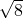
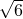
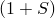

# 2.2.4 Hysteretic materials

**Product: **Abaqus/Standard  

### I. Bergstrm-Boyce hysteresis for elastomers: test of time-dependent behavior

### Elements tested

CAX4    CPE4    

### Problem description

The problems in this set are simulations of experiments presented in [Bergstrm and Boyce (1998)](ch02s02abv142.md#ver-ref-bergboyce). The Abaqus/Standard results are compared to the Bergstrm and Boyce results.

The tests consist of uniaxial compression of disk-like rubber specimens (height = 13 mm, diameter = 28 mm) and plane strain compression of rectangular specimens (height = 13 mm, cross-sectional area = 140 mm2). The materials used in the tests are Chloroprene rubber with varying carbon black filler concentrations and unfilled Nitrile rubber. The specimens are subjected to constant strain rate, cyclic loading, and constant strain-rate load cycles interspersed with relaxation segments of varying time intervals. The strain measure used here refers to logarithmic strain.

Two problems that test the creep strain-rate regularizing parameter, *E*, have also been included.

**Material: **

**Arruda-Boyce hyperelasticity**

| Chloroprene rubber (15 pph. carbon black) |
| --- |
|  = 0.6 MPa,  =  = 2.8284, *D* = 0.01 |
| Chloroprene rubber (40 pph. carbon black) |
|  = 1.08 MPa,  =  = 2.8284, *D* = 0.01 |
| Chloroprene rubber (65 pph. carbon black) |
|  = 1.71 MPa,  =  = 2.8284, *D* = 0.01 |
| Nitrile rubber (unfilled) |
|  = 0.87 MPa,  =  = 2.4495, *D* = 0.01 |

**Hysteresis**

| Chloroprene rubber (15 pph. carbon black) |
| --- |
| *S* = 1.6, *A* = 0.9526 (MPa)4 s1, *m* = 4.0, *C* = 1.0 |
| Chloroprene rubber (40 pph. carbon black) |
| *S* = 2.0, *A* = 0.9526 (MPa)4 s1, *m* = 4.0, *C* = 1.0 |
| Chloroprene rubber (65 pph. carbon black) |
| *S* = 4.0, *A* = 0.03135 (MPa)5 s1, *m* = 5.0, *C* = 0.9 |
| Nitrile rubber (unfilled) |
| *S* = 2.5, *A* = 0.5500 (MPa)5 s1, *m* = 5.0, *C* = 0.6 |

**Loading: **

The loading is imposed with displacement-controlled boundary conditions.

### Results and discussion

The results of the Abaqus/Standard numerical simulations are in very good agreement with the results presented in [Bergstrm and Boyce (1998)](ch02s02abv142.md#ver-ref-bergboyce). The results for the problems that test the creep strain-rate regularizing parameter, *E*, are almost identical to the results without the use of this parameter in all regions except around zero strain, where the results with this parameter are smoother.

### Input files

[mbbcdo3euc_un_1e_2_cl15.inp](../eif/mbbcdo3euc_un_1e_2_cl15.inp)

Uniaxial cyclic compression, linear perturbation with [*LOAD CASE](../key/key-link.md#usb-kws-hloadcase), CAX4 elements; repeated cycling; strain rate = 0.01/s; Chloroprene rubber (15 pph. carbon black).

[mbbcdo3mcy_ps_1e_2_cl65.inp](../eif/mbbcdo3mcy_ps_1e_2_cl65.inp)

Plane strain cyclic compression, CPE4 elements; strain rate = 0.01/s; Chloroprene rubber (65 pph. carbon black).

[mbbcdo3mcy_un_1e_2_cl15.inp](../eif/mbbcdo3mcy_un_1e_2_cl15.inp)

Uniaxial cyclic compression, CAX4 elements; strain rate = 0.01/s; Chloroprene rubber (15 pph. carbon black).

[mbbcdo3mcy_un_1e_2_cl40.inp](../eif/mbbcdo3mcy_un_1e_2_cl40.inp)

Uniaxial cyclic compression, CAX4 elements; strain rate = 0.01/s; Chloroprene rubber (40 pph. carbon black).

[mbbcdo3mcy_un_1e_2_cl65.inp](../eif/mbbcdo3mcy_un_1e_2_cl65.inp)

Uniaxial cyclic compression, CAX4 elements; strain rate = 0.01/s; Chloroprene rubber (65 pph. carbon black).

[mbbcdo3mcy_un_1e_2_ni.inp](../eif/mbbcdo3mcy_un_1e_2_ni.inp)

Uniaxial cyclic compression, CAX4 elements; strain rate = 0.01/s; Nitrile rubber (unfilled).

[mbbcdo3mcy_un_23e_5_ni.inp](../eif/mbbcdo3mcy_un_23e_5_ni.inp)

Uniaxial cyclic compression, CAX4 elements; strain rate = 0.00023/s; Nitrile rubber (unfilled).

[mbbcdo3rcy_un_1e_1_cl15.inp](../eif/mbbcdo3rcy_un_1e_1_cl15.inp)

Uniaxial cyclic compression with 1 relaxation segment in both uploading and unloading; relaxation strain = 0.6; strain rate = 0.1/s; relaxation time = 1000s; Chloroprene rubber (15 pph. carbon black).

[mbbcdo3ruc_un_1e_1_cl15.inp](../eif/mbbcdo3ruc_un_1e_1_cl15.inp)

Uniaxial cyclic compression with two relaxation segments in both uploading and unloading; relaxation strains = 0.26 and 0.54; strain rate = 0.1/s; relaxation time = 30s; Chloroprene rubber (15 pph. carbon black).

[mbbcdo3rcy_un_2e_3_cl15.inp](../eif/mbbcdo3rcy_un_2e_3_cl15.inp)

Uniaxial cyclic compression with two relaxation segments in both uploading and unloading; relaxation strains = 0.3 and 0.6; strain rate = 0.002/s; relaxation time = 120s; Chloroprene rubber (15 pph. carbon black).

[hysteresis_e001_uniaxial.inp](../eif/hysteresis_e001_uniaxial.inp)

Cyclic uniaxial straining; test for creep strain-rate regularizing parameter *E*: CAX4 element.

[hysteresis_e001_biaxial.inp](../eif/hysteresis_e001_biaxial.inp)

Cyclic biaxial straining; test for creep strain-rate regularizing parameter *E*: C3D8R element.

### II. Bergstrm-Boyce hysteresis for elastomers: test of time-independent behavior

### Elements tested

C3D8    C3D8H    C3D8R    C3D8RH    CPE4    

### Problem description

The problems in this set test and verify the performance of the hysteresis material model in conjunction with some of the hyperelastic potentials available in Abaqus/Standard. The problems involve imposing homogeneous/inhomogeneous deformations over very short periods of time in comparison with the characteristic relaxation time of the hysteresis model. Since the stress-scaling factor is taken to be 1.0 for all the tests, the stresses of this step should be very close to twice the values obtained from running the corresponding problems without the hysteresis option but with the same hyperelastic material definition. In a second step the boundary conditions are held fixed and the stresses are allowed to relax. The stresses at the end of this step from the hysteresis calculations should be close to the values obtained in the run with the hyperelastic material.

For the test with hydrostatic compression loading, [mbbcdo3ahc.inp](../eif/mbbcdo3ahc.inp), and the uniaxial loading test, [mbbtdo3hut.inp](../eif/mbbtdo3hut.inp), the stresses obtained should be twice those obtained in the corresponding problems run solely with hyperelasticity. This is a consequence of the fact that, in the test with hydrostatic compression loading, the induced stresses are purely hydrostatic; such a stress state is incapable of inducing inelastic deformation in the material model. The uniaxial loading test involves a creep constant of *A* = 0.0, which is equivalent to eliminating the creep response of the model. The factor of 2 in the stress output is a result of the choice of the stress scaling factor, *S* = 1. These two problems are run as single-step analyses.

In the problems that use reduced-integration elements, the hourglass stiffness is verified as being calculated on the basis of the instantaneous moduli.

A single problem also verifies using a hyperelastic material with an instantaneous elastic moduli definition and hysteresis effects. The elastic constants in the file [mbbcot3hut_inst.inp](../eif/mbbcot3hut_inst.inp) are taken to be  times the constants of the corresponding problem with the default long-term moduli specification, [mbbcot3hut.inp](../eif/mbbcot3hut.inp). (The constant corresponding to the volumetric part of the strain energy, , should be divided by the same factor; in this problem it is of no consequence since the material is completely incompressible.) The results of these two problems are verified to be identical.

The problem [mbbcoo3vlp.inp](../eif/mbbcoo3vlp.inp) tests linear perturbation results. A purely hyperelastic response is recovered in this analysis by setting the creep scaling parameter to 0.0, which facilitates comparison with the identical problem run with only hyperelastic behavior ([mhecoo3vlp.inp](../eif/mhecoo3vlp.inp)).

### Results and discussion

All tests yield the expected results, as defined in the problem description.

### Input files

[mbbcdo3ahc.inp](../eif/mbbcdo3ahc.inp)

Compressible, polynomial (N=1), hydrostatic compression, C3D8 elements.

[mbbcdo3gsh_ogden.inp](../eif/mbbcdo3gsh_ogden.inp)

Compressible, Ogden (N=1), nonuniform shear, C3D8R elements.

[mbbcdo3gsh_redpol.inp](../eif/mbbcdo3gsh_redpol.inp)

Compressible, reduced polynomial (N=1), nonuniform shear, C3D8 elements.

[mbbcdo3gsh_vwaals.inp](../eif/mbbcdo3gsh_vwaals.inp)

Compressible, Van der Waals, nonuniform shear, C3D8 elements.

[mbbcdo3gsh_yeoh.inp](../eif/mbbcdo3gsh_yeoh.inp)

Compressible, Yeoh, nonuniform shear, C3D8 elements.

[mbbcdo3ibt.inp](../eif/mbbcdo3ibt.inp)

Compressible, Arruda-Boyce, biaxial tension, linear perturbation with [*LOAD CASE](../key/key-link.md#usb-kws-hloadcase), CPE4 elements.

[mbbcoo3hut.inp](../eif/mbbcoo3hut.inp)

Incompressible, polynomial (N=1), uniaxial tension, C3D8H elements.

[mbbtdo3hut.inp](../eif/mbbtdo3hut.inp)

Compressible, polynomial (N=1), test data, uniaxial tension, C3D8 elements.

[mbbcot3hut.inp](../eif/mbbcot3hut.inp)

Incompressible, temperature-dependent elasticity, polynomial (N=1), uniaxial tension, C3D8RH elements.

[mbbcot3hut_inst.inp](../eif/mbbcot3hut_inst.inp)

Incompressible, temperature-dependent instantaneous elasticity, polynomial (N=1), uniaxial tension, C3D8RH elements.

[mbbcoo3vlp.inp](../eif/mbbcoo3vlp.inp)

Incompressible, uniaxial tension, static linear perturbation steps, C3D8RH elements.

### Reference

Bergstrm,  J. S., and M. C. Boyce, “Constitutive Modeling of the Large Strain Time-Dependent Behavior of Elastomers,” Journal of the Mechanics and Physics of Solids, vol. 46, pp. 931–954, 1998.

