# 2.2.5 温度依赖弹性材料

**产品：**Abaqus/Explicit  

### 测试单元

T2D2    T3D2    B21    B31    PIPE21    PIPE31    SAX1    S4R    S4RS    S4RSW    C3D8R    C3D10M    CPE4R    CPE6M    CPS4R    CPS6M    CAX4R    CAX6M    M3D4R    

### 测试特性

使用预定义温度场测试以下弹性材料模型的温度依赖材料特性：各向同性弹性、正交各向异性弹性、各向异性弹性和层压板。

### 问题描述

该验证测试包括一组单元素模型，这些模型包含所有可用单元类型与所有可用材料模型的组合。所有单元通过指定每个单元顶部节点的垂直速度（底部节点固定）来施加拉伸载荷。速度从零斜坡增加到0.2。所有节点的温度从初始值0增加到最终值100。材料特性定义为温度的线性函数，如[表2.2.5-1](ch02s02abv143.md#table-tempelast-matprops)所示。所有材料的密度为7850。对于每种材料模型，仅使用该模型可用的单元类型。未变形网格显示在[图2.2.5-1](ch02s02abv143.md#exxtempelastic-proptest)中。

### 结果与讨论

[图2.2.5-2](ch02s02abv143.md#exxtempelastic-plot-iso)显示了各向同性弹性模型垂直应力与垂直应变的关系图。正交弹性（工程常数）、正交弹性（正交各向异性）、各向异性弹性和层压板的垂直应力与垂直应变的关系图分别显示在[图2.2.5-3](ch02s02abv143.md#exxtempelastic-plot-engconst)、[图2.2.5-4](ch02s02abv143.md#exxtempelastic-plot-ortho)、[图2.2.5-5](ch02s02abv143.md#exxtempelastic-plot-aniso)和[图2.2.5-6](ch02s02abv143.md#exxtempelastic-plot-lamina)中。对于桁架、梁和轴对称壳单元，垂直应力和垂直应变分别为和，对于其余单元分别为和。管道单元的结果与梁单元一致。

### 输入文件

[temp_elastic.inp](../eif/temp_elastic.inp)

此分析中使用的输入数据。

[temp_elastic_ef1.inp](../eif/temp_elastic_ef1.inp)

此分析中引用的外部文件。

[temp_elastic_simpson.inp](../eif/temp_elastic_simpson.inp)

使用Simpson积分通过壳厚度的显式动力学分析。

[temp_elastic_restart.inp](../eif/temp_elastic_restart.inp)

完成25毫秒响应的重启动数据。

### 表格

**表2.2.5-1** 材料特性。
| 材料 | 特性 | T=0 | T=100 |
| --- | --- | --- | --- |
| 各向同性弹性 | E | 193.1×10^9 | 97.0×10^9 |
|  |  | 0.0 | 0.0 |
| 正交弹性 |  | 2.0×10^11 | 1.0×10^11 |
| （工程常数） |  | 1.0×10^11 | 5.0×10^10 |
|  |  | 1.0×10^11 | 5.0×10^10 |
|  |  | 0.0 | 0.0 |
|  |  | 0.0 | 0.0 |
|  |  | 0.0 | 0.0 |
|  |  | 7.69×10^10 | 6.69×10^10 |
|  |  | 7.69×10^10 | 6.69×10^10 |
|  |  | 9.0×10^9 | 8.0×10^9 |
| 正交弹性 |  | 2.24×10^11 | 1.00×10^11 |
| （正交各向异性） |  | 4.79×10^5 | 4.59×10^5 |
|  |  | 1.23×10^11 | 0.5×10^11 |
|  | 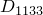 | 4.21×10^5 | 4.00×10^5 |
|  | 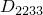 | 4.74×10^5 | 4.00×10^5 |
|  | 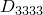 | 1.21×10^11 | 0.5×10^11 |
|  |  | 7.69×10^10 | 7.00×10^10 |
|  |  | 7.69×10^10 | 7.00×10^10 |
|  |  | 9.00×10^9 | 8.00×10^9 |
| 层压板 |  | 2.0×10^11 | 1.0×10^11 |
|  |  | 1.5×10^11 | 0.7×10^11 |
|  |  | 0.0 | 0.0 |
|  |  | 2.00×10^10 | 1.80×10^10 |
|  |  | 9.00×10^9 | 8.00×10^9 |
|  |  | 8.50×10^9 | 7.50×10^9 |
| 各向异性弹性 |  | 2.24×10^11 | 1.00×10^11 |
|  |  | 4.79×10^5 | 4.00×10^5 |
|  |  | 1.23×10^11 | 0.5×10^11 |
|  |  | 4.21×10^5 | 4.00×10^5 |
|  |  | 4.74×10^5 | 4.00×10^5 |
|  |  | 1.21×10^11 | 0.5×10^11 |
|  |  | 1.00×10^6 | 9.00×10^5 |
|  |  | 2.00×10^6 | 1.80×10^6 |
|  |  | 3.00×10^6 | 2.60×10^6 |
|  |  | 7.69×10^10 | 7.00×10^10 |
|  |  | 4.00×10^6 | 3.60×10^6 |
|  | 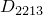 | 5.00×10^6 | 4.60×10^6 |
|  | 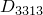 | 6.00×10^6 | 5.60×10^6 |
|  | 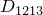 | 7.00×10^6 | 6.60×10^6 |
|  |  | 7.69×10^10 | 7.00×10^10 |
|  | 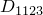 | 8.00×10^6 | 7.60×10^6 |
|  |  | 9.00×10^6 | 8.00×10^6 |
|  | 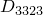 | 1.00×10^7 | 9.00×10^6 |
|  |  | 1.10×10^7 | 1.00×10^7 |
|  | 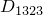 | 1.20×10^7 | 1.10×10^7 |
|  |  | 9.00×10^9 | 8.00×10^9 |

### 图表

**图2.2.5-1** 弹性材料的温度依赖材料特性测试。

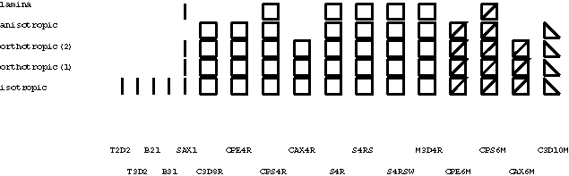

**图2.2.5-2** 各向同性弹性的垂直应力与垂直应变。

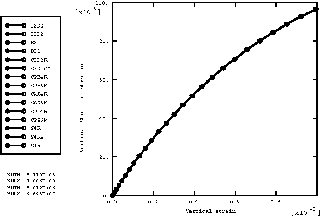

**图2.2.5-3** 正交弹性（工程常数）的垂直应力与垂直应变。

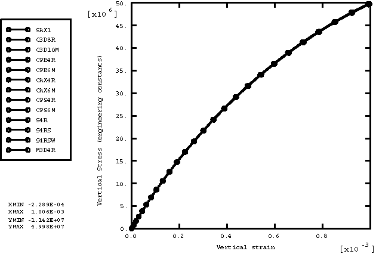

**图2.2.5-4** 正交弹性（正交各向异性）的垂直应力与垂直应变。

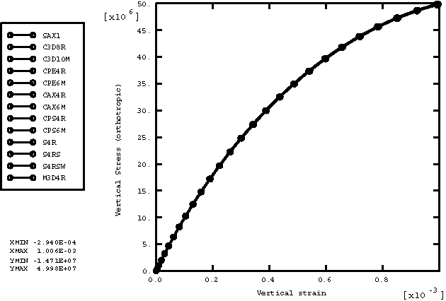

**图2.2.5-5** 各向异性弹性的垂直应力与垂直应变。

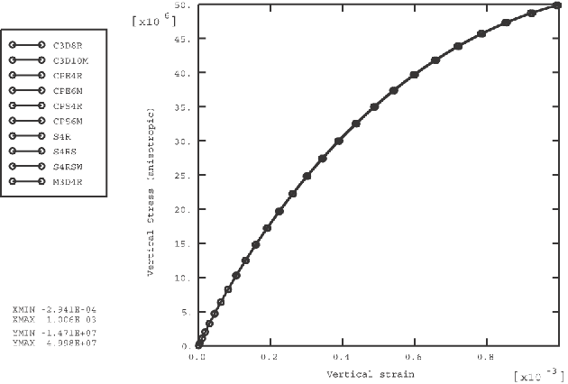

**图2.2.5-6** 层压板的垂直应力与垂直应变。

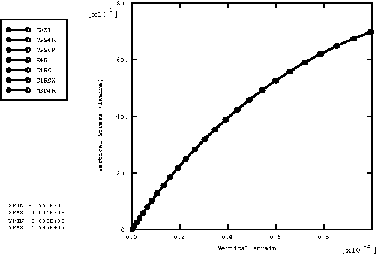

