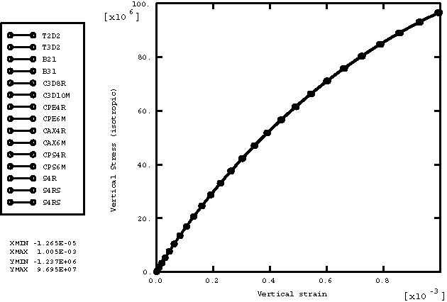
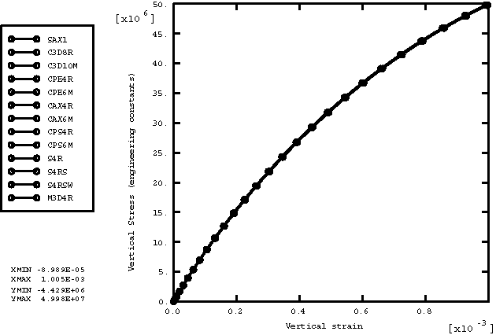
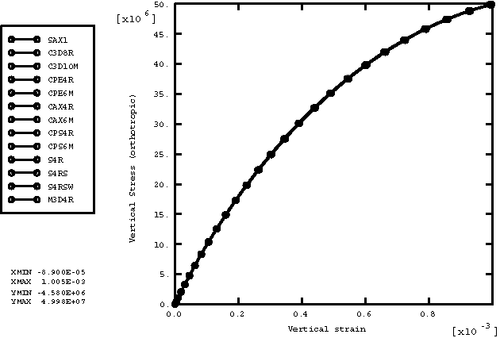
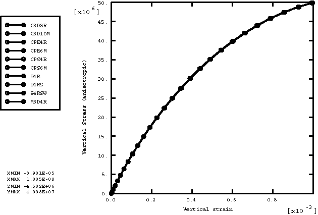
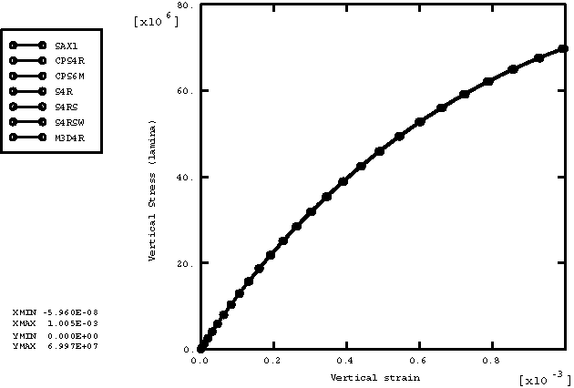

# 2.2.6 Field-variable-dependent elastic materials

**Product: **Abaqus/Explicit  

### Elements tested

T2D2    T3D2    B21    B31    PIPE21    PIPE31    SAX1    S4R    S4RS    S4RSW    C3D8R    C3D10M    CPE4R    CPE6M    CPS4R    CPS6M    CAX4R    CAX6M    M3D4R    

### Features tested

Field-variable-dependent material properties with predefined field variables are tested for the following elastic material models: isotropic elasticity, orthotropic elasticity, anisotropic elasticity, and lamina.

### Problem description

This verification test consists of a set of single element models that include combinations of all the available element types with all the available material models. All elements are loaded with a tensile load defined by specifying the vertical velocity at the top nodes of each element with the bottom nodes fixed. The velocity is ramped from zero to 0.2. One field variable, which increases from an initial value of 0 to a final value of 100, is defined at all the nodes. Material properties are defined as a linear function of the field variable, shown in [Table 2.2.6--1](ch02s02abv144.md#table-fieldelast-matprops). The density for all the materials is 7850. For every material model only those element types available for the model are used. The undeformed meshes are shown in [Figure 2.2.6--1](ch02s02abv144.md#exxfieldelastic-proptest).

### Results and discussion

[Figure 2.2.6--2](ch02s02abv144.md#exxfieldelastic-plot-iso) shows the plot of vertical stress versus vertical strain for the isotropic elasticity model. The plots of vertical stress versus vertical strain for orthotropic elasticity (ENGINEERING CONSTANTS), orthotropic elasticity (ORTHOTROPIC), anisotropic elasticity, and lamina are shown in [Figure 2.2.6--3](ch02s02abv144.md#exxfieldelastic-plot-engconst), [Figure 2.2.6--4](ch02s02abv144.md#exxfieldelastic-plot-ortho), [Figure 2.2.6--5](ch02s02abv144.md#exxfieldelastic-plot-aniso), and [Figure 2.2.6--6](ch02s02abv144.md#exxfieldelastic-plot-lamina), respectively. The vertical stress and vertical strain are  and  for the truss, beam, and axisymmetric shell elements and  and  for the remaining elements. The results from pipe elements are consistent with the beams.

### Input files

[field_elastic.inp](../eif/field_elastic.inp)

Input data used in this analysis.

[field_elastic_ef1.inp](../eif/field_elastic_ef1.inp)

External file referenced in this input.

### Table

**Table 2.2.6–1** Material properties.
| Material | Properties | fv=0 | fv=100 |
| --- | --- | --- | --- |
| Isotropic elasticity | E | 193.1 109 | 97 109 |
|  |  | 0.0 | 0.0 |
| Orthotropic elasticity |  | 2.0 1011 | 1.0 1011 |
| (ENGINEERING CONSTANTS) |  | 1.0 1011 | 5.0 1010 |
|  |  | 1.0 1011 | 5.0 1010 |
|  |  | 0.0 | 0.0 |
|  |  | 0.0 | 0.0 |
|  |  | 0.0 | 0.0 |
|  |  | 7.69 1010 | 6.69 1010 |
|  |  | 7.69 1010 | 6.69 1010 |
|  |  | 9.0 109 | 8.0 109 |
| Orthotropic elasticity |  | 2.24 1011 | 1.00 1011 |
| (ORTHOTROPIC) |  | 4.79 105 | 4.59 105 |
|  |  | 1.23 1011 | 0.5 1011 |
|  |  | 4.21 105 | 4.00 105 |
|  |  | 4.74 105 | 4.00 105 |
|  |  | 1.21 1011 | 0.5 1011 |
|  |  | 7.69 1010 | 7.00 1010 |
|  |  | 7.69 1010 | 7.00 1010 |
|  |  | 9.00 109 | 8.00 109 |
| Lamina |  | 2.0 1011 | 1.0 1011 |
|  |  | 1.5 1011 | 0.7 1011 |
|  |  | 0.0 | 0.0 |
|  |  | 2.00 1010 | 1.80 1010 |
|  |  | 9.00 109 | 8.00 109 |
|  |  | 8.50 109 | 7.50 109 |
| Anisotropic elasticity |  | 2.24 1011 | 1.00 1011 |
|  |  | 4.79 105 | 4.00 105 |
|  |  | 1.23 1011 | 0.5 1011 |
|  |  | 4.21 105 | 4.00 105 |
|  |  | 4.74 105 | 4.00 105 |
|  |  | 1.21 1011 | 0.5 1011 |
|  |  | 1.00 106 | 9.00 105 |
|  |  | 2.00 106 | 1.80 106 |
|  |  | 3.00 106 | 2.60 106 |
|  |  | 7.69 1010 | 7.00 1010 |
|  |  | 4.00 106 | 3.60 106 |
|  |  | 5.00 106 | 4.60 106 |
|  |  | 6.00 106 | 5.60 106 |
|  |  | 7.00 106 | 6.60 106 |
|  |  | 7.69 1010 | 7.00 1010 |
|  |  | 8.00 106 | 7.60 106 |
|  |  | 9.00 106 | 8.00 106 |
|  |  | 1.00 107 | 9.00 106 |
|  |  | 1.10 107 | 1.00 107 |
|  |  | 1.20 107 | 1.10 107 |
|  |  | 9.00 109 | 8.00 109 |

### Figures

**Figure 2.2.6–1** Field-variable-dependent material property test for elastic materials.

**Figure 2.2.6–2** Vertical stress vs. vertical strain for isotropic elasticity.

**Figure 2.2.6–3** Vertical stress vs. vertical strain for orthotropic elasticity (ENGINEERING CONSTANTS).

**Figure 2.2.6–4** Vertical stress vs. vertical strain for orthotropic elasticity (ORTHOTROPIC).

**Figure 2.2.6–5** Vertical stress vs. vertical strain for anisotropic elasticity.

**Figure 2.2.6–6** Vertical stress vs. vertical strain for lamina.

