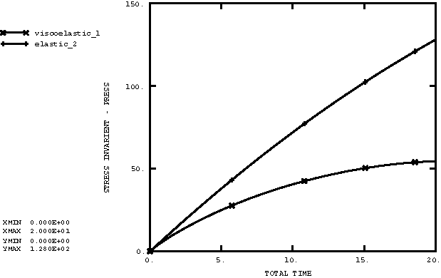
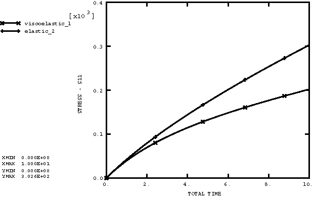
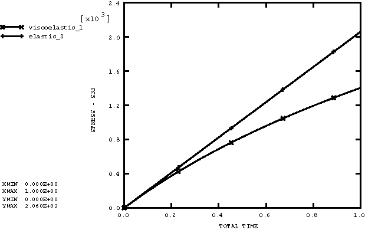

# 2.2.7 超弹性大应变粘弹性

**产品：**Abaqus/Explicit  

### 测试单元

CAX4R    CPE4R    CPS4R    M3D4R    

### 测试特性

大变形运动学，粘弹性-超弹性材料模型。

### 问题描述

此示例用于验证Abaqus/Explicit中的粘弹性材料模型。在所有问题中，材料由具有的超弹性多项式 formulation定义。粘弹性行为由Prony级数参数或测试数据输入选项给出。

第一个测试是体积松弛。单个单元在应力允许松弛的一段时间内以均匀速率压缩。此问题测试体积松弛行为是否被正确捕获。此测试中使用平面应力和平面应变单元。

第二个测试是单轴松弛。单个单元在应力允许松弛的一段时间内以均匀速率拉伸。此问题验证剪切松弛行为是否被正确捕获。此测试中使用平面应变和膜单元。

第三个测试是周向松弛。单个轴对称单元的所有节点在应力允许松弛的一段时间内以均匀速率向外径向移动。所有节点在轴向固定。此问题验证剪切和体积松弛行为在周向上是否正确。

### 结果与讨论

应力的时间历史显示在[图2.2.7-1](ch02s02abv145.md#exxviscohyper-press-v-time)到[图2.2.7-3](ch02s02abv145.md#exxviscohyper-circum-v-time)中。[图2.2.7-1](ch02s02abv145.md#exxviscohyper-press-v-time)显示了具有粘弹性特性的材料与没有粘弹性特性的材料的体积响应对比。[图2.2.7-2](ch02s02abv145.md#exxviscohyper-tensile-v-time)显示了具有粘弹性特性的材料与没有粘弹性特性的材料的拉伸响应对比。[图2.2.7-3](ch02s02abv145.md#exxviscohyper-circum-v-time)显示了具有粘弹性特性的材料与没有粘弹性特性的材料的周向响应对比。

此问题测试列出的特性，但不提供它们的独立验证。

### 输入文件

[visco_vol_pe.inp](../eif/visco_vol_pe.inp)

使用平面应变单元的体积松弛测试。

[visco_uni_mem.inp](../eif/visco_uni_mem.inp)

使用膜单元的单轴松弛测试。

[visco_circum_axi.inp](../eif/visco_circum_axi.inp)

使用轴对称单元的周向蠕变测试。

[visco_vol_ps.inp](../eif/visco_vol_ps.inp)

使用平面应力单元的体积松弛测试。

[visco_uni_pe.inp](../eif/visco_uni_pe.inp)

使用平面应变单元的单轴松弛测试。

[visco_uni_pe_frq.inp](../eif/visco_uni_pe_frq.inp)

使用平面应变单元并使用从频率相关模量数据校准的Prony参数的单轴松弛测试。

### 图表

**图2.2.7-1** 体积压缩（CPE4R）的压力应力与时间。

**图2.2.7-2** 单轴拉伸（M3D4R）的拉伸应力与时间。

**图2.2.7-3** 周向扩展（CAX4R）的周向应力与时间。

