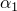

# 2.2.8 Nonlinear large-strain viscoelasticity with hyperelasticity

**Product: **Abaqus/Standard  Abaqus/Explicit  

### Elements tested

C3D8    C3D8H    C3D8R    C3D8RH    

CAX4    CAX4H    CAX4R    CAX4RH    

CPE4    CPE4H    CPE4R    CPE4RH    

### Feature tested

Nonlinear viscoelastic material model.

### Problem description

In each input file a single element is subjected to a uniaxial load. The input files consist of two steps. In the first step the load is gradually increased until it reaches the prescribed value. In the second step the value of the load is kept constant for a specified time. These tests verify the correctness of the creep behavior with different element types.

**Material: **

 The nonlinear viscoelastic material consists of three or four networks, including a purely elastic network. The strain-hardening power law, the hyperbolic-sine, and the Bergstrom-Boyce creep models are used to model the viscoelastic behavior. Creep model coefficients are shown in [Table 2.2.8--1](ch02s02abv146.md#ver-mat-nonlinviscohyper-table-strain-hardening), [Table 2.2.8--2](ch02s02abv146.md#ver-mat-nonlinviscohyper-table-hyperbolic) and [Table 2.2.8--3](ch02s02abv146.md#ver-mat-nonlinviscohyper-table-bb). Several different hyperelastic materials are tested, as described in [Table 2.2.8--4](ch02s02abv146.md#ver-mat-nonlinviscohyper-table-hyperelastic).

**Table 2.2.8–1** Strain-hardening power law creep model coefficients.
| =105 |
| --- |
| =1.0 |
| =--0.5 |

**Table 2.2.8–2** Hyperbolic-sine creep model coefficients.
| =2.5105 |
| --- |
| =0.15 |
| =2.0 |

**Table 2.2.8–3** Bergstrom-Boyce creep model coefficients.
|  | Coefficient for model 1 | Coefficients for model 2 | Coefficients for model 3 |
| --- | --- | --- | --- |
|  | 2.5105 | 7.15105 | 2.887 |
|  | 4.0 | 1.0 | 4.0 |
|  | --1.0 | 0.5 | --1.0 |
|  | 0.01 | 0.01 | 0.01 |

**Table 2.2.8–4** Hyperelastic materials.
| Material | Coefficients for material 1 | Coefficients for material 2 |
| --- | --- | --- |
| Arruda-Boyce | =20.0=7.0=0.0 | =20.0=7.0=0.1 |
| neo-Hookean | =10=0.1 | =10=0.01 |
| Ogden (N=2) | =16.0=2.0=4.0=2.0=0.0=0.0 | =16.0=2.0=4.0=2.0=0.1=0.0 |
| Van der Waals | =20.0=10.0=0.1=0.02=0.0 | =20.0=10.0=0.1=0.02=0.1 |

### Results and discussion

The results agree well with exact analytical or approximate solutions. 

### Input files

[viscnet_c3d8_nh_n2.inp](../eif/viscnet_c3d8_nh_n2.inp)

Uniaxial creep test, C3D8 element and neo-Hookean material.

[viscnet_c3d8h_ab_n2.inp](../eif/viscnet_c3d8h_ab_n2.inp)

Uniaxial creep test, C3D8H element and Arruda-Boyce material.

[viscnet_c3d8h_ab_bb_n2.inp](../eif/viscnet_c3d8h_ab_bb_n2.inp)

Uniaxial creep test, C3D8H element, Arruda-Boyce hyperelastic material, and two viscoelastic networks: strain-hardening power law model and Bergstrom-Boyce model.

[viscnet_c3d8h_ab_bb_n2_user.inp](../eif/viscnet_c3d8h_ab_bb_n2_user.inp)

Uniaxial creep test, C3D8H element, Arruda-Boyce hyperelastic material, and two viscoelastic networks: strain-hardening power law model and Bergstrom-Boyce model defined via user subroutine [`UCREEPNETWORK`](../sub/sub-link.md#sub-xsl-ucreepnetwork).

[viscnet_c3d8h_ab_bb_n3.inp](../eif/viscnet_c3d8h_ab_bb_n3.inp)

Uniaxial creep test, C3D8H element, Arruda-Boyce hyperelastic material, and three viscoelastic networks: strain-hardening power law model and two Bergstrom-Boyce models.

[viscnet_c3d8h_ab_bb_n3_user.inp](../eif/viscnet_c3d8h_ab_bb_n3_user.inp)

Uniaxial creep test, C3D8H element, Arruda-Boyce hyperelastic material, and three viscoelastic networks: strain-hardening power law model and two Bergstrom-Boyce models defined via user subroutine [`UCREEPNETWORK`](../sub/sub-link.md#sub-xsl-ucreepnetwork).

[viscnet_c3d8h_ogden_n2.inp](../eif/viscnet_c3d8h_ogden_n2.inp)

Uniaxial creep test, C3D8H element and Ogden material.

[viscnet_c3d8h_vanwaals_n2.inp](../eif/viscnet_c3d8h_vanwaals_n2.inp)

Uniaxial creep test, C3D8H element and Van der Waals material.

[viscnet_c3d8r_nh_n2.inp](../eif/viscnet_c3d8r_nh_n2.inp)

Uniaxial creep test, C3D8R element and neo-Hookean material.

[viscnet_c3d8rh_ab_n2.inp](../eif/viscnet_c3d8rh_ab_n2.inp)

Uniaxial creep test, C3D8RH element and Arruda-Boyce material.

[viscnet_c3d8rh_ogden_n2.inp](../eif/viscnet_c3d8rh_ogden_n2.inp)

Uniaxial creep test, C3D8RH element and Ogden material.

[viscnet_c3d8rh_vanwaals_n2.inp](../eif/viscnet_c3d8rh_vanwaals_n2.inp)

Uniaxial creep test, C3D8RH element and Van der Waals material.

[viscnet_cax4_nh_n2.inp](../eif/viscnet_cax4_nh_n2.inp)

Uniaxial creep test, CAX4 element and neo-Hookean material.

[viscnet_cax4h_ab_n2.inp](../eif/viscnet_cax4h_ab_n2.inp)

Uniaxial creep test, CAX4H element and Arruda-Boyce material.

[viscnet_cax4h_ogden_n2.inp](../eif/viscnet_cax4h_ogden_n2.inp)

Uniaxial creep test, CAX4H element and Ogden material.

[viscnet_cax4h_vanwaals_n2.inp](../eif/viscnet_cax4h_vanwaals_n2.inp)

Uniaxial creep test, CAX4H element and Van der Waals material.

[viscnet_cax4r_nh_n2.inp](../eif/viscnet_cax4r_nh_n2.inp)

Uniaxial creep test, CAX4R element and neo-Hookean material.

[viscnet_cax4rh_ab_n2.inp](../eif/viscnet_cax4rh_ab_n2.inp)

Uniaxial creep test, CAX4RH element and Arruda-Boyce material.

[viscnet_cax4rh_ogden_n2.inp](../eif/viscnet_cax4rh_ogden_n2.inp)

Uniaxial creep test, CAX4RH element and Ogden material.

[viscnet_cax4h_ogden_bb_n2.inp](../eif/viscnet_cax4h_ogden_bb_n2.inp)

Uniaxial creep test, CAX4H element, Ogden hyperelastic material, and two viscoelastic networks: strain-hardening power law model and Bergstrom-Boyce model.

[viscnet_cax4rh_vanwaals_n2.inp](../eif/viscnet_cax4rh_vanwaals_n2.inp)

Uniaxial creep test, CAX4RH element and Van der Waals material.

[viscnet_cax4h_vanwaals_bb_n2.inp](../eif/viscnet_cax4h_vanwaals_bb_n2.inp)

Uniaxial creep test, CAX4H element, Van der Waals hyperelastic material, and two viscoelastic networks: strain-hardening power law model and Bergstrom-Boyce model.

[viscnet_cpe4_nh_n2.inp](../eif/viscnet_cpe4_nh_n2.inp)

Uniaxial creep test, CPE4 element and neo-Hookean material.

[viscnet_cpe4h_ab_n2.inp](../eif/viscnet_cpe4h_ab_n2.inp)

Uniaxial creep test, CPE4H element and Arruda-Boyce material.

[viscnet_cpe4h_ogden_n2.inp](../eif/viscnet_cpe4h_ogden_n2.inp)

Uniaxial creep test, CPE4H element and Ogden material.

[viscnet_cpe4h_vanwaals_n2.inp](../eif/viscnet_cpe4h_vanwaals_n2.inp)

Uniaxial creep test, CPE4H element and Van der Waals material.

[viscnet_cpe4r_nh_n2.inp](../eif/viscnet_cpe4r_nh_n2.inp)

Uniaxial creep test, CPE4R element and neo-Hookean material.

[viscnet_cpe4rh_ab_n2.inp](../eif/viscnet_cpe4rh_ab_n2.inp)

Uniaxial creep test, CPE4RH element and Arruda-Boyce material.

[viscnet_cpe4rh_ogden_n2.inp](../eif/viscnet_cpe4rh_ogden_n2.inp)

Uniaxial creep test, CPE4RH element and Ogden material.

[viscnet_cpe4rh_vanwaals_n2.inp](../eif/viscnet_cpe4rh_vanwaals_n2.inp)

Uniaxial creep test, CPE4RH element and Van der Waals material.

[viscnet_cpe4_nh_bb_n2.inp](../eif/viscnet_cpe4_nh_bb_n2.inp)

Uniaxial creep test, CPE4 element, neo-Hookean hyperelastic material, and two viscoelastic networks: strain-hardening power law model and Bergstrom-Boyce model.

[x_viscnet_c3d8_nh_n2.inp](../eif/x_viscnet_c3d8_nh_n2.inp)

Explicit dynamic analysis, uniaxial creep test, C3D8 element and neo-Hookean material.

[x_viscnet_c3d8_ab_n2.inp](../eif/x_viscnet_c3d8_ab_n2.inp)

Explicit dynamic analysis, uniaxial creep test, C3D8 element and Arruda-Boyce material.

[x_viscnet_c3d8_ogden_n2.inp](../eif/x_viscnet_c3d8_ogden_n2.inp)

Explicit dynamic analysis, uniaxial creep test, C3D8 element and Ogden material.

[x_viscnet_c3d8_vanwaals_n2.inp](../eif/x_viscnet_c3d8_vanwaals_n2.inp)

Explicit dynamic analysis, uniaxial creep test, C3D8 element and Van der Waals material.

[x_viscnet_c3d8r_nh_n2.inp](../eif/x_viscnet_c3d8r_nh_n2.inp)

Explicit dynamic analysis, uniaxial creep test, C3D8R element and neo-Hookean material.

[x_viscnet_c3d8r_ab_n2.inp](../eif/x_viscnet_c3d8r_ab_n2.inp)

Explicit dynamic analysis, uniaxial creep test, C3D8R element and Arruda-Boyce material.

[x_viscnet_c3d8r_ogden_n2.inp](../eif/x_viscnet_c3d8r_ogden_n2.inp)

Explicit dynamic analysis, uniaxial creep test, C3D8R element and Ogden material.

[x_viscnet_c3d8r_vanwaals_n2.inp](../eif/x_viscnet_c3d8r_vanwaals_n2.inp)

Explicit dynamic analysis, uniaxial creep test, C3D8R element and Van der Waals material.

[x_viscnet_c3d8r_nh_n1_bb.inp](../eif/x_viscnet_c3d8r_nh_n1_bb.inp)

Explicit dynamic analysis, uniaxial creep test, C3D8R element, neo-Hookean hyperelastic material, and one Bergstron-Boyce viscoelastic network.

[x_viscnet_cax4r_nh_n2.inp](../eif/x_viscnet_cax4r_nh_n2.inp)

Explicit dynamic analysis, uniaxial creep test, CAX4R element and neo-Hookean material.

[x_viscnet_cax4r_ab_n2.inp](../eif/x_viscnet_cax4r_ab_n2.inp)

Explicit dynamic analysis, uniaxial creep test, CAX4R element and Arruda-Boyce material.

[x_viscnet_cax4r_ogden_n2.inp](../eif/x_viscnet_cax4r_ogden_n2.inp)

Explicit dynamic analysis, uniaxial creep test, CAX4R element and Ogden material.

[x_viscnet_cax4r_vanwaals_n2.inp](../eif/x_viscnet_cax4r_vanwaals_n2.inp)

Explicit dynamic analysis, uniaxial creep test, CAX4R element and Van der Waals material.

[x_viscnet_cpe4r_nh_n2.inp](../eif/x_viscnet_cpe4r_nh_n2.inp)

Explicit dynamic analysis, uniaxial creep test, CPE4R element and neo-Hookean material.

[x_viscnet_cpe4r_ab_n2.inp](../eif/x_viscnet_cpe4r_ab_n2.inp)

Explicit dynamic analysis, uniaxial creep test, CPE4R element and Arruda-Boyce material.

[x_viscnet_cpe4r_ogden_n2.inp](../eif/x_viscnet_cpe4r_ogden_n2.inp)

Explicit dynamic analysis, uniaxial creep test, CPE4R element and Ogden material.

[x_viscnet_cpe4r_vanwaals_n2.inp](../eif/x_viscnet_cpe4r_vanwaals_n2.inp)

Explicit dynamic analysis, uniaxial creep test, CPE4R element and Van der Waals material.

