# 2.2.9 粘弹性圆柱体的瞬态内压加载

**产品：**Abaqus/Standard  

### 测试单元

CAX4I    CAX8R    CPE4I    CPE8R    

### 测试特性

本问题测试了为时间相关材料模型积分提供的自动增量功能，以及在大量Prony级数项情况下粘弹性材料模型的使用。本问题还展示了粘弹性材料模型在动态分析中的应用。

### 问题描述

结构是一个固体火箭发动机，建模为一个包裹在薄钢壳中的细长空心粘弹性圆柱体。火箭的点火通过作用在粘弹性圆柱体内径上的瞬态内压载荷来模拟。需要获得结构的瞬态响应。

**模型：**

粘弹性圆柱体内半径为10 mm，外半径为50 mm。钢壳厚0.5 mm。假设轴向为平面应变，解决方案无梯度。因此，该问题使用一排轴对称、二阶、减缩积分单元（CAX8R）进行建模。粘弹性材料用20个单元表示，壳体用单个单元建模。

**网格：**

网格如图2.2.9-1所示。网格在圆柱体内径处更密，该处应力最高。

**材料：**

粘弹性材料的伸长松弛函数使用六项Prony级数定义：

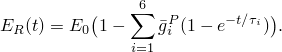

瞬时模量 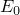 为1651.59 MPa；六对相对模量  和时间常数  为

| *i* |  | 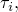 秒 |
| --- | --- | --- |
| 1 | 0.1986 | 0.281 107 |
| 2 | 0.1828 | 0.281 105 |
| 3 | 0.1388 | 0.281 103 |
| 4 | 0.2499 | 0.281 101 |
| 5 | 0.1703 | 0.281 101 |
| 6 | 0.0593 | 0.281 103 |

该模型导致非常低的长期弹性模量（0.4955 MPa），因此材料几乎表现为粘弹性流体。由于粘弹性材料在整个问题中是不可压缩的，构成伸长松弛函数的相对模量  和时间常数  可以直接用于剪切松弛函数的定义。与此对比的是["承受恒定轴向载荷的粘弹性杆"，《Abaqus基准指南》第3.1.1节](../bmk/bmk-link.md#bmk-mat-viscorod)，其中材料略微可压缩，因此剪切模量和时间常数通过体积模量与伸长值相关联。

本问题的另一个解是通过使用大应变线性粘弹性理论建模粘弹性圆柱体的行为获得的。松弛行为的定义方式相同，但短期弹性特性作为超弹性材料定义的一部分给出。使用 1的多项式形式，常数为  = 275.247 MPa，  = 0（neo-Hookean材料）和  = 7.107 MPa1。这些常数使得初始杨氏模量和初始泊松比分别等于  和 。钢壳假定为线弹性，弹性模量为200 GPa，泊松比为0.3。

**载荷：**

静态分析中使用的时间相关压力载荷为

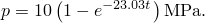

压力随时间变化的曲线如图2.2.9-2所示。为了突出惯性效应，动态分析中的压力载荷施加速度快10倍：

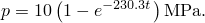

这些压力历史通过用户子程序[`DLOAD`](../sub/sub-link.md#sub-xsl-dload)指定。

### 分析

静态分析使用准静态过程，时间周期为0.5秒。指定了瞬态蠕变解精度的容差，以启用自动时间增量。精度容差设置为7.0×10^3，与最大弹性应变在同一数量级。

动态分析使用动态过程，时间周期为0.05秒。该分析基于非线性几何行为进行。指定了半增量残差的精度容差以启用自动增量。所选值（1000 N）比最高的等效节点载荷高一个数量级。

### 结果与讨论

图2.2.9-3至图2.2.9-5分别描述了线性静态分析中最内层单元的径向应力、环向应力和环向应变的时间历史。使用大应变公式的静态分析给出了几乎相同的结果。

图2.2.9-6至图2.2.9-8分别描述了非线性动态分析中最内层单元的径向应力、环向应力和环向应变的时间历史。

### 输入文件

[viscocylinder_cax8r_linear.inp](../eif/viscocylinder_cax8r_linear.inp)

线性静态分析。

[viscocylinder_cax8r_linear.f](../eif/viscocylinder_cax8r_linear.f)

[viscocylinder_cax8r_linear.inp](../eif/viscocylinder_cax8r_linear.inp)中使用的用户子程序[`DLOAD`](../sub/sub-link.md#sub-xsl-dload)。

[viscocylinder_cax8r_static.inp](../eif/viscocylinder_cax8r_static.inp)

非线性静态分析。

[viscocylinder_cax8r_static.f](../eif/viscocylinder_cax8r_static.f)

[viscocylinder_cax8r_static.inp](../eif/viscocylinder_cax8r_static.inp)中使用的用户子程序[`DLOAD`](../sub/sub-link.md#sub-xsl-dload)。

[viscocylinder_cax8r_dyn.inp](../eif/viscocylinder_cax8r_dyn.inp)

非线性动态分析。

[viscocylinder_cax8r_dyn.f](../eif/viscocylinder_cax8r_dyn.f)

[viscocylinder_cax8r_dyn.inp](../eif/viscocylinder_cax8r_dyn.inp)中使用的用户子程序[`DLOAD`](../sub/sub-link.md#sub-xsl-dload)。

[viscocylinder_cpe8r.inp](../eif/viscocylinder_cpe8r.inp)

使用平面应变单元（CPE8R）的楔形块进行线性静态分析。

[viscocylinder_cpe8r.f](../eif/viscocylinder_cpe8r.f)

[viscocylinder_cpe8r.inp](../eif/viscocylinder_cpe8r.inp)中使用的用户子程序[`DLOAD`](../sub/sub-link.md#sub-xsl-dload)。

[viscocylinder_cax4i_linear.inp](../eif/viscocylinder_cax4i_linear.inp)

使用CAX4I的线性静态分析。

[viscocylinder_cax4i_linear.f](../eif/viscocylinder_cax4i_linear.f)

[viscocylinder_cax4i_linear.inp](../eif/viscocylinder_cax4i_linear.inp)中使用的用户子程序[`DLOAD`](../sub/sub-link.md#sub-xsl-dload)。

[viscocylinder_cax4i_static.inp](../eif/viscocylinder_cax4i_static.inp)

使用CAX4I的非线性静态分析。

[viscocylinder_cax4i_static_po.inp](../eif/viscocylinder_cax4i_static_po.inp)

[*POST OUTPUT*](../key/key-link.md#usb-kws-hpostoutput)分析。

[viscocylinder_cax4i_static.f](../eif/viscocylinder_cax4i_static.f)

[viscocylinder_cax4i_static.inp](../eif/viscocylinder_cax4i_static.inp)中使用的用户子程序[`DLOAD`](../sub/sub-link.md#sub-xsl-dload)。

[viscocylinder_cax4i_dyn.inp](../eif/viscocylinder_cax4i_dyn.inp)

使用CAX4I的非线性动态分析。

[viscocylinder_cax4i_dyn.f](../eif/viscocylinder_cax4i_dyn.f)

[viscocylinder_cax4i_dyn.inp](../eif/viscocylinder_cax4i_dyn.inp)中使用的用户子程序[`DLOAD`](../sub/sub-link.md#sub-xsl-dload)。

[viscocylinder_cpe4i.inp](../eif/viscocylinder_cpe4i.inp)

使用CPE4I的线性静态分析。

[viscocylinder_cpe4i.f](../eif/viscocylinder_cpe4i.f)

[viscocylinder_cpe4i.inp](../eif/viscocylinder_cpe4i.inp)中使用的用户子程序[`DLOAD`](../sub/sub-link.md#sub-xsl-dload)。

### 图表

**图2.2.9-1** 带弹性壳的粘弹性圆柱体有限元模型。

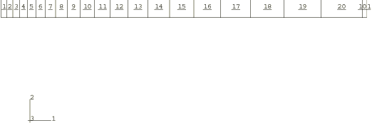

**图2.2.9-2** 内压载荷随时间的变化（静态分析）。

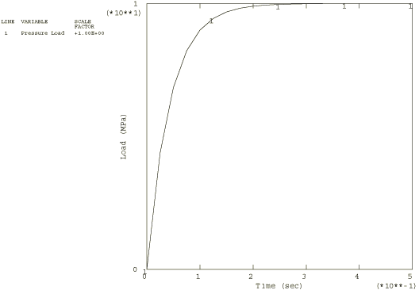

**图2.2.9-3** 圆柱体最内层积分点的径向应力（静态分析）。

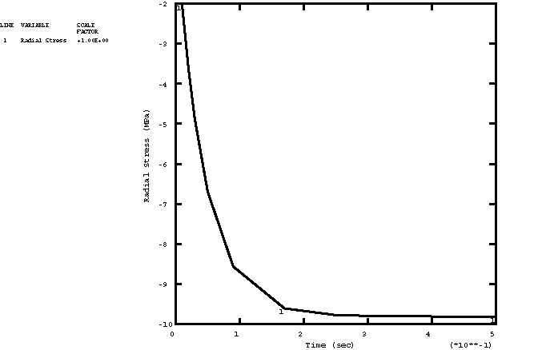

**图2.2.9-4** 圆柱体最内层积分点的环向应力（静态分析）。

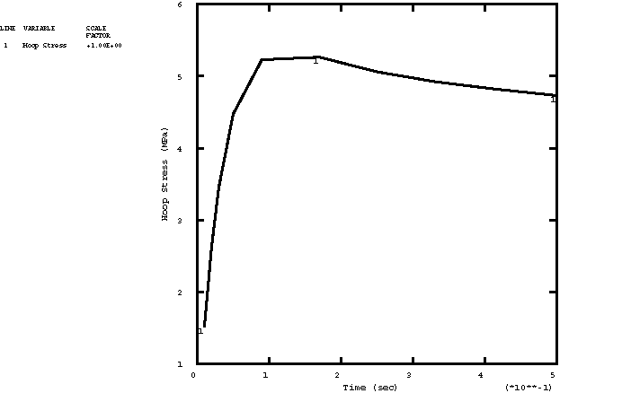

**图2.2.9-5** 圆柱体最内层积分点的环向应变（静态分析）。

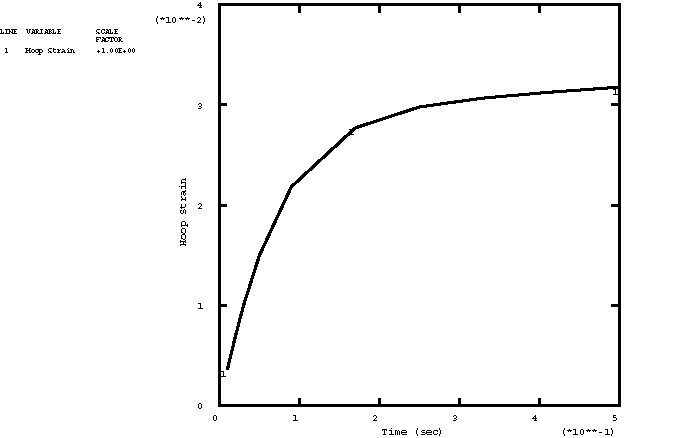

**图2.2.9-6** 圆柱体最内层积分点的径向应力（动态分析）。

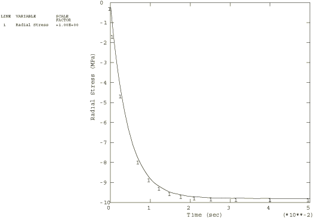

**图2.2.9-7** 圆柱体最内层积分点的环向应力（动态分析）。

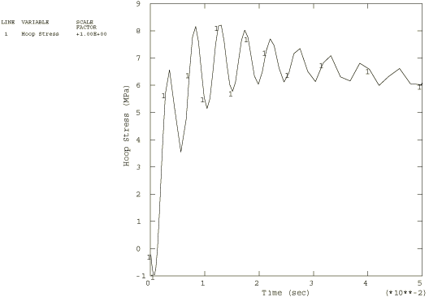

**图2.2.9-8** 圆柱体最内层积分点的环向应变（动态分析）。

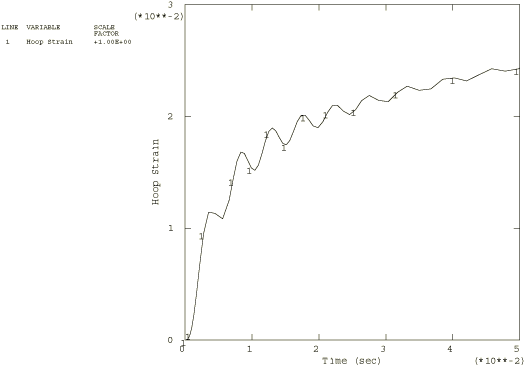

