# 2.2.10 与速率无关的塑性

**产品：**Abaqus/Standard  Abaqus/Explicit  

### I. 带等向硬化的Mises塑性

### 测试单元

C3D8    CPS4    T3D2    

### 问题描述

**材料：**

**弹性**

杨氏模量，*E* = 200.0E3

泊松比， = 0.3

**塑性**

硬化：

| 屈服应力 | 塑性应变 |
| --- | --- |
| 200. | 0.0000 |
| 220. | 0.0009 |
| 220. | 0.0029 |

（单位不重要。）

### 结果与讨论

结果与精确分析解或近似解高度吻合。

### 输入文件

[mpliho3hut.inp](../eif/mpliho3hut.inp)

单轴拉伸，C3D8单元。

[mpliho2hut.inp](../eif/mpliho2hut.inp)

单轴拉伸，CPS4单元。

[mpliho1hut.inp](../eif/mpliho1hut.inp)

单轴拉伸，T3D2单元。

[mpliho3gsh.inp](../eif/mpliho3gsh.inp)

剪切，C3D8单元。

[mpliho2gsh.inp](../eif/mpliho2gsh.inp)

剪切，CPS4单元。

[mpliho1mcy.inp](../eif/mpliho1mcy.inp)

循环加载，T3D2单元。

[mpliho3vlp.inp](../eif/mpliho3vlp.inp)

包含[*LOAD CASE*](../key/key-link.md#usb-kws-hloadcase)的线性扰动步骤，单轴拉伸，C3D8单元。

[mplihi3hut.inp](../eif/mplihi3hut.inp)

的非零初始条件下的单轴拉伸，C3D8单元。

### II. 带线性运动硬化的Mises塑性

### 测试单元

T3D2

### 问题描述

**材料：**

**弹性**

杨氏模量，*E* = 200.0E3

泊松比， = 0.3

**塑性**

硬化：

| 屈服应力 | 塑性应变 |
| --- | --- |
| 200. | 0.0000 |
| 220. | 0.0009 |

线性运动硬化模型由前面给出的应力-应变数据的斜率定义。（单位不重要。）

### 结果与讨论

结果与精确分析解或近似解高度吻合。

### 输入文件

##### **Abaqus/Standard输入文件**

[mplkho1mcy.inp](../eif/mplkho1mcy.inp)

循环加载，T3D2单元。

[mplkhi1hut.inp](../eif/mplkhi1hut.inp)

的非零初始条件下的单轴拉伸，载荷控制，T3D2单元。

##### **Abaqus/Explicit输入文件**

[mplkho1mcy_xpl.inp](../eif/mplkho1mcy_xpl.inp)

循环加载，T3D2单元。

[mplkhi1hut_xpl.inp](../eif/mplkhi1hut_xpl.inp)

的非零初始条件下的单轴拉伸，载荷控制，T3D2单元。

### III. 带组合等向/运动硬化的Mises塑性

### 测试单元

B21    C3D8    C3D8R    CPE4    CPS4    M3D4    SAX1    T3D2    

### 问题描述

**材料1：**

**弹性**

杨氏模量，*E* = 200.0E3

泊松比， = 0.3

**塑性**

初始屈服应力： = 200.0

等向硬化参数， = 2000

等向硬化参数，*b* = 0.25

运动硬化参数，*C* = 2.222×10^4

运动硬化参数， = 34.65

上述参数用于生成某些使用表格数据的输入文件。（单位不重要。）

**材料2：**

**弹性**

杨氏模量，*E* = 200.0E3

泊松比， = 0.3

**塑性**

初始屈服应力： = 200.0

运动硬化参数，*C* = 2.222×10^4

运动硬化参数， = 0.0

上述参数用于生成某些使用表格数据的输入文件。（单位不重要。）

**材料3：**

**弹性**

杨氏模量，*E* = 200.0E3

泊松比， = 0.3

**塑性**

初始屈服应力： = 200.0

等向硬化参数， = 0.0

等向硬化参数，*b* = 0.0

运动硬化参数，*C* = 2.222×10^4

运动硬化参数， = 34.65

（单位不重要。）

**材料4：**

**弹性**

杨氏模量，*E* = 200.0E3

泊松比， = 0.3

**塑性**

初始屈服应力： = 200.0

等向硬化参数， = 2000

等向硬化参数，*b* = 0.25

运动硬化参数， = 1.111×10^4

运动硬化参数，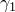 = 34.65

运动硬化参数，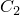 = 5.555×10^3

运动硬化参数， = 34.65

运动硬化参数， = 5.555×10^3

运动硬化参数，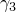 = 0.0

（单位不重要。）

**材料5：**

**弹性**

杨氏模量，*E* = 200.0E3

泊松比， = 0.3

**塑性**

初始屈服应力： = 200.0

等向硬化参数， = 0.0

等向硬化参数，*b* = 0.0

运动硬化参数， = 1.111×10^4

运动硬化参数， = 34.65

运动硬化参数， = 5.555×10^3

运动硬化参数， = 34.65

运动硬化参数， = 5.555×10^3

运动硬化参数， = 0.0

（单位不重要。）

### 结果与讨论

结果与精确分析解或近似解高度吻合。

### 输入文件

##### **Abaqus/Standard输入文件**

#### 材料1：

[mplchb2hut.inp](../eif/mplchb2hut.inp)

带温度和场变量依赖的单轴拉伸，位移控制，SAX1单元。

[mplchb3hut.inp](../eif/mplchb3hut.inp)

带温度依赖的单轴拉伸，位移控制，C3D8R单元。

[mplcho1hut.inp](../eif/mplcho1hut.inp)

单轴拉伸，表格数据，载荷控制，B21单元。

[mplcho1hutmb.inp](../eif/mplcho1hutmb.inp)

单轴拉伸，表格数据，载荷控制，B21单元，反向应力数 = 3。

[mplcho3nt1.inp](../eif/mplcho3nt1.inp)

单轴拉伸，载荷控制，C3D8单元。

[mplchi3nt1.inp](../eif/mplchi3nt1.inp)

单轴拉伸，、和的非零初始条件；位移控制；带钢筋的M3D4单元。

[mplchi2hut.inp](../eif/mplchi2hut.inp)

带方向和与非零初始条件的单轴拉伸，位移控制，CPE4单元。

#### 材料2：

[mplcho1mcy.inp](../eif/mplcho1mcy.inp)

循环加载，无等向硬化，位移控制，T3D2单元。

[mplcho1mcymb.inp](../eif/mplcho1mcymb.inp)

循环加载，无等向硬化，位移控制，T3D2单元，反向应力数 = 3。

#### 材料3：

[mplcho2gsh.inp](../eif/mplcho2gsh.inp)

包含扰动步骤的简单剪切，CPS4单元。

#### 材料4：

[mplchb2hutmb.inp](../eif/mplchb2hutmb.inp)

带温度和场变量依赖的单轴拉伸，位移控制，SAX1单元，反向应力数 = 3。

[mplchi2hutmb.inp](../eif/mplchi2hutmb.inp)

带方向和与非零初始条件的单轴拉伸，位移控制，CPE4单元，反向应力数 = 3。

[mplcho3nt1mb.inp](../eif/mplcho3nt1mb.inp)

单轴拉伸，载荷控制，C3D8单元，反向应力数 = 3。

[mplchi3nt1mb.inp](../eif/mplchi3nt1mb.inp)

单轴拉伸，、和的非零初始条件；位移控制；带钢筋的M3D4单元；反向应力数 = 3。

#### 材料5：

[mplcho2gshmb.inp](../eif/mplcho2gshmb.inp)

包含扰动步骤的简单剪切，CPS4单元，反向应力数 = 3。

##### **Abaqus/Explicit输入文件**

#### 材料1：

[mplchb2hut_xpl.inp](../eif/mplchb2hut_xpl.inp)

带温度和场变量依赖的单轴拉伸，位移控制，SAX1单元。

[mplchb3hut_xpl.inp](../eif/mplchb3hut_xpl.inp)

带温度依赖的单轴拉伸，位移控制，C3D8R单元。

[mplcho1hut_xpl.inp](../eif/mplcho1hut_xpl.inp)

单轴拉伸，表格数据，载荷控制，B21单元。

[mplcho1hutmb_xpl.inp](../eif/mplcho1hutmb_xpl.inp)

单轴拉伸，表格数据，载荷控制，B21单元，反向应力数 = 3。

[mplcho3nt1_xpl.inp](../eif/mplcho3nt1_xpl.inp)

单轴拉伸，载荷控制，C3D8R单元。

[mplchi3nt1_xpl.inp](../eif/mplchi3nt1_xpl.inp)

单轴拉伸，、和的非零初始条件；位移控制；带钢筋的M3D4R单元。

[mplchi2hut_xpl.inp](../eif/mplchi2hut_xpl.inp)

带方向和与非零初始条件的单轴拉伸，位移控制，CPE4R单元。

#### 材料2：

[mplcho1mcy_xpl.inp](../eif/mplcho1mcy_xpl.inp)

循环加载，无等向硬化，位移控制，T3D2单元。

[mplcho1mcymb_xpl.inp](../eif/mplcho1mcymb_xpl.inp)

循环加载，无等向硬化，位移控制，T3D2单元，反向应力数 = 3。

#### 材料3：

[mplcho2gsh_xpl.inp](../eif/mplcho2gsh_xpl.inp)

包含扰动步骤的简单剪切，CPS4R单元。

#### 材料4：

[mplchb2hutmb_xpl.inp](../eif/mplchb2hutmb_xpl.inp)

带温度和场变量依赖的单轴拉伸，位移控制，SAX1单元，反向应力数 = 3。

[mplchi2hutmb_xpl.inp](../eif/mplchi2hutmb_xpl.inp)

带方向和与非零初始条件的单轴拉伸，位移控制，CPE4R单元，反向应力数 = 3。

[mplcho3nt1mb_xpl.inp](../eif/mplcho3nt1mb_xpl.inp)

单轴拉伸，载荷控制，C3D8R单元，反向应力数 = 3。

[mplchi3nt1mb_xpl.inp](../eif/mplchi3nt1mb_xpl.inp)

单轴拉伸，、和的非零初始条件；位移控制；带钢筋的M3D4R单元；反向应力数 = 3。

#### 材料5：

[mplcho2gshmb_xpl.inp](../eif/mplcho2gshmb_xpl.inp)

包含扰动步骤的简单剪切，CPS4R单元，反向应力数 = 3。

### IV. 绝热Mises塑性

### 测试单元

C3D8    CPS4    T3D2    

### 问题描述

**材料：**

**弹性**

杨氏模量，*E* = 30.0E6

泊松比， = 0.3

**塑性**

硬化：

| 屈服应力 | 塑性应变 | 温度 |
| --- | --- | --- |
| 30.0E3 | 0.000 | 0.0 |
| 50.0E3 | 0.200 | 0.0 |
| 50.0E3 | 2.000 | 0.0 |
| 3.0E3 | 0.000 | 100.0 |
| 5.0E3 | 0.200 | 100.0 |
| 5.0E3 | 2.000 | 100.0 |

**其他特性**

密度， = 1000.0

比热，*c* = 0.4

非弹性热分数 = 0.5

（单位不重要。）

### 结果与讨论

结果与精确分析解或近似解高度吻合。

### 输入文件

[mhliho3hut.inp](../eif/mhliho3hut.inp)

单轴拉伸，C3D8单元。

[mhliho1hut.inp](../eif/mhliho1hut.inp)

单轴拉伸，T3D2单元。

[mhliho3gsh.inp](../eif/mhliho3gsh.inp)

剪切，C3D8单元。

[mhliho2gsh.inp](../eif/mhliho2gsh.inp)

剪切，CPS4单元。

[mhliho3ltr.inp](../eif/mhliho3ltr.inp)

三轴，C3D8单元。

[mhliht3hut.inp](../eif/mhliht3hut.inp)

单轴拉伸，C3D8单元。

[mhliht3xmx.inp](../eif/mhliht3xmx.inp)

多轴，C3D8单元。

### V. Hill塑性

### 测试单元

C3D8

### 问题描述

**材料：**

**弹性**

杨氏模量，*E* = 200.0E3

泊松比， = 0.3

**塑性**

硬化：

| 屈服应力 | 塑性应变 |
| --- | --- |
| 200. | 0.0000 |
| 220. | 0.0009 |
| 220. | 0.0029 |

各向异性屈服比：1.5、1.2、1.0、1.0、1.0、1.0

（单位不重要。）

### 结果与讨论

结果与精确分析解或近似解高度吻合。

### 输入文件

[mppiho3nt1.inp](../eif/mppiho3nt1.inp)

方向1的单轴拉伸，C3D8单元。

[mppiho3ot2.inp](../eif/mppiho3ot2.inp)

方向2的单轴拉伸，C3D8单元。

[mppiho3pt3.inp](../eif/mppiho3pt3.inp)

方向3的单轴拉伸，C3D8单元。

[mppiho3vlp.inp](../eif/mppiho3vlp.inp)

包含[*LOAD CASE*](../key/key-link.md#usb-kws-hloadcase)的线性扰动步骤，方向1的单轴拉伸，C3D8单元。

### VI. 变形塑性

### 测试单元

C3D8    CPS4    T3D2    

### 问题描述

**材料：**

**弹性**

杨氏模量，*E* = 200.0E3

泊松比， = 0.3

**塑性**

屈服应力， = 200.0

指数，*n* = 21.315

屈服偏移， = 0.11802

（单位不重要。）

### 结果与讨论

结果与精确分析解或近似解高度吻合。

### 输入文件

[mdfooo3hut.inp](../eif/mdfooo3hut.inp)

单轴拉伸，C3D8单元。

[mdfooo3huti.inp](../eif/mdfooo3huti.inp)

带初始应力的单轴拉伸，C3D8单元。

[mdfooo2hut.inp](../eif/mdfooo2hut.inp)

单轴拉伸，CPS4单元。

[mdfooo2huti.inp](../eif/mdfooo2huti.inp)

带初始应力的单轴拉伸，CPS4单元。

[mdfooo1hut.inp](../eif/mdfooo1hut.inp)

单轴拉伸，T3D2单元。

[mdfooo1huti.inp](../eif/mdfooo1huti.inp)

带初始应力的单轴拉伸，T3D2单元。

### VII. 带线性弹性的Drucker-Prager塑性

### 测试单元

C3D8    C3D8R    CAX4    CPE4    CPS4    

### 问题描述

**材料：**

**弹性**

杨氏模量，*E* = 300.0E3

泊松比， = 0.3

**塑性**

摩擦角， = 40.0

剪胀角， = 40.0

第三不变量比，*K* = 0.78（包含时；否则为1.0）

硬化曲线：

| 屈服应力 | 塑性应变 |
| --- | --- |
| 6.0E3 | 0.000000 |
| 9.0E3 | 0.020000 |
| 11.0E3 | 0.063333 |
| 12.0E3 | 0.110000 |
| 12.0E3 | 1.000000 |

（单位不重要。）

屈服准则的双曲型和指数型通过使用将它们简化为等效线性形式的参数进行验证。将双曲屈服函数简化为线性形式需要 。将指数屈服函数简化为线性形式需要 *b* = 1.0且 *a* = (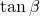)^(-1)。

### 结果与讨论

本节中的大多数测试设置为单位尺寸单个单元的均匀变形情况。因此，单元内所有积分点的结果相同。然而，为了测试某些条件，有必要建立非均匀变形问题。在每种情况下，本构路径以20个固定大小的增量进行积分。

### 输入文件

##### **剪切准则：线性Drucker-Prager**

[mdeooo3euc.inp](../eif/mdeooo3euc.inp)

单轴压缩，C3D8单元。

[mdeooo2euc.inp](../eif/mdeooo2euc.inp)

单轴压缩，CPS4单元。

[mdeooo3ctc.inp](../eif/mdeooo3ctc.inp)

三轴压缩，CAX4单元。

[mdeooo3dte.inp](../eif/mdeooo3dte.inp)

三轴拉伸，CAX4单元。

[mdekoo3dte.inp](../eif/mdekoo3dte.inp)

*K* = 0.78，三轴拉伸，CAX4单元。

[mdeooo3gsh.inp](../eif/mdeooo3gsh.inp)

剪切，C3D8单元。

[mdeooo2gsh.inp](../eif/mdeooo2gsh.inp)

剪切，CPS4单元。

[mdekoo3gsh.inp](../eif/mdekoo3gsh.inp)

*K* = 0.78，剪切，C3D8单元。

[mdekoo2gsh.inp](../eif/mdekoo2gsh.inp)

*K* = 0.78；剪切，CPS4单元。

[mdeooo3hut.inp](../eif/mdeooo3hut.inp)

单轴拉伸，C3D8单元。

[mdeooo2hut.inp](../eif/mdeooo2hut.inp)

单轴拉伸，CPS4单元。

[mdekoo3hut.inp](../eif/mdekoo3hut.inp)

*K* = 0.78，单轴拉伸，C3D8单元。

[mdekoo2hut.inp](../eif/mdekoo2hut.inp)

*K* = 0.78，单轴拉伸，CPS4单元。

[mdekot3hut.inp](../eif/mdekot3hut.inp)

*K* = 0.78，带温度依赖的单轴拉伸，C3D8R单元。

[mdeooo3jht.inp](../eif/mdeooo3jht.inp)

静水拉伸，C3D8单元。

[mdeooo3ltr.inp](../eif/mdeooo3ltr.inp)

三轴应力，CPE4单元（非均匀）。

[mdeooo2ltr.inp](../eif/mdeooo2ltr.inp)

三轴应力，CPS4单元（非均匀）。

[mdekoo3ltr.inp](../eif/mdekoo3ltr.inp)

*K* = 0.78，三轴应力，CPE4单元（非均匀）。

[mdekoo2ltr.inp](../eif/mdekoo2ltr.inp)

*K* = 0.78，三轴应力，CPS4单元（非均匀）。

[mdeoot3euc.inp](../eif/mdeoot3euc.inp)

带温度依赖的单轴压缩，C3D8单元。

[mdeooo3vlp.inp](../eif/mdeooo3vlp.inp)

线性扰动单轴压缩，C3D8单元。

[mdedos3euc.inp](../eif/mdedos3euc.inp)

带速率依赖的单轴压缩，C3D8单元。

[mdeooi3euc.inp](../eif/mdeooi3euc.inp)

非零初始条件的单轴压缩，C3D8单元。

[mdedoo2euc.inp](../eif/mdedoo2euc.inp)

单轴拉伸，完全塑性，CPS4单元。

##### **剪切准则：指数**

Abaqus/Standard输入文件

[mdeeoo3jht.inp](../eif/mdeeoo3jht.inp)

静水拉伸，C3D8单元。

[mdeeoo3ltr.inp](../eif/mdeeoo3ltr.inp)

三轴应力，CPE4单元（非均匀）。

[mdeeoo3dte.inp](../eif/mdeeoo3dte.inp)

三轴拉伸，CAX4单元。

[mdeeoo3hut.inp](../eif/mdeeoo3hut.inp)

单轴拉伸，C3D8单元。

[mdeeoo2hut.inp](../eif/mdeeoo2hut.inp)

单轴拉伸，CPS4单元。

[mdeeoo3gsh.inp](../eif/mdeeoo3gsh.inp)

剪切，C3D8单元。

[mdeeoo2gsh.inp](../eif/mdeeoo2gsh.inp)

剪切，CPS4单元。

[mdeeoo3ctc.inp](../eif/mdeeoo3ctc.inp)

三轴压缩，CAX4单元。

[mdeeoo3euc.inp](../eif/mdeeoo3euc.inp)

单轴压缩，C3D8单元。

[mdeeoo2euc.inp](../eif/mdeeoo2euc.inp)

单轴压缩，CPS4单元。

[mdeeos3euc.inp](../eif/mdeeos3euc.inp)

带速率依赖的单轴压缩，C3D8单元。

[mdeeot3euc.inp](../eif/mdeeot3euc.inp)

带温度依赖的单轴压缩，C3D8单元。

[mdeeoo3vlp.inp](../eif/mdeeoo3vlp.inp)

线性扰动单轴压缩，C3D8单元。

Abaqus/Explicit输入文件

[mdeeoo3jht_xpl.inp](../eif/mdeeoo3jht_xpl.inp)

静水拉伸，C3D8R单元。

[mdeeoo3ltr_xpl.inp](../eif/mdeeoo3ltr_xpl.inp)

三轴应力，CPE4R单元（非均匀）。

[mdeeoo3dte_xpl.inp](../eif/mdeeoo3dte_xpl.inp)

三轴拉伸，CAX4R单元。

[mdeeoo3hut_xpl.inp](../eif/mdeeoo3hut_xpl.inp)

单轴拉伸，C3D8R单元。

[mdeeoo2hut_xpl.inp](../eif/mdeeoo2hut_xpl.inp)

单轴拉伸，CPS4R单元。

[mdeeoo3gsh_xpl.inp](../eif/mdeeoo3gsh_xpl.inp)

剪切，C3D8R单元。

[mdeeoo2gsh_xpl.inp](../eif/mdeeoo2gsh_xpl.inp)

剪切，CPS4R单元。

[mdeeoo3ctc_xpl.inp](../eif/mdeeoo3ctc_xpl.inp)

三轴压缩，CAX4R单元。

[mdeeoo3euc_xpl.inp](../eif/mdeeoo3euc_xpl.inp)

单轴压缩，C3D8R单元。

[mdeeoo2euc_xpl.inp](../eif/mdeeoo2euc_xpl.inp)

单轴压缩，CPS4R单元。

[mdeeos3euc_xpl.inp](../eif/mdeeos3euc_xpl.inp)

带速率依赖的单轴压缩，C3D8R单元。

[mdeeot3euc_xpl.inp](../eif/mdeeot3euc_xpl.inp)

带温度依赖的单轴压缩，C3D8R单元。

##### **剪切准则：带测试数据的指数**

Abaqus/Standard输入文件

[mdeeto3jht.inp](../eif/mdeeto3jht.inp)

静水拉伸，C3D8单元。

[mdeeto3ltr.inp](../eif/mdeeto3ltr.inp)

三轴应力，CPE4单元（非均匀）。

[mdeeto3dte.inp](../eif/mdeeto3dte.inp)

三轴拉伸，CAX4单元。

[mdeeto3hut.inp](../eif/mdeeto3hut.inp)

单轴拉伸，C3D8单元。

[mdeeto2hut.inp](../eif/mdeeto2hut.inp)

单轴拉伸，CPS4单元。

[mdeeto3gsh.inp](../eif/mdeeto3gsh.inp)

剪切，C3D8单元。

[mdeeto2gsh.inp](../eif/mdeeto2gsh.inp)

剪切，CPS4单元。

[mdeeto3ctc.inp](../eif/mdeeto3ctc.inp)

三轴压缩，CAX4单元。

[mdeeto3euc.inp](../eif/mdeeto3euc.inp)

单轴压缩，C3D8单元。

[mdeeto2euc.inp](../eif/mdeeto2euc.inp)

单轴压缩，CPS4单元。

[mdeets3euc.inp](../eif/mdeets3euc.inp)

带速率依赖的单轴压缩，C3D8单元。

[mdeeto3vlp.inp](../eif/mdeeto3vlp.inp)

线性扰动单轴压缩，C3D8单元。

Abaqus/Explicit输入文件

[mdeeto3jht_xpl.inp](../eif/mdeeto3jht_xpl.inp)

静水拉伸，C3D8R单元。

[mdeeto3ltr_xpl.inp](../eif/mdeeto3ltr_xpl.inp)

三轴应力，CPE4R单元（非均匀）。

[mdeeto3dte_xpl.inp](../eif/mdeeto3dte_xpl.inp)

三轴拉伸，CAX4R单元。

[mdeeto3hut_xpl.inp](../eif/mdeeto3hut_xpl.inp)

单轴拉伸，C3D8R单元。

[mdeeto2hut_xpl.inp](../eif/mdeeto2hut_xpl.inp)

单轴拉伸，CPS4R单元。

[mdeeto3gsh_xpl.inp](../eif/mdeeto3gsh_xpl.inp)

剪切，C3D8R单元。

[mdeeto2gsh_xpl.inp](../eif/mdeeto2gsh_xpl.inp)

剪切，CPS4R单元。

[mdeeto3ctc_xpl.inp](../eif/mdeeto3ctc_xpl.inp)

三轴压缩，CAX4R单元。

[mdeeto3euc_xpl.inp](../eif/mdeeto3euc_xpl.inp)

单轴压缩，C3D8R单元。

[mdeeto2euc_xpl.inp](../eif/mdeeto2euc_xpl.inp)

单轴压缩，CPS4R单元。

[mdeets3euc_xpl.inp](../eif/mdeets3euc_xpl.inp)

带速率依赖的单轴压缩，C3D8R单元。

##### **剪切准则：双曲**

Abaqus/Standard输入文件

[mdehoo3jht.inp](../eif/mdehoo3jht.inp)

静水拉伸，C3D8单元。

[mdehoo3ltr.inp](../eif/mdehoo3ltr.inp)

三轴应力，CPE4单元（非均匀）。

[mdehoo3dte.inp](../eif/mdehoo3dte.inp)

三轴拉伸，CAX4单元。

[mdehoo3hut.inp](../eif/mdehoo3hut.inp)

单轴拉伸，C3D8单元。

[mdehoo2hut.inp](../eif/mdehoo2hut.inp)

单轴拉伸，CPS4单元。

[mdehoo3gsh.inp](../eif/mdehoo3gsh.inp)

剪切，C3D8单元。

[mdehoo2gsh.inp](../eif/mdehoo2gsh.inp)

剪切，CPS4单元。

[mdehoo3ctc.inp](../eif/mdehoo3ctc.inp)

三轴压缩，CAX4单元。

[mdehoo3euc.inp](../eif/mdehoo3euc.inp)

单轴压缩，C3D8单元。

[mdehoo2euc.inp](../eif/mdehoo2euc.inp)

单轴压缩，CPS4单元。

[mdehos3euc.inp](../eif/mdehos3euc.inp)

带速率依赖的单轴压缩，C3D8单元。

[mdehot3euc.inp](../eif/mdehot3euc.inp)

带温度依赖的单轴压缩，C3D8单元。

[mdehoo3vlp.inp](../eif/mdehoo3vlp.inp)

线性扰动单轴压缩，C3D8单元。

Abaqus/Explicit输入文件

[mdehoo3jht_xpl.inp](../eif/mdehoo3jht_xpl.inp)

静水拉伸，C3D8R单元。

[mdehoo3ltr_xpl.inp](../eif/mdehoo3ltr_xpl.inp)

三轴应力，CPE4R单元（非均匀）。

[mdehoo3dte_xpl.inp](../eif/mdehoo3dte_xpl.inp)

三轴拉伸，CAX4R单元。

[mdehoo3hut_xpl.inp](../eif/mdehoo3hut_xpl.inp)

单轴拉伸，C3D8R单元。

[mdehoo2hut_xpl.inp](../eif/mdehoo2hut_xpl.inp)

单轴拉伸，CPS4R单元。

[mdehoo3gsh_xpl.inp](../eif/mdehoo3gsh_xpl.inp)

剪切，C3D8R单元。

[mdehoo2gsh_xpl.inp](../eif/mdehoo2gsh_xpl.inp)

剪切，CPS4R单元。

[mdehoo3ctc_xpl.inp](../eif/mdehoo3ctc_xpl.inp)

三轴压缩，CAX4R单元。

[mdehoo3euc_xpl.inp](../eif/mdehoo3euc_xpl.inp)

单轴压缩，C3D8R单元。

[mdehoo2euc_xpl.inp](../eif/mdehoo2euc_xpl.inp)

单轴压缩，CPS4R单元。

[mdehos3euc_xpl.inp](../eif/mdehos3euc_xpl.inp)

带速率依赖的单轴压缩，C3D8R单元。

[mdehot3euc_xpl.inp](../eif/mdehot3euc_xpl.inp)

带温度依赖的单轴压缩，C3D8R单元。

##### **在Abaqus/Standard和Abaqus/Explicit之间传递结果**

[sx_s_druckerprager.inp](../eif/sx_s_druckerprager.inp)

从Abaqus/Standard导入到Abaqus/Explicit的基础问题，C3D8R单元，单轴拉伸。

[sx_x_druckerprager_y_y.inp](../eif/sx_x_druckerprager_y_y.inp)

sx_s_druckerprager.inp的显式动态延续，导入参考构型和状态，C3D8R单元，单轴拉伸。

[sx_x_druckerprager_n_y.inp](../eif/sx_x_druckerprager_n_y.inp)

sx_s_druckerprager.inp的显式动态延续，仅导入状态，C3D8R单元，单轴拉伸。

[sx_x_druckerprager_n_n.inp](../eif/sx_x_druckerprager_n_n.inp)

sx_s_druckerprager.inp的显式动态延续，不导入状态或参考构型，C3D8R单元，单轴拉伸。

[xs_s_druckerprager_y_y.inp](../eif/xs_s_druckerprager_y_y.inp)

从sx_x_druckerprager_y_y.inp导入到Abaqus/Standard，导入参考构型和状态，C3D8R单元，单轴拉伸。

[xs_s_druckerprager_n_y.inp](../eif/xs_s_druckerprager_n_y.inp)

从sx_x_druckerprager_n_y.inp导入到Abaqus/Standard，仅导入状态，C3D8R单元，单轴拉伸。

[xs_s_druckerprager_n_n.inp](../eif/xs_s_druckerprager_n_n.inp)

从sx_x_druckerprager_n_n.inp导入到Abaqus/Standard，不导入状态或参考构型，C3D8R单元，单轴拉伸。

### VIII. 带多孔弹性的Drucker-Prager塑性

### 测试单元

CAX4

### 问题描述

**材料：**

**弹性**

对数体积模量， = 1.49

泊松比， = 0.1

**塑性**

摩擦角， = 10.0

剪胀角， = 10.0

硬化曲线：

| 屈服应力 | 塑性应变 |
| --- | --- |
| 100.0 | 0.0 |
| 500.0 | 0.5 |

**初始条件**

初始孔隙比， = 4.1

屈服准则的双曲型和指数型通过使用将它们简化为等效线性形式的参数进行验证。将双曲屈服函数简化为线性形式需要 。将指数屈服函数简化为线性形式需要 *b* = 1.0且 *a* = ()^(-1)。

（单位不重要。）

### 结果与讨论

本节中的测试设置为单位尺寸单个单元的均匀变形情况。因此，单元内所有积分点的结果相同。在每种情况下，本构路径以20个固定大小的增量进行积分。

### 输入文件

##### **剪切准则：线性Drucker-Prager**

[mdpdoo3bus.inp](../eif/mdpdoo3bus.inp)

单轴应变，CAX4单元。

[mdpdoo3ctc.inp](../eif/mdpdoo3ctc.inp)

三轴压缩，CAX4单元。

##### **剪切准则：指数**

[mdpeoo3bus.inp](../eif/mdpeoo3bus.inp)

单轴应变，CAX4单元。

[mdpeoo3ctc.inp](../eif/mdpeoo3ctc.inp)

三轴压缩，CAX4单元。

##### **剪切准则：带测试数据的指数**

[mdpeto3bus.inp](../eif/mdpeto3bus.inp)

单轴应变，CAX4单元。

[mdpeto3ctc.inp](../eif/mdpeto3ctc.inp)

三轴压缩，CAX4单元。

##### **剪切准则：双曲**

[mdphoo3bus.inp](../eif/mdphoo3bus.inp)

单轴应变，CAX4单元。

[mdphoo3ctc.inp](../eif/mdphoo3ctc.inp)

三轴压缩，CAX4单元。

### IX. 盖塑性

### 测试单元

C3D8R    CAX4    CPE4    

### 问题描述

**材料：**

在本节描述的测试中，除非另有说明，否则使用线性弹性、盖塑性I、盖硬化I和*K* = 1.0的以下数据。使用此数据，弹性剪切模量为5000.0，体积模量为10000.0。纯剪切中的首次屈服发生在S12 = 100.0，纯静水压缩中的首次屈服发生在PRESS = 270.0，纯静水拉伸中的首次屈服发生在PRESS = 300.0，以及当PRESS = 时首次屈服发生在PRESS = 120.0和S12 = 125.0。除非另有说明，否则使用C3D8单元。

**线性弹性（几乎所有测试中使用）**

杨氏模量，*E* = 12857.1429

泊松比， = 0.28571429 (= 1/7)

**盖塑性I（几乎所有测试中使用）**

内聚力，*d* = 173.20508 (= 100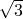)

Drucker-Prager破坏面的斜率， = 30.0

盖椭圆度，*R* = 0.61858957

初始体积塑性应变，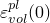 = 0.027

过渡参数， = 0.69258232

第三不变量因子，*K* = 1.0或0.8，取决于测试。

**盖硬化I（几乎所有测试中使用）**

纯静水压缩中屈服面的位置，

体积压缩塑性应变，

|  |  |
| --- | --- |
| 213.0 | 0.00 |
| 222.0 | 0.01 |
| 242.0 | 0.02 |
| 282.0 | 0.03 |
| 362.0 | 0.04 |
| 522.0 | 0.05 |
| 842.0 | 0.06 |
| 1482.0 | 0.07 |
| 2762.0 | 0.08 |

**盖塑性II**

*d* = 0.2286E6

 = 85.0

*R* = 0.0875

 = 1.22

 = 0.07877

*K* = 1.0

**盖硬化II**

纯静水压缩中屈服面的位置，

体积压缩塑性应变，

|  |  |
| --- | --- |
| 0.03E6 | 0.0 |
| 0.20E6 | 1.22 |
| 2.00E6 | 2.44 |
| 2.00E7 | 3.66 |

**多孔弹性I**

对数体积模量， = 20.0

泊松比， = 0.28571429

拉伸强度极限， = 1.0E5

**多孔弹性II**

 = 0.09

 = 0.0

 = 0.02E6

**初始条件**

初始孔隙比， = 1.0

### 结果与讨论

结果与精确分析解或近似解高度吻合。

### 输入文件

[mcaooo3mcy.inp](../eif/mcaooo3mcy.inp)

静水循环测试，位移控制。

执行以下六个步骤：

[mcaooo3euc.inp](../eif/mcaooo3euc.inp)

单轴压缩应力测试；位移控制。

第2步反转导致拉伸屈服的位移。

[mcaooo3gsh.inp](../eif/mcaooo3gsh.inp)

剪切测试；载荷控制（S22 = S11）；覆盖软线性单元。

由于横向约束，会有一些静水应力。

[mcaooo3ucs.inp](../eif/mcaooo3ucs.inp)

循环剪切测试；位移控制；S12主导。

[mcaoot3ctc.inp](../eif/mcaoot3ctc.inp)

静水压缩至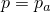，然后纯剪切；位移控制；温度依赖。

屈服应保持体积不变。

[mcakoo3gsh.inp](../eif/mcakoo3gsh.inp)

剪切测试；载荷控制；两个主单元和两个覆盖软单元。

一组加载主应力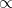 (1, 1, 2)，另一组加载 (1, 1, 2)。

屈服应力比应为*K* = 0.8。

[mcaoob3bus.inp](../eif/mcaoob3bus.inp)

单轴压缩应变（固结仪）测试；CPE4单元；载荷控制；带[*CAP PLASTICITY*](../key/key-link.md#usb-kws-mcapplasticity)和[*CAP HARDENING*](../key/key-link.md#usb-kws-mcaphardening)数据的温度和场变量依赖。

指定温度和场变量以使[*CAP PLASTICITY*](../key/key-link.md#usb-kws-mcapplasticity)和[*CAP HARDENING*](../key/key-link.md#usb-kws-mcaphardening)数据与盖塑性I和盖硬化I数据完全相同。

[mcaooo3bus.inp](../eif/mcaooo3bus.inp)

单轴压缩应变（固结仪）测试；载荷控制；NLGEOM和多孔弹性I。

多孔弹性I的切线体积和剪切模量与线性弹性的差异在测试应变范围内约为1%。

[mcaooo3ctc.inp](../eif/mcaooo3ctc.inp)

三轴测试。静水加载至，然后仅增加S11。

[mcaooo3vlp.inp](../eif/mcaooo3vlp.inp)

单轴压缩应变（固结仪）测试；载荷控制；非线性分析分为两步，每步之前都有线性扰动步骤。

非线性步骤的结果应对应于mca0003bus.inp的结果。

两个线性扰动步骤（[*STATIC*](../key/key-link.md#usb-kws-hstatic)）的结果应相同，因为假设小位移且弹性是线性的。

[mcakoo3ltr.inp](../eif/mcakoo3ltr.inp)

设计用于在8个高斯点产生不同应力状态但以剪切为主的位移模式。

目的是测试Newton迭代的鲁棒性，因此采用非常大的应变增量。

位移控制。*K* = 0.8。

[mcaooo3ltr.inp](../eif/mcaooo3ltr.inp)

测试算法鲁棒性的另一个测试。

使用CAX4单元、多孔弹性II、盖塑性II和盖硬化II。

[mcaooo3xmx.inp](../eif/mcaooo3xmx.inp)

测试盖初始位置的调整。

两个具有不同初始应力状态的C3D8R单元。

单元1中的初始应力将导致调整，使应力点位于盖屈服面上。

单元2中的初始应力将导致调整，使应力点位于过渡屈服面上。

### X. 带多孔弹性的粘土塑性

### 测试单元

C3D8    CAX8R    

### 问题描述

**材料：**

**多孔弹性**

对数体积模量， = 0.026

泊松比， = 0.3

**塑性**

对数塑性体积模量， = 0.174

临界状态斜率，*M* = 1.0

初始屈服面大小， = 58.3

（在测试mcl*xxxx*ahc.inp中，我们使用 = 130.9或 = 1.904）

盖参数， = 0.5（包含时；否则为1.0）

第三不变量比，*K* = 0.78（包含时；否则为1.0）

**初始条件**

初始孔隙比， = 1.08

（单位不重要。）

### 结果与讨论

结果与精确分析解或近似解高度吻合。

### 输入文件

[mclooo3ahc.inp](../eif/mclooo3ahc.inp)

静水压缩，C3D8单元。

[mcloio3ahc.inp](../eif/mcloio3ahc.inp)

带截距选项的静水压缩，C3D8单元。

[mclooo3ctc.inp](../eif/mclooo3ctc.inp)

三轴压缩，CAX8R单元。

[mclott3ctc.inp](../eif/mclott3ctc.inp)

三轴压缩，温度依赖，CAX8R单元。

[mclobo3ctc.inp](../eif/mclobo3ctc.inp)

 = 0.5，三轴压缩，CAX8R单元。

[mclooo3dte.inp](../eif/mclooo3dte.inp)

三轴拉伸，CAX8R单元。

[mclkoo3dte.inp](../eif/mclkoo3dte.inp)

*K* = 0.78，三轴拉伸，CAX8R单元。

[mclktd3dte.inp](../eif/mclktd3dte.inp)

*K* = 0.78，三轴拉伸，场变量依赖，CAX8R单元。

[mclkbo3dte.inp](../eif/mclkbo3dte.inp)

 = 0.5，*K* = 0.78，三轴拉伸，CAX8R单元。

[mcloto3euc.inp](../eif/mcloto3euc.inp)

单轴压缩，CAX8R单元。

[mclooo3gsh.inp](../eif/mclooo3gsh.inp)

剪切，C3D8单元。

[mcloto3gsh.inp](../eif/mcloto3gsh.inp)

剪切，表格硬化，C3D8单元。

[mclooo3vlp.inp](../eif/mclooo3vlp.inp)

线性扰动静水压缩，C3D8单元。

### XI. 可压碎泡沫塑性

### 测试单元

C3D8    CPE4    

### 问题描述

**材料：**

**弹性**

杨氏模量，*E* = 3.0E6

泊松比， = 0.2

**塑性**

静水压缩中的初始屈服应力， = 2.0E5

静水拉伸强度， = 2.0E4

单轴压缩中的初始屈服应力， = 2.2E5

屈服应力比，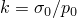 = 1.1

屈服应力比，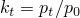 = 0.1

硬化曲线（来自单轴压缩）：

| 屈服应力 | 塑性应变 |
| --- | --- |
| 2.200E5 | 0.0 |
| 2.465E5 | 0.1 |
| 2.729E5 | 0.2 |
| 2.990E5 | 0.3 |
| 3.245E5 | 0.4 |
| 3.493E5 | 0.5 |
| 3.733E5 | 0.6 |
| 3.962E5 | 0.7 |
| 4.180E5 | 0.8 |
| 4.387E5 | 0.9 |
| 4.583E5 | 1.0 |
| 4.938E5 | 1.2 |
| 5.248E5 | 1.4 |
| 5.515E5 | 1.6 |
| 5.743E5 | 1.8 |
| 5.936E5 | 2.0 |
| 6.294E5 | 2.5 |
| 6.520E5 | 3.0 |
| 6.833E5 | 5.0 |
| 6.883E5 | 10.0 |

**初始条件**

初始体积压缩塑性应变，，对于测试指定初始等效塑性应变的情况设置为0.02。

（单位不重要。）

### 结果与讨论

结果与精确分析解或近似解高度吻合。

### 输入文件

[mfeoto3ahc.inp](../eif/mfeoto3ahc.inp)

静水压缩，C3D8单元。

[mfeoto3euc.inp](../eif/mfeoto3euc.inp)

单轴压缩，C3D8单元。

[mfeoto3gsh.inp](../eif/mfeoto3gsh.inp)

剪切，C3D8单元。

[mfeoto3hut.inp](../eif/mfeoto3hut.inp)

单轴拉伸，C3D8单元。

[mfeoti3euc.inp](../eif/mfeoti3euc.inp)

单轴压缩，CPE4单元。

[mfeoto3ltr.inp](../eif/mfeoto3ltr.inp)

三轴应力，CPE4单元（非均匀）。

[mfeoto3vlp.inp](../eif/mfeoto3vlp.inp)

带[*LOAD CASE*](../key/key-link.md#usb-kws-hloadcase)的线性扰动和静水压缩，C3D8单元。

### XII. 带线性弹性的粘土塑性

### 测试单元

C3D8    CAX8R    

### 问题描述

**材料：**

**弹性**

每个测试中使用的杨氏模量在输入文件描述中给出。每个测试的模量基于等效测试在增量10和20时与多孔弹性的平均弹性刚度。因此，可以直接与["与速率无关的塑性"中的"带线性弹性的Drucker-Prager塑性"](./ch02s02abv148.md#ver-mat-rateindep-dplinelast)中记录的结果进行比较。

泊松比， = 0.3

**塑性**

临界状态斜率，*M* = 1.0

初始体积塑性应变， = 0.4

盖参数， = 0.5（包含时；否则为1.0）

第三不变量比，*K* = 0.78（包含时；否则为1.0）

["与速率无关的塑性"中的"带线性弹性的Drucker-Prager塑性"](./ch02s02abv148.md#ver-mat-rateindep-dplinelast)中使用的指数硬化曲线以表格形式输入，初始体积塑性应变对应于屈服面大小 = 58.3或 = 130.9。

（单位不重要。）

### 结果与讨论

结果与精确分析解或近似解高度吻合。

### 输入文件

##### **Abaqus/Standard输入文件**

[mceooo3ahc.inp](../eif/mceooo3ahc.inp)

静水压缩，C3D8单元，*E* = 18820。

[mceoot3ctc.inp](../eif/mceoot3ctc.inp)

三轴压缩，CAX8R单元，*E* = 30732。

[mceobo3ctc.inp](../eif/mceobo3ctc.inp)

 = 0.5，三轴压缩，CAX8R单元，*E* = 29556。

[mceooo3dte.inp](../eif/mceooo3dte.inp)

三轴拉伸，CAX8R单元，*E* = 21114。

[mcekod3dte.inp](../eif/mcekod3dte.inp)

*K* = 0.78，三轴拉伸，CAX8R单元，*E* = 28140。

[mcekbo3dte.inp](../eif/mcekbo3dte.inp)

 = 0.5，*K* = 0.78，三轴拉伸，CAX8R单元，*E* = 27580。

[mceooo3euc.inp](../eif/mceooo3euc.inp)

单轴压缩，CAX8R单元，*E* = 30000。

[mceooo3gsh.inp](../eif/mceooo3gsh.inp)

剪切，C3D8单元，*E* = 2798。

[mceooo3vlp.inp](../eif/mceooo3vlp.inp)

带[*LOAD CASE*](../key/key-link.md#usb-kws-hloadcase)的线性扰动和静水压缩，C3D8单元，*E* = 18820。

##### **Abaqus/Explicit输入文件**

[mceooo3ahc_xpl.inp](../eif/mceooo3ahc_xpl.inp)

静水压缩，C3D8单元，*E* = 18820。

[mceoot3ctc_xpl.inp](../eif/mceoot3ctc_xpl.inp)

三轴压缩，CAX4R单元，*E* = 30732。

[mceobo3ctc_xpl.inp](../eif/mceobo3ctc_xpl.inp)

 = 0.5，三轴压缩，CAX4R单元，*E* = 29556。

[mceooo3dte_xpl.inp](../eif/mceooo3dte_xpl.inp)

三轴拉伸，CAX4R单元，*E* = 21114。

[mcekod3dte_xpl.inp](../eif/mcekod3dte_xpl.inp)

*K* = 0.78，三轴拉伸，CAX4R单元，*E* = 28140。

[mcekbo3dte_xpl.inp](../eif/mcekbo3dte_xpl.inp)

 = 0.5，*K* = 0.78，三轴拉伸，CAX4R单元，*E* = 27580。

[mceooo3euc_xpl.inp](../eif/mceooo3euc_xpl.inp)

单轴压缩，CAX4R单元，*E* = 30000。

[mceooo3gsh_xpl.inp](../eif/mceooo3gsh_xpl.inp)

剪切，C3D8单元，*E* = 2798。

##### **从Abaqus/Standard传递结果到Abaqus/Explicit**

[mceooo3ahc_sx_s.inp](../eif/mceooo3ahc_sx_s.inp)

Abaqus/Standard分析，静水压缩，C3D8单元，*E* = 18820。

[mceooo3ahc_sx_x.inp](../eif/mceooo3ahc_sx_x.inp)

Abaqus/Explicit导入分析，UPDATE=NO，STATE=YES。

[mceoot3ctc_sx_s.inp](../eif/mceoot3ctc_sx_s.inp)

Abaqus/Standard分析，三轴压缩，CAX4R单元，*E* = 27580。

[mceoot3ctc_sx_x.inp](../eif/mceoot3ctc_sx_x.inp)

Abaqus/Explicit导入分析，UPDATE=NO，STATE=YES。

[mceobo3ctc_sx_s.inp](../eif/mceobo3ctc_sx_s.inp)

Abaqus/Standard分析， = 0.5，三轴压缩，CAX4R单元，*E* = 29556。

[mceobo3ctc_sx_x.inp](../eif/mceobo3ctc_sx_x.inp)

Abaqus/Explicit导入分析，UPDATE=NO，STATE=YES。

[mceooo3dte_sx_s.inp](../eif/mceooo3dte_sx_s.inp)

Abaqus/Standard分析，三轴拉伸，CAX4R单元，*E* = 21114。

[mceooo3dte_sx_x.inp](../eif/mceooo3dte_sx_x.inp)

Abaqus/Explicit导入分析，UPDATE=NO，STATE=YES。

[mcekod3dte_sx_s.inp](../eif/mcekod3dte_sx_s.inp)

Abaqus/Standard分析，*K* = 0.78，三轴拉伸，CAX4R单元，*E* = 28140。

[mcekod3dte_sx_x.inp](../eif/mcekod3dte_sx_x.inp)

Abaqus/Explicit导入分析，UPDATE=NO，STATE=YES。

[mcekbo3dte_sx_s.inp](../eif/mcekbo3dte_sx_s.inp)

Abaqus/Standard分析， = 0.5，*K* = 0.78，三轴拉伸，CAX4R单元，*E* = 27580。

[mcekbo3dte_sx_x.inp](../eif/mcekbo3dte_sx_x.inp)

Abaqus/Explicit导入分析，UPDATE=NO，STATE=YES。

[mceooo3euc_sx_s.inp](../eif/mceooo3euc_sx_s.inp)

Abaqus/Standard分析，单轴压缩，CAX4R单元，*E* = 30000。

[mceooo3euc_sx_x.inp](../eif/mceooo3euc_sx_x.inp)

Abaqus/Explicit导入分析，UPDATE=NO，STATE=YES。

[mceooo3gsh_sx_s.inp](../eif/mceooo3gsh_sx_s.inp)

Abaqus/Standard分析，剪切，C3D8单元，*E* = 2798。

[mceooo3gsh_sx_x.inp](../eif/mceooo3gsh_sx_x.inp)

Abaqus/Explicit导入分析，UPDATE=NO，STATE=YES。

##### **从Abaqus/Explicit传递结果到Abaqus/Standard**

[mceoot3ctc_xs_x.inp](../eif/mceoot3ctc_xs_x.inp)

Abaqus/Explicit分析，三轴压缩，CAX4R单元，*E* = 27580。

[mceoot3ctc_xs_s.inp](../eif/mceoot3ctc_xs_s.inp)

Abaqus/Standard导入分析，UPDATE=NO，STATE=YES。

[mceooo3dte_xs_x.inp](../eif/mceooo3dte_xs_x.inp)

Abaqus/Explicit分析，三轴拉伸，CAX4R单元，*E* = 21114。

[mceooo3dte_xs_s.inp](../eif/mceooo3dte_xs_s.inp)

Abaqus/Standard导入分析，UPDATE=NO，STATE=YES。

[mceooo3gsh_xs_x.inp](../eif/mceooo3gsh_xs_x.inp)

Abaqus/Explicit分析，剪切，C3D8单元，*E* = 2798。

[mceooo3gsh_xs_s.inp](../eif/mceooo3gsh_xs_s.inp)

Abaqus/Standard导入分析，UPDATE=NO，STATE=YES。

[mceobo3ctc_xs_x.inp](../eif/mceobo3ctc_xs_x.inp)

Abaqus/Explicit分析， = 0.5，三轴压缩，CAX4R单元，*E* = 29556。

[mceobo3ctc_xs_s.inp](../eif/mceobo3ctc_xs_s.inp)

Abaqus/Standard导入分析，UPDATE=NO，STATE=YES。

[mcekod3dte_xs_x.inp](../eif/mcekod3dte_xs_x.inp)

Abaqus/Explicit分析，*K* = 0.78，三轴拉伸，CAX4R单元，*E* = 28140。

[mcekod3dte_xs_s.inp](../eif/mcekod3dte_xs_s.inp)

Abaqus/Standard导入分析，UPDATE=NO，STATE=YES。

[mceooo3ahc_xs_x.inp](../eif/mceooo3ahc_xs_x.inp)

Abaqus/Explicit分析，静水压缩，C3D8单元，*E* = 18820。

[mceooo3ahc_xs_s.inp](../eif/mceooo3ahc_xs_s.inp)

Abaqus/Standard导入分析，UPDATE=NO，STATE=YES。

### XIII. 多孔金属塑性

### 测试单元

C3D8    CAX4    CAX4T    CPE4    

### 问题描述

**材料：**

**弹性**

杨氏模量，*E* = 300.0

泊松比， = 0.3

**塑性**

硬化曲线：

| 屈服应力 | 塑性应变 |
| --- | --- |
| 1.0000000 | 0.00 |
| 1.7411011 | 0.05 |
| 2.7276924 | 0.50 |
| 2.9950454 | 0.80 |

**多孔金属塑性**

改进的Gurson模型： = 1.5， = 1.0， = 2.25

（否则， =  =  = 1.0）

孔洞形核参数（包含时）：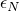 = 0.3，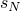 = 0.1， = 0.04

初始相对密度， = 0.95（ = 0.05）。

**耦合温度-位移分析中使用的材料特性：**

**弹性**

杨氏模量，*E* = 200.0E9

泊松比， = 0.3

**塑性**

硬化曲线：

| 屈服应力 | 塑性应变 |
| --- | --- |
| 7.0E8 | 0.00 |
| 3.7E9 | 10.0 |

**多孔金属塑性**

 =  =  = 1.0

初始相对密度， = 0.95（ = 0.05）。

**热特性**

比热， = 586.0

密度， = 7833.0

热导率，*k* = 52.0

热膨胀系数， = 1.2E5

（单位不重要。）

### 结果与讨论

结果与精确分析解或近似解高度吻合。

### 输入文件

[mgrono2xmx.inp](../eif/mgrono2xmx.inp)

非均匀变形，位移控制，CPE4单元。

[mgrono2xmx1.inp](../eif/mgrono2xmx1.inp)

除初始相对密度使用[*INITIAL CONDITIONS*](../key/key-link.md#usb-kws-minitialcond)，TYPE = RELATIVE DENSITY选项指定外，与mgrono2xmx.inp相同。

[mgrono3hut.inp](../eif/mgrono3hut.inp)

单轴拉伸，牵引控制，孔洞形核，C3D8单元。

[mgrono3jht.inp](../eif/mgrono3jht.inp)

静水拉伸，位移控制，孔洞形核，C3D8单元。

[mgrooo2bus.inp](../eif/mgrooo2bus.inp)

单轴应变（约束压缩），牵引控制，CAX4单元。

[mgrooo2euc.inp](../eif/mgrooo2euc.inp)

单轴压缩，牵引控制，CAX4单元。

[mgrooo2gsh.inp](../eif/mgrooo2gsh.inp)

剪切，CPE4单元。

[mgrooo2hut.inp](../eif/mgrooo2hut.inp)

单轴拉伸，位移控制，CAX4单元。

[mgrooo2jht.inp](../eif/mgrooo2jht.inp)

静水拉伸，位移控制，CAX4单元。

[mgrooo3gsh.inp](../eif/mgrooo3gsh.inp)

剪切，C3D8单元。

[mgrooo3jht.inp](../eif/mgrooo3jht.inp)

静水拉伸，位移控制，C3D8单元。

[mgrqno2hut.inp](../eif/mgrqno2hut.inp)

改进的Gurson模型，单轴拉伸，位移控制，孔洞形核，CAX4单元。

[mgrqoo2ahc.inp](../eif/mgrqoo2ahc.inp)

改进的Gurson模型，静水压缩，位移控制，CAX4单元。

[mgtooo2hut.inp](../eif/mgtooo2hut.inp)

单轴拉伸，耦合温度-位移，CAX4T单元。

[mgroob2hut.inp](../eif/mgroob2hut.inp)

单轴拉伸，位移控制，CAX4单元，温度和场变量依赖。

[mgrqnt2hut.inp](../eif/mgrqnt2hut.inp)

改进的Gurson模型，单轴拉伸，孔洞形核，温度依赖。

### XIV. Mohr-Coulomb塑性

### 测试单元

C3D8    C3D8R    CAX4    CAX4R    CPE4    CPE4R    

### 问题描述

**材料1：**

**弹性**

杨氏模量，*E* = 300.E3

泊松比， = 0.3

**塑性**

摩擦角， = 40

剪胀角， = 40

内聚力硬化曲线：

| 屈服应力 | 塑性应变 |
| --- | --- |
| 6.0E3 | 0.000000 |
| 9.0E3 | 0.020000 |
| 11.0E3 | 0.063333 |
| 12.0E3 | 0.110000 |
| 12.0E3 | 1.000000 |

**拉伸截止**

完全塑性，屈服应力 = 600.0

（单位不重要。）

**材料2：**

**弹性**

杨氏模量，*E* = 300.E3

泊松比， = 0.3

**塑性**

摩擦角， = 30

剪胀角， = 20

内聚力硬化曲线：

| 屈服应力 | 塑性应变 |
| --- | --- |
| 866.025 | 0.0 |
| 1732.05 | 1.0 |

**拉伸截止**

软化响应：

| 屈服应力 | 塑性应变 |
| --- | --- |
| 1000.0 | 0.0 |
| 100.0 | 1.0 |

（单位不重要。）

**材料3：**

**弹性**

杨氏模量，*E* = 2.E7

泊松比， = 0.3

**塑性**

摩擦角， = 30

剪胀角， = 20

完全塑性内聚力：

| 屈服应力 | 塑性应变 |
| --- | --- |
| 1000.0 | 0.0 |
| 1000.0 | 1.0 |

**拉伸截止**

完全塑性：

| 屈服应力 | 塑性应变 |
| --- | --- |
| 1000.0 | 0.0 |
| 1000.0 | 1.0 |

（单位不重要。）

### 结果与讨论

结果与精确分析解或近似解高度吻合。

### 输入文件

##### **Abaqus/Standard输入文件**

#### 材料1：

[mmoooo3jht.inp](../eif/mmoooo3jht.inp)

静水拉伸，C3D8单元。

[mmoooo3ltr.inp](../eif/mmoooo3ltr.inp)

三轴应力，CPE4单元（非均匀）。

[mmoooo3dte.inp](../eif/mmoooo3dte.inp)

三轴拉伸，CAX4单元。

[mmoooo3hut.inp](../eif/mmoooo3hut.inp)

单轴拉伸，C3D8单元。

[mmoooo3gsh.inp](../eif/mmoooo3gsh.inp)

剪切，C3D8单元。

[mmoooo3ctc.inp](../eif/mmoooo3ctc.inp)

三轴压缩，CAX4单元。

[mmoooo3euc.inp](../eif/mmoooo3euc.inp)

单轴压缩，C3D8单元。

[mmooot3euc.inp](../eif/mmooot3euc.inp)

带温度依赖的单轴压缩，C3D8单元。

[mmoooo3vlp.inp](../eif/mmoooo3vlp.inp)

包含[*LOAD CASE*](../key/key-link.md#usb-kws-hloadcase)的线性扰动步骤，单轴压缩，C3D8单元。

[mctc_trxs.inp](../eif/mctc_trxs.inp)

带拉伸截止的三轴拉伸，CAX4单元。

#### 材料2：

[mctc_ucut.inp](../eif/mctc_ucut.inp)

拉伸截止，单轴压缩后单轴拉伸，C3D8R和CAX4R单元。

[mctc_psss.inp](../eif/mctc_psss.inp)

拉伸截止，平面应变压缩/拉伸和简单剪切，CPE4R单元。

#### 材料3：

[mctc_btbc.inp](../eif/mctc_btbc.inp)

拉伸截止，双轴拉伸后双轴压缩，C3D8R单元。

[mctc_ptpc.inp](../eif/mctc_ptpc.inp)

拉伸截止，静水拉伸后静水压缩，C3D8R单元。

##### **Abaqus/Explicit输入文件**

#### 材料1：

[mmoooo3jht_xpl.inp](../eif/mmoooo3jht_xpl.inp)

静水拉伸，C3D8单元。

[mmoooo3ltr_xpl.inp](../eif/mmoooo3ltr_xpl.inp)

三轴应力，CPE4R单元（非均匀）。

[mmoooo3dte_xpl.inp](../eif/mmoooo3dte_xpl.inp)

三轴拉伸，CAX4R单元。

[mmoooo3hut_xpl.inp](../eif/mmoooo3hut_xpl.inp)

单轴拉伸，C3D8单元。

[mmoooo3gsh_xpl.inp](../eif/mmoooo3gsh_xpl.inp)

剪切，C3D8单元。

[mmoooo3ctc_xpl.inp](../eif/mmoooo3ctc_xpl.inp)

三轴压缩，CAX4R单元。

[mmoooo3euc_xpl.inp](../eif/mmoooo3euc_xpl.inp)

单轴压缩，C3D8单元。

[mmooot3euc_xpl.inp](../eif/mmooot3euc_xpl.inp)

带温度依赖的单轴压缩，C3D8单元。

[mctc_trxs_xpl.inp](../eif/mctc_trxs_xpl.inp)

带拉伸截止的三轴拉伸，CAX4R单元。

#### 材料2：

[mctc_ucut_xpl.inp](../eif/mctc_ucut_xpl.inp)

拉伸截止，单轴压缩后单轴拉伸，C3D8R和CAX4R单元。

[mctc_psss_xpl.inp](../eif/mctc_psss_xpl.inp)

拉伸截止，平面应变压缩/拉伸和简单剪切，CPE4R单元。

##### **从Abaqus/Standard传递结果到Abaqus/Explicit**

#### 材料1：

[mmoooo3jht_sx_s.inp](../eif/mmoooo3jht_sx_s.inp)

Abaqus/Standard分析，静水拉伸，C3D8单元。

[mmoooo3jht_sx_x.inp](../eif/mmoooo3jht_sx_x.inp)

Abaqus/Explicit导入分析，UPDATE=NO，STATE=YES。

[mmoooo3ltr_sx_s.inp](../eif/mmoooo3ltr_sx_s.inp)

Abaqus/Standard分析，三轴应力，CPE4R单元。

[mmoooo3ltr_sx_x.inp](../eif/mmoooo3ltr_sx_x.inp)

Abaqus/Explicit导入分析，UPDATE=NO，STATE=YES。

[mmoooo3dte_sx_s.inp](../eif/mmoooo3dte_sx_s.inp)

Abaqus/Standard分析，三轴拉伸，CAX4R单元。

[mmoooo3dte_sx_x.inp](../eif/mmoooo3dte_sx_x.inp)

Abaqus/Explicit导入分析，UPDATE=NO，STATE=YES。

[mmoooo3hut_sx_s.inp](../eif/mmoooo3hut_sx_s.inp)

Abaqus/Standard分析，单轴拉伸，C3D8单元。

[mmoooo3hut_sx_x.inp](../eif/mmoooo3hut_sx_x.inp)

Abaqus/Explicit导入分析，UPDATE=NO，STATE=YES。

[mmoooo3gsh_sx_s.inp](../eif/mmoooo3gsh_sx_s.inp)

Abaqus/Standard分析，剪切，C3D8单元。

[mmoooo3gsh_sx_x.inp](../eif/mmoooo3gsh_sx_x.inp)

Abaqus/Explicit导入分析，UPDATE=NO，STATE=YES。

[mmoooo3ctc_sx_s.inp](../eif/mmoooo3ctc_sx_s.inp)

Abaqus/Standard分析，三轴压缩，CAX4R单元。

[mmoooo3ctc_sx_x.inp](../eif/mmoooo3ctc_sx_x.inp)

Abaqus/Explicit导入分析，UPDATE=NO，STATE=YES。

[mmoooo3euc_sx_s.inp](../eif/mmoooo3euc_sx_s.inp)

Abaqus/Standard分析，单轴压缩，C3D8单元。

[mmoooo3euc_sx_x.inp](../eif/mmoooo3euc_sx_x.inp)

Abaqus/Explicit导入分析，UPDATE=NO，STATE=YES。

#### 材料3：

[sx_s_mctc.inp](../eif/sx_s_mctc.inp)

Abaqus/Standard分析，单轴拉伸后压缩，C3D8R单元。

[sx_x_mctc_n_y.inp](../eif/sx_x_mctc_n_y.inp)

Abaqus/Explicit导入分析，UPDATE=NO，STATE=YES。

##### **从Abaqus/Explicit传递结果到Abaqus/Standard**

#### 材料1：

[mmoooo3dte_xs_x.inp](../eif/mmoooo3dte_xs_x.inp)

Abaqus/Explicit分析，三轴拉伸，CAX4R单元。

[mmoooo3dte_xs_s.inp](../eif/mmoooo3dte_xs_s.inp)

Abaqus/Standard导入分析，UPDATE=NO，STATE=YES。

[mmoooo3gsh_xs_x.inp](../eif/mmoooo3gsh_xs_x.inp)

Abaqus/Explicit分析，剪切，C3D8单元。

[mmoooo3gsh_xs_s.inp](../eif/mmoooo3gsh_xs_s.inp)

Abaqus/Standard导入分析，UPDATE=NO，STATE=YES。

[mmoooo3ctc_xs_x.inp](../eif/mmoooo3ctc_xs_x.inp)

Abaqus/Explicit分析，三轴压缩，CAX4R单元。

[mmoooo3ctc_xs_s.inp](../eif/mmoooo3ctc_xs_s.inp)

Abaqus/Standard导入分析，UPDATE=NO，STATE=YES。

[mmoooo3ltr_xs_x.inp](../eif/mmoooo3ltr_xs_x.inp)

Abaqus/Explicit分析，三轴应力，CPE4R单元。

[mmoooo3ltr_xs_s.inp](../eif/mmoooo3ltr_xs_s.inp)

Abaqus/Standard导入分析，UPDATE=NO，STATE=YES。

[mmoooo3jht_xs_x.inp](../eif/mmoooo3jht_xs_x.inp)

Abaqus/Explicit分析，静水拉伸，C3D8单元。

[mmoooo3jht_xs_s.inp](../eif/mmoooo3jht_xs_s.inp)

Abaqus/Standard导入分析，UPDATE=NO，STATE=YES。

[mmoooo3hut_xs_x.inp](../eif/mmoooo3hut_xs_x.inp)

Abaqus/Explicit分析，单轴拉伸，C3D8单元。

[mmoooo3hut_xs_s.inp](../eif/mmoooo3hut_xs_s.inp)

Abaqus/Standard导入分析，UPDATE=NO，STATE=YES。

#### 材料3：

[xs_x_mctc.inp](../eif/xs_x_mctc.inp)

Abaqus/Explicit分析，单轴拉伸，C3D8R单元。

[xs_s_mctc_n_y.inp](../eif/xs_s_mctc_n_y.inp)

Abaqus/Standard导入分析，UPDATE=NO，STATE=YES。

### XV. 铸铁塑性

### 测试单元

C3D8    CAX4    CAX4T    CPE4    T3D2    

### 问题描述

**材料：**

**弹性**

杨氏模量，*E* = 14.773E6

泊松比， = 0.2273

**塑性**

塑性"泊松比"， = 0.039

硬化曲线：拉伸和压缩中的硬化曲线如图2.2.10-1所示。

**热特性**

比热， = 47.52

密度， = 439.92

热导率，*k* = 9.4

热膨胀系数， = 11.0E6

**图2.2.10-1** 单轴拉伸和单轴压缩下的应力与塑性应变。

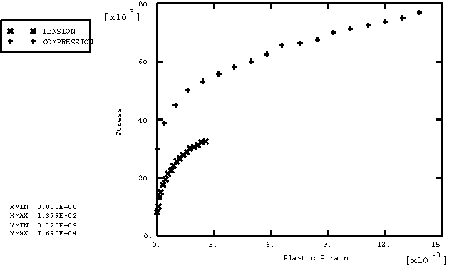

（单位不重要。）

### 结果与讨论

本节中的大多数测试设置为单位尺寸单个单元的均匀变形情况。因此，单元内所有积分点的结果相同。

### 输入文件

##### **Abaqus/Standard输入文件**

[mciooo3jht.inp](../eif/mciooo3jht.inp)

静水拉伸，C3D8单元。

[mciooo3gsh.inp](../eif/mciooo3gsh.inp)

剪切，C3D8单元。

[mciooo3hut.inp](../eif/mciooo3hut.inp)

单轴拉伸，CAX4单元。

[mcioot3euc.inp](../eif/mcioot3euc.inp)

带温度依赖的单轴压缩，C3D8单元。

[mctoot3hut.inp](../eif/mctoot3hut.inp)

单轴拉伸，耦合温度-位移，CAX4T单元。

[mciooo3xmx.inp](../eif/mciooo3xmx.inp)

非均匀变形，CPE4单元。

[mciooo1hut.inp](../eif/mciooo1hut.inp)

单轴拉伸和包含[*LOAD CASE*](../key/key-link.md#usb-kws-hloadcase)的线性扰动步骤，T3D2单元。

##### **Abaqus/Explicit输入文件**

[mciooo3jht_xpl.inp](../eif/mciooo3jht_xpl.inp)

静水拉伸，C3D8单元。

[mciooo3gsh_xpl.inp](../eif/mciooo3gsh_xpl.inp)

剪切，C3D8单元。

[mciooo3hut_xpl.inp](../eif/mciooo3hut_xpl.inp)

单轴拉伸，CAX4R单元。

[mcioot3euc_xpl.inp](../eif/mcioot3euc_xpl.inp)

带温度依赖的单轴压缩，C3D8单元。

[mciooo3xmx_xpl.inp](../eif/mciooo3xmx_xpl.inp)

非均匀变形，CPE4单元。

[mciooo1hut_xpl.inp](../eif/mciooo1hut_xpl.inp)

单轴拉伸，T3D2单元。

##### **从Abaqus/Standard传递结果到Abaqus/Explicit**

[mciooo3gsh_sx_s.inp](../eif/mciooo3gsh_sx_s.inp)

Abaqus/Standard分析，剪切，C3D8单元。

[mciooo3gsh_sx_x.inp](../eif/mciooo3gsh_sx_x.inp)

从mciooo3gsh_sx_s.inp的Abaqus/Explicit导入分析。

[mciooo3gsh_xs_s.inp](../eif/mciooo3gsh_xs_s.inp)

从mciooo3gsh_sx_x.inp的Abaqus/Standard导入分析。

[mciooo3gsh_xx_x2.inp](../eif/mciooo3gsh_xx_x2.inp)

从mciooo3gsh_sx_x.inp的Abaqus/Explicit导入分析。

