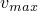
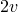
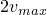
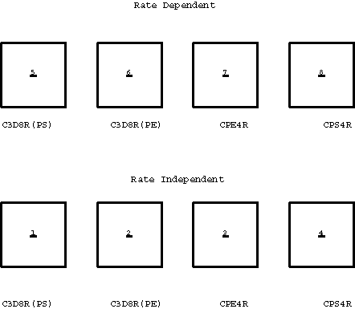
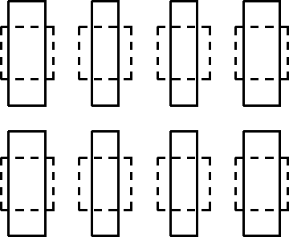
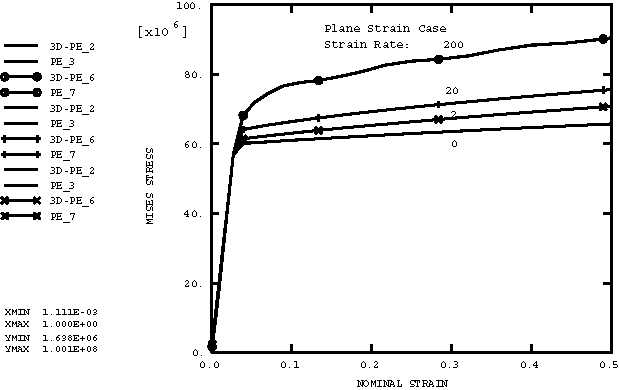

# 2.2.12 Rate-dependent plasticity in Abaqus/Explicit

**Product: **Abaqus/Explicit  

### I. Rate-dependent Mises plasticity

### Elements tested

CPE4R    CPS4R    C3D8R    

### Features tested

Mises plasticity, rate dependence.

### Problem description

This problem is a one-element verification problem for Mises plasticity with rate dependence. Three different element types are tested by stretching the element in the global *y*-direction. [Figure 2.2.12--1](ch02s02abv150.md#exxratedep-origmesh) shows the eight elements used in the analysis. The 8-node brick element (C3D8R) appears twice. The plane stress instance has no boundary conditions applied to the out-of-plane direction, and the element should respond in a state of plane stress, except for some dynamic oscillations. The plane strain instance has zero displacement boundary conditions applied to all out-of-plane displacements, and the element should respond in a state of plane strain.

The bottom and top nodes of each element are given equal and opposite prescribed velocities (*v*, ramping up from 0 to ) in the *y*-direction. The original length of each side of the elements is . The nominal strain rate is, therefore, , with its maximum value being . The plasticity model in elements 1 through 4 in [Figure 2.2.12--1](ch02s02abv150.md#exxratedep-origmesh) has no rate dependence. The plasticity model in elements 5 through 8 is rate dependent.

This analysis is run with maximum strain rates of 2, 20, and 200 sec1.

### Results and discussion

[Figure 2.2.12--2](ch02s02abv150.md#exxratedep-totaldef) shows the deformed mesh at the maximum displacement. This corresponds to a nominal strain of 100%.

[Figure 2.2.12--3](ch02s02abv150.md#exxratedep-planestrain) contains plots of nominal strain versus Mises stress at different strain rates for the plane strain cases. The names of the individual curves that appear in the graph legend are a concatenation of an element model type, an underscore (_), and the element numbers. The results obtained with the 8-node brick element are identical to those obtained for the 4-node quadrilateral at all strain rates. There are 12 curves plotted in the figure. For the three velocity values the two element types (CPE4R and C3D8R) are plotted using the rate-dependent and rate-independent results. The velocities vary by an order of magnitude in each case, and the number of explicit time increments used also varies by an order of magnitude. The rate-independent results are plotted for each velocity case to verify that the rate-independent plasticity integration is not overly sensitive to the strain increment size.

[Figure 2.2.12--4](ch02s02abv150.md#exxratedep-planestress) contains plots of Mises stress versus nominal strain at different strain rates for the plane stress cases. The same 12 curves are plotted as for the plane strain case.

The results presented here are the same as those obtained with Abaqus/Standard.

### Input files

[ratedep020.inp](../eif/ratedep020.inp)

Strain rate of 20.

[ratedep002.inp](../eif/ratedep002.inp)

Strain rate of 2.

[ratedep200.inp](../eif/ratedep200.inp)

Strain rate of 200.

[ratedep_tabular.inp](../eif/ratedep_tabular.inp)

Overstress power law is entered as a piecewise linear function.

[ratedep_tabular_rtol.inp](../eif/ratedep_tabular_rtol.inp)

Demonstrates the use of the RTOL parameter on the [*MATERIAL](../key/key-link.md#usb-kws-mmaterial) option.

### Figures

**Figure 2.2.12–1** Original mesh for one-element rate-dependent plasticity tests.

**Figure 2.2.12–2** Total deformation for one-element rate-dependent plasticity tests.

**Figure 2.2.12–3** Mises stress versus nominal strain for plane strain cases.

**Figure 2.2.12–4** Mises stress versus nominal strain for plane stress cases.

### II. Johnson-Cook rate dependence

### Element tested

C3D8R

### Feature tested

Johnson-Cook rate dependence in combination with Mises plasticity and Drucker-Prager plasticity.

### Problem description

This problem is a one-element verification problem for Mises plasticity and Drucker-Prager plasticity in combination with Johnson-Cook strain-rate dependence. The element is subjected to uniaxial loading conditions. 

### Results and discussion

The results agree well with exact analytical or approximate solutions.

### Input files

[jcrateplasticuni.inp](../eif/jcrateplasticuni.inp)

Johnson-Cook rate dependence and Mises plasticity.

[jcratedpexpuni.inp](../eif/jcratedpexpuni.inp)

Johnson-Cook rate dependence and Drucker-Prager plasticity, exponent form.

[jcratedphypuni.inp](../eif/jcratedphypuni.inp)

Johnson-Cook rate dependence and Drucker-Prager plasticity, hyperbolic form.

[jcratedplinuni.inp](../eif/jcratedplinuni.inp)

Johnson-Cook rate dependence and Drucker-Prager plasticity, linear form.

