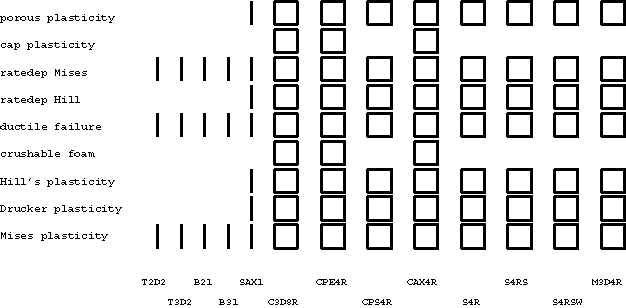
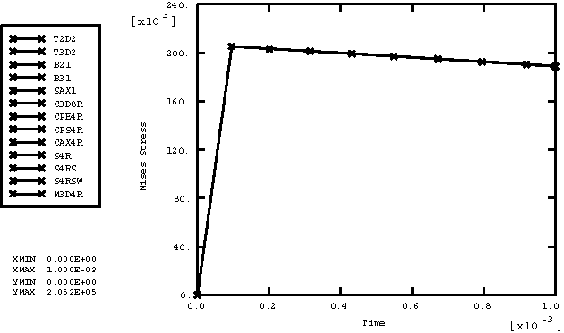
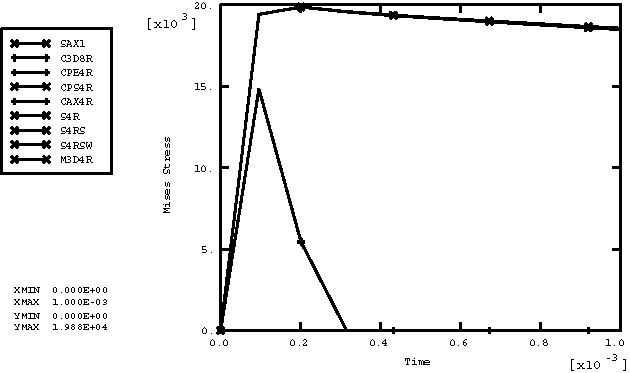
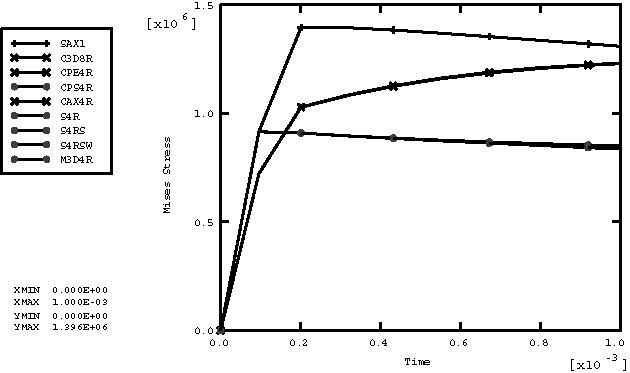
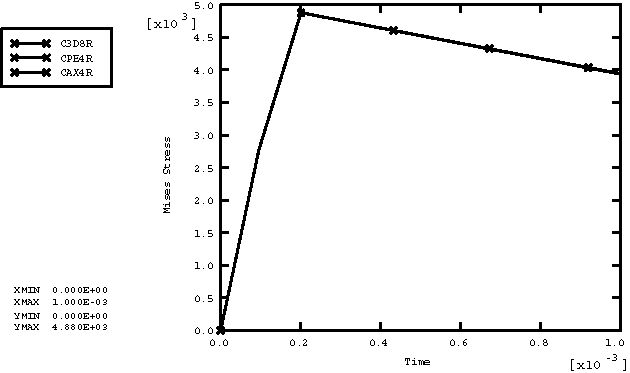
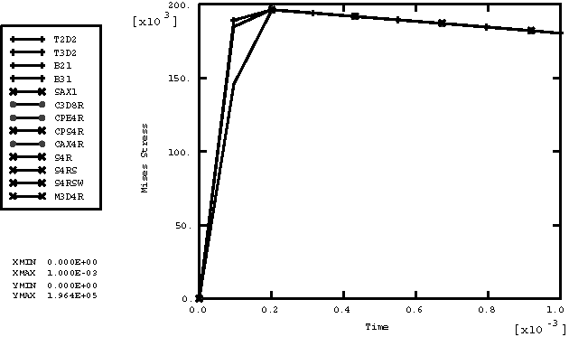
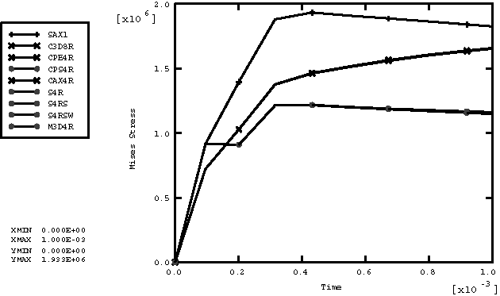
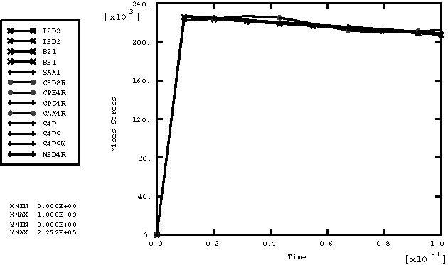
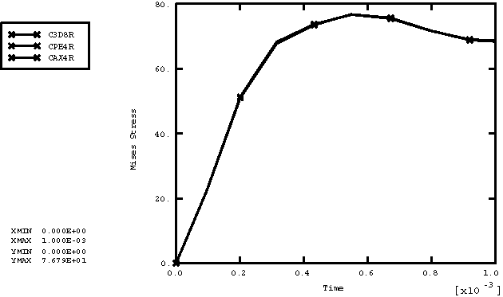
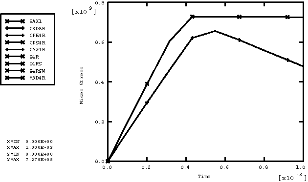

# 2.2.15 Field-variable-dependent inelastic materials

**Product: **Abaqus/Explicit  

### Elements tested

T2D2    T3D2    B21    B31    PIPE21    PIPE31    SAX1    S4R    S4RS    S4RSW    C3D8R    CPE4R    CPS4R    CAX4R    M3D4R    

### Features tested

Field-variable-dependent material properties with predefined temperature fields are tested for the following inelastic material models: Mises plasticity, Drucker plasticity, Hill's potential plasticity, crushable foam plasticity with volumetric hardening, crushable foam plasticity with isotropic hardening, ductile failure plasticity, rate-dependent Hill's potential plasticity, rate-dependent Mises plasticity, Drucker-Prager/Cap plasticity, and porous metal plasticity.

### Problem description

This verification test consists of a set of single element models that include combinations of all of the available element types with all of the available material models. All of the elements are loaded with a tensile load defined by specifying the vertical velocity at the top nodes of each element with the bottom nodes fixed. One field variable, which increases from an initial value of 0 to a final value of 100, is defined at all of the nodes. Material properties are defined as a linear function of the field variable. For every material model only those element types available for the model are used. The undeformed meshes are shown in [Figure 2.2.15--1](ch02s02abv153.md#exxfieldplastic-proptest), and the material properties are listed in [Table 2.2.15--1](ch02s02abv153.md#table-fieldplast-matprops).

### Results and discussion

[Figure 2.2.15--2](ch02s02abv153.md#exxfieldplastic-mises) shows the history plot of Mises stress for the Mises plasticity model for all elements, except for pipe elements, which are consistent with beams. We can see the material softening because the yield stress drops as the field variable increases. [Figure 2.2.15--3](ch02s02abv153.md#exxfieldplastic-drucker) through [Figure 2.2.15--11](ch02s02abv153.md#exxfieldplastic-porousmetal) show the history plots of Mises stress for the other material models.

### Input files

[field_plastic.inp](../eif/field_plastic.inp)

Input data used in this analysis.

[field_plastic_ef1.inp](../eif/field_plastic_ef1.inp)

External file referenced in this input.

### Table

**Table 2.2.15–1** Material properties.
| Material | Properties | fv=0 | fv=100 |
| --- | --- | --- | --- |
| Mises plasticity (density=8032) | E | 193.1 109 | 160.1 109 |
|  |  | 0.3 | 0.3 |
|  |  | 206893 | 186893 |
|  | H | 206893 | 186893 |
| Drucker plasticity (density=1000) | E | 2.1 107 | 1.9 107 |
|  |  | 0.3 | 0.3 |
|  |  | 40000 | 36000 |
|  | H | 40000 | 39000 |
|  |  | 40 | 39 |
|  | K | 1.0 | 0.9 |
|  |  | 20.0 | 19.0 |
| Hill's plasticity (density=2500) | E | 1.0 109 | 8.0 108 |
|  |  | 0.3 | 0.31 |
|  |  | 1.0 106 | 9.0 195 |
|  | H | 4.0 105 | 3.7 105 |
| Crushable foam with volumetric hardening (density=500) | E | 5.0 106 | 3.0 106 |
|  |  | 0.3 | 0.0 |
|  | *k* | 0.9 | 1.3 |
|  |  | 0.1 | 0.1 |
| Crushable foam with isotropic hardening (density=500) | E | 5.0 106 | 3.0 106 |
|  |  | 0.3 | 0.0 |
|  | *k* | 0.9 | 1.3 |
|  |  | 0.0 | 0.0 |
| Ductile failure (density=5800) | E | 2.0 108 | 1.8 108 |
|  |  | 0.3 | 0.3 |
|  |  | 2.0 105 | 1.8 105 |
|  | H | 4.0 105 | 3.8 105 |
| Hill's plasticity (density=5850) | E | 1.8 108 | 2.0 108 |
| (rate dependent) |  | 0.3 | 0.3 |
|  |  | 1.8 105 | 1.7 105 |
|  | H | 8000 | 8000 |
| Mises plasticity (density=1500) | E | 2.0 109 | 1.8 109 |
| (rate dependent) |  | 0.4 | 0.4 |
|  |  | 6.0 107 | 5.5 107 |
|  | H | 2.0 107 | 3.5 107 |
| Drucker-Prager/Cap plasticity | E | 30000 | 29000 |
| (density=2.4 103) |  | 0.3 | 0.29 |
|  | d | 100 | 99 |
|  |  | 37.67 | 36.67 |
|  | R | 0.1 | 0.11 |
|  |  | 0.0 | 0.0 |
|  |  | 0.01 | 0.011 |
| Porous metal plasticity | E | 2.0 1011 | 1.8 1011 |
| (density=7.7 107) |  | 0.33 | 0.33 |
|  |  | 7.5 108 | 7.5 108 |
|  | H | 0.0 | 0.0 |

### Figures

**Figure 2.2.15–1** Field-variable-dependent material property test for inelastic materials.

**Figure 2.2.15–2** Mises stress versus time for Mises plasticity.

**Figure 2.2.15–3** Mises stress versus time for Drucker plasticity.

**Figure 2.2.15–4** Mises stress versus time for Hill's plasticity.

**Figure 2.2.15–5** Mises stress versus time for crushable foam plasticity with volumetric hardening.

**Figure 2.2.15–6** Mises stress versus time for crushable foam plasticity with isotropic hardening.

**Figure 2.2.15–7** Mises stress versus time for ductile failure plasticity.

**Figure 2.2.15–8** Mises stress versus time for rate-dependent Hill's plasticity.

**Figure 2.2.15–9** Mises stress versus time for rate-dependent Mises plasticity.

**Figure 2.2.15–10** Mises stress versus time for Drucker-Prager/Cap plasticity.

**Figure 2.2.15–11** Mises stress versus time for porous metal plasticity.

