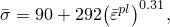
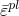
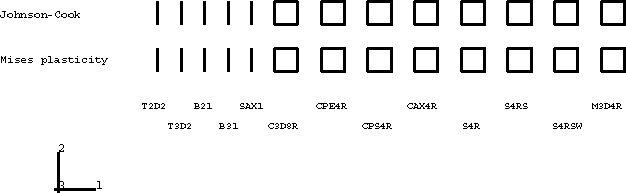
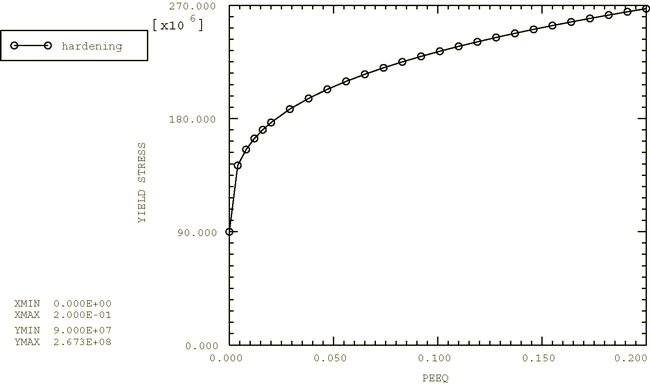
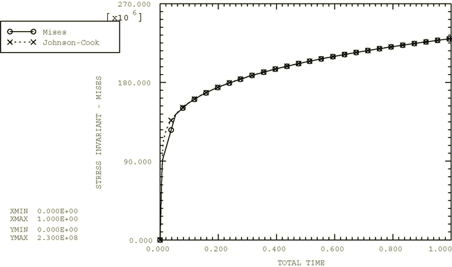
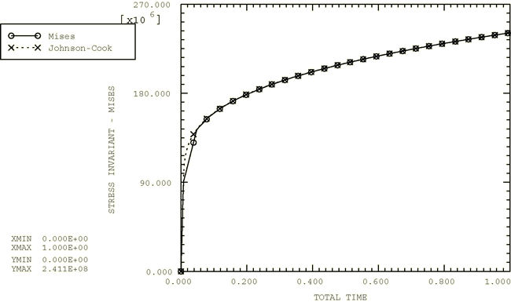
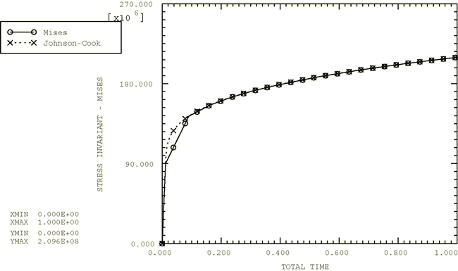

# 2.2.16 Johnson-Cook plasticity

**Products: **Abaqus/Standard  Abaqus/Explicit  

### Elements tested

T2D2    T3D2    B21    B31    SAX1    C3D8R    CPE4R    CPS4R    CAX4R    S4R    S4RS    S4RSW    M3D4R    

### Feature tested

Johnson-Cook plasticity model.

### Problem description

This verification problem tests single-element models that are run under simple loading conditions (uniaxial tension, uniaxial compression, and simple shear). The purpose of this example is to test the Johnson-Cook plasticity model by comparing it to the Mises plasticity model with equivalent plastic hardening. [Figure 2.2.16--1](ch02s02abv154.md#exxjcook-testcases) shows the 26 elements used in the analysis in their original shapes. The elements in the top row are modeled using the Johnson-Cook material model; the elements in the bottom row are modeled using the Mises plasticity model with an equivalent hardening curve. The elastic material properties are Young's modulus = 124 GPa and Poisson's ratio = 0.34. The plastic hardening is chosen to be 

where  is the yield stress (unit in MPa) and  is the equivalent plastic strain. The material properties are those of OFHC copper as reported by [Johnson and Cook (1985)](ch02s02abv154.md#ver-ref-johnson-cook). A plot of  versus  is shown in [Figure 2.2.16--2](ch02s02abv154.md#exxjcook-hardencurve).

### Results and discussion

The results obtained by using the Johnson-Cook material model match the corresponding results obtained by using the Mises plasticity model with an equivalent hardening curve. [Figure 2.2.16--3](ch02s02abv154.md#exxjcook-tension) shows the comparison of the Mises stress obtained with the Johnson-Cook and the Mises plasticity models using the C3D8R element under uniaxial tension; [Figure 2.2.16--4](ch02s02abv154.md#exxjcook-compress) shows the comparison of the Mises stress obtained with the Johnson-Cook and the Mises plasticity models using the CPE4R element under uniaxial compression; [Figure 2.2.16--5](ch02s02abv154.md#exxjcook-shear) shows the comparison of the Mises stress obtained with the Johnson-Cook and the Mises plasticity models using the CPE4R element under simple shear.

### Input files

##### **Abaqus/Standard input files**

[johnsoncook_s.inp](../eif/johnsoncook_s.inp)

Uniaxial tension test.

[johnsoncookinit_pre_s.inp](../eif/johnsoncookinit_pre_s.inp)

Uniaxial compression test, nonzero initial conditions for .

##### **Abaqus/Explicit input files**

[johnsoncook.inp](../eif/johnsoncook.inp)

Uniaxial tension test.

[johnsoncook_pre.inp](../eif/johnsoncook_pre.inp)

Uniaxial compression test.

[johnsoncook_shr.inp](../eif/johnsoncook_shr.inp)

Simple shear test.

[johnsoncookinit.inp](../eif/johnsoncookinit.inp)

Uniaxial tension test, nonzero initial conditions for .

[johnsoncookinit_pre.inp](../eif/johnsoncookinit_pre.inp)

Uniaxial compression test, nonzero initial conditions for .

[johnsoncookinit_shr.inp](../eif/johnsoncookinit_shr.inp)

Simple shear test, nonzero initial conditions for .

### Reference

Johnson, G. R., and W. H. Cook, “Fracture Characteristics of Three Metals Subjected to Various Strains, Strain rates, Temperatures and Pressures,” Engineering Fracture Mechanics, vol. 21, no. 1, pp. 31–48, 1985.

### Figures

**Figure 2.2.16–1** Johnson-Cook plasticity test cases.

**Figure 2.2.16–2** Hardening curve: yield stress versus equivalent plastic strain.

**Figure 2.2.16–3** Uniaxial tension comparison (C3D8R element).

**Figure 2.2.16–4** Uniaxial compression comparison (CPE4R element).

**Figure 2.2.16–5** Simple shear comparison (CPE4R element).

