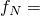
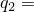
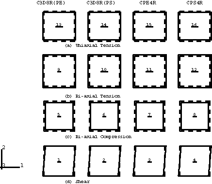
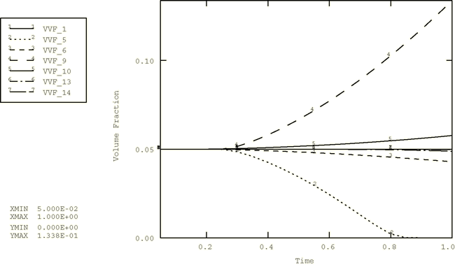
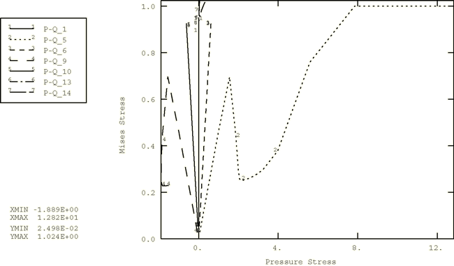
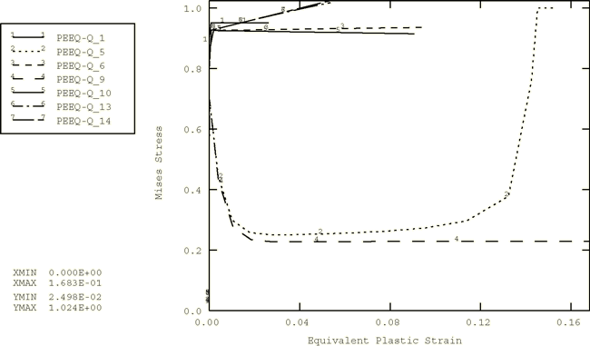
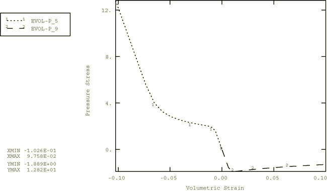

# 2.2.17 多孔金属塑性

**产品：**Abaqus/Explicit  

### 测试单元

C3D8R    CPE4R    CPS4R    

### 测试特性

多孔塑性模型。

### 问题描述

此问题包含16个单元素验证问题，全部在一个输入文件中运行。本例的目的是测试多孔塑性模型。测试了三种不同的单元类型（C3D8R、CPE4R、CPS4R）。图2.2.17-1显示了分析中使用的16个单元的原始和变形形状。虚线表示原始网格。8节点砖单元（C3D8R）在每行中出现两次：一种情况是施加边界条件以约束面外位移，使C3D8R单元模拟平面应变条件；另一种情况是不指定面外位移边界条件，使C3D8R单元模拟平面应力条件。每个边的原始长度为1。

本例问题旨在测试以下特性：
- 平面应变、平面应力和三维情况
- 拉伸、压缩和简单剪切变形
- 孔洞形核和孔洞生长

如下所述实现这些测试。

行(a)中单元的载荷表示*x*方向的单轴拉伸载荷。

在图2.2.17-1的行(b)和(c)中，每个单元的左右、上下节点在*x*和*y*方向上给予相等且相反的指定恒定速度，以产生平面应变和平面应力情况的双轴压缩和拉伸载荷。

在图2.2.17-1的行(d)中，每个单元的底部和顶部节点在*x*方向上给予相等且相反的指定恒定速度，以产生简单剪切载荷。

图2.2.17-1的行(b)、(c)和(d)中的单元被分配了无孔洞形核的材料定义，系数  = 1.0。基体材料的行为假定为完全塑性，屈服应力  = 1.0。图2.2.17-1的行(a)中的单元被分配了带孔洞形核（ = 0.3， = 0.1， = 0.04）和系数  = 1.5， = 1.0， = 2.25的材料定义。此基体材料的行为包括硬化。弹性特性为  = 300， = 0.3，两种材料定义都使用密度0.001。假定所有情况的初始相对密度为0.95。

### 结果与讨论

所有测试中平面应变和平面应力单元获得的结果与施加平面应变和平面应力边界条件的三维单元获得的相应结果相同。图中出现的曲线名称是输出变量名称、下划线（_）和数字的串联。数字指的是单元编号。例如，PEEQ-Q_1指的是单元1的Mises应力与等效塑性应变曲线。

图2.2.17-2显示了孔洞体积分数随时间的变化。该图表明孔洞体积分数在纯剪切过程中保持恒定（线1）。在压缩测试中，孔洞体积分数随压力增加而减小（线2和3）。一旦孔洞完全闭合，材料几乎变得不可压缩。在多轴和单轴拉伸测试中，孔洞生长（线4至7），对于指定孔洞形核的材料，新孔洞可能形核（线6和7）。

图2.2.17-3和图2.2.17-4显示了Mises应力与压力应力的变化以及Mises应力与等效塑性应变的变化。通过这些图描述了材料点应力路径的演变。孔洞闭合和孔洞生长对压力应力的影响如图2.2.17-5所示。该图包含来自平面应变双轴压缩（线1）和拉伸（线2）测试的结果。在压缩测试中，响应是弹性的，然后是塑性硬化直到孔洞闭合，最后是不可压缩行为。在拉伸中，弹性行为之后是孔洞生长引起的软化。

Abaqus/Explicit获得的结果与Abaqus/Standard中获得的结果相同。

### 输入文件

[gurson.inp](../eif/gurson.inp)

此分析中使用的输入数据。

[gurson_mod.inp](../eif/gurson_mod.inp)

除初始相对密度使用[*INITIAL CONDITIONS*](../key/key-link.md#usb-kws-minitialcond)，TYPE=RELATIVE DENSITY指定外，与gurson.inp相同。

### 图表

**图2.2.17-1** 单单元多孔塑性测试的变形形状。

**图2.2.17-2** 孔洞体积分数与时间的关系。

**图2.2.17-3** *p*–*q*空间中应力状态的演变。

**图2.2.17-4** Mises应力与等效塑性应变的关系。

**图2.2.17-5** 压力应力与体积应变的关系。

