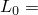
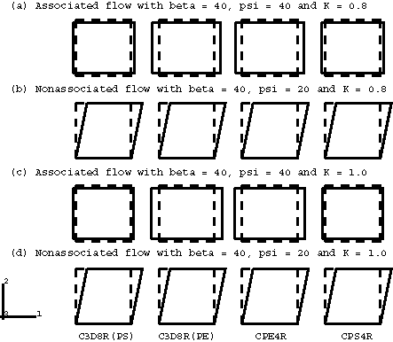
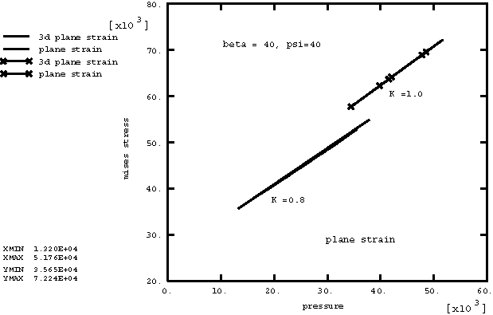
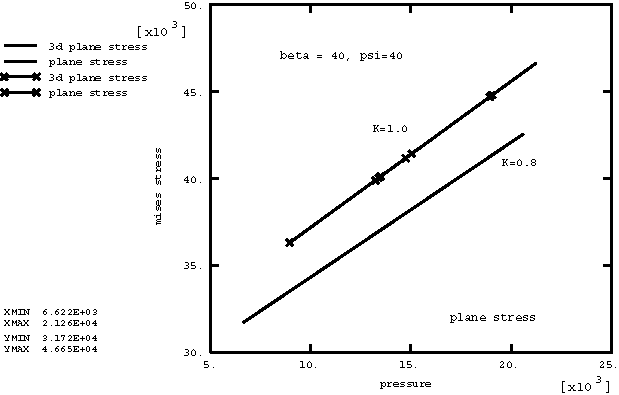
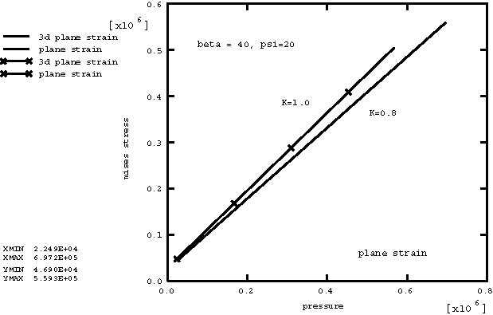
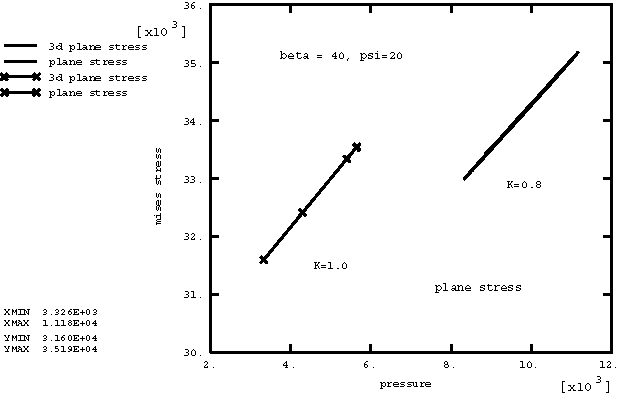
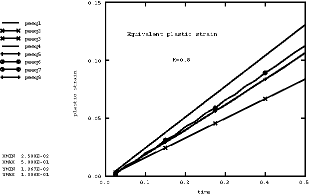
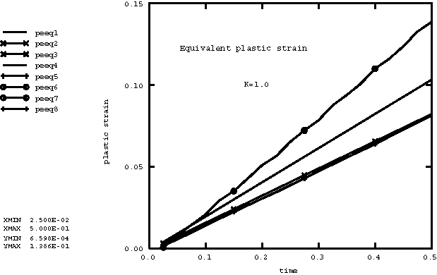

# 2.2.18 Drucker-Prager塑性

**产品：**Abaqus/Explicit  

### 测试单元

C3D8R    CPE4R    CPS4R    

### 测试特性

带第三应力不变量的扩展Drucker-Prager塑性。

### 问题描述

此问题包含16个单元素验证问题，全部在一个输入文件中运行。该问题使用关联和非关联流动法则来练习扩展Drucker-Prager塑性材料模型。测试了三种不同的单元类型（C3D8R、CPE4R、CPS4R）。图2.2.18-1显示了分析中使用的16个单元的原始和变形形状。虚线表示原始网格。8节点砖单元（C3D8R）在每行中出现两次：一种情况是施加边界条件以约束面外位移，使C3D8R单元产生平面应变结果；另一种情况是不指定面外位移边界条件，使C3D8R单元产生平面应力结果。每个边的原始长度为  = 1。

本例问题旨在测试以下特性：
- 平面应变、平面应力和三维情况
- 压缩和简单剪切变形
- 关联和非关联流动
- 第三不变量依赖（*K*的值）

如下所述实现这些测试。

在图2.2.18-1的行(a)和(c)中，每个单元的底部和顶部节点在*y*方向上给予相等且相反的指定恒定速度，以产生压缩载荷。对于图2.2.18-1的行(b)和(d)，每个单元的顶部节点在*x*方向上给予指定速度，而底部节点固定，从而导致简单剪切模式。

图2.2.18-1的行(a)和(c)中的单元被分配了带关联流动法则的材料定义：摩擦角（和(d)中的单元被分配了带非关联流动法则的材料定义：摩擦角（ = 0.8的值。在图2.2.18-1的行(c)和(d)中，分配给单元的  = 1.0的值。

塑性应力-应变关系使用带硬化的扩展Drucker-Prager塑性模型定义。假定完全塑性，单轴压缩中的屈服应力  = 40×10^3。弹性特性为  = 20×10^6， = 0.3。材料密度为1000。

### 结果与讨论

图2.2.18-2显示了平面应变情况（C3D8和CPE4R单元）下Mises应力与压力的关系图，使用关联流动法则。这展示了材料的压力依赖特性。在  = 1.0的情况下，曲线的斜率对应于40的正切。

图2.2.18-3显示了平面应力情况（C3D8和CPS4R单元）下Mises应力与压力的关系图，使用关联流动法则。

图2.2.18-4显示了平面应变情况（C3D8和CPE4R单元）下Mises应力与压力的关系图，使用非关联流动法则。在  = 1.0的情况下，曲线的斜率对应于40的正切。

图2.2.18-5显示了平面应力情况（C3D8和CPS4R单元）下Mises应力与压力的关系图，使用非关联流动法则。

当*K*小于1.0时，Mises应力与压力曲线的斜率将小于或等于摩擦角。这取决于非圆形偏应力空间中的塑性应变路径。

图2.2.18-6包含了具有  = 0.8值的八个单元的等效塑性应变时间历史响应的八条曲线。图2.2.18-7包含了具有  = 1.0值的八个单元的等效塑性应变的八条历史曲线。在图2.2.18-6和图2.2.18-7中只可见四条曲线，因为C3D8R单元的三维结果复制了平面应变和平面应力结果。如上所述，边界条件被施加到C3D8R单元以实现这种对应。这作为检查二维和三维材料模型都获得相同结果的一种方式。

Abaqus/Explicit获得的结果与Abaqus/Standard中获得的结果相同。

### 输入文件

[drucker.inp](../eif/drucker.inp)

此分析中使用的输入数据。

### 图表

**图2.2.18-1** 单单元Drucker-Prager塑性测试的变形形状。

**图2.2.18-2** 子午面上的屈服面：关联流动，平面应变情况。

**图2.2.18-3** 子午面上的屈服面：关联流动，平面应力情况。

**图2.2.18-4** 子午面上的屈服面：非关联流动，平面应变情况。

**图2.2.18-5** 子午面上的屈服面：非关联流动，平面应力情况。

**图2.2.18-6** 等效塑性应变， = 0.8。

**图2.2.18-7** 等效塑性应变， = 1.0。

