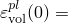
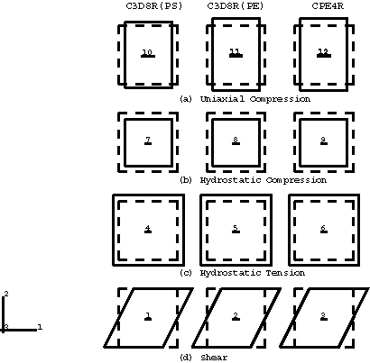
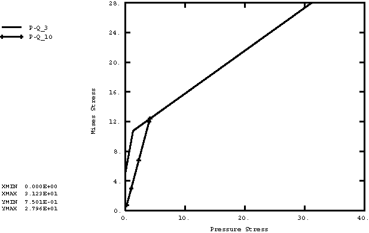
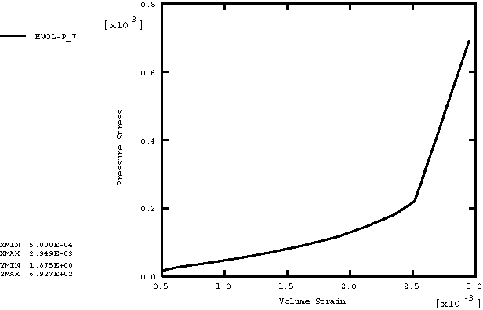
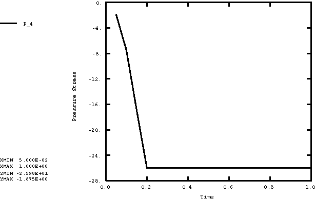
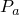
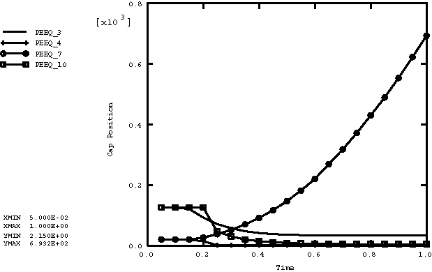

# 2.2.19 Drucker-Prager/盖塑性模型

**产品：**Abaqus/Explicit  

### 测试单元

C3D8R    CPE4R    

### 测试特性

Drucker-Prager/盖塑性模型。

### 问题描述

此问题包含12个单元素验证问题，全部在一个输入文件中运行。该问题练习Drucker-Prager/盖塑性材料模型。测试了两种不同的单元类型（C3D8R、CPE4R）。图2.2.19-1显示了分析中使用的12个单元的原始和变形形状。虚线表示原始网格。8节点砖单元（C3D8R）在每行中出现两次：在第二列中施加边界条件以约束面外位移，使C3D8R单元产生平面应变结果。第一列中的单元1和单元10不使用面外边界条件。对于第一列中的单元4和单元7，面外边界条件分别对应于静水拉伸和压缩。每个边的原始长度为  = 1。

本例问题旨在测试以下特性：
- 平面应变和三维情况
- 拉伸、压缩和简单剪切变形

如下所述实现这些测试。

行(a)中的载荷表示*x*方向的单轴压缩载荷。

在图2.2.19-1的行(b)和(c)中，每个单元的左右、上下节点在*x*和*y*方向上给予相等且相反的指定恒定速度，分别产生静水压缩和拉伸载荷。

在图2.2.19-1的行(d)中，每个单元的底部和顶部节点在*x*方向上给予相等且相反的指定恒定速度，以产生简单剪切载荷。

材料的弹性响应假定为线性各向同性，杨氏模量30×10^3，泊松比0.3，密度0.001。假定摩擦角为  = 30.0，盖偏心率参数选择为  = 0.1。使用过渡面参数  = 0.01。

盖的初始位置对于行(b)和(c)取为  = 0.0005，对于行(a)和(d)取为  = 0.002。两种情况使用的内聚力值分别为  = 15.0和  = 10.0。

### 结果与讨论

所有测试中平面应变单元获得的结果与施加平面应变边界条件的三维单元获得的相应结果相同。图中出现的曲线名称是输出变量名称、下划线（_）和数字的串联。数字指的是单元编号。例如，P-Q_3指的是单元3的Mises应力与等效压力应力曲线。

图2.2.19-2至图2.2.19-5显示了Drucker-Prager/盖模型的响应。这些图展示了盖面的两个主要目的。首先，它在静水压缩中限制屈服面，从而提供一种非弹性硬化机制来表示塑性压实。此行为在单元7的图2.2.19-3和图2.2.19-5中展示。这些图显示压力应力随体积应变增加，根据盖硬化曲线。一旦压力超过硬化曲线上指定的最大压力，响应就是不可压缩的。其次，盖面通过提供软化来帮助控制体积膨胀，作为材料在Drucker-Prager剪切破坏和过渡屈服面上屈服的产生的非弹性体积增加的函数。此行为在单元3的图2.2.19-2和图2.2.19-5中展示。这些图显示在弹性行为期间，Mises应力*q*在零压力应力*p*下增加，直到首次屈服。一旦达到屈服面，发生非弹性剪切变形，伴随膨胀。由于单元被约束（垂直变形被约束，假定面外方向为平面应变条件），膨胀导致压力应力增加。继续剪切导致应力点（ = 26.0时失去强度（图2.2.19-4）。在单轴压缩（单元10）中，应力状态（。由于材料是无约束的，非弹性体积膨胀不会导致压力应力的增加（图2.2.19-2），但它导致盖面朝原点移动（图2.2.19-5）。

此问题测试Drucker-Prager/盖塑性模型，但不提供它的独立验证。

### 输入文件

[captests.inp](../eif/captests.inp)

此分析中使用的输入数据。

### 图表

**图2.2.19-1** 单单元盖塑性测试的变形形状。

**图2.2.19-2** *p*-*q*空间中应力状态的演变。

**图2.2.19-3** 压力应力与体积应变的关系。

**图2.2.19-4** 压力应力与时间的关系。

**图2.2.19-5** 盖位置，，与时间的关系。

