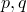
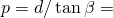
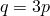

# 2.2.19 Drucker-Prager/Cap plasticity model

**Product: **Abaqus/Explicit  

### Elements tested

C3D8R    CPE4R    

### Feature tested

Drucker-Prager/Cap plasticity model.

### Problem description

This problem contains 12 one-element verification problems that are all run in one input file. The problem exercises the Drucker-Prager/Cap plasticity material model. Two different element types are tested (C3D8R, CPE4R). [Figure 2.2.19--1](ch02s02abv157.md#exxcaptests-deform) shows the 12 elements used in the analysis in their original and deformed shapes. The dashed lines represent the original mesh. The 8-node brick element (C3D8R) appears twice in each row: in the second column boundary conditions are applied to constrain the out-of-plane displacement so that the C3D8R element generates plane strain results. No out-of-plane boundary conditions are used for element 1 and element 10 in the first column. For elements 4 and 7 in column one the out-of-plane boundary conditions correspond to hydrostatic tension and compression, respectively. The original length of each side of the elements is  1.

This example problem is designed to test the following features:
- plane strain and three-dimensional cases
- tension, compression, and simple shear deformations

This is accomplished as described below.

The loading in row (a) represents uniaxial compressive loading in the *x*-direction.

In rows (b) and (c) in [Figure 2.2.19--1](ch02s02abv157.md#exxcaptests-deform), the left and right, top and bottom nodes of each element are given equal and opposite prescribed constant velocities in the *x*- and *y*-directions to generate hydrostatic compressive and tensile loading, respectively.

In row (d) in [Figure 2.2.19--1](ch02s02abv157.md#exxcaptests-deform), the bottom and top nodes of each element are given equal and opposite prescribed constant velocities in the *x*-direction to generate a simple shear loading.

The material's elastic response is assumed to be linear and isotropic, with Young's modulus 30  103, Poisson's ratio 0.3, and a density of 0.001. A friction angle of  30.0 is assumed, and the cap eccentricity parameter is chosen as  0.1. The transition surface parameter  0.01 is used.

The initial cap position is taken as  0.0005 for rows (b) and (c), and as  0.002 for rows (a) and (d). The values of cohesion used for the two cases are  15.0 and  10.0, respectively.

### Results and discussion

The results obtained from the plane strain elements in all the tests are identical to the corresponding results obtained from the three-dimensional elements where plane strain boundary conditions are applied. The names of the individual curves that appear in the graph legend are a concatenation of the output variable names, an underscore (_), and a number. The number refers to the element number. For example, P-Q_3 refers to the Mises stress versus equivalent pressure stress curve for element 3.

[Figure 2.2.19--2](ch02s02abv157.md#exxcaptests-stress-evolve) through [Figure 2.2.19--5](ch02s02abv157.md#exxcaptests-position-v-time) show the response of the Drucker-Prager/Cap model. The figures show the two main purposes of the cap surface. Firstly, it bounds the yield surface in hydrostatic compression, thus providing an inelastic hardening mechanism to represent plastic compaction. This behavior is shown in [Figure 2.2.19--3](ch02s02abv157.md#exxcaptests-stress-v-strain) and [Figure 2.2.19--5](ch02s02abv157.md#exxcaptests-position-v-time) for element 7. The figures show that the pressure stress increases with volume strain according to the cap hardening curve. Once the pressure exceeds the maximum pressure specified on the hardening curve, the response is incompressible. Secondly, the cap surface helps control volume dilatancy by providing softening as a function of the inelastic volume increase created as the material yields on the Drucker-Prager shear failure and transition yield surfaces. This behavior is shown in [Figure 2.2.19--2](ch02s02abv157.md#exxcaptests-stress-evolve) and [Figure 2.2.19--5](ch02s02abv157.md#exxcaptests-position-v-time) for element 3. The figures show that during elastic behavior the Mises stress, *q*, increases at zero pressure stress, *p*, until first yield. Once the yield surface is reached, inelastic shear deformation occurs, which is accompanied by dilatancy. Since the element is confined (vertical deformation is constrained and plane strain conditions are assumed in the out-of-plane direction), the dilatancy gives rise to an increase in pressure stress. Continuing shearing causes the stress point () to remain on the yield surface, but to move away from the origin ([Figure 2.2.19--2](ch02s02abv157.md#exxcaptests-stress-evolve)). This dilatant behavior also causes the cap surface to move towards the origin ([Figure 2.2.19--5](ch02s02abv157.md#exxcaptests-position-v-time)). Once the stress point meets the cap or transition yield surface, inelastic volume dilatancy ceases and further shearing causes no further increases in Mises or pressure stress. In hydrostatic tension (element 4) the material loses strength at a pressure stress of  26.0 ([Figure 2.2.19--4](ch02s02abv157.md#exxcaptests-stress-v-time)). In uniaxial compression (element 10) the stress state, (), satisfies the relation . Since the material is unconstrained, inelastic volume dilatancy does not give rise to an increase in pressure stress ([Figure 2.2.19--2](ch02s02abv157.md#exxcaptests-stress-evolve)), but it causes the cap surface to move towards the origin ([Figure 2.2.19--5](ch02s02abv157.md#exxcaptests-position-v-time)).

This problem tests the Drucker-Prager/Cap plasticity model, but does not provide independent verification of it.

### Input file

[captests.inp](../eif/captests.inp)

Input data used in this analysis.

### Figures

**Figure 2.2.19–1** Deformed shape for one element Cap plasticity tests.

**Figure 2.2.19–2** Evolution of stress state in *p*-*q* space.

**Figure 2.2.19–3** Pressure stress versus volume strain.

**Figure 2.2.19–4** Pressure stress versus time.

**Figure 2.2.19–5** Cap position, , versus time.

