# 2.2.20 状态方程材料

**产品：** Abaqus/Explicit

### I. 线性 Us-Up Hugoniot状态方程

### 测试单元

C3D8R    CPE4R

### 测试特性

线性  状态方程（EOS）材料模型与塑性。

### 问题描述

此验证问题包含单元素模型列表，使用C3D8R或CPE4R单元，在简单加载条件下运行（单轴拉伸、单轴压缩和简单剪切）。本例的目的是测试状态方程材料模型及其与Mises和Johnson-Cook塑性模型的组合。研究了两组平行模型。第一组使用线性弹性、线性弹性与Mises塑性、以及线性弹性与Johnson-Cook塑性材料。第二组使用线性  型EOS、线性  型EOS与Mises塑性、以及线性  型EOS与Johnson-Cook塑性材料。

对于线性弹性，体积响应定义为

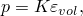

其中 *K* 是材料的体积模量。线性  Hugoniot形式为

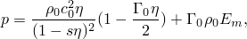

其中  与标称体积应变度量 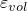 相同。因此，将参数  和 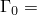 设置为0.0可获得简单的静水体响应，这与弹性体积响应相同。材料的弹性偏响应由剪切模量定义。

弹性材料特性为杨氏模量 = 207 GPa，泊松比 = 0.29。初始材料密度  为7890 kg/m3。线性  型状态方程材料模型的等效特性为  = 4563.115 m/s，剪切模量 = 80.233 GPa。对于使用塑性（包括Mises和Johnson-Cook塑性模型）的模型，塑性硬化选择为

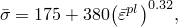

其中  是屈服应力（单位为MPa）， 是等效塑性应变。

### 结果与讨论

使用EOS材料模型的分析获得的结果与使用线性弹性模型的分析获得的结果一致。使用C3D8R单元在单轴拉伸载荷下，EOS材料模型（带Johnson-Cook塑性剪切响应）与线性弹性模型（带相同的Johnson-Cook塑性剪切响应）获得的压力和Mises应力比较分别如图2.2.20-1和图2.2.20-2所示。单轴压缩比较如图2.2.20-3和图2.2.20-4所示。

### 输入文件

[eosshrela.inp](../eif/eosshrela.inp)

单轴拉伸测试。

[eosshrela_pre.inp](../eif/eosshrela_pre.inp)

单轴压缩测试。

[eosshrela_shr.inp](../eif/eosshrela_shr.inp)

简单剪切测试。

[eosshrelainit_shr.inp](../eif/eosshrelainit_shr.inp)

 非零初始条件的简单剪切测试。

### 图表

**图2.2.20-1** 单轴拉伸中的压力应力：弹性响应与线性  型状态方程响应。

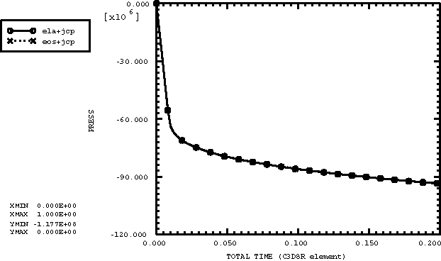

**图2.2.20-2** 单轴拉伸中的Mises应力：弹性响应与线性  型状态方程响应。

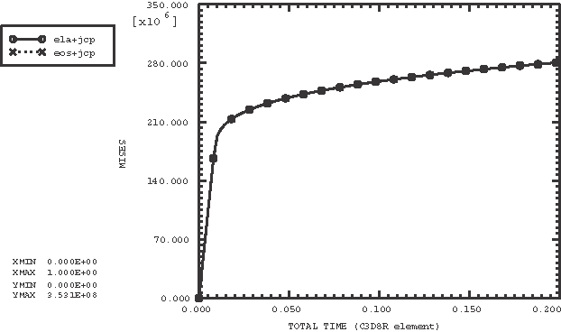

**图2.2.20-3** 单轴压缩中的压力应力：弹性响应与线性  型状态方程响应。

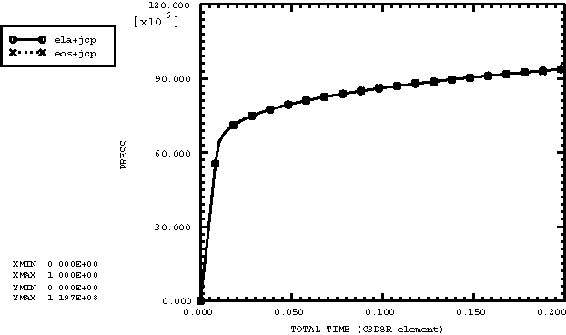

**图2.2.20-4** 单轴压缩中的Mises应力：弹性响应与线性  型状态方程响应。

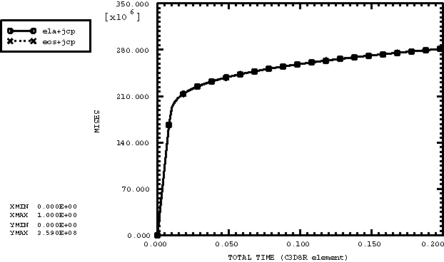

### II. 表状态方程

### 测试单元

C3D8R    CPE4R

### 测试特性

带塑性的表状态方程（EOS）材料模型。

### 问题描述

此验证问题包含使用C3D8R或CPE4R单元的单元素模型，在简单加载条件下运行（单轴拉伸、单轴压缩和简单剪切）。本例的目的是测试表EOS材料模型及其与Mises和Johnson-Cook塑性模型的组合。研究了两组平行模型。第一组使用线性弹性、线性弹性与Mises塑性、以及线性弹性与Johnson-Cook塑性材料。第二组使用表EOS、表EOS与Mises塑性、以及表EOS与Johnson-Cook塑性材料。

对于线性弹性，体积响应定义为

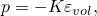

其中 *K* 是材料的体积模量。表EOS在能量上是线性的，假设形式为

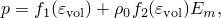

其中 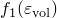 和  只是对数体积应变  的函数，且 ， 是参考密度。因此，将函数 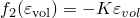 和 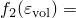 设置为0.0可获得简单的静水体响应，这与弹性体积响应相同。材料的弹性偏响应由剪切模量定义。

弹性材料特性为杨氏模量 = 207 GPa，泊松比 = 0.29。初始材料密度  为7890 kg/m3。表EOS材料模型的特性使用  = 164.286 GPa，剪切模量 = 80.233 GPa计算。对于使用塑性（包括Mises和Johnson-Cook塑性模型）的模型，塑性硬化选择为

其中  是屈服应力（单位为MPa）， 是等效塑性应变。

### 结果与讨论

使用EOS材料模型的分析获得的结果与使用线性弹性模型的分析获得的结果一致。

### 输入文件

[eostabshrela.inp](../eif/eostabshrela.inp)

单轴拉伸测试。

[eostabshrela_pre.inp](../eif/eostabshrela_pre.inp)

单轴压缩测试。

[eostabshrela_shr.inp](../eif/eostabshrela_shr.inp)

简单剪切测试。

[eostabshrelainit_shr.inp](../eif/eostabshrelainit_shr.inp)

 非零初始条件的简单剪切测试。

### III. P-α状态方程

### 测试单元

C3D8R    CPE4R

### 测试特性

 状态方程（EOS）材料模型。

### 问题描述

此验证问题包含使用C3D8R或CPE4R单元的单元素模型，在简单加载条件下运行（单轴、静水和简单剪切）。本例的目的是测试  状态方程材料模型及其与不同偏行为模型的组合：线性弹性、牛顿粘性剪切、以及Mises和Johnson-Cook塑性；以及其与固相水动力学响应的不同模型的组合：Mie-Gruneisen和表状态方程。

测试使用的材料特性代表部分饱和砂土。总结如下：

**材料：**

**固相**

固相由Mie-Gruneisen状态方程描述：

|  | 2070 kg/m3 |
| --- | --- |
|  | 1480 m/sec |
| *s* | 1.93 |
|  | 0.880 |

对于使用表状态方程的模型，函数  和  的定义使其提供与上述Mie-Gruneisen状态方程相似的水动力学行为。

**压实特性**

|  | 600 m/sec |
| --- | --- |
| 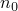 () | 0.049758 (1.052364) |
|  | 0.0 MPa |
|  | 6.5 MPa |

**粘性剪切行为**

|  | 5.0E+4 |
| --- | --- |

**弹性剪切行为**

| *E* | 124 MPa |
| --- | --- |
|  | 0.3 |

**塑性**

对于带塑性剪切行为的模型（Mises或Johnson-Cook塑性），塑性硬化选择为

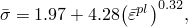

其中  是屈服应力（单位为MPa）， 是等效塑性应变。塑性模型与线性弹性剪切行为结合使用。

### 结果与讨论

分析获得的结果与精确解析解或近似解非常一致。在循环体积测试中，膨胀度  随静水压力的演变如图2.2.20-5所示。

### 输入文件

[eospalpha_uni.inp](../eif/eospalpha_uni.inp)

单轴测试。

[eospalpha_vol.inp](../eif/eospalpha_vol.inp)

循环静水测试。

[eospalpha_shr.inp](../eif/eospalpha_shr.inp)

简单剪切测试。

[eospalphainit_shr.inp](../eif/eospalphainit_shr.inp)

 非零初始条件的简单剪切测试。

### 图表

**图2.2.20-5** 循环体积测试期间的  弹性和塑性曲线。

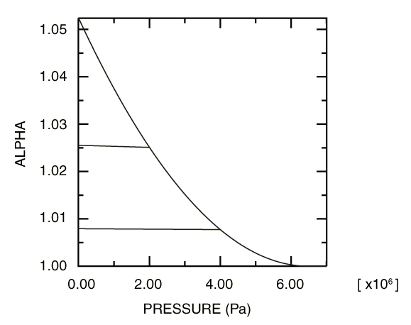

### IV. 粘性剪切行为

### 测试单元

C3D8R    CPE4R

### 测试特性

带粘性剪切行为的状态方程材料的粘性模型。

### 问题描述

此验证问题包含使用C3D8R或CPE4R单元的单元素模型，在简单剪切加载条件下运行。本例的目的是测试牛顿和非牛顿流体的不同粘性模型。在所有情况下，材料的水动力学响应由Mie-Gruneisen状态方程描述。有些测试包括使用Arrhenius形式的热流变简单温度依赖粘性。

测试使用的材料特性总结如下：

**材料：**

**水动力学特性**

水动力学响应由Mie-Gruneisen状态方程描述：

|  | 2070 kg/m3 |
| --- | --- |
|  | 1480 m/sec |
| *s* | 1.93 |
|  | 0.880 |

**粘性特性**

每种测试粘性模型的特性如下：

**Mat1：**

牛顿粘度：

|  | 1 MPa sec |
| --- | --- |

**Mat2：**

幂律粘度：

| 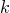 | 2.173 MPa (sec)n |
| --- | --- |
|  | 0.392 |
|  | 1 MPa sec |
|  | 0.1 MPa sec |

**Mat3：**

Carreau-Yasuda粘度：

|  | 1 MPa sec |
| --- | --- |
|  | 0.1 MPa sec |
|  | 0.11 sec |
|  | 0.392 |
|  | 0.644 |

**Mat4：**

Cross粘度：

|  | 1 MPa sec |
| --- | --- |
|  | 0.1 MPa sec |
|  | 0.11 sec |
|  | 0.392 |

**Mat5：**

Herschel-Bulkley粘度：

|  | 1 MPa sec |
| --- | --- |
|  | 3.59 MPa |
|  | 2.173 MPa (sec)n |
|  | 0.392 |

**Mat6：**

Ellis-Meter粘度：

|  | 1 MPa sec |
| --- | --- |
|  | 0.1 MPa sec |
|  | 5.665 MPa |
|  | 0.392 |

**Mat7：**

Powell-Eyring粘度：

|  | 1 MPa sec |
| --- | --- |
|  | 0.1 MPa sec |
|  | 0.11 sec |

**Mat8：**

表粘度：

|  (MPa sec) |  (sec-1) |
| --- | --- |
| 1.00000 | 0.0 |
| 0.83383 | 1.0 |
| 0.76532 | 2.0 |
| 0.71776 | 3.0 |
| 0.68112 | 4.0 |
| 0.65134 | 5.0 |
| 0.62631 | 6.0 |
| 0.60477 | 7.0 |
| 0.58593 | 8.0 |
| 0.56921 | 9.0 |
| 0.55422 | 10.0 |
| 0.54066 | 11.0 |
| 0.52830 | 12.0 |
| 0.51697 | 13.0 |
| 0.50652 | 14.0 |
| 0.49684 | 15.0 |

**Mat9：**

用户定义Cross粘度。粘度表示为

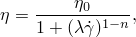

|  | 1 MPa sec |
| --- | --- |
|  | 0.11 sec |
|  | 0.392 |

**TRS特性**

Arrhenius形式：

|  | 109100 joule/mole |
| --- | --- |
|  | 308 kelvin |
|  | 0 kelvin |
|  | 8.31434 joule/(mole kelvin) |

### 结果与讨论

分析获得的结果与精确解析解或近似解非常一致。

### 输入文件

[eosshrvisc.inp](../eif/eosshrvisc.inp)

简单剪切测试。

[eosshrvisctrs.inp](../eif/eosshrvisctrs.inp)

带Arrhenius TRS特性的材料。简单剪切测试。

[eosshrvisc.f](../eif/eosshrvisc.f)

用户子程序 [`VUVISCOSITY`](../sub/sub-link.md#sub-xsl-vuviscosity)，用于eosshrvisc.inp和eosshrvisctrs.inp中用户定义的Cross粘度模型。

### V. 压力依赖剪切塑性

### 测试单元

C3D8R    CPE4R    CAX4R

### 测试特性

带压力依赖（Drucker-Prager）剪切塑性的状态方程（EOS）材料模型。

### 问题描述

此验证问题包含使用C3D8R、CPE4R或CAX4R单元的单元素模型，在简单加载条件下运行（单轴拉伸、单轴压缩和简单剪切）。本例的目的是测试材料体积响应的EOS模型与剪切响应的扩展Drucker-Prager压力依赖塑性模型的组合。有些模型还在塑性定义中包括Johnson-Cook应变率依赖。

### 结果与讨论

结果与精确解析解或近似解非常一致。

### 输入文件

[eosjcratedpexpuni3d.inp](../eif/eosjcratedpexpuni3d.inp)

单轴拉伸测试，Johnson-Cook应变率依赖，指数形式剪切准则的Drucker-Prager塑性，C3D8R单元。

[eosjcratedpexpunicpe.inp](../eif/eosjcratedpexpunicpe.inp)

单轴拉伸测试，Johnson-Cook应变率依赖，指数形式剪切准则的Drucker-Prager塑性，CPE4R单元。

[eosjcratedpexpuniaxi.inp](../eif/eosjcratedpexpuniaxi.inp)

单轴拉伸测试，Johnson-Cook应变率依赖，指数形式剪切准则的Drucker-Prager塑性，CAX4R单元。

[eosjcratedphypuni3d.inp](../eif/eosjcratedphypuni3d.inp)

单轴拉伸测试，Johnson-Cook应变率依赖，双曲线剪切准则的Drucker-Prager塑性，C3D8R单元。

[eosjcratedphypunicpe.inp](../eif/eosjcratedphypunicpe.inp)

单轴拉伸测试，Johnson-Cook应变率依赖，双曲线剪切准则的Drucker-Prager塑性，CPE4R单元。

[eosjcratedphypuniaxi.inp](../eif/eosjcratedphypuniaxi.inp)

单轴拉伸测试，Johnson-Cook应变率依赖，双曲线剪切准则的Drucker-Prager塑性，CAX4R单元。

[eosdruckerprager.inp](../eif/eosdruckerprager.inp)

单轴拉伸测试，C3D8R和CPE4R单元。

[eosdruckerprager_pre.inp](../eif/eosdruckerprager_pre.inp)

单轴压缩测试，C3D8R和CPE4R单元。

[eosdruckerprager_shr.inp](../eif/eosdruckerprager_shr.inp)

简单剪切测试，C3D8R和CPE4R单元。

### VI. 用户定义状态方程

### 测试单元

C3D8R    CPE4R

### 测试特性

带塑性的用户定义状态方程（EOS）材料模型。

### 问题描述

此验证问题包含使用C3D8R或CPE4R单元的单元素模型，在简单加载条件下运行（单轴拉伸、单轴压缩和简单剪切）。本例的目的是测试用户定义EOS材料模型（用户子程序 [`VUEOS`](../sub/sub-link.md#sub-xsl-vueos)）及其与Mises和Johnson-Cook塑性模型的组合。研究了两组平行模型。第一组使用线性弹性、线性弹性与Mises塑性、以及线性弹性与Johnson-Cook塑性材料。第二组使用用户定义EOS、用户定义EOS与Mises塑性、以及用户定义EOS与Johnson-Cook塑性材料。

对于线性弹性，体积响应定义为

其中 *K* 是材料的体积模量。为了使用户定义EOS获得相同的弹性体积响应，用户子程序 [`VUEOS`](../sub/sub-link.md#sub-xsl-vueos) 中的压力更新为

其中  是参考密度。用户子程序需要返回压力对密度的导数 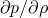，这是评估进入稳定时间计算的有效材料模量所必需的。用户子程序 [`VUEOS`](../sub/sub-link.md#sub-xsl-vueos) 还返回压力对能量的导数 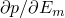，这通常需要使用Newton方法求解非线性压力-能量依赖关系。在此处考虑的情况下，这些量为

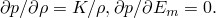

状态方程材料的弹性偏响应可以通过使用 [*ELASTIC*](../key/key-link.md#usb-kws-melastic)，TYPE=SHEAR选项来定义。

弹性材料特性为杨氏模量 = 207 GPa，泊松比 = 0.29。初始材料密度  为7890 kg/m3。表EOS材料模型的特性使用  = 164.286 GPa，剪切模量 = 80.233 GPa计算。对于使用塑性的模型（包括Mises和Johnson-Cook塑性模型），塑性硬化选择为

其中  是屈服应力（单位为MPa）， 是等效塑性应变。

### 结果与讨论

使用EOS材料模型的分析获得的结果与使用线性弹性模型的分析获得的结果一致。

### 输入文件

[eosusershrela.inp](../eif/eosusershrela.inp)

单轴拉伸测试。

[eosusershrela_pre.inp](../eif/eosusershrela_pre.inp)

单轴压缩测试。

[eosusershrela_shr.inp](../eif/eosusershrela_shr.inp)

简单剪切测试。

[eosusershrelainit_shr.inp](../eif/eosusershrelainit_shr.inp)

 非零初始条件的简单剪切测试。

[vueos_tab.f](../eif/vueos_tab.f)

上述输入文件中使用的用户子程序 [`VUEOS`](../sub/sub-link.md#sub-xsl-vueos)。
