# 2.2.21 Progressive damage and failure of ductile metals

**Products: **Abaqus/Standard  Abaqus/Explicit  

### I. Ductile criterion, Johnson-Cook criterion, and shear criterion

### Elements tested

T2D2    T3D2    B21    B31    SAX1    C3D8    C3D8R    SC8R    S4    S4R    S4RS    CPS4R    CPE4R    CAX4R    M3D4R    M3D4    

### Features tested

Ductile and shear damage initiation criteria are tested for the following material models: Mises plasticity; Hill plasticity; Drucker-Prager plasticity; and, in Abaqus/Explicit, equation of state with Johnson-Cook plasticity. The Johnson-Cook criterion, a special case of the ductile criterion, is also tested with the following material models: Mises plasticity, Hill plasticity, Johnson-Cook plasticity, Drucker-Prager plasticity, and equation of state with Mises plasticity. For the ductile and the shear damage initiation criteria, the capability to specify initial conditions on the damage initiation measures is tested.

### Problem description

This verification test consists of a set of single-element models subjected to biaxial tension; an exception is the truss and beam elements, which are loaded by uniaxial tension. For each material model only those element types supported for that model are used. The ductile criterion is specified in terms of the plastic strain at the onset of damage as a tabular function of the stress triaxiality and the equivalent plastic strain rate. In Abaqus/Explicit the ductile criterion can also be defined as a tabular function of Lode angle. The Johnson-Cook criterion (available only in Abaqus/Explicit) is specified in terms of failure parameters 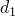–, the reference strain rate , the melting temperature, and the transition temperature. The shear criterion is specified in terms of the plastic strain at the onset of damage as a tabular function of the shear stress ratio and the equivalent plastic strain rate. The damage evolution law (available only in Abaqus/Explicit) is specified in terms of the equivalent plastic displacement or in terms of the fracture energy dissipation. A maximum degradation of  0.75 is set. The default failure choice (i.e., element deletion) is used in all tests in this subsection.

The tests for initial conditions on the damage initiation measures do not subject the elements to any deformation. Instead, these tests verify only that the specified initial conditions are output without any modifications.

### Results and discussion

Material degradation starts when the equivalent plastic strain reaches the specified damage initiation criterion. The damage variable evolves according to the evolution law specified in terms of the plastic displacement or energy dissipation. The element is deleted from the mesh once all the integration points at any one section of an element fail; the element output variable STATUS will then be set to zero.

### Input files

##### **Ductile criterion**

[damage_ductile_mises.inp](../eif/damage_ductile_mises.inp)

Ductile criterion, Mises plasticity.

[damage_ductile_mises_ic.inp](../eif/damage_ductile_mises_ic.inp)

Ductile criterion, test initial conditions.

[damage_ductile_lode_mises.inp](../eif/damage_ductile_lode_mises.inp)

Ductile criterion with Lode angle dependency, Mises plasticity.

[damage_ductile_hill.inp](../eif/damage_ductile_hill.inp)

Ductile criterion, Hill plasticity.

[damage_ductile_dp.inp](../eif/damage_ductile_dp.inp)

Ductile criterion, Drucker-Prager plasticity.

[damage_ductile_eos.inp](../eif/damage_ductile_eos.inp)

Ductile criterion, equation of state with Johnson-Cook plasticity.

[damage_ductile_mises_std.inp](../eif/damage_ductile_mises_std.inp)

Ductile criterion, Mises plasticity in Abaqus/Standard.

[damage_ductile_mises_ic_std.inp](../eif/damage_ductile_mises_ic_std.inp)

Ductile criterion in Abaqus/Standard, test initial conditions.

[johnsoncook_dmg_s.inp](../eif/johnsoncook_dmg_s.inp)

Ductile criterion, Johnson-Cook plasticity in Abaqus/Standard.

[damage_ductile_hill_std.inp](../eif/damage_ductile_hill_std.inp)

Ductile criterion, Hill plasticity in Abaqus/Standard.

[damage_ductile_dp_std.inp](../eif/damage_ductile_dp_std.inp)

Ductile criterion, Drucker-Prager plasticity in Abaqus/Standard.

##### **Johnson-Cook criterion**

[damage_jc_mises.inp](../eif/damage_jc_mises.inp)

Johnson-Cook criterion, Mises plasticity.

[damage_jc_hill.inp](../eif/damage_jc_hill.inp)

Johnson-Cook criterion, Hill plasticity.

[damage_jc_jc.inp](../eif/damage_jc_jc.inp)

Johnson-Cook criterion, Johnson-Cook plasticity.

[damage_jc_dp.inp](../eif/damage_jc_dp.inp)

Johnson-Cook criterion, Drucker-Prager plasticity.

[damage_jc_eos.inp](../eif/damage_jc_eos.inp)

Johnson-Cook criterion, equation of state with Mises plasticity.

##### **Shear criterion**

[damage_shear_mises.inp](../eif/damage_shear_mises.inp)

Shear criterion, Mises plasticity.

[damage_shear_mises_ic.inp](../eif/damage_shear_mises_ic.inp)

Shear criterion, test initial conditions.

[damage_shear_hill.inp](../eif/damage_shear_hill.inp)

Shear criterion, Hill plasticity. 

[damage_shear_dp.inp](../eif/damage_shear_dp.inp)

Shear criterion, Drucker-Prager plasticity. 

[damage_shear_eos.inp](../eif/damage_shear_eos.inp)

Shear criterion, equation of state with Johnson-Cook plasticity.

[damage_shear_mises_std.inp](../eif/damage_shear_mises_std.inp)

Shear criterion, Mises plasticity in Abaqus/Standard.

[damage_shear_mises_ic_std.inp](../eif/damage_shear_mises_ic_std.inp)

Shear criterion in Abaqus/Standard, test initial conditions.

[damage_shear_hill_std.inp](../eif/damage_shear_hill_std.inp)

Shear criterion, Hill plasticity in Abaqus/Standard. 

[damage_shear_dp_std.inp](../eif/damage_shear_dp_std.inp)

Shear criterion, Drucker-Prager plasticity in Abaqus/Standard. 

### II. Forming limit diagram (FLD) criterion and forming limit stress diagram (FLSD) criterion

### Elements tested

SC8R    S4    S4R    S4RS    CPS4R    M3D4    M3D4R    

### Features tested

The FLD and FLSD damage initiation criteria are tested on elements with a plane stress formulation for the following material models: Mises plasticity; Hill plasticity; Drucker-Prager plasticity; and, in Abaqus/Explicit, for Johnson-Cook plasticity.

### Problem description

This verification test consists of a set of single-element models subjected to equibiaxial tension. The FLD criterion is specified in terms of the maximum in-plane principal strain at damage initiation as a tabular function of the minimum in-plane principal strain. The FLSD criterion is specified in terms of the maximum in-plane principal limit stress as a tabular function of the minimum in-plane principal stress. In Abaqus/Explicit input files the damage evolution law is specified in terms of the equivalent plastic displacement or in terms of the fracture energy dissipation. A maximum degradation of 0.75 is used. The default failure choice (i.e., element deletion) is used in all tests in this subsection.

### Results and discussion

For the FLD criterion material degradation starts when the maximum in-plane principal strain reaches the major limit strain according to the specified forming limit curve. For the FLSD criterion material degradation starts when the maximum in-plane principal stress reaches the major limit stress according to the specified forming limit stress curve. The damage variable evolves according to the evolution law specified in terms of the plastic displacement or energy dissipation.

### Input files

##### **FLD criterion**

[damage_fld_mises.inp](../eif/damage_fld_mises.inp)

FLD criterion, Mises plasticity. 

[damage_fld_hill.inp](../eif/damage_fld_hill.inp)

FLD criterion, Hill plasticity. 

[damage_fld_dp.inp](../eif/damage_fld_dp.inp)

FLD criterion, Drucker-Prager plasticity. 

[damage_fld_jc.inp](../eif/damage_fld_jc.inp)

FLD criterion, Johnson-Cook plasticity. 

[damage_fld_mises_std.inp](../eif/damage_fld_mises_std.inp)

FLD criterion, Mises plasticity in Abaqus/Standard. 

[damage_fld_hill_std.inp](../eif/damage_fld_hill_std.inp)

FLD criterion, Hill plasticity in Abaqus/Standard. 

[damage_fld_dp_std.inp](../eif/damage_fld_dp_std.inp)

FLD criterion, Drucker-Prager plasticity in Abaqus/Standard. 

##### **FLSD criterion**

[damage_flsd_mises.inp](../eif/damage_flsd_mises.inp)

FLSD criterion, Mises plasticity.

[damage_flsd_hill.inp](../eif/damage_flsd_hill.inp)

FLSD criterion, Hill plasticity. 

[damage_flsd_dp.inp](../eif/damage_flsd_dp.inp)

FLSD criterion, Drucker-Prager plasticity. 

[damage_flsd_jc.inp](../eif/damage_flsd_jc.inp)

FLSD criterion, Johnson-Cook plasticity.

[damage_flsd_mises_std.inp](../eif/damage_flsd_mises_std.inp)

FLSD criterion, Mises plasticity in Abaqus/Standard.

[damage_flsd_hill_std.inp](../eif/damage_flsd_hill_std.inp)

FLSD criterion, Hill plasticity in Abaqus/Standard. 

[damage_flsd_dp_std.inp](../eif/damage_flsd_dp_std.inp)

FLSD criterion, Drucker-Prager plasticityin Abaqus/Standard.

### III. Marciniak-Kuczynski (M-K) criterion

### Elements tested

SC8R    S4    S4R    S4RS    CPS4R    M3D4R    M3D4    

### Features tested

The M-K damage initiation criterion is tested for Mises plasticity in Abaqus/Explicit.

### Problem description

First, a set of single elements with plane stress formulation is loaded under equibiaxial tension to test the M-K damage initiation criterion for different element types. The material properties for this test correspond to a steel alloy modeled with rate-dependent Mises plasticity. The initial imperfection size is defined as a tabular function of the angular direction. The M-K criterion is specified in terms of the limit ratio of the deformation in the groove (thickness imperfection) relative to the nominal deformation outside the groove. 

In addition, to demonstrate the capability of the M-K analysis in predicting forming limit diagrams for an aluminum alloy, a set of parametric studies are performed to evaluate the effect of strain paths on the FLDs using S4R elements. In these studies an aluminum alloy (AA 5754–O) is modeled using isotropic Mises plasticity with Nadai hardening:  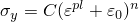, with 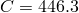 MPa, 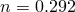, and 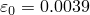. The initial imperfection size is assumed to be 0.9999 in these studies. The number of virtual imperfections is set to 100. A set of analyses are performed with the ratio between the major and minor principal strain parameterized and kept constant throughout each individual analysis, which generates the FLD curve without prestrain. To evaluate the effect of the loading paths on the FLDs, two more sets of studies are performed in which the material is initially prestrained (either with plane strain or equibiaxial loading) and subsequently subjected to the same type of proportional loading as in the case without prestrain. 

### Results and discussion

Material degradation starts when the ratio of the deformation in the groove relative to the nominal deformation reaches the specified critical value. The damage variable evolves according to the evolution rule specified in terms of the plastic displacement or energy dissipation. 

[Figure 2.2.21--1](ch02s02abv159.md#exxdamage-mk-fld) shows the FLD curves predicted with the M-K analyses for the three sets of parametric studies described above, along with a typical loading path involved in each study. The predicted FLD curve with no prestrain matches the analytical criterion suggested by [Hill (1952)](ch02s02abv159.md#ver-ref-hill) in the left side of the FLD curve (drawing region). The 10% plane strain prestrain shifts the FLD curve upward and, thus, increases the forming limit in both the drawing region and the stretching region. The 10% equibiaxial prestrain moves the FLD curve downward and to the right; therefore, the forming limit is increased in some regions while lowered in others. These results suggest that the FLDs strongly depend on the loading paths prior to reaching the localization point.

**Figure 2.2.21–1** Forming limit diagram.

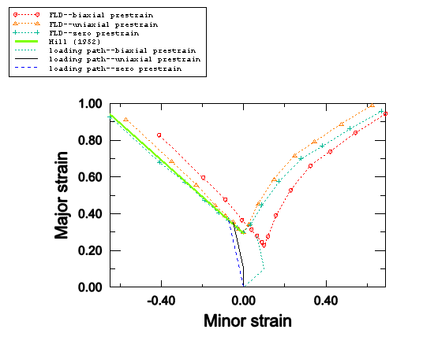

### Input file

[damage_mk_mises.inp](../eif/damage_mk_mises.inp)

 M-K criterion; steel alloy; rate-dependent Mises plasticity; SC8R, S4, S4R, S4RS, CPS4R, M3D4R, and M3D4 elements.

##### **Prediction of FLDs using S4R elements**

[damage_prestrain_no.inp](../eif/damage_prestrain_no.inp)

Template file for parametric study of aluminum alloy with zero prestrain.

[damage_prestrain_no.psf](../eif/damage_prestrain_no.psf)

Script file for parametric study of aluminum alloy with zero prestrain.

[damage_prestrain_uniaxial.inp](../eif/damage_prestrain_uniaxial.inp)

Template file for parametric study of aluminum alloy with uniaxial prestrain.

[damage_prestrain_uniaxial.psf](../eif/damage_prestrain_uniaxial.psf)

Script file for parametric study of aluminum alloy with uniaxial prestrain.

[damage_prestrain_biaxial.inp](../eif/damage_prestrain_biaxial.inp)

Template file for parametric study of aluminum alloy with biaxial prestrain.

[damage_prestrain_biaxial.psf](../eif/damage_prestrain_biaxial.psf)

Script file for parametric study of aluminum alloy with biaxial prestrain.

### IV. Mschenborn-Sonne forming limit diagram (MSFLD)

### Elements tested

SC8R    S4R    S4RS    CPS4R    M3D4R    M3D4    

### Features tested

The MSFLD damage initiation criterion is tested for Mises plasticity. The capability to specify initial conditions on the damage initiation measure is also tested.

### Problem description

A set of single elements with a plane stress formulation is loaded under equibiaxial tension to test the MSFLD damage initiation criterion for different element types. The MSFLD criterion is specified in terms of the maximum in-plane principal strain at damage initiation as a tabular function of the minimum in-plane principal strain (FLD definition) or in terms of the equivalent plastic strain at damage initiation as a tabular function of the ratio of principal strain rates (MSFLD definition). 

To demonstrate the capability of the MSFLD criterion in predicting failure for nonlinear strain paths, a number of numerical simulations of two-step forming processes have been carried out in Abaqus/Explicit using the MSFLD criterion as well as the M-K criterion. Each of the two forming steps follows a linear path with constant principal strain rate ratio , but there can be a jump in the value of  from the first step to second step; therefore, the overall deformation path is not linear. Based on the value of  throughout the first step and the value of equivalent plastic strain at the end of the first step, these simulations are grouped into five sets: within each set, individual simulations differ only in the value of  during the second step. The same material model described in the last section (AA 5754–O) has also been used here.

The test for initial conditions on the damage initiation measure does not subject the elements to any deformation. Instead, this test verifies only that the specified initial conditions are output without any modifications.

### Results and discussion

As shown in [Figure 2.2.21--1](ch02s02abv159.md#exxdamage-mk-fld), the forming limit diagrams in the space of major versus minor principal strain (FLD representation) strongly depend on the loading path. However, by representing the same data from the M-K analysis in the space of equivalent plastic strain versus the ratio of principal strain rates (MSFLD representation), those three curves fall onto the same curve as shown in [Figure 2.2.21--2](ch02s02abv159.md#exxdamage-mk-msfld-rep). This curve has been used to define the MSFLD criterion for the two-step numerical simulations described above. The points of initiation of necking predicted by the M-K criterion for each of the two-step forming processes that are being considered are shown in [Figure 2.2.21--3](ch02s02abv159.md#exxdamage-mk-m0p4), [Figure 2.2.21--4](ch02s02abv159.md#exxdamage-mk-m0p6-lower), [Figure 2.2.21--5](ch02s02abv159.md#exxdamage-mk-m0p6-higher), [Figure 2.2.21--6](ch02s02abv159.md#exxdamage-mk-p0p3-lower), and [Figure 2.2.21--7](ch02s02abv159.md#exxdamage-mk-p0p3-higher). In these figures the solid symbols represent the material state at the end of the first forming step (i.e., the starting point for the second loading step) and the corresponding hollow symbols represent the points of initiation of necking along different loading paths during the second step. The same data are also plotted in [Figure 2.2.21--8](ch02s02abv159.md#exxdamage-msfld-mk-compare) in the - diagram. The dashed lines in [Figure 2.2.21--8](ch02s02abv159.md#exxdamage-msfld-mk-compare) connect the necking points obtained using the MSFLD criterion for each of the two-step forming processes. As shown in the figure, in most situations the necking predictions based on the MSFLD compare remarkably well with those based on the more expensive M-K analysis. The only case observed in this figure in which the M-K and MSFLD criteria are not in close agreement corresponds to the predeformation of  = 0.3 with higher equivalent plastic strain (solid square). In this case the MSFLD criterion slightly over predicts the forming limits for deformation states on the right side of the curve. This situation may be expected to occur when the deformation state of the material gets very close to the forming limit curve sometime during the loading history and is subsequently strained in a direction along which it can sustain further deformation. However, this mismatch can be accounted for through precalibration and the use of a safety factor. These results indicate that the onset of necking instability occurs when a new deformation state in the equivalent plastic strain versus principal strain rate ratio space either lies on the forming limit curve or, upon sudden change in the strain rate ratio, a line connecting the states just before and after the change in strain rate ratio crosses the forming limit diagram. This example demonstrates the capability of the MSFLD criterion in predicting necking even for the nonlinear strain paths. 

### Input files

[damage_msfld_msfld_mises.inp](../eif/damage_msfld_msfld_mises.inp)

MSFLD criterion with MSFLD definition, Mises plasticity.

[damage_msfld_msfld_mises_ic.inp](../eif/damage_msfld_msfld_mises_ic.inp)

MSFLD criterion, test initial conditions.

[damage_msfld_fld_mises.inp](../eif/damage_msfld_fld_mises.inp)

MSFLD criterion with FLD definition, Mises plasticity.

[damage_msfld_msfld_mises_std.inp](../eif/damage_msfld_msfld_mises_std.inp)

MSFLD criterion with MSFLD definition, Mises plasticity in Abaqus/Standard.

[damage_msfld_msfld_mises_ic_std.inp](../eif/damage_msfld_msfld_mises_ic_std.inp)

MSFLD criterion in Abaqus/Standard, test initial conditions.

[damage_msfld_fld_mises_std.inp](../eif/damage_msfld_fld_mises_std.inp)

MSFLD criterion with FLD definition, Mises plasticity in Abaqus/Standard.

##### **Comparison of failure predictions from MSFLD criterion versus those from M-K analysis **

[damage_msfld_p0p3_lower.inp](../eif/damage_msfld_p0p3_lower.inp)

Template file for parametric study using MSFLD criterion with starting point of  = 0.3 and lower equivalent plastic strain. 

[damage_msfld_p0p3_lower.psf](../eif/damage_msfld_p0p3_lower.psf)

Script file for parametric study using MSFLD criterion with starting point of  = 0.3 and lower equivalent plastic strain.

[damage_msfld_p0p3_higher.inp](../eif/damage_msfld_p0p3_higher.inp)

Template file for parametric study using MSFLD criterion with starting point of  = 0.3 and higher equivalent plastic strain. 

[damage_msfld_p0p3_higher.psf](../eif/damage_msfld_p0p3_higher.psf)

Script file for parametric study using MSFLD criterion with starting point of  = 0.3 and higher equivalent plastic strain.

[damage_msfld_m0p6_lower.inp](../eif/damage_msfld_m0p6_lower.inp)

Template file for parametric study using MSFLD criterion with starting point of  = –0.6 and lower equivalent plastic strain. 

[damage_msfld_m0p6_lower.psf](../eif/damage_msfld_m0p6_lower.psf)

Script file for parametric study using MSFLD criterion with starting point of  = –0.6 and lower equivalent plastic strain.

[damage_msfld_m0p6_higher.inp](../eif/damage_msfld_m0p6_higher.inp)

Template file for parametric study using MSFLD criterion with starting point of  = –0.6 and higher equivalent plastic strain. 

[damage_msfld_m0p6_higher.psf](../eif/damage_msfld_m0p6_higher.psf)

Script file for parametric study using MSFLD criterion with starting point of  = –0.6 and higher equivalent plastic strain.

[damage_msfld_m0p4.inp](../eif/damage_msfld_m0p4.inp)

Template file for parametric study using MSFLD criterion with starting point of  = –0.4. 

[damage_msfld_m0p4.psf](../eif/damage_msfld_m0p4.psf)

Script file for parametric study using MSFLD criterion with starting point of  = –0.4.

[damage_mk_p0p3_lower.inp](../eif/damage_mk_p0p3_lower.inp)

Template file for parametric study using M-K analysis with starting point of  = 0.3 and lower equivalent plastic strain. 

[damage_mk_p0p3_lower.psf](../eif/damage_mk_p0p3_lower.psf)

Script file for parametric study using M-K analysis with starting point of  = 0.3 and lower equivalent plastic strain.

[damage_mk_p0p3_higher.inp](../eif/damage_mk_p0p3_higher.inp)

Template file for parametric study using M-K analysis with starting point of  = 0.3 and higher equivalent plastic strain. 

[damage_mk_p0p3_higher.psf](../eif/damage_mk_p0p3_higher.psf)

Script file for parametric study using M-K analysis with starting point of  = 0.3 and higher equivalent plastic strain.

[damage_mk_m0p6_lower.inp](../eif/damage_mk_m0p6_lower.inp)

Template file for parametric study using M-K analysis with starting point of  = –0.6 and lower equivalent plastic strain. 

[damage_mk_m0p6_lower.psf](../eif/damage_mk_m0p6_lower.psf)

Script file for parametric study using M-K analysis with starting point of  = –0.6 and lower equivalent plastic strain.

[damage_mk_m0p6_higher.inp](../eif/damage_mk_m0p6_higher.inp)

Template file for parametric study using M-K analysis with starting point of  = –0.6 and higher equivalent plastic strain. 

[damage_mk_m0p6_higher.psf](../eif/damage_mk_m0p6_higher.psf)

Script file for parametric study using M-K analysis with starting point of  = –0.6 and higher equivalent plastic strain.

[damage_mk_m0p4.inp](../eif/damage_mk_m0p4.inp)

Template file for parametric study using M-K analysis with starting point of  = –0.4. 

[damage_mk_m0p4.psf](../eif/damage_mk_m0p4.psf)

Script file for parametric study using M-K analysis with starting point of  = –0.4.

### Figures

**Figure 2.2.21–2** Forming limit diagrams predicted with M-K analyses and plotted in the space of equivalent plastic strain versus ratio of principal strain rates (MSFLD representation).

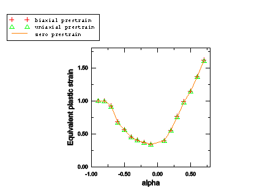

**Figure 2.2.21–3** Forming limits predicted using M-K analyses for two-step forming processes with starting point of  = –0.4.

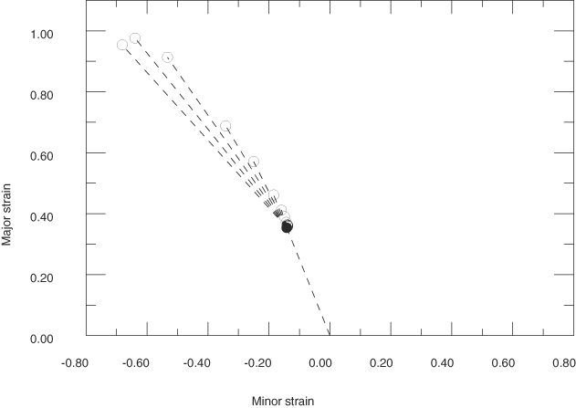

**Figure 2.2.21–4** Forming limits predicted using M-K analyses for two-step forming processes with starting point of  = –0.6 and lower equivalent plastic strain.

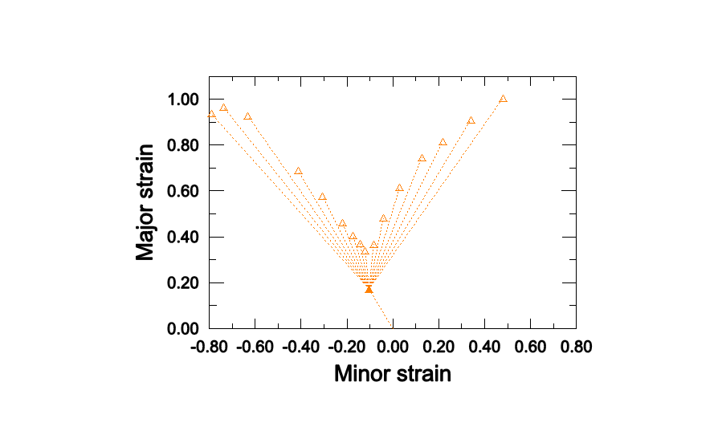

**Figure 2.2.21–5** Forming limits predicted using M-K analyses for two-step forming processes with starting point of  = –0.6 and higher equivalent plastic strain.

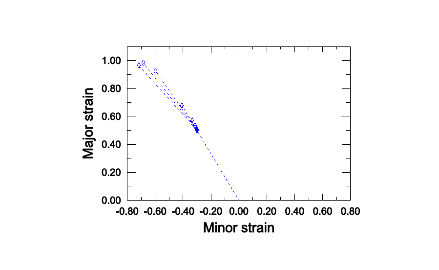

**Figure 2.2.21–6** Forming limits predicted using M-K analyses for two-step forming processes with starting point of  = 0.3 and lower equivalent plastic strain.

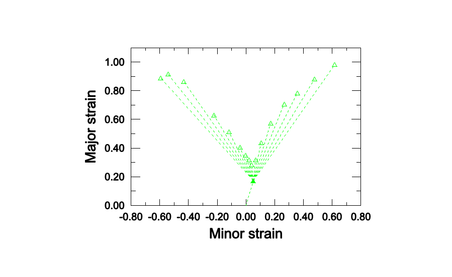

**Figure 2.2.21–7** Forming limits predicted using M-K analyses for two-step forming processes with starting point of  = 0.3 and higher equivalent plastic strain.

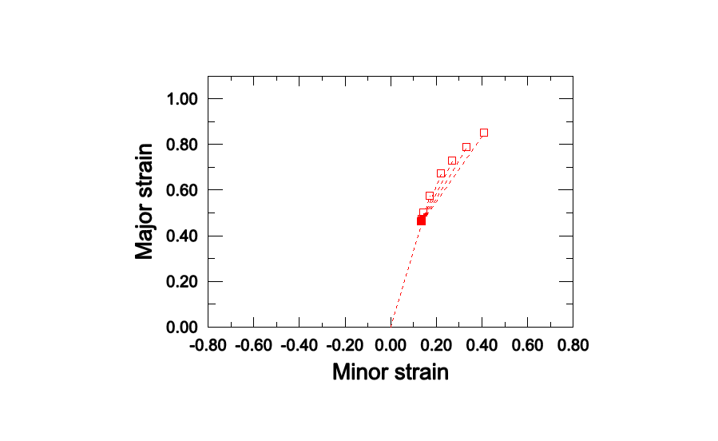

**Figure 2.2.21–8** Comparison of forming limit diagrams predicted using MSFLD criterion and those using M-K analyses. (Solid symbols: state at end of first step for various type of loading. Hollow symbols: state corresponding to initiation of necking during the second step predicted using the M-K analyses. Dashed lines: necking points obtained using the MSFLD criterion. Refer to the input file descriptions for an explanation of the labels.)

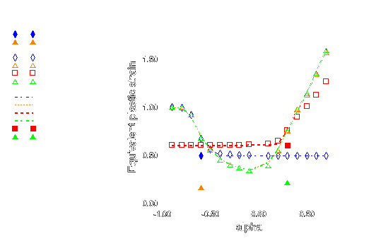

### V. Element deletion

### Elements tested

T2D2    T3D2    C3D8    C3D8R    CPE4R    CAX4R    

### Feature tested

The nondefault degradation behavior is tested in Abaqus/Explicit by specifying that fully damaged elements should remain in the computations.

### Problem description

The ductile initiation criterion is used on a set of single-element models, subjected to plane strain compression followed by plane strain tension for the elements with two-dimensional and three-dimensional stress states. The truss elements are loaded in uniaxial compression followed by uniaxial tension.

### Results and discussion

For elements with two-dimensional and three-dimensional stress states, only the deviatoric and tensile hydrostatic response of the material are degraded once the damage initiation criterion is met; the compressive hydrostatic response is not degraded. For elements with one-dimensional stress states, the stress component is degraded only when it is positive. All elements remain active when element deletion is not used. 

### Input file

[damage_section_no.inp](../eif/damage_section_no.inp)

Nondefault element degradation behavior.

### VI. Damage evolution

### Element tested

S4R

### Features tested

The maximum and multiplicative rules for computing the overall damage variable from each individual damage variable contribution are tested in Abaqus/Explicit. The field and temperature dependence of the damage initiation criteria and the damage evolution rules are also tested.

### Problem description

This verification test consists of six elements, each associated with a different material. For each of the first five materials, only one initiation criterion with its corresponding evolution rule is specified; for the material assigned to the sixth element, all five initiation criteria with their corresponding evolution rules are specified. In this way the individual contribution to the overall damage variable (in the sixth element) can be obtained explicitly from the damage variables of the first five elements.

### Results and discussion

The overall damage variable matches with the total contributions from each of the individual damage variables according to the specified combination rule; i.e., maximum or multiplicative.

### Input file

[damage_combine_deg.inp](../eif/damage_combine_deg.inp)

Maximum or multiplicative combination rules.

### Reference

Hill,  R., “On Discontinuous Plastic States, with Special Reference to Localized Necking in Thin Sheets,” Journal of the Mechanics and Physics of Solids, vol. 1, pp. 19–30, 1952.

