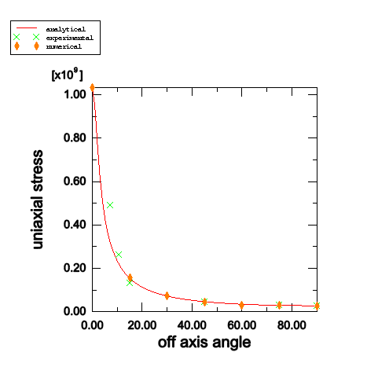
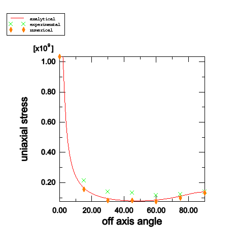
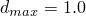
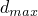

# 2.2.22 Progressive damage and failure in fiber-reinforced materials

**Products: **Abaqus/Standard  Abaqus/Explicit  

### I. Damage initiation and damage evolution

### Elements tested

CPS4    CPS3    CPS6    CPS8    CPS8R    CPS4R    CPS4I    CPS6M    SC6R    SC8R    STRI3    STRI65    S3    S3R    S3RS    S4    S4R    S4RS    S4RSW    S4R5    S8R5    S9R5    S8R    M3D3    M3D4    M3D4R    M3D6    M3D8    M3D8R    M3D9    M3D9R    

### Features tested

Hashin's damage initiation criteria and energy-based damage evolution law are tested with a linearly elastic material.

### Problem description

This verification test consists of a set of one- and two-element models subjected to uniaxial tension or compression for various angles (off-axis angles) between the fiber direction and the direction in which the load is applied. The default maximum degradation (equal to 1.0) is used for first-order elements, and the value of the maximum degradation of 0.95 was specified for the second-order elements.

### Results and discussion

The degradation of the material stiffness starts when Hashin's initiation criterion is reached for at least one of the failure modes. The damage variables, for the damage modes for which the initiation criteria are satisfied, evolve according to an energy-based evolution law with linear softening. Once the damage variable reaches the maximum degradation specified, no further damage takes place.

The results for the off-axis angles equal to 0 (fiber tension and compression) and 90 (matrix tension and compression) were verified to agree with analytical results.

[Figure 2.2.22--1](ch02s02abv160.md#ver-mat-damage-hsntension) and [Figure 2.2.22--2](ch02s02abv160.md#ver-mat-damage-hsncomp) show the unidirectional stress for tension and compression, respectively, at which the initiation criterion is satisfied as a function of the off-axis angle. In these figures the numerical predictions agree very well with the analytical results and also show good agreement with the experimental data reported in [Jones (1999)](ch02s02abv160.md#ver-ref-jones).

**Figure 2.2.22–1** Failure criteria for uniaxial tension as a function of off-axis angle.

**Figure 2.2.22–2** Failure criteria for uniaxial compression as a function of off-axis angle.

### Input files

##### **Abaqus/Standard input files**

[damage_hsncomp_cps4r_0.inp](../eif/damage_hsncomp_cps4r_0.inp)

CPS4 elements are subjected to uniaxial compression; off-axis angle, 0. 

[damage_hsncomp_cps4r_90.inp](../eif/damage_hsncomp_cps4r_90.inp)

CPS4R elements are subjected to uniaxial compression; off-axis angle, 90. 

[damage_hsncomp_cps6_90.inp](../eif/damage_hsncomp_cps6_90.inp)

CPS6 elements are subjected to uniaxial compression; off-axis angle, 90. 

[damage_hsncomp_cps6m_0.inp](../eif/damage_hsncomp_cps6m_0.inp)

CPS6M elements are subjected to uniaxial compression; off-axis angle, 0. 

[damage_hsncomp_cps8_0.inp](../eif/damage_hsncomp_cps8_0.inp)

CPS8 elements are subjected to uniaxial compression; off-axis angle, 0. 

[damage_hsncomp_cps8r_0.inp](../eif/damage_hsncomp_cps8r_0.inp)

CPS8R elements are subjected to uniaxial compression; off-axis angle, 0. 

[damage_hsncomp_m3d8_0.inp](../eif/damage_hsncomp_m3d8_0.inp)

M3D8 elements are subjected to uniaxial compression; off-axis angle, 0. 

[damage_hsncomp_m3d8r_0.inp](../eif/damage_hsncomp_m3d8r_0.inp)

M3D8R elements are subjected to uniaxial compression; off-axis angle, 0. 

[damage_hsncomp_m3d9_0.inp](../eif/damage_hsncomp_m3d9_0.inp)

M3D9 elements are subjected to uniaxial compression; off-axis angle, 0. 

[damage_hsncomp_s4r_0.inp](../eif/damage_hsncomp_s4r_0.inp)

S4R elements are subjected to uniaxial compression; off-axis angle, 0.

[damage_hsncomp_s4r_15.inp](../eif/damage_hsncomp_s4r_15.inp)

S4R elements are subjected to uniaxial compression; off-axis angle, 15. 

[damage_hsncomp_s4r_30.inp](../eif/damage_hsncomp_s4r_30.inp)

S4R elements are subjected to uniaxial compression; off-axis angle, 30. 

[damage_hsncomp_s4r_45.inp](../eif/damage_hsncomp_s4r_45.inp)

S4R elements are subjected to uniaxial compression; off-axis angle, 45. 

[damage_hsncomp_s4r_60.inp](../eif/damage_hsncomp_s4r_60.inp)

S4R elements are subjected to uniaxial compression; off-axis angle, 60. 

[damage_hsncomp_s4r_75.inp](../eif/damage_hsncomp_s4r_75.inp)

S4R elements are subjected to uniaxial compression; off-axis angle, 75.

[damage_hsncomp_s4r_90.inp](../eif/damage_hsncomp_s4r_90.inp)

S4R elements are subjected to uniaxial compression; off-axis angle, 90. 

[damage_hsncomp_s8r_0.inp](../eif/damage_hsncomp_s8r_0.inp)

S8R elements are subjected to uniaxial compression; off-axis angle, 0. 

[damage_hsncomp_s8r5_0.inp](../eif/damage_hsncomp_s8r5_0.inp)

S8R5 elements are subjected to uniaxial compression; off-axis angle, 0. 

[damage_hsncomp_s9r5_0.inp](../eif/damage_hsncomp_s9r5_0.inp)

S9R5 elements are subjected to uniaxial compression; off-axis angle, 0. 

[damage_hsncomp_sc6r_0.inp](../eif/damage_hsncomp_sc6r_0.inp)

SC6R elements are subjected to uniaxial compression; off-axis angle, 0. 

[damage_hsnten_cps3_90.inp](../eif/damage_hsnten_cps3_90.inp)

CPS3 elements are subjected to uniaxial tension; off-axis angle, 90. 

[damage_hsnten_cps4_30.inp](../eif/damage_hsnten_cps4_30.inp)

CPS4 elements are subjected to uniaxial tension; off-axis angle, 30. 

[damage_hsnten_cps4i_60.inp](../eif/damage_hsnten_cps4i_60.inp)

CPS4I elements are subjected to uniaxial tension; off-axis angle, 60. 

[damage_hsnten_cps4r_0.inp](../eif/damage_hsnten_cps4r_0.inp)

CPS4R elements are subjected to uniaxial tension; off-axis angle, 0. 

[damage_hsnten_cps4r_90.inp](../eif/damage_hsnten_cps4r_90.inp)

CPS4R elements are subjected to uniaxial tension; off-axis angle, 90. 

[damage_hsnten_m3d3_90.inp](../eif/damage_hsnten_m3d3_90.inp)

M3D3 elements are subjected to uniaxial tension; off-axis angle, 90.

[damage_hsnten_m3d4r_0.inp](../eif/damage_hsnten_m3d4r_0.inp)

M3D4R elements are subjected to uniaxial tension; off-axis angle, 0. 

[damage_hsnten_m3d6_90.inp](../eif/damage_hsnten_m3d6_90.inp)

M3D6 elements are subjected to uniaxial tension; off-axis angle, 90. 

[damage_hsnten_m3d9r_0.inp](../eif/damage_hsnten_m3d9r_0.inp)

M3D9R elements are subjected to uniaxial tension; off-axis angle, 0. 

[damage_hsnten_s3_0.inp](../eif/damage_hsnten_s3_0.inp)

S3 elements are subjected to uniaxial tension; off-axis angle, 0. 

[damage_hsnten_s3r_90.inp](../eif/damage_hsnten_s3r_90.inp)

S3R elements are subjected to uniaxial tension; off-axis angle, 90. 

[damage_hsnten_s4_90.inp](../eif/damage_hsnten_s4_90.inp)

S4 elements are subjected to uniaxial tension; off-axis angle, 90. 

[damage_hsnten_s4r_0.inp](../eif/damage_hsnten_s4r_0.inp)

S4R elements are subjected to uniaxial tension; off-axis angle, 0. 

[damage_hsnten_s4r_15.inp](../eif/damage_hsnten_s4r_15.inp)

S4R elements are subjected to uniaxial tension; off-axis angle, 15. 

[damage_hsnten_s4r_30.inp](../eif/damage_hsnten_s4r_30.inp)

S4R elements are subjected to uniaxial tension; off-axis angle, 30. 

[damage_hsnten_s4r_45.inp](../eif/damage_hsnten_s4r_45.inp)

S4R elements are subjected to uniaxial tension; off-axis angle, 45. 

[damage_hsnten_s4r_60.inp](../eif/damage_hsnten_s4r_60.inp)

S4R elements are subjected to uniaxial tension; off-axis angle, 60. 

[damage_hsnten_s4r_75.inp](../eif/damage_hsnten_s4r_75.inp)

S4R elements are subjected to uniaxial tension; off-axis angle, 75. 

[damage_hsnten_s4r_90.inp](../eif/damage_hsnten_s4r_90.inp)

S4R elements are subjected to uniaxial tension; off-axis angle, 90. 

[damage_hsnten_s4r5_90.inp](../eif/damage_hsnten_s4r5_90.inp)

S4R5 elements are subjected to uniaxial tension; off-axis angle, 90. 

[damage_hsnten_sc8r_0.inp](../eif/damage_hsnten_sc8r_0.inp)

SC8R elements are subjected to uniaxial tension; off-axis angle, 0. 

[damage_hsnten_stri3_0.inp](../eif/damage_hsnten_stri3_0.inp)

STRI3 elements are subjected to uniaxial tension; off-axis angle, 0.

[damage_hsnten_stri65_90.inp](../eif/damage_hsnten_stri65_90.inp)

STRI65 elements subjected to uniaxial tension; off-axis angle, 90. 

##### **Abaqus/Explicit input files**

[x_damage_hsnten_cps3_45.inp](../eif/x_damage_hsnten_cps3_45.inp)

CPS3 elements are subjected to uniaxial tension; off-axis angle, 45.

[x_damage_hsncomp_cps3_45.inp](../eif/x_damage_hsncomp_cps3_45.inp)

CPS3 elements are subjected to uniaxial compression; off-axis angle, 45.

[x_damage_hsnten_cps4r_45.inp](../eif/x_damage_hsnten_cps4r_45.inp)

CPS4R elements are subjected to uniaxial tension; off-axis angle, 45. 

[x_damage_hsncomp_cps4r_45.inp](../eif/x_damage_hsncomp_cps4r_45.inp)

CPS4R elements are subjected to uniaxial compression; off-axis angle, 45. 

[x_damage_hsnten_m3d3_45.inp](../eif/x_damage_hsnten_m3d3_45.inp)

M3D3 elements are subjected to uniaxial tension; off-axis angle, 45. 

[x_damage_hsncomp_m3d3_45.inp](../eif/x_damage_hsncomp_m3d3_45.inp)

M3D3 elements are subjected to uniaxial compression; off-axis angle, 45. 

[x_damage_hsnten_m3d4r_45.inp](../eif/x_damage_hsnten_m3d4r_45.inp)

M3D4R elements are subjected to uniaxial tension; off-axis angle, 45. 

[x_damage_hsncomp_m3d4r_45.inp](../eif/x_damage_hsncomp_m3d4r_45.inp)

M3D4R elements are subjected to uniaxial compression; off-axis angle, 45. 

[x_damage_hsnten_m3d4_45.inp](../eif/x_damage_hsnten_m3d4_45.inp)

M3D4 elements are subjected to uniaxial tension; off-axis angle, 45. 

[x_damage_hsncomp_m3d4_45.inp](../eif/x_damage_hsncomp_m3d4_45.inp)

M3D4 elements are subjected to uniaxial compression; off-axis angle, 45. 

[x_damage_hsnten_sc6r_45.inp](../eif/x_damage_hsnten_sc6r_45.inp)

SC6R elements are subjected to uniaxial tension; off-axis angle, 45. 

[x_damage_hsncomp_sc6r_45.inp](../eif/x_damage_hsncomp_sc6r_45.inp)

SC6R elements are subjected to uniaxial compression; off-axis angle, 45. 

[x_damage_hsnten_sc8r_45.inp](../eif/x_damage_hsnten_sc8r_45.inp)

SC8R elements are subjected to uniaxial tension; off-axis angle, 45. 

[x_damage_hsncomp_sc8r_45.inp](../eif/x_damage_hsncomp_sc8r_45.inp)

SC8R elements are subjected to uniaxial compression; off-axis angle, 45. 

[x_damage_hsnten_s3_45.inp](../eif/x_damage_hsnten_s3_45.inp)

S3 elements are subjected to uniaxial tension; off-axis angle, 45. 

[x_damage_hsncomp_s3_45.inp](../eif/x_damage_hsncomp_s3_45.inp)

S3 elements are subjected to uniaxial compression; off-axis angle, 45. 

[x_damage_hsnten_s3r_45.inp](../eif/x_damage_hsnten_s3r_45.inp)

S3R elements are subjected to uniaxial tension; off-axis angle, 45. 

[x_damage_hsncomp_s3r_45.inp](../eif/x_damage_hsncomp_s3r_45.inp)

S3R elements are subjected to uniaxial compression; off-axis angle, 45. 

[x_damage_hsnten_s4_45.inp](../eif/x_damage_hsnten_s4_45.inp)

S4 elements are subjected to uniaxial tension; off-axis angle, 45. 

[x_damage_hsncomp_s4_45.inp](../eif/x_damage_hsncomp_s4_45.inp)

S4 elements are subjected to uniaxial compression; off-axis angle, 45.

[x_damage_hsnten_s4r_0.inp](../eif/x_damage_hsnten_s4r_0.inp)

S4R elements are subjected to uniaxial tension; off-axis angle, 0. 

[x_damage_hsnten_s4r_15.inp](../eif/x_damage_hsnten_s4r_15.inp)

S4R elements are subjected to uniaxial tension; off-axis angle, 15.

[x_damage_hsnten_s4r_30.inp](../eif/x_damage_hsnten_s4r_30.inp)

S4R elements are subjected to uniaxial tension; off-axis angle, 30.

[x_damage_hsnten_s4r_45.inp](../eif/x_damage_hsnten_s4r_45.inp)

S4R elements are subjected to uniaxial tension; off-axis angle, 45. 

[x_damage_hsnten_s4r_60.inp](../eif/x_damage_hsnten_s4r_60.inp)

S4R elements are subjected to uniaxial tension; off-axis angle, 60. 

[x_damage_hsnten_s4r_75.inp](../eif/x_damage_hsnten_s4r_75.inp)

S4R elements are subjected to uniaxial tension; off-axis angle, 75. 

[x_damage_hsnten_s4r_90.inp](../eif/x_damage_hsnten_s4r_90.inp)

S4R elements are subjected to uniaxial tension; off-axis angle, 90. 

[x_damage_hsncomp_s4r_0.inp](../eif/x_damage_hsncomp_s4r_0.inp)

S4R elements are subjected to uniaxial compression; off-axis angle, 0. 

[x_damage_hsncomp_s4r_15.inp](../eif/x_damage_hsncomp_s4r_15.inp)

S4R elements are subjected to uniaxial compression; off-axis angle, 15. 

[x_damage_hsncomp_s4r_30.inp](../eif/x_damage_hsncomp_s4r_30.inp)

S4R elements are subjected to uniaxial compression; off-axis angle, 30. 

[x_damage_hsncomp_s4r_45.inp](../eif/x_damage_hsncomp_s4r_45.inp)

S4R elements are subjected to uniaxial compression; off-axis angle, 45. 

[x_damage_hsncomp_s4r_60.inp](../eif/x_damage_hsncomp_s4r_60.inp)

S4R elements are subjected to uniaxial compression; off-axis angle, 60. 

[x_damage_hsncomp_s4r_75.inp](../eif/x_damage_hsncomp_s4r_75.inp)

S4R elements are subjected to uniaxial compression; off-axis angle, 75. 

[x_damage_hsncomp_s4r_90.inp](../eif/x_damage_hsncomp_s4r_90.inp)

S4R elements are subjected to uniaxial compression; off-axis angle, 90. 

### Reference

Jones,  R. M., “Mechanics of Composite Materials,” Taylor & Francis, Inc., pp. 102–112, 1999.

### II. Import from Abaqus/Standard to Abaqus/Explicit

### Elements tested

CPS3    CPS4R    M3D3    M3D4R    M3D4    S3R    S4R    S4    SC6R    SC8R    

### Problem description

This category of problems tests the import capability from Abaqus/Standard to Abaqus/Explicit with the Hashin damage model. All tests subject the elements to uniaxial tension and compression loading in Abaqus/Standard. The model is then imported into Abaqus/Explicit and is subjected to further uniaxial tension and compression loading. Two fiber orientations, 0 and 45, are considered. All the tests include problems that import neither the reference configuration nor the state, problems that import only the state, problems that import only the reference configuration, and problems that import both the reference configuration and the state.

### Results and discussion

The import capability is validated by comparing various damage variables and energy dissipation due to damage after each import of the results; the response after import is as expected.

### Input files

[sx_s_dmg_hsntencomp_cps_0.inp](../eif/sx_s_dmg_hsntencomp_cps_0.inp)

Base problem for carrying out import from Abaqus/Standard to Abaqus/Explicit; CPS3 and CPS4R elements; fiber orientation 0.

[sx_s_dmg_hsntencomp_cps_45.inp](../eif/sx_s_dmg_hsntencomp_cps_45.inp)

Base problem for carrying out import from Abaqus/Standard to Abaqus/Explicit; CPS3 and CPS4R elements; fiber orientation 45.

[sx_s_dmg_hsntencomp_mem_0.inp](../eif/sx_s_dmg_hsntencomp_mem_0.inp)

Base problem for carrying out import from Abaqus/Standard to Abaqus/Explicit; M3D3, M3D4R, and M3D4 elements; fiber orientation 0.

[sx_s_dmg_hsntencomp_mem_45.inp](../eif/sx_s_dmg_hsntencomp_mem_45.inp)

Base problem for carrying out import from Abaqus/Standard to Abaqus/Explicit; M3D3, M3D4R, and M3D4 elements; fiber orientation 45.

[sx_s_dmg_hsntencomp_shell_0.inp](../eif/sx_s_dmg_hsntencomp_shell_0.inp)

Base problem for carrying out import from Abaqus/Standard to Abaqus/Explicit; S3R, S4R, and S4 elements; fiber orientation 0.

[sx_s_dmg_hsntencomp_shell_45.inp](../eif/sx_s_dmg_hsntencomp_shell_45.inp)

Base problem for carrying out import from Abaqus/Standard to Abaqus/Explicit; S3R, S4R, and S4 elements; fiber orientation 45.

[sx_s_dmg_hsntencomp_cshell_0.inp](../eif/sx_s_dmg_hsntencomp_cshell_0.inp)

Base problem for carrying out import from Abaqus/Standard to Abaqus/Explicit; SC6R and SC8R elements; fiber orientation 0.

[sx_s_dmg_hsntencomp_cshell_45.inp](../eif/sx_s_dmg_hsntencomp_cshell_45.inp)

Base problem for carrying out import from Abaqus/Standard to Abaqus/Explicit; SC6R and SC8R elements; fiber orientation 45.

[sx_x_dmg_hsntencomp_cps_0_n_n.inp](../eif/sx_x_dmg_hsntencomp_cps_0_n_n.inp)

Explicit dynamic continuation of sx_s_dmg_hsntencomp_cps_0.inp without importing the reference configuration or the state; CPS3 and CPS4R elements; fiber orientation 0.

[sx_x_dmg_hsntencomp_cps_0_n_y.inp](../eif/sx_x_dmg_hsntencomp_cps_0_n_y.inp)

Explicit dynamic continuation of sx_s_dmg_hsntencomp_cps_0.inp with only the state imported; CPS3 and CPS4R elements; fiber orientation 0.

[sx_x_dmg_hsntencomp_cps_0_y_n.inp](../eif/sx_x_dmg_hsntencomp_cps_0_y_n.inp)

Explicit dynamic continuation of sx_s_dmg_hsntencomp_cps_0.inp with only the reference configuration imported; CPS3 and CPS4R elements; fiber orientation 0.

[sx_x_dmg_hsntencomp_cps_0_y_y.inp](../eif/sx_x_dmg_hsntencomp_cps_0_y_y.inp)

Explicit dynamic continuation of sx_s_dmg_hsntencomp_cps_0.inp with both the reference configuration and the state imported; CPS3 and CPS4R elements; fiber orientation 0.

[sx_x_dmg_hsntencomp_cps_45_n_n.inp](../eif/sx_x_dmg_hsntencomp_cps_45_n_n.inp)

Explicit dynamic continuation of sx_s_dmg_hsntencomp_cps_45.inp without importing the reference configuration or the state; CPS3 and CPS4R elements; fiber orientation 45.

[sx_x_dmg_hsntencomp_cps_45_n_y.inp](../eif/sx_x_dmg_hsntencomp_cps_45_n_y.inp)

Explicit dynamic continuation of sx_s_dmg_hsntencomp_cps_45.inp with only the state imported; CPS3 and CPS4R elements; fiber orientation 45.

[sx_x_dmg_hsntencomp_cps_45_y_n.inp](../eif/sx_x_dmg_hsntencomp_cps_45_y_n.inp)

Explicit dynamic continuation of sx_s_dmg_hsntencomp_cps_45.inp with only the reference configuration imported; CPS3 and CPS4R elements; fiber orientation 45.

[sx_x_dmg_hsntencomp_cps_45_y_y.inp](../eif/sx_x_dmg_hsntencomp_cps_45_y_y.inp)

Explicit dynamic continuation of sx_s_dmg_hsntencomp_cps_45.inp with both the reference configuration and the state imported; CPS3 and CPS4R elements; fiber orientation 45.

[sx_x_dmg_hsntencomp_mem_0_n_n.inp](../eif/sx_x_dmg_hsntencomp_mem_0_n_n.inp)

Explicit dynamic continuation of sx_s_dmg_hsntencomp_mem_0.inp without importing the reference configuration or the state; M3D3, M3D4R, and M3D4 elements; fiber orientation 0.

[sx_x_dmg_hsntencomp_mem_0_n_y.inp](../eif/sx_x_dmg_hsntencomp_mem_0_n_y.inp)

Explicit dynamic continuation of sx_s_dmg_hsntencomp_mem_0.inp with only the state imported; M3D3, M3D4R, and M3D4 elements; fiber orientation 0.

[sx_x_dmg_hsntencomp_mem_0_y_n.inp](../eif/sx_x_dmg_hsntencomp_mem_0_y_n.inp)

Explicit dynamic continuation of sx_s_dmg_hsntencomp_mem_0.inp with only the reference configuration imported; M3D3, M3D4R, and M3D4 elements; fiber orientation 0.

[sx_x_dmg_hsntencomp_mem_0_y_y.inp](../eif/sx_x_dmg_hsntencomp_mem_0_y_y.inp)

Explicit dynamic continuation of sx_s_dmg_hsntencomp_mem_0.inp with both the reference configuration and the state imported; M3D3, M3D4R, and M3D4 elements; fiber orientation 0.

[sx_x_dmg_hsntencomp_mem_45_n_n.inp](../eif/sx_x_dmg_hsntencomp_mem_45_n_n.inp)

Explicit dynamic continuation of sx_s_dmg_hsntencomp_mem_45.inp without importing the reference configuration or the state; M3D3, M3D4R, and M3D4 elements; fiber orientation 45.

[sx_x_dmg_hsntencomp_mem_45_n_y.inp](../eif/sx_x_dmg_hsntencomp_mem_45_n_y.inp)

Explicit dynamic continuation of sx_s_dmg_hsntencomp_mem_45.inp with only the state imported; M3D3, M3D4R, and M3D4 elements; fiber orientation 45.

[sx_x_dmg_hsntencomp_mem_45_y_n.inp](../eif/sx_x_dmg_hsntencomp_mem_45_y_n.inp)

Explicit dynamic continuation of sx_s_dmg_hsntencomp_mem_45.inp with only the reference configuration imported; M3D3, M3D4R, and M3D4 elements; fiber orientation 45.

[sx_x_dmg_hsntencomp_mem_45_y_y.inp](../eif/sx_x_dmg_hsntencomp_mem_45_y_y.inp)

Explicit dynamic continuation of sx_s_dmg_hsntencomp_mem_45.inp with both the reference configuration and the state imported; M3D3, M3D4R, and M3D4 elements; fiber orientation 45.

[sx_x_dmg_hsntencomp_shell_0_n_n.inp](../eif/sx_x_dmg_hsntencomp_shell_0_n_n.inp)

Explicit dynamic continuation of sx_s_dmg_hsntencomp_shell_0.inp without importing the reference configuration or the state; S3R, S4R, and S4 elements; fiber orientation 0.

[sx_x_dmg_hsntencomp_shell_0_n_y.inp](../eif/sx_x_dmg_hsntencomp_shell_0_n_y.inp)

Explicit dynamic continuation of sx_s_dmg_hsntencomp_shell_0.inp with only the state imported; S3R, S4R, and S4 elements; fiber orientation 0.

[sx_x_dmg_hsntencomp_shell_0_y_n.inp](../eif/sx_x_dmg_hsntencomp_shell_0_y_n.inp)

Explicit dynamic continuation of sx_s_dmg_hsntencomp_shell_0.inp with only the reference configuration imported; S3R, S4R, and S4 elements; fiber orientation 0.

[sx_x_dmg_hsntencomp_shell_0_y_y.inp](../eif/sx_x_dmg_hsntencomp_shell_0_y_y.inp)

Explicit dynamic continuation of sx_s_dmg_hsntencomp_shell_0.inp with both the reference configuration and the state imported; S3R, S4R, and S4 elements; fiber orientation 0.

[sx_x_dmg_hsntencomp_shell_45_n_n.inp](../eif/sx_x_dmg_hsntencomp_shell_45_n_n.inp)

Explicit dynamic continuation of sx_s_dmg_hsntencomp_shell_45.inp without importing the reference configuration or the state; S3R, S4R, and S4 elements; fiber orientation 45.

[sx_x_dmg_hsntencomp_shell_45_n_y.inp](../eif/sx_x_dmg_hsntencomp_shell_45_n_y.inp)

Explicit dynamic continuation of sx_s_dmg_hsntencomp_shell_45.inp with only the state imported; S3R, S4R, and S4 elements; fiber orientation 45.

[sx_x_dmg_hsntencomp_shell_45_y_n.inp](../eif/sx_x_dmg_hsntencomp_shell_45_y_n.inp)

Explicit dynamic continuation of sx_s_dmg_hsntencomp_shell_45.inp with only the reference configuration imported; S3R, S4R, and S4 elements; fiber orientation 45.

[sx_x_dmg_hsntencomp_shell_45_y_y.inp](../eif/sx_x_dmg_hsntencomp_shell_45_y_y.inp)

Explicit dynamic continuation of sx_s_dmg_hsntencomp_shell_45.inp with both the reference configuration and the state imported; S3R, S4R, and S4 elements; fiber orientation 45.

[sx_x_dmg_hsntencomp_cshell_0_n_n.inp](../eif/sx_x_dmg_hsntencomp_cshell_0_n_n.inp)

Explicit dynamic continuation of sx_s_dmg_hsntencomp_cshell_0.inp without importing the reference configuration or the state; SC6R and SC8R elements; fiber orientation 0.

[sx_x_dmg_hsntencomp_cshell_0_n_y.inp](../eif/sx_x_dmg_hsntencomp_cshell_0_n_y.inp)

Explicit dynamic continuation of sx_s_dmg_hsntencomp_cshell_0.inp with only the state imported; SC6R and SC8R elements; fiber orientation 0.

[sx_x_dmg_hsntencomp_cshell_0_y_n.inp](../eif/sx_x_dmg_hsntencomp_cshell_0_y_n.inp)

Explicit dynamic continuation of sx_s_dmg_hsntencomp_cshell_0.inp with only the reference configuration imported; SC6R and SC8R elements; fiber orientation 0.

[sx_x_dmg_hsntencomp_cshell_0_y_y.inp](../eif/sx_x_dmg_hsntencomp_cshell_0_y_y.inp)

Explicit dynamic continuation of sx_s_dmg_hsntencomp_cshell_0.inp with both the reference configuration and the state imported; SC6R and SC8R elements; fiber orientation 0.

[sx_x_dmg_hsntencomp_cshell_45_n_n.inp](../eif/sx_x_dmg_hsntencomp_cshell_45_n_n.inp)

Explicit dynamic continuation of sx_s_dmg_hsntencomp_cshell_45.inp without importing the reference configuration or the state; SC6R and SC8R elements; fiber orientation 45.

[sx_x_dmg_hsntencomp_cshell_45_n_y.inp](../eif/sx_x_dmg_hsntencomp_cshell_45_n_y.inp)

Explicit dynamic continuation of sx_s_dmg_hsntencomp_cshell_45.inp with only the state imported; SC6R and SC8R elements; fiber orientation 45.

[sx_x_dmg_hsntencomp_cshell_45_y_n.inp](../eif/sx_x_dmg_hsntencomp_cshell_45_y_n.inp)

Explicit dynamic continuation of sx_s_dmg_hsntencomp_cshell_45.inp with only the reference configuration imported; SC6R and SC8R elements; fiber orientation 45.

[sx_x_dmg_hsntencomp_cshell_45_y_y.inp](../eif/sx_x_dmg_hsntencomp_cshell_45_y_y.inp)

Explicit dynamic continuation of sx_s_dmg_hsntencomp_cshell_45.inp with both the reference configuration and the state imported; SC6R and SC8R elements; fiber orientation 45.

### III. Import from Abaqus/Explicit to Abaqus/Standard

### Elements tested

CPS3    CPS4R    M3D3    M3D4R    M3D4    S3R    S4R    S4    SC6R    SC8R    

### Problem description

This category of problems tests the import capability from Abaqus/Explicit to Abaqus/Standard with the Hashin damage model. All tests subject the elements to uniaxial tension and compression loading in Abaqus/Explicit. The model is then imported into Abaqus/Standard and is subjected to further uniaxial tension and compression loading. Two fiber orientations, 0 and 45, are considered. All the tests include problems that import neither the reference configuration nor the state, problems that import only the state, problems that import only the reference configuration, and problems that import both the reference configuration and the state.

### Results and discussion

The import capability is validated by comparing various damage variables and energy dissipation due to damage after each import of the results; the response after import is as expected.

### Input files

[xs_x_dmg_hsntencomp_cps_0.inp](../eif/xs_x_dmg_hsntencomp_cps_0.inp)

Base problem for carrying out import from Abaqus/Explicit to Abaqus/Standard; CPS3 and CPS4R elements; fiber orientation 0.

[xs_x_dmg_hsntencomp_cps_45.inp](../eif/xs_x_dmg_hsntencomp_cps_45.inp)

Base problem for carrying out import from Abaqus/Explicit to Abaqus/Standard; CPS3 and CPS4R elements; fiber orientation 45.

[xs_x_dmg_hsntencomp_mem_0.inp](../eif/xs_x_dmg_hsntencomp_mem_0.inp)

Base problem for carrying out import from Abaqus/Explicit to Abaqus/Standard; M3D3, M3D4R, and M3D4 elements; fiber orientation 0.

[xs_x_dmg_hsntencomp_mem_45.inp](../eif/xs_x_dmg_hsntencomp_mem_45.inp)

Base problem for carrying out import from Abaqus/Explicit to Abaqus/Standard; M3D3, M3D4R, and M3D4 elements; fiber orientation 45.

[xs_x_dmg_hsntencomp_shell_0.inp](../eif/xs_x_dmg_hsntencomp_shell_0.inp)

Base problem for carrying out import from Abaqus/Explicit to Abaqus/Standard; S3R, S4R, and S4 elements; fiber orientation 0.

[xs_x_dmg_hsntencomp_shell_45.inp](../eif/xs_x_dmg_hsntencomp_shell_45.inp)

Base problem for carrying out import from Abaqus/Explicit to Abaqus/Standard; S3R, S4R, and S4 elements; fiber orientation 45.

[xs_x_dmg_hsntencomp_cshell_0.inp](../eif/xs_x_dmg_hsntencomp_cshell_0.inp)

Base problem for carrying out import from Abaqus/Explicit to Abaqus/Standard; SC6R and SC8R elements; fiber orientation 0.

[xs_x_dmg_hsntencomp_cshell_45.inp](../eif/xs_x_dmg_hsntencomp_cshell_45.inp)

Base problem for carrying out import from Abaqus/Explicit to Abaqus/Standard; SC6R and SC8R elements; fiber orientation 45.

[xs_s_dmg_hsntencomp_cps_0_n_n.inp](../eif/xs_s_dmg_hsntencomp_cps_0_n_n.inp)

Static continuation of xs_x_dmg_hsntencomp_cps_0.inp without importing the reference configuration or the state; CPS3 and CPS4R elements; fiber orientation 0.

[xs_s_dmg_hsntencomp_cps_0_n_y.inp](../eif/xs_s_dmg_hsntencomp_cps_0_n_y.inp)

Static continuation of xs_x_dmg_hsntencomp_cps_0.inp with only the state imported; CPS3 and CPS4R elements; fiber orientation 0.

[xs_s_dmg_hsntencomp_cps_0_y_n.inp](../eif/xs_s_dmg_hsntencomp_cps_0_y_n.inp)

Static continuation of xs_x_dmg_hsntencomp_cps_0.inp with only the reference configuration imported; CPS3 and CPS4R elements; fiber orientation 0.

[xs_s_dmg_hsntencomp_cps_0_y_y.inp](../eif/xs_s_dmg_hsntencomp_cps_0_y_y.inp)

Static continuation of xs_x_dmg_hsntencomp_cps_0.inp with both the reference configuration and the state imported; CPS3 and CPS4R elements; fiber orientation 0.

[xs_s_dmg_hsntencomp_cps_45_n_n.inp](../eif/xs_s_dmg_hsntencomp_cps_45_n_n.inp)

Static continuation of xs_x_dmg_hsntencomp_cps_45.inp without importing the reference configuration or the state; CPS3 and CPS4R elements; fiber orientation 45.

[xs_s_dmg_hsntencomp_cps_45_n_y.inp](../eif/xs_s_dmg_hsntencomp_cps_45_n_y.inp)

Static continuation of xs_x_dmg_hsntencomp_cps_45.inp with only the state imported; CPS3 and CPS4R elements; fiber orientation 45.

[xs_s_dmg_hsntencomp_cps_45_y_n.inp](../eif/xs_s_dmg_hsntencomp_cps_45_y_n.inp)

Static continuation of xs_x_dmg_hsntencomp_cps_45.inp with only the reference configuration imported; CPS3 and CPS4R elements; fiber orientation 45.

[xs_s_dmg_hsntencomp_cps_45_y_y.inp](../eif/xs_s_dmg_hsntencomp_cps_45_y_y.inp)

Static continuation of xs_x_dmg_hsntencomp_cps_45.inp with both the reference configuration and the state imported; CPS3 and CPS4R elements; fiber orientation 45.

[xs_s_dmg_hsntencomp_mem_0_n_n.inp](../eif/xs_s_dmg_hsntencomp_mem_0_n_n.inp)

Static continuation of xs_x_dmg_hsntencomp_mem_0.inp without importing the reference configuration or the state; M3D3, M3D4R, and M3D4 elements; fiber orientation 0.

[xs_s_dmg_hsntencomp_mem_0_n_y.inp](../eif/xs_s_dmg_hsntencomp_mem_0_n_y.inp)

Static continuation of xs_x_dmg_hsntencomp_mem_0.inp with only the state imported; M3D3, M3D4R, and M3D4 elements; fiber orientation 0.

[xs_s_dmg_hsntencomp_mem_0_y_n.inp](../eif/xs_s_dmg_hsntencomp_mem_0_y_n.inp)

Static continuation of xs_x_dmg_hsntencomp_mem_0.inp with only the reference configuration imported; M3D3, M3D4R, and M3D4 elements; fiber orientation 0.

[xs_s_dmg_hsntencomp_mem_0_y_y.inp](../eif/xs_s_dmg_hsntencomp_mem_0_y_y.inp)

Static continuation of xs_x_dmg_hsntencomp_mem_0.inp with both the reference configuration and the state imported; M3D3, M3D4R, and M3D4 elements; fiber orientation 0.

[xs_s_dmg_hsntencomp_mem_45_n_n.inp](../eif/xs_s_dmg_hsntencomp_mem_45_n_n.inp)

Static continuation of xs_x_dmg_hsntencomp_mem_45.inp without importing the reference configuration or the state; M3D3, M3D4R, and M3D4 elements; fiber orientation 45.

[xs_s_dmg_hsntencomp_mem_45_n_y.inp](../eif/xs_s_dmg_hsntencomp_mem_45_n_y.inp)

Static continuation of xs_x_dmg_hsntencomp_mem_45.inp with only the state imported; M3D3, M3D4R, and M3D4 elements; fiber orientation 45.

[xs_s_dmg_hsntencomp_mem_45_y_n.inp](../eif/xs_s_dmg_hsntencomp_mem_45_y_n.inp)

Static continuation of xs_x_dmg_hsntencomp_mem_45.inp with only the reference configuration imported; M3D3, M3D4R, and M3D4 elements; fiber orientation 45.

[xs_s_dmg_hsntencomp_mem_45_y_y.inp](../eif/xs_s_dmg_hsntencomp_mem_45_y_y.inp)

Static continuation of xs_x_dmg_hsntencomp_mem_45.inp with both the reference configuration and the state imported; M3D3, M3D4R, and M3D4 elements; fiber orientation 45.

[xs_s_dmg_hsntencomp_shell_0_n_n.inp](../eif/xs_s_dmg_hsntencomp_shell_0_n_n.inp)

Static continuation of xs_x_dmg_hsntencomp_shell_0.inp without importing the reference configuration or the state; S3R, S4R, and S4 elements; fiber orientation 0.

[xs_s_dmg_hsntencomp_shell_0_n_y.inp](../eif/xs_s_dmg_hsntencomp_shell_0_n_y.inp)

Static continuation of xs_x_dmg_hsntencomp_shell_0.inp with only the state imported; S3R, S4R, and S4 elements; fiber orientation 0.

[xs_s_dmg_hsntencomp_shell_0_y_n.inp](../eif/xs_s_dmg_hsntencomp_shell_0_y_n.inp)

Static continuation of xs_x_dmg_hsntencomp_shell_0.inp with only the reference configuration imported; S3R, S4R, and S4 elements; fiber orientation 0.

[xs_s_dmg_hsntencomp_shell_0_y_y.inp](../eif/xs_s_dmg_hsntencomp_shell_0_y_y.inp)

Static continuation of xs_x_dmg_hsntencomp_shell_0.inp with both the reference configuration and the state imported; S3R, S4R, and S4 elements; fiber orientation 0.

[xs_s_dmg_hsntencomp_shell_45_n_n.inp](../eif/xs_s_dmg_hsntencomp_shell_45_n_n.inp)

Static continuation of xs_x_dmg_hsntencomp_shell_45.inp without importing the reference configuration or the state; S3R, S4R, and S4 elements; fiber orientation 45.

[xs_s_dmg_hsntencomp_shell_45_n_y.inp](../eif/xs_s_dmg_hsntencomp_shell_45_n_y.inp)

Static continuation of xs_x_dmg_hsntencomp_shell_45.inp with only the state imported; S3R, S4R, and S4 elements; fiber orientation 45.

[xs_s_dmg_hsntencomp_shell_45_y_n.inp](../eif/xs_s_dmg_hsntencomp_shell_45_y_n.inp)

Static continuation of xs_x_dmg_hsntencomp_shell_45.inp with only the reference configuration imported; S3R, S4R, and S4 elements; fiber orientation 45.

[xs_s_dmg_hsntencomp_shell_45_y_y.inp](../eif/xs_s_dmg_hsntencomp_shell_45_y_y.inp)

Static continuation of xs_x_dmg_hsntencomp_shell_45.inp with both the reference configuration and the state imported; S3R, S4R, and S4 elements; fiber orientation 45.

[xs_s_dmg_hsntencomp_cshell_0_n_n.inp](../eif/xs_s_dmg_hsntencomp_cshell_0_n_n.inp)

Static continuation of xs_x_dmg_hsntencomp_cshell_0.inp without importing the reference configuration or the state; SC6R and SC8R elements; fiber orientation 0.

[xs_s_dmg_hsntencomp_cshell_0_n_y.inp](../eif/xs_s_dmg_hsntencomp_cshell_0_n_y.inp)

Static continuation of xs_x_dmg_hsntencomp_cshell_0.inp with only the state imported; SC6R and SC8R elements; fiber orientation 0.

[xs_s_dmg_hsntencomp_cshell_0_y_n.inp](../eif/xs_s_dmg_hsntencomp_cshell_0_y_n.inp)

Static continuation of xs_x_dmg_hsntencomp_cshell_0.inp with only the reference configuration imported; SC6R and SC8R elements; fiber orientation 0.

[xs_s_dmg_hsntencomp_cshell_0_y_y.inp](../eif/xs_s_dmg_hsntencomp_cshell_0_y_y.inp)

Static continuation of xs_x_dmg_hsntencomp_cshell_0.inp with both the reference configuration and the state imported; SC6R and SC8R elements; fiber orientation 0.

[xs_s_dmg_hsntencomp_cshell_45_n_n.inp](../eif/xs_s_dmg_hsntencomp_cshell_45_n_n.inp)

Static continuation of xs_x_dmg_hsntencomp_cshell_45.inp without importing the reference configuration or the state; SC6R and SC8R elements; fiber orientation 45.

[xs_s_dmg_hsntencomp_cshell_45_n_y.inp](../eif/xs_s_dmg_hsntencomp_cshell_45_n_y.inp)

Static continuation of xs_x_dmg_hsntencomp_cshell_45.inp with only the state imported; SC6R and SC8R elements; fiber orientation 45.

[xs_s_dmg_hsntencomp_cshell_45_y_n.inp](../eif/xs_s_dmg_hsntencomp_cshell_45_y_n.inp)

Static continuation of xs_x_dmg_hsntencomp_cshell_45.inp with only the reference configuration imported; SC6R and SC8R elements; fiber orientation 45.

[xs_s_dmg_hsntencomp_cshell_45_y_y.inp](../eif/xs_s_dmg_hsntencomp_cshell_45_y_y.inp)

Static continuation of xs_x_dmg_hsntencomp_cshell_45.inp with both the reference configuration and the state imported; SC6R and SC8R elements; fiber orientation 45.

### IV. Element deletion

### Elements tested

CPS4    CPS4R    M3D4    S4    S4R    

### Feature tested

The default and nondefault degradation behaviors are tested. By default, in Abaqus/Standard elements are deleted if the damage variable for each failure mode and at each material point reaches the default maximum degradation value, . On the other hand, the default behavior in Abaqus/Explicit is to delete an element when the damage variables associated with either of the fiber failure modes (tensile or compressive) reaches  at all the section points at any one integration location of an element. You can control whether or not element deletion is activated, and you can specify the value of the damage variable at or above which a material point will be assumed to be completely damaged.

### Problem description

Each model consists of nine elements. A linear elastic material is assigned to all the elements except one, for which a fiber reinforced damage model is used. The specimen is subjected to biaxial extension, which is followed by biaxial compression. For each of the elements three different cases are tested: 
- default behavior (, and elements are deleted if the deletion criteria are satisfied);
- default value of maximum degradation (), and the elements remain active even if the deletion criteria are satisfied; and
- the maximum degradation  is specified (0.99 for Abaqus/Standard tests; 0.975 for Abaqus/Explicit tests), and the elements remain active even if the deletion criteria are satisfied.

### Results and discussion

 In Abaqus/Standard simulations, the first step (biaxial extension) causes the fiber tensile and matrix tensile modes to be completely damaged. In the subsequent biaxial compression step the remaining two failure modes (fiber and matrix compressive modes) are completely damaged as well. The evolutions of damage variables stop when the value of  is reached. Once the maximum degradation is reached at all material points for all failure modes, the elements are deleted when deletion is requested and remain active when element deletion is not requested. In Abaqus/Explicit simulations, the criterion for element deletion is met during the first step as the fibers fail in tensile mode. The element is deleted or remains active depending on whether or not element deletion is activated.

### Input files

##### **Abaqus/Standard input files**

[damage_elemdelete_cps4.inp](../eif/damage_elemdelete_cps4.inp)

CPS4 elements are tested with default behavior ([*SECTION CONTROLS](../key/key-link.md#usb-kws-msectioncontrols), ELEMENT DELETION=YES, ).

[damage_elemnodelete_cps4.inp](../eif/damage_elemnodelete_cps4.inp)

CPS4 elements are tested with nondefault behavior ([*SECTION CONTROLS](../key/key-link.md#usb-kws-msectioncontrols), ELEMENT DELETION=NO, ).

[damage_elemnodelete099_cps4.inp](../eif/damage_elemnodelete099_cps4.inp)

CPS4 elements are tested with nondefault behavior ([*SECTION CONTROLS](../key/key-link.md#usb-kws-msectioncontrols), ELEMENT DELETION=NO, MAX DEGRADATION= 0.99).

[damage_elemdelete_m3d4.inp](../eif/damage_elemdelete_m3d4.inp)

M3D4 elements are tested with default behavior ([*SECTION CONTROLS](../key/key-link.md#usb-kws-msectioncontrols), ELEMENT DELETION=YES, ).

[damage_elemnodelete_m3d4.inp](../eif/damage_elemnodelete_m3d4.inp)

M3D4 elements are tested with nondefault behavior ([*SECTION CONTROLS](../key/key-link.md#usb-kws-msectioncontrols), ELEMENT DELETION=NO, ).

[damage_elemnodelete099_m3d4.inp](../eif/damage_elemnodelete099_m3d4.inp)

M3D4 elements are tested with nondefault behavior ([*SECTION CONTROLS](../key/key-link.md#usb-kws-msectioncontrols), ELEMENT DELETION=NO, MAX DEGRADATION= 0.99).

[damage_elemdelete_s4.inp](../eif/damage_elemdelete_s4.inp)

S4 elements are tested with default behavior ([*SECTION CONTROLS](../key/key-link.md#usb-kws-msectioncontrols), ELEMENT DELETION=YES, ).

[damage_elemnodelete_s4.inp](../eif/damage_elemnodelete_s4.inp)

S4 elements are tested with nondefault behavior ([*SECTION CONTROLS](../key/key-link.md#usb-kws-msectioncontrols), ELEMENT DELETION=NO, ).

[damage_elemnodelete099_s4.inp](../eif/damage_elemnodelete099_s4.inp)

S4 elements are tested with nondefault behavior ([*SECTION CONTROLS](../key/key-link.md#usb-kws-msectioncontrols), ELEMENT DELETION=NO, MAX DEGRADATION= 0.99).

##### **Abaqus/Explicit input files**

[x_damage_elemdelete_cps4r.inp](../eif/x_damage_elemdelete_cps4r.inp)

CPS4R elements are tested with default behavior ([*SECTION CONTROLS](../key/key-link.md#usb-kws-msectioncontrols), ELEMENT DELETION=YES, ).

[x_damage_elemnodelete_cps4r.inp](../eif/x_damage_elemnodelete_cps4r.inp)

CPS4R elements are tested with nondefault behavior ([*SECTION CONTROLS](../key/key-link.md#usb-kws-msectioncontrols), ELEMENT DELETION=NO, ).

[x_damage_elemnodelete0975_cps4r.inp](../eif/x_damage_elemnodelete0975_cps4r.inp)

CPS4R elements are tested with nondefault behavior ([*SECTION CONTROLS](../key/key-link.md#usb-kws-msectioncontrols), ELEMENT DELETION=NO, MAX DEGRADATION= 0.975).

[x_damage_elemdelete_s4r.inp](../eif/x_damage_elemdelete_s4r.inp)

S4R elements are tested with default behavior ([*SECTION CONTROLS](../key/key-link.md#usb-kws-msectioncontrols), ELEMENT DELETION=YES, ).

[x_damage_elemnodelete_s4r.inp](../eif/x_damage_elemnodelete_s4r.inp)

S4R elements are tested with nondefault behavior ([*SECTION CONTROLS](../key/key-link.md#usb-kws-msectioncontrols), ELEMENT DELETION=NO, ).

[x_damage_elemnodelete0975_s4r.inp](../eif/x_damage_elemnodelete0975_s4r.inp)

S4R elements are tested with nondefault behavior ([*SECTION CONTROLS](../key/key-link.md#usb-kws-msectioncontrols), ELEMENT DELETION=NO, MAX DEGRADATION= 0.975).

[x_damage_elemdelete_s4.inp](../eif/x_damage_elemdelete_s4.inp)

S4 elements are tested with default behavior ([*SECTION CONTROLS](../key/key-link.md#usb-kws-msectioncontrols), ELEMENT DELETION=YES, ).

[x_damage_elemnodelete_s4.inp](../eif/x_damage_elemnodelete_s4.inp)

S4 elements are tested with nondefault behavior ([*SECTION CONTROLS](../key/key-link.md#usb-kws-msectioncontrols), ELEMENT DELETION=NO, ).

[x_damage_elemnodelete0975_s4.inp](../eif/x_damage_elemnodelete0975_s4.inp)

S4 elements are tested with nondefault behavior ([*SECTION CONTROLS](../key/key-link.md#usb-kws-msectioncontrols), ELEMENT DELETION=NO, MAX DEGRADATION= 0.975).

### V. Procedures

### Elements tested

CPS4R    CPS4    

### Feature tested

Hashin's damage initiation criteria with energy-based evolution law are tested with different types of procedures in Abaqus/Standard.

### Problem description

This verification test consists of small models (up to nine elements) that are used with various procedure types in Abaqus/Standard. Element removal and reactivation using model change are tested by removing the element, reactivating it in the subsequent step, and verifying that all the state variables are reset correctly. The dynamic and Riks analyses are tested by comparing the numerical results with the analytical results. Finally, the linear perturbation procedures are tested by performing a general step in which the material properties are degraded before the perturbation step and then comparing the results with those obtained using a material without damage with appropriately modified parameters.

### Results and discussion

The results agree well with exact analytical results or numerical results obtained using undamaged material.

### Input files

[damage_riks.inp](../eif/damage_riks.inp)

Riks analysis.

[damage_modelchange.inp](../eif/damage_modelchange.inp)

Model change.

[damage_freq.inp](../eif/damage_freq.inp)

Frequency extraction analysis.

[damage_freq_undamaged.inp](../eif/damage_freq_undamaged.inp)

Frequency extraction analysis (model without damage).

[damage_dyn.inp](../eif/damage_dyn.inp)

Dynamic analysis.

[damage_ssd.inp](../eif/damage_ssd.inp)

Steady-state dynamics.

[damage_ssd_undamaged.inp](../eif/damage_ssd_undamaged.inp)

Steady-state dynamics (model without damage).

