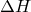
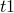

# 2.2.23 Creep

**Product: **Abaqus/Standard  

### I. Mises creep

### Elements tested

C3D8    CPS4    T3D2    

### Problem description

**Material: **

**Elasticity**

Young's modulus, *E* = 20.0E6

Poisson's ratio,  = 0.3

**Creep**

Time-hardening/strain-hardening power law
- *A* = 2.5E27
- *n* = 5.0
- *m* = 0.2

Hyperbolic-sine law
- *A* = 2.5E27
- *B* = 4.4E4
- *n* = 5.0
-  = 0.0
- *R* = 8.314

(The units are not important.)

### Results and discussion

The tests in this section are set up as cases of homogeneous deformation of a single element. Consequently, the results are identical for all integration points within the element. The elements have unit dimensions except in the loading direction in which they have a length of 10. The constitutive path is integrated with the quasi-static procedure using automatic incrementation. Therefore, the number of increments varies from test to test. The results are reported at a convenient increment near the halfway point of the response and at the end of the test.

### Input files

[mcrtmo3qcr.inp](../eif/mcrtmo3qcr.inp)

Time-hardening power law, uniaxial tension creep, C3D8 elements.

[mcrsto3qcr.inp](../eif/mcrsto3qcr.inp)

Strain-hardening power law, uniaxial tension creep, C3D8 elements.

[mcrhyo3qcr.inp](../eif/mcrhyo3qcr.inp)

Hyperbolic-sine law, uniaxial tension creep, C3D8 elements.

[mcrtmo3rre.inp](../eif/mcrtmo3rre.inp)

Time-hardening power law, uniaxial tension relaxation, C3D8 elements.

[mcrsto3rre.inp](../eif/mcrsto3rre.inp)

Strain-hardening power law, uniaxial tension relaxation, C3D8 elements.

[mcrtmo2qcr.inp](../eif/mcrtmo2qcr.inp)

Time-hardening power law, uniaxial tension creep, linear perturbation with [*LOAD CASE](../key/key-link.md#usb-kws-hloadcase), CPS4  elements.

[mcrsto2qcr.inp](../eif/mcrsto2qcr.inp)

Strain-hardening power law, uniaxial tension creep, CPS4 elements.

[mcrtmo2rre.inp](../eif/mcrtmo2rre.inp)

Time-hardening power law, uniaxial tension relaxation, CPS4 elements.

[mcrsto2rre.inp](../eif/mcrsto2rre.inp)

Strain-hardening power law, uniaxial tension relaxation, CPS4 elements.

[mcrtmo1qcr.inp](../eif/mcrtmo1qcr.inp)

Time-hardening power law, uniaxial tension creep, T3D2 elements.

[mcrsto1qcr.inp](../eif/mcrsto1qcr.inp)

Strain-hardening power law, uniaxial tension creep, T3D2 elements.

[mcrtmo1rre.inp](../eif/mcrtmo1rre.inp)

Time-hardening power law, uniaxial tension relaxation, T3D2 elements.

[mcrsto1rre.inp](../eif/mcrsto1rre.inp)

Strain-hardening power law, uniaxial tension relaxation, T3D2 elements.

[mcrtmo3vlp.inp](../eif/mcrtmo3vlp.inp)

Time-hardening power law, uniaxial tension creep, linear perturbation with [*LOAD CASE](../key/key-link.md#usb-kws-hloadcase), C3D8 elements.

### II. Hill creep

### Element tested

C3D8

### Problem description

**Material: **

**Elasticity**

Young's modulus, *E* = 20.0E6

Poisson's ratio,  = 0.3

**Creep**

*A* = 2.5E27

*n* = 5.0

*m* = 0.2

Anisotropic creep ratios: 1.5, 1.2, 1.0, 1.0, 1.0, 1.0

(The units are not important.)

### Results and discussion

The constitutive path is integrated with the quasi-static procedure using automatic incrementation. Therefore, the number of increments varies from test to test.

### Input files

[mcptmo3nt1.inp](../eif/mcptmo3nt1.inp)

Time-hardening power law, uniaxial tension creep in direction 1, C3D8 elements.

[mcptmo3ot2.inp](../eif/mcptmo3ot2.inp)

Time-hardening power law, uniaxial tension creep in direction 2, C3D8 elements.

[mcptmo3pt3.inp](../eif/mcptmo3pt3.inp)

Time-hardening power law, uniaxial tension creep in direction 3, C3D8 elements.

[mcpsto3nt1.inp](../eif/mcpsto3nt1.inp)

Strain-hardening power law, uniaxial tension creep in direction 1, C3D8 elements.

[mcpsto3ot2.inp](../eif/mcpsto3ot2.inp)

Strain-hardening power law, uniaxial tension creep in direction 2, C3D8 elements.

[mcpsto3pt3.inp](../eif/mcpsto3pt3.inp)

Strain-hardening power law, uniaxial tension creep in direction 3, C3D8 elements.

[mcptmo3vlp.inp](../eif/mcptmo3vlp.inp)

Time-hardening power law, uniaxial tension creep in direction 1, linear perturbation with [*LOAD CASE](../key/key-link.md#usb-kws-hloadcase), C3D8 elements.

### III. Mises creep and plasticity

### Elements tested

B32    C3D8    C3D8R    CPS4    S4    S4R    T3D2    

### Problem description

**Material: **

**Elasticity**

Young's modulus, *E* = 20.0E6

Poisson's ratio,  = 0.3

**Plasticity**

Hardening curve:

| Yield stress | Plastic strain |
| --- | --- |
| 10.0E3 | 0.00 |
| 50.0E3 | 0.02 |

**Creep**

*A* = 1.0E24

*n* = 5.0

*m* = 0.2

**Swelling**

Volumetric swelling rate = 2.0E6

(The units are not important.)

### Results and discussion

The tests in this section verify the coupled Mises creep and plasticity model for problems involving uniaxial tension, shear, bending, and torsion. The test cases consider stress spaces with 1, 2, or 3 direct components. Both time and strain creep laws, as well as volumetric swelling, are considered with the constitutive path integrated by the quasi-static procedure using automatic incrementation. Explicit and implicit time integration are employed, with automatic switching to the implicit scheme once a material point goes plastic. The solution's accuracy is verified by comparing it to test cases employing extremely fine time integration.

### Input files

[mmctmo1hut.inp](../eif/mmctmo1hut.inp)

Time-hardening power law, uniaxial tension creep, T3D2 elements.

[mmctmo2hut.inp](../eif/mmctmo2hut.inp)

Time-hardening power law, uniaxial tension creep, CPS4 elements.

[mmctmo2euc.inp](../eif/mmctmo2euc.inp)

Time-hardening power law, uniaxial compression creep, linear perturbation with [*LOAD CASE](../key/key-link.md#usb-kws-hloadcase), S4R elements.

[mmctmo2euce.inp](../eif/mmctmo2euce.inp)

Time-hardening power law, uniaxial compression creep, S4 elements.

[mmctmo3hut.inp](../eif/mmctmo3hut.inp)

Time-hardening power law, uniaxial tension creep, C3D8R elements.

[mmcsto3hut.inp](../eif/mmcsto3hut.inp)

Strain-hardening power law, uniaxial tension creep, C3D8R elements.

[mkcsto3hut.inp](../eif/mkcsto3hut.inp)

Strain-hardening power law, uniaxial tension creep, Hardening=Kinematic, C3D8R elements.

[mmcsto2gsh.inp](../eif/mmcsto2gsh.inp)

Strain-hardening power law, shear creep, CPS4 elements.

[mmcsto3gsh.inp](../eif/mmcsto3gsh.inp)

Strain-hardening power law, shear creep, C3D8 elements.

[mswooo1ahc.inp](../eif/mswooo1ahc.inp)

Volumetric swelling, T3D2 elements.

[mswooo2ahc.inp](../eif/mswooo2ahc.inp)

Volumetric swelling, CPS4 elements.

[mswooo3ahc.inp](../eif/mswooo3ahc.inp)

Volumetric swelling, C3D8 elements.

[mmcsto1xmx.inp](../eif/mmcsto1xmx.inp)

Time-hardening power law, creep law, combined torsion and bending, B32 elements.

### IV. Drucker-Prager creep and plasticity

### Elements tested

C3D8    C3D8R    

### Problem description

**Material: **

**Elasticity**

Young's modulus, *E* = 300.0E3

Poisson's ratio,  = 0.3

**Plasticity**

Angle of friction,  = 40.0

Dilation angle,  = 40.0

Third invariant ratio, *K* = 1.0

Hardening curve:

| Yield stress | Plastic strain |
| --- | --- |
| 6.0E3 | 0.00 |
| 9.0E3 | 0.02 |
| 11.0E3 | 0.063333 |
| 12.0E3 | 0.11 |
| 12.0E3 | 1.0 |

**Creep**

For the time and strain creep laws:
- *A* = 0.5E7
- *n* = 1.1
- *m* = 0.2

The Singh-Mitchell creep law parameters are varied. For example:
- *A* = 0.002
-  = 1.0E6
- *m* = 1.0
-  = 1.0

(The units are not important.)

### Results and discussion

The tests in this section verify the coupled Drucker-Prager creep and plasticity model. The tests are set up as cases of homogeneous deformation of a single solid element of unit dimension subjected to uniaxial tension and compression, shear, and hydrostatic tension. The Singh-Mitchell, time, and strain hardening creep laws are considered with the constitutive path integrated by the quasi-static procedure. Explicit and implicit time integration are employed, with automatic switching to the implicit scheme once a material point goes plastic.

### Input files

[mdcsmo3euc.inp](../eif/mdcsmo3euc.inp)

Singh-Mitchell type law, uniaxial compression, C3D8 elements.

[mdcsmo3hut.inp](../eif/mdcsmo3hut.inp)

Singh-Mitchell type law, uniaxial tension, C3D8 elements.

[mdcsmo3gsh.inp](../eif/mdcsmo3gsh.inp)

Singh-Mitchell type law, shear, C3D8R elements.

[mdcsmo3jht.inp](../eif/mdcsmo3jht.inp)

Singh-Mitchell type law, hydrostatic tension, C3D8R elements.

[mdcsmt3euc.inp](../eif/mdcsmt3euc.inp)

Singh-Mitchell type law, uniaxial compression with temperature dependence, C3D8 elements.

[mdctmo3hut.inp](../eif/mdctmo3hut.inp)

Time-hardening power law, uniaxial tension, C3D8 elements.

[mdcsto3hut.inp](../eif/mdcsto3hut.inp)

Strain-hardening power law, uniaxial tension, perturbation step with [*LOAD CASE](../key/key-link.md#usb-kws-hloadcase), C3D8 elements.

[mdcuco3hut.inp](../eif/mdcuco3hut.inp)

User-specified creep law, uniaxial tension, C3D8 elements.

[mdcuco3hut.f](../eif/mdcuco3hut.f)

User subroutine [`CREEP`](../sub/sub-link.md#sub-xsl-creep) used in mdcuco3hut.inp.

### V. Cap creep and plasticity

### Elements tested

C3D8    C3D8R    

### Problem description

**Material: **

**Elasticity**

Young's modulus, *E* = 300.0E4

Poisson's ratio,  = 0.3

**Cap plasticity**

Material cohesion, *d* = 2.0E4

Material angle of friction,  = 40.0

Cap eccentricity, *R* = 0.3

Initial cap yield surface,  = 0.5

Transition surface radius,  = 0.0

Third invariant ratio, *K* = 1.0

Hardening curve:

| Hydrostatic pressure yield stress | Volumetric plastic strain |
| --- | --- |
| 6.01E3 | 0.0 |
| 6.04E3 | 0.4 |
| 1.432E4 | 0.5 |
| 3.5E4 | 0.7 |
| 8.7E4 | 1.0 |

**Creep (for both cohesion and consolidation)**

Time-hardening power law:
- *A* = 1.0E24
- *n* = 5
- *m* = 0.0

Strain-hardening power law:
- *A* = 7.0E26
- *n* = 5
- *m* = 0.0

Singh-Mitchell type law:
- *A* = 0.002
-  = 1.6E4
- *m* = 0.0
-  = 1.0

User-specified creep law:

The user subroutine for the time creep law specified earlier is implemented.

(The units are not important.)

### Results and discussion

The tests in this section verify the cap creep and plasticity model. The tests are set up as cases of homogeneous deformation of a single solid element of unit dimension. To validate the model, the element is subjected to various stress paths including uniaxial tension and compression, shear, hydrostatic tension and compression, and triaxial compression. The Singh-Mitchell creep law, the time and strain hardening creep laws, and a user-defined creep model are considered with the constitutive path integrated by the quasi-static procedure. Explicit and implicit time integration are employed, with automatic switching to the implicit scheme once a material point goes plastic.

### Input files

[mccsmo3ahc.inp](../eif/mccsmo3ahc.inp)

Singh-Mitchell type law, hydrostatic compression, C3D8R elements.

[mccsmo3euc.inp](../eif/mccsmo3euc.inp)

Singh-Mitchell type law, uniaxial compression, C3D8 elements.

[mccsto3hut.inp](../eif/mccsto3hut.inp)

Strain-hardening power law, uniaxial tension, C3D8 elements.

[mccsto3gsh.inp](../eif/mccsto3gsh.inp)

Strain-hardening power law, shear, C3D8R elements.

[mcctmo3aht.inp](../eif/mcctmo3aht.inp)

Time-hardening power law, hydrostatic tension, C3D8R elements.

[mcctmo3ctc.inp](../eif/mcctmo3ctc.inp)

Time-hardening power law, triaxial compression, C3D8R elements.

[mccuco3ctc.inp](../eif/mccuco3ctc.inp)

User-specified creep law, triaxial compression, C3D8R elements.

[mccuco3ctc.f](../eif/mccuco3ctc.f)

User subroutine [`CREEP`](../sub/sub-link.md#sub-xsl-creep) used in mccuco3ctc.inp.

### VI. Additional verification problems for the coupled creep and plasticity capability

### Elements tested

CAX8R    CINPE5R    CPE4    CPE8R    

### Problem description

Additional verification problems were obtained by adding creep to the plasticity model of ["Limit load calculations with granular materials," Section 1.15.4 of the Abaqus Benchmarks Guide](../bmk/bmk-link.md#bmk-anl-granularlimitload), and ["Finite deformation of an elastic-plastic granular material," Section 1.15.5 of the Abaqus Benchmarks Guide](../bmk/bmk-link.md#bmk-anl-deformgranulartmat). For these cases a small creep strain rate was selected to verify the plasticity component of the coupled creep and plasticity models. Thus, the results should be comparable to the equivalent problem without creep, although they are separate Abaqus material models. These verification problems test both the Drucker-Prager creep and the Drucker-Prager/Cap creep models.

Further verification problems for Mises creep and plasticity were obtained by adding plasticity to the problems described in ["Creep of a thick cylinder under internal pressure," Section 3.2.15 of the Abaqus Benchmarks Guide](../bmk/bmk-link.md#bmk-mat-creepthickcylinder), and ["*Ct*-integral evaluation," Section 1.16.6 of the Abaqus Benchmarks Guide](../bmk/bmk-link.md#bmk-anl-ctintegral). For the example described in ["Creep of a thick cylinder under internal pressure," Section 3.2.15 of the Abaqus Benchmarks Guide](../bmk/bmk-link.md#bmk-mat-creepthickcylinder), the initial application of the pressure plastifies the cylinder during the first step of the analysis; and the creep response is then developed in the second step. For the example described in ["*Ct*-integral evaluation," Section 1.16.6 of the Abaqus Benchmarks Guide](../bmk/bmk-link.md#bmk-anl-ctintegral), the plastic deformation is very small and localized. Plastification occurs only during the preloading static step. As a result, the -integrals calculated by Abaqus in the early stages of the quasi-static step are expected to differ somewhat from the ones calculated in the creep-only case and are not path independent. Later on, when larger scale creep dominates the stress fields, the -integrals calculated should converge toward the same values as obtained in the creep-only case and become path independent.

### Results and discussion

The results obtained show good agreement with the corresponding example problems. The addition of creep in the first two problems has little effect on the plastic results, and the addition of plasticity in the second two problems has little effect on the creep results.

### Input files

[granmatlimitload1.inp](../eif/granmatlimitload1.inp)

Verification input file for the problem described in ["Limit load calculations with granular materials," Section 1.15.4 of the Abaqus Benchmarks Guide](../bmk/bmk-link.md#bmk-anl-granularlimitload).

[granmatlimitload2.inp](../eif/granmatlimitload2.inp)

Verification input file for the problem described in ["Limit load calculations with granular materials," Section 1.15.4 of the Abaqus Benchmarks Guide](../bmk/bmk-link.md#bmk-anl-granularlimitload).

[granmatfinitedef1.inp](../eif/granmatfinitedef1.inp)

Verification input file for the problem described in ["Finite deformation of an elastic-plastic granular material," Section 1.15.5 of the Abaqus Benchmarks Guide](../bmk/bmk-link.md#bmk-anl-deformgranulartmat).

[thickcylcreep1.inp](../eif/thickcylcreep1.inp)

Verification input file for the problem described in ["Creep of a thick cylinder under internal pressure," Section 3.2.15 of the Abaqus Benchmarks Guide](../bmk/bmk-link.md#bmk-mat-creepthickcylinder).

[ctintegral1.inp](../eif/ctintegral1.inp)

Verification input file for the problem described in ["*Ct*-integral evaluation," Section 1.16.6 of the Abaqus Benchmarks Guide](../bmk/bmk-link.md#bmk-anl-ctintegral).

