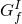
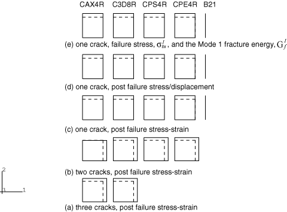
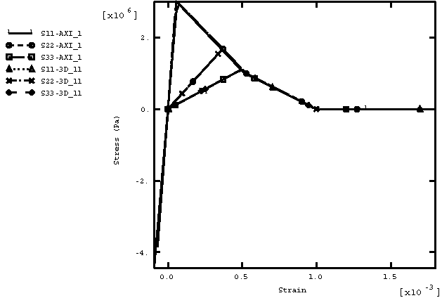
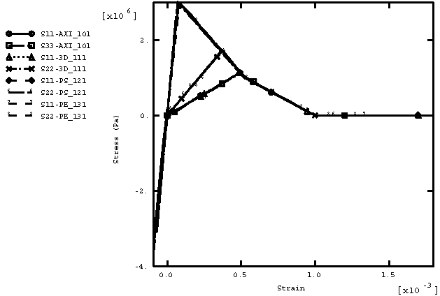
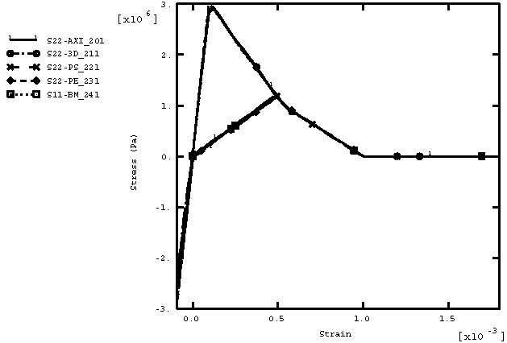
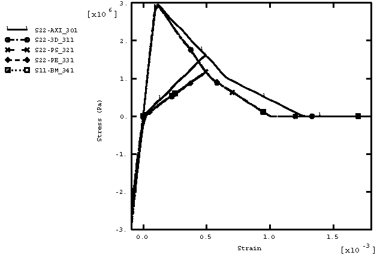
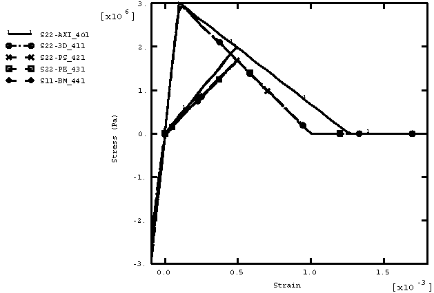

# 2.2.27 脆性裂纹本构模型

**产品：** Abaqus/Explicit

### 测试单元

CAX4R    C3D8R    CPS4R    CPE4R    B21

### 测试特性

加载/卸载/再加载条件下脆性裂纹模型响应。测试不同活动裂纹组合。

### 问题描述

此问题包含21个单元素验证问题，全部在一个输入文件中运行。此问题在加载/卸载/再加载条件下练习脆性裂纹材料模型；针对单裂纹和多裂纹情况练习所有可能的裂纹状态。

[图2.2.27-1](ch02s02abv165.md#exxcrack-deform)显示了分析中使用的21个单元的原始和变形形状。虚线表示原始形状。底行仅包含CAX4R和C3D8R单元，因为它们是唯一不能产生三个同时裂纹的单元。上一行包含除B21以外的所有单元，因为它们是唯一不能产生两个同时裂纹的单元。顶三行包含所有五种单元类型，因为它们指的是导致单裂纹的加载情况。三行用于测试张力软化数据输入的三种不同方式。

每个边的原始长度为  = 1。单元使用幅值函数加载，使其承受拉伸，然后卸载并加载到压缩，然后再加载到拉伸。此加载程序沿一个方向施加（[图2.2.27-1](ch02s02abv165.md#exxcrack-deform)中的行(c)、(d)和(e)）、两个方向（行(b)）或三个方向（行(a)）。这分别产生一个、两个或三个同时裂纹。

使用的材料特性是典型中等强度混凝土的特性：弹性特性为  = 30 × 10^9 Pa， = 0.2；开裂失效应力为 3 × 10^6 Pa；质量密度为2400 kg/m3。

### 结果与讨论

[图2.2.27-2](ch02s02abv165.md#exxcrack-3dirs)显示了CAX4R和C3D8R单元（[图2.2.27-1](ch02s02abv165.md#exxcrack-deform)中的行(a)）所有三个开裂方向中的应力-应变。对于CAX4R，径向和轴向加载同等施加。对于C3D8R，方向1和3以相同的速率加载，而方向2以该速率的四分之三加载。两种单元的结果相同。

[图2.2.27-3](ch02s02abv165.md#exxcrack-2dirs)显示了CAX4R、C3D8R、CPS4R和CPE4R单元（[图2.2.27-1](ch02s02abv165.md#exxcrack-deform)中的行(b)）两个开裂方向中的应力-应变。对于除轴对称情况外的所有情况，方向2以方向1加载速率的四分之三加载。在轴对称情况下，径向和轴向以相同的速率加载。所有单元的结果一致。

[图2.2.27-4](ch02s02abv165.md#exxcrack-straintype)显示了CAX4R、C3D8R、CPS4R、CPE4R和B21单元（[图2.2.27-1](ch02s02abv165.md#exxcrack-deform)中的行(c)）唯一开裂方向（方向2）中的应力-应变。张力软化数据通过指定失效后应力-应变关系来定义。所有单元的结果相同。

[图2.2.27-5](ch02s02abv165.md#exxcrack-disptype)显示了CAX4R、C3D8R、CPS4R、CPE4R和B21单元（[图2.2.27-1](ch02s02abv165.md#exxcrack-deform)中的行(d)）唯一开裂方向（方向2）中的应力-应变。张力软化数据通过指定失效后应力/位移关系来定义。除轴对称单元外，所有单元的结果相同。轴对称结果略有不同，因为Abaqus/Explicit计算的特征长度在轴对称情况下不同。

[图2.2.27-6](ch02s02abv165.md#exxcrack-gfitype)显示了CAX4R、C3D8R、CPS4R、CPE4R和B21单元（[图2.2.27-1](ch02s02abv165.md#exxcrack-deform)中的行(e)）唯一开裂方向（方向2）中的应力-应变。张力软化数据通过指定失效应力  和I型断裂能  来定义。除轴对称单元外，所有单元的结果相同。轴对称结果略有不同，因为Abaqus/Explicit计算的轴对称特征长度不同。

### 输入文件

[cracking.inp](../eif/cracking.inp)

此分析使用的输入数据。

### 图表

**图2.2.27-1** 单元素裂纹模型测试的变形形状。

**图2.2.27-2** 三个开裂方向中的应力-应变：CAX4R和C3D8R单元。

**图2.2.27-3** 两个开裂方向中的应力-应变：CAX4R、C3D8R、CPS4R和CPE4R单元。

**图2.2.27-4** 单一开裂方向中的应力-应变（指定应力-应变）：CAX4R、C3D8R、CPS4R、CPE4R和B21单元。

**图2.2.27-5** 单一开裂方向中的应力-应变（指定应力/位移）：CAX4R、C3D8R、CPS4R、CPE4R和B21单元。

**图2.2.27-6** 单一开裂方向中的应力-应变（指定失效应力和断裂能）：CAX4R、C3D8R、CPS4R、CPE4R和B21单元。

