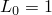
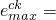
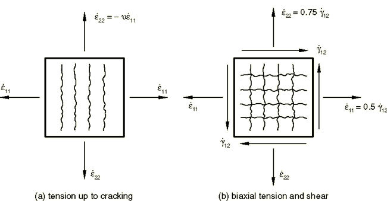
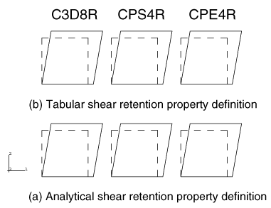
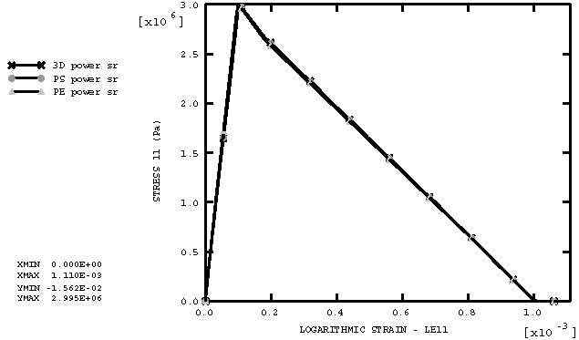
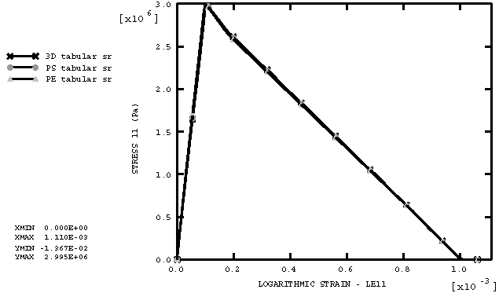
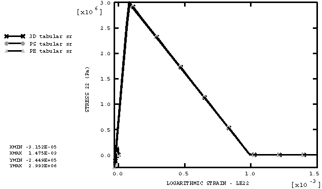
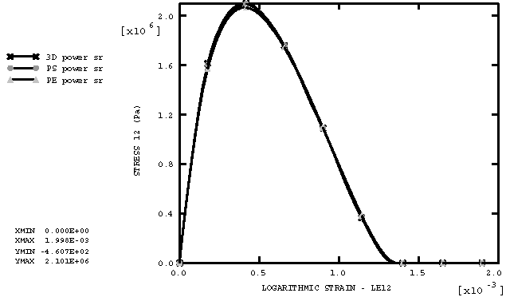

# 2.2.28 裂纹模型：张拉剪切试验

**产品：** Abaqus/Explicit

### 测试单元

C3D8R    CPS4R    CPE4R

### 测试特性

同时拉伸和剪切加载下脆性裂纹模型响应：这验证了模型中使用的剪切保留公式。

### 问题描述

此测试说明了脆性裂纹模型在同时承受拉伸和剪切加载时的行为。这一行为一直是比较不同类型裂纹模型（固定裂纹与旋转裂纹、正交裂纹与非正交裂纹）背景下广泛讨论的主题；例如，参见[Rots和Blaauwendraad (1989)](ch02s02abv166.md#ver-ref-rotsblaauwen)。有人认为，固定正交裂纹模型（如Abaqus/Explicit中实现的模型）产生的剪切行为过于刚硬。在此验证示例中，我们表明事实并非如此，因为Abaqus/Explicit中剪切保留行为的表述方式如此（正如["混凝土和其他脆性材料的裂纹模型"](../stm/stm-link.md#stm-mat-cracking) Abaqus Theory Guide第4.5.3节中所述）。

此处进行的测试最初由[Willam等人(1987)](ch02s02abv166.md#ver-ref-willam)提出。它包括在水平方向（方向1）加载试样，直到垂直裂纹开始（[图2.2.28-1](ch02s02abv166.md#exxcrackts-loadsequence)(a)）；然后试样同时在双轴拉伸和剪切下加载，如图[图2.2.28-1](ch02s02abv166.md#exxcrackts-loadsequence)(b)所示。加载的后一部分导致主应力方向旋转，问题在于裂纹模型是否提供了足够的剪切响应（剪切应力必须在变形发生时消失）。

此测试在六个单元素上进行，全部在一个输入文件中运行。元素每个边的原始长度为 。[图2.2.28-2](ch02s02abv166.md#exxcrackts-deform)显示了分析中使用的六个单元的原始和变形形状。虚线表示原始形状。底行包含C3D8R、CPS4R和CPE4R单元，其剪切保留特性使用幂律解析形式定义，而顶行包含相同的单元，但使用模拟解析形式的表格形式定义剪切保留特性。测试两组单元的目的是验证Abaqus/Explicit中用于定义剪切保留的两种不同选项。

使用的材料特性是典型中等强度混凝土的特性：弹性特性为  = 30 × 10^9 Pa， = 0.2；开裂失效应力为 3 × 10^6 Pa；剪切保留由Abaqus/Explicit提供的幂律定义，其中  = 2， = 0.001；质量密度为2400 kg/m3。

### 结果与讨论

[图2.2.28-3](ch02s02abv166.md#exxcrackts-horiz-powerlaw)显示了使用幂律剪切保留输入定义的三种不同单元类型的水平应力-应变。三种单元类型的结果相同。[图2.2.28-4](ch02s02abv166.md#exxcrackts-horiz-tabular)显示了使用表格剪切保留输入定义的三种不同单元类型的水平应力-应变。三种单元类型的结果再次相同。此外，比较两种不同剪切保留输入定义的结果，我们观察到它们相同。[图2.2.28-5](ch02s02abv166.md#exxcrackts-vert-powerlaw)和[图2.2.28-6](ch02s02abv166.md#exxcrackts-vert-tabular)显示了垂直应力-应变行为的类似结果。使用裂纹模型获得的水平和垂直应力-应变行为是输入张力软化数据的反映，因为试样在水平和垂直方向都开裂。

[图2.2.28-7](ch02s02abv166.md#exxcrackts-shear-powerlaw)显示了使用幂律剪切保留输入定义的三种不同单元类型的剪切应力-应变。三种单元类型的结果相同。[图2.2.28-8](ch02s02abv166.md#exxcrackts-shear-tabular)显示了使用表格剪切保留输入定义的三种不同单元类型的剪切应力-应变。三种单元类型的结果再次相同。此外，比较两种不同剪切保留输入定义的结果，我们观察到它们相同。我们还观察到模型提供的剪切应力增加到最大值（取决于剪切保留特性），然后减小到零。这种类损伤剪切行为是一个重要特性，有人声称旋转裂纹模型提供它，而固定裂纹模型不能。此测试表明，Abaqus/Explicit中实现的裂纹模型确实产生了这种所需的剪切行为。

### 输入文件

[cracking_ts.inp](../eif/cracking_ts.inp)

此分析使用的输入数据。

### 参考

Rots, J. G., and J. Blaauwendraad, "Crack Models for Concrete: Discrete or Smeared? Fixed, Multi-Directional or Rotating?," HERON, vol. 34, no. 1, Delft University of Technology, The Netherlands, 1989.

Willam, K., E. Pramono, and S. Sture, "Fundamental Issues of Smeared Crack Models," Proc. SEM-RILEM International Conference on Fracture of Concrete and Rock, S.P. Shah and S.E. Swartz (Eds.), SEM, Bethel, pp. 192-207, 1987.

### 图表

**图2.2.28-1** 张拉剪切试验加载序列。

**图2.2.28-2** 单元素张拉剪切测试的变形形状。

**图2.2.28-3** 水平应力-应变；幂律剪切保留。

**图2.2.28-4** 水平应力-应变；表格剪切保留。

**图2.2.28-5** 垂直应力-应变；幂律剪切保留。

**图2.2.28-6** 垂直应力-应变；表格剪切保留。

**图2.2.28-7** 剪切应力-应变；幂律剪切保留。

**图2.2.28-8** 剪切应力-应变；表格剪切保留。

