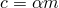

# 2.2.30 Abaqus/Standard中的复合、质量比例和旋转惯性比例阻尼

**产品：** Abaqus/Standard

### I. 复合阻尼

### 测试单元

B31    MASS    ROTARYI    SPRING2

### 问题描述

对由弹簧、质量和旋转惯性单元组成的系统进行特征值分析。弹簧单元建立平移自由度的刚度，而质量被分配到所有六个自由度（由于质量和旋转惯性单元）。为避免求解器奇异性，模型中包含了一个质量可忽略的B31单元。复合阻尼值也被指定用于质量和旋转惯性单元。

### 结果与讨论

由于系统非常简单，可以很容易地检查每种模式的复合阻尼值。这将是元素质量的总和乘以它们投影到模式中并用该模式的广义质量归一化的复合阻尼值。对于此测试输入文件中给出的值，六种请求模式中每种的复合阻尼将等于0.01。

### 输入文件

[mdacmo1yfr.inp](../eif/mdacmo1yfr.inp)

复合阻尼输入文件，也测试[*LOAD CASE*](../key/key-link.md#usb-kws-hloadcase)。

[mdacmo1yfr_anis_mass.inp](../eif/mdacmo1yfr_anis_mass.inp)

带各向异性质量的复合阻尼输入文件；此外，测试[*LOAD CASE*](../key/key-link.md#usb-kws-hloadcase)。

### II. 质量比例阻尼

### 测试单元

MASS    SPRING1

### 问题描述

测试带质量比例阻尼的简单弹簧/质量系统的线性行为（参见["弹簧和阻尼器元素的线性行为"](../bmk/bmk-link.md#bmk-elm-springdashpot)第2.6.2节中的系统A）。MASS单元（*m* = 0.02588）连接到SPRING1单元；因此，系统是接地的。质量比例阻尼参数的值（ = 4.6367852）被选择为使得系统中的阻尼（）与["弹簧和阻尼器元素的线性行为"](../bmk/bmk-link.md#bmk-elm-springdashpot)第2.6.2节的问题I中使用阻尼单元（*c* = 0.12）提供阻尼时相同。

### 参考解

系统的力平衡产生一个二阶线性微分方程，用于单自由度阻尼振荡器，其解与["弹簧和阻尼器元素的线性行为"](../bmk/bmk-link.md#bmk-elm-springdashpot)第2.6.2节问题I中给出的解相同。

### 结果与讨论

质量位移的结果与["弹簧和阻尼器元素的线性行为"](../bmk/bmk-link.md#bmk-elm-springdashpot)第2.6.2节中的结果一致。

### 输入文件

[mdampo1ydy.inp](../eif/mdampo1ydy.inp)

质量比例阻尼输入文件。

[mdampo1ydy_anis_mass.inp](../eif/mdampo1ydy_anis_mass.inp)

带各向异性质量的质量比例阻尼输入文件。

### III. 旋转惯性比例阻尼

### 测试单元

MASS    R2D2    ROTARYI    SPRING2

### 问题描述

测试带旋转惯性比例阻尼的简单弹簧/刚体系统的行为。一个刚体（R2D2单元），在其参考节点有旋转惯性并带有旋转惯性比例阻尼，仅允许绕*z*轴旋转。刚体单元的旋转受到作用在其法向上的两个弹簧约束。在第一步中，刚体在静态过程中旋转10度，从而在弹簧中产生力。在接下来的动态步骤中，上述单自由度系统允许自由振荡。包含了一个额外的扰动步骤来测试负载情况定义。

### 参考解

系统的力矩平衡产生一个二阶线性微分方程，用于单自由度阻尼振荡器。刚体旋转的解析指数衰减正弦解由此获得。

### 结果与讨论

刚体旋转的结果与解析解一致。

### 输入文件

[rotary_inertia_damping.inp](../eif/rotary_inertia_damping.inp)

旋转惯性比例阻尼输入文件，带[*LOAD CASE*](../key/key-link.md#usb-kws-hloadcase)的扰动步骤。
