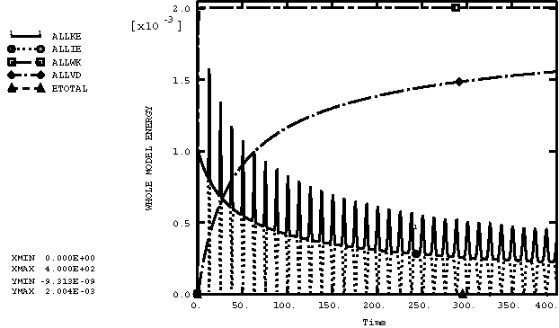

# 2.2.31 Abaqus/Explicit中的材料阻尼

**产品：** Abaqus/Explicit

### 测试单元

CPS4R    CPE4R    C3D8R    CAX4R    B21    B22    B31    B32    S4R    SAX1    M3D4R

### 测试特性

刚度比例材料阻尼。

### 问题描述

此示例问题用于验证刚度比例材料阻尼。一维波通过单行单元传播，并允许随时间衰减。使用了连续体单元和结构单元。C3D8R单元模型如图[图2.2.31-1](ch02s02abv169.md#exxdamping-c3d8rmodel)所示。对于二维单元模型，单元行在一侧的*y*方向受到约束；对于三维单元模型，在*y*和*z*方向受到约束。所有模型在*x*方向的两端都是自由的。对于结构单元，加载是面内的，所有旋转自由度都是固定的。阻尼将导致初始脉冲的振幅和频率减小，直到系统的内能变为零，并且杆具有恒定的纵向速度。

测试了线弹性和超弹性材料。弹性材料的杨氏模量为4.4122 × 10^8 N/m²（6.4 × 10^4 lb/in²），泊松比为0.33，密度为1.069 × 10^10 kg/m³（1.0 × 10^3 lb sec²/in⁴）。超弹性材料是Mooney-Rivlin材料，其常数（对于多项式应变能函数）为  = 551.6 kPa（80.0 lb/in²）， = 137.9 kPa（20 lb/in²），以及  = 4.5322 × 10³ kPa⁻¹（0.03125 psi⁻¹）。其密度为1.069 × 10^7 kg/m³（1.0 lb sec²/in⁴）。在这两种情况下，密度都已增加以减慢波速，使得应力脉冲的波长刚好短于杆的长度。

两种材料的刚度比例阻尼系数为0.01。在Abaqus/Explicit中，还可以通过将阻尼系数指定为温度和/或场变量的表格函数来定义可变刚度比例阻尼。选择大的阻尼系数是为了清楚说明材料阻尼的影响。通常，此材料特性旨在模拟系统的低水平阻尼，在这种情况下，阻尼系数的值将小得多。在所有情况下，线性和二次体积粘度都设置为零。这隔离了刚度比例阻尼的影响。

### 结果与讨论

C3D8R单元模型能量的时间历史如图[图2.2.31-2](ch02s02abv169.md#exxdamping-energybalance)所示。ALLVD的值表示由于阻尼损失的能量。当应力脉冲在杆的两端之间时，动能和应变能相等。当应力波击中自由表面时，波被反射并改变符号。因此，当波的前半部分击中自由端时，它反射的波恰好抵消原始波的后端。在这一点上，系统中所有的应变能都已转化为动能。一旦波完全从端部反射，一半的动能被转移回应变能。如预期的那样，波振幅减小。所有其他测试的单元类型产生类似的结果。

此问题测试所有可用材料模型的刚度比例材料阻尼，但不提供独立验证。

### 输入文件

[damp3d.inp](../eif/damp3d.inp)

三维实体单元，弹性材料定义。

[damppe.inp](../eif/damppe.inp)

平面应变单元，弹性材料定义。

[dampps.inp](../eif/dampps.inp)

平面应力单元，弹性材料定义。

[dampax.inp](../eif/dampax.inp)

轴对称单元，弹性材料定义。

[dampshell.inp](../eif/dampshell.inp)

壳单元，弹性材料定义。

[dampmembrane.inp](../eif/dampmembrane.inp)

膜单元，弹性材料定义。

[dampbeam2d.inp](../eif/dampbeam2d.inp)

二维梁单元，弹性材料定义。

[dampbeam3d.inp](../eif/dampbeam3d.inp)

三维梁单元，弹性材料定义。

[damptruss2d.inp](../eif/damptruss2d.inp)

二维桁架单元，弹性材料定义。

[damptruss3d.inp](../eif/damptruss3d.inp)

三维桁架单元，弹性材料定义。

[damp3dhyper.inp](../eif/damp3dhyper.inp)

三维实体单元，超弹性材料定义。

[damppehyper.inp](../eif/damppehyper.inp)

平面应变单元，超弹性材料定义。

[damppshyper.inp](../eif/damppshyper.inp)

平面应力单元，超弹性材料定义。

[dampaxhyper.inp](../eif/dampaxhyper.inp)

轴对称单元，超弹性材料定义。

[dampshellhyper.inp](../eif/dampshellhyper.inp)

壳单元，超弹性材料定义。

[dampmembranehyper.inp](../eif/dampmembranehyper.inp)

膜单元，超弹性材料定义。

### 图表

**图2.2.31-1** C3D8R单元模型。

**图2.2.31-2** 三维连续单元（C3D8R）能量平衡与时间的关系。

