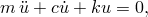
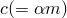
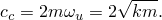
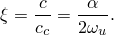
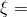
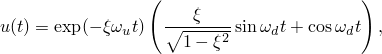
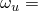
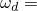
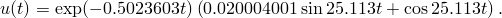
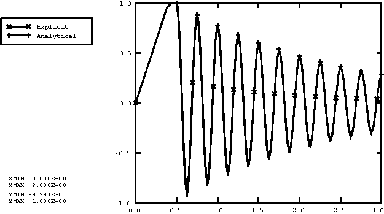

# 2.2.32 Abaqus/Explicit中的质量比例阻尼

**产品：**Abaqus/Explicit  

### 测试的单元

T3D2

### 测试的功能

质量比例阻尼。

### 问题描述

本算例旨在通过将Abaqus/Explicit结果与简单问题的精确解进行比较来验证质量比例阻尼。

质量比例阻尼通过在材料定义中为那些需要质量比例阻尼的单元包含阻尼来定义。

本算例是最简单的动力学系统：一个无质量桁架连接质点到地面。通过赋予桁架材料密度来获得质量，使得桁架的集中质量在桁架自由端给出正确的质点。桁架初始拉伸然后释放，使其进行小振幅振动。将解与通过解析求解运动方程获得的精确解进行比较。

[图2.2.32-1](ch02s02abv170.md#sxmrayleigh-system)显示了几何形状。模型由单个桁架单元组成，类型为T3D2，一端节点被约束，另一端节点仅能在x方向自由移动。桁架的质量矩阵是集中化的；因此，该系统等同于弹簧和集中质量。桁架的横截面积为645 mm2（1 in2），长度为254 mm（10 in）。它由线弹性材料制成，弹性模量为69 GPa（107 lb/in2）。桁架的密度在无约束端提供集中质量2.777×10^-5 kg（1585 lb-s2/in）。

质量在第一步中被平移25.4 mm（1 in）拉伸自由端，然后在第二步中释放。绘制时间历程并与理论值进行比较。

### 结果与讨论

系统的运动方程为

其中m是质量，是阻尼，是质量阻尼因子，k是刚度，u是位移。

假设解的形式为，则有

其中是振动的无阻尼频率。当c的值使该方程的判别式为零时发生临界阻尼，因此

我们将阻尼比定义为，即阻尼与临界阻尼的比值：

该方程中的关系通常用作选择和的基础。

定义的方程可以重写为

我们选择这种情况下阻尼小于临界值，<0.02且<1，系统可以振动。初始条件为：初始位移=1和初始速度=0；因此，运动的动态部分为

其中是系统的阻尼频率。

为产生阻尼比=0.2，使用质量比例阻尼因子=1.00472 sec^-1。也可以通过在Abaqus/Explicit中将阻尼系数指定为温度和/或场变量的表格函数来定义可变质量比例阻尼。理论结果中使用的参数计算为：=25.11802 rad/sec，=25.11300 rad/sec，以及

第二步结束时刻（t=2.5 sec）的位移值为0.2841910 in；Abaqus/Explicit给出0.2717 in，相对误差为4%。对于这个一单元简单桁架模型，使用动态步长的直接用户控制来获得平滑和准确的结果。位移历程与解析结果在[图2.2.32-2](ch02s02abv170.md#exxmassdamp-timehist)中进行了比较。

### 输入文件

[massdamping.inp](../eif/massdamping.inp)

本分析使用的输入数据。

### 图形

**图2.2.32-1** 桁架-质量振动系统。

**图2.2.32-2** 样本时间历程。

