# 2.2.33 Thermal expansion test

**Product: **Abaqus/Explicit  

### Elements tested

B21    B22    B31    B32    PIPE21    PIPE31    C3D8R    C3D10M    CPE4R    CPE6M    CPS4R    CPS6M    CAX4R    CAX6M    M3D4R    S4R    S4RS    S4RSW    SAX1    T2D2    T3D2    

### Features tested

Thermal expansion defined by a predefined temperature field is tested for the following material models: isotropic elasticity, orthotropic elasticity, anisotropic elasticity, lamina, hyperelasticity with polynomial and Ogden forms, hyperelasticity with Arruda-Boyce and Van der Waals forms, hyperfoam, Mises plasticity, Drucker-Prager plasticity, Hill's potential plasticity, crushable foam plasticity with volumetric hardening, crushable foam plasticity with isotropic hardening, ductile failure plasticity, rate-dependent Hill's potential plasticity, rate-dependent Mises plasticity, Drucker-Prager/Cap plasticity, porous metal plasticity, visco-hyperelasticity with polynomial and Ogden forms, visco-hyperelasticity with Arruda-Boyce and Van der Waals forms, and visco-hyperfoam.

### Problem description

The verification tests consist of a set of single element tests that include a combination of all the available elements with all the available materials. All elements are loaded by ramping up the temperature from an initial value of 0 to a final value of 100. The undeformed meshes are shown in [Figure 2.2.33--1](ch02s02abv171.md#exxsimple-elastictest) for the elasticity models, [Figure 2.2.33--2](ch02s02abv171.md#exxsimple-plastictest) for the inelasticity models, and [Figure 2.2.33--3](ch02s02abv171.md#exxsimple-viscoelast-test) for the viscoelasticity models. Material properties are listed in [Table 2.2.33--1](ch02s02abv171.md#table-simpleexpan-elast) for the elastic materials and in [Table 2.2.33--2](ch02s02abv171.md#table-simpleexpan-inelast) for the inelastic materials. The thermal expansion coefficient for all materials is 0.00005.

The degrees of freedom in the vertical direction are constrained for all the nodes, and deformation is allowed only in the horizontal direction. Nodes associated with elements C3D8R and C3D10M are constrained in the out-of-plane direction, which causes a plane strain condition to apply for these elements.

### Results and discussion

The time history plots for isotropic elasticity, Mises plasticity, and viscoelasticity for all of the elements are shown in [Figure 2.2.33--4](ch02s02abv171.md#exxsimple-isotropic), [Figure 2.2.33--5](ch02s02abv171.md#exxsimple-mises), and [Figure 2.2.33--6](ch02s02abv171.md#exxsimple-viscoelast), respectively, except for pipe elements, whose results are consistent with beam elements.

### Input files

[simple_expansion_one.inp](../eif/simple_expansion_one.inp)

Mises plasticity test.

[simple_expansion.inp](../eif/simple_expansion.inp)

Other material models and elements.

### Tables

**Table 2.2.33–1** Material properties for elastic materials.
| Material | Properties | Value |
| --- | --- | --- |
| Isotropic elasticity (density=8032) | E | 193.1 109 |
|  | 0.3 |
| Orthotropic elasticity (density=7850) (ENGINEERING CONSTANTS) |  | 2.0 1011 |
|  | 1.0 1011 |
|  | 1.0 1011 |
|  | 0.3 |
|  | 0.23 |
|  | 0.34 |
|  | 7.69 1010 |
|  | 7.69 1010 |
|  | 9.0 109 |
| Orthotropic elasticity (density=7850) (ORTHOTROPIC) |  | 2.24 1011 |
|  | 1.23 1011 |
|  | 4.79 1011 |
|  | 4.21 1010 |
|  | 4.74 1010 |
|  | 1.21 1011 |
|  | 7.69 1010 |
|  | 7.69 1010 |
|  | 9.00 109 |
| Lamina (density=7800) |  | 2.0 1011 |
|  | 1.5 1011 |
|  | 0.35 |
|  | 2.00 1010 |
|  | 9.00 109 |
|  | 8.50 109 |
| Foam hyperelasticity (density=0.001) | N | 2 |
|  | 0.01 |
| uniaxial test | (0.0217, 0.05) |
|  | ... ... |
|  | (0.02896, 0.80) |
| simple shear test | (0.0140, 0.08, 0.0046) |
|  | ... ... |
|  | (0.2987, 0.72, 0.1904) |
| Anisotropic elasticity (density=7850) |  | 2.24 1011 |
|  | 1.23 1011 |
|  | 4.79 1011 |
|  | 4.21 1010 |
|  | 4.74 1010 |
|  | 1.21 1011 |
|  | 1.00 106 |
|  | 2.00 106 |
|  | 3.00 106 |
|  | 7.69 1010 |
|  | 4.00 106 |
|  | 5.00 106 |
|  | 6.00 106 |
|  | 7.00 106 |
|  | 7.69 1010 |
|  | 8.00 106 |
|  | 9.00 106 |
|  | 1.00 107 |
|  | 1.10 106 |
|  | 1.20 106 |
|  | 9.00 109 |
| Polynomial hyperelasticity (density=1000) | N | 2 |
| uniaxial test | (155060, 0.1338) |
|  | ... ... |
|  | (6.424 106, 6.6433) |
| biaxial test | (93840, 0.02) |
|  | ... ... |
|  | (2.465 106, 3.45) |
| planar test | (60000, 0.0690) |
|  | ... ... |
|  | (1.82 106, 4.0621) |
| Ogden hyperelasticity (density=1000) | N | 3 |
| uniaxial test | (155060, 0.1338) |
|  | ... ... |
|  | (6.424 106, 6.6433) |
| biaxial test | (93840, 0.02) |
|  | ... ... |
|  | (2.465 106, 3.45) |
| planar test | (60000, 0.0690) |
|  | ... ... |
|  | (1.82 106, 4.0621) |
| Arruda-Boyce hyperelasticity (density=1000) | uniaxial test | (155060, 0.1338) |
|  | ... ... |
|  | (6.424 106, 6.6433) |
| biaxial test | (93840, 0.02) |
|  | ... ... |
|  | (2.465 106, 3.45) |
| planar test | (60000, 0.0690) |
|  | ... ... |
|  | (1.82 106, 4.0621) |
| Van der Waals hyperelasticity (density=1000) | uniaxial test | (155060, 0.1338) |
|  | ... ... |
|  | (6.424 106, 6.6433) |
| biaxial test | (93840, 0.02) |
|  | ... ... |
|  | (2.465 106, 3.45) |
| planar test | (60000, 0.0690) |
|  | ... ... |
|  | (1.82 106, 4.0621) |
| Viscoelasticity (density=8032) | E | 193.1 109 |
|  | 0.3 |
| 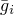 | 0.901001 |
| 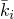 | 0.0 |
|  | 0.99 |
|  | 70 |
|  | 4.92 |
|  | 215 |
| Visco-polynomial hyperelasticity (density=1000) | N | 2 |
| uniaxial test | (155060, 0.1338) |
|  | ... ... |
|  | (6.424 106, 6.6433) |
| biaxial test | (93840, 0.02) |
|  | ... ... |
|  | (2.465 106, 3.45) |
| planar test | (60000, 0.0690) |
|  | ... ... |
|  | (1.82 106, 4.0621) |
|  | 0.901001 |
|  | 0.0 |
|  | 0.99 |
|  | 70 |
|  | 4.92 |
|  | 215 |
| Visco-Ogden hyperelasticity (density=1000) | N | 3 |
| uniaxial test | (155060, 0.1338) |
|  | ... ... |
|  | (6.424 106, 6.6433) |
| biaxial test | (93840, 0.02) |
|  | ... ... |
|  | (2.465 106, 3.45) |
| planar test | (60000, 0.0690) |
|  | ... ... |
|  | (1.82 106, 4.0621) |
|  | 0.901001 |
|  | 0.0 |
|  | 0.99 |
|  | 70 |
|  | 4.92 |
|  | 215 |
| Visco-foam hyperelasticity (density=0.001) | N | 2 |
|  | 0.0 |
| uniaxial test | (0.0217, 0.05) |
|  | ... ... |
|  | (0.02896, 0.80) |
| simple shear test | (0.0140, 0.08, 0.0046) |
|  | ... ... |
|  | (0.2987, 0.72, 0.1904) |
|  | 0.901001 |
|  | 0.0 |
|  | 0.99 |
|  | 70 |
|  | 4.92 |
|  | 215 |
| Visco-Arruda-Boyce hyperelasticity (density=1000) | uniaxial test | (155060, 0.1338) |
|  | ... ... |
|  | (6.424 106, 6.6433) |
| biaxial test | (93840, 0.02) |
|  | ... ... |
|  | (2.465 106, 3.45) |
| planar test | (60000, 0.0690) |
|  | ... ... |
|  | (1.82 106, 4.0621) |
|  | 0.901001 |
|  | 0.0 |
|  | 0.99 |
|  | 70 |
|  | 4.92 |
|  | 215 |
| Visco-Van der Waals hyperelasticity (density=1000) | uniaxial test | (155060, 0.1338) |
|  | ... ... |
|  | (6.424 106, 6.6433) |
| biaxial test | (93840, 0.02) |
|  | ... ... |
|  | (2.465 106, 3.45) |
| planar test | (60000, 0.0690) |
|  | ... ... |
|  | (1.82 106, 4.0621) |
|  | 0.901001 |
|  | 0.0 |
|  | 0.99 |
|  | 70 |
|  | 4.92 |
|  | 215 |

**Table 2.2.33–2** Material properties for inelastic materials.
| Material | Properties | Value |
| --- | --- | --- |
| Mises plasticity (density=8032) | E | 193.1 109 |
|  | 0.3 |
|  | 206893 |
| H | 206893 |
| Drucker plasticity (density=1000) | E | 2.0 107 |
|  | 0.3 |
|  | 40000 |
| H | 40000 |
|  | 40 |
| K | 1.0 |
|  | 20.0 |
| Hill's plasticity (density=2500) | E | 1.0 109 |
|  | 0.3 |
|  | 1.0 106 |
| H | 4.0 105 |
|  | 1.5 |
|  | 1.0 |
|  | 1.0 |
|  | 1.0 |
| 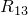 | 1.0 |
| 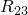 | 1.0 |
| Crushable foam with volumetric hardening (density=500) | E | 3.0 106 |
|  | 0.0 |
| *k* | 1.1 |
|  | 0.1 |
| hardening | (2.2 105, 0.0) |
|  | ... ... |
|  | (6.88 105, 10.0) |
| Crushable foam with isotropic hardening (density=500) | E | 3.0 106 |
|  | 0.0 |
| *k* | 1.1 |
|  | 0.2983 |
| hardening | (2.2 105, 0.0) |
|  | ... ... |
|  | (6.88 105, 10.0) |
| Ductile failure (density=5800) | E | 2.0 108 |
|  | 0.3 |
|  | 2.0 105 |
| H | 4.0 105 |
|  | 0.5 |
| Mises plasticity (density=8032)(rate dependent) | E | 193.1 109 |
|  | 0.3 |
|  | 206893 |
| H | 206893 |
| D | 1000 |
| p | 2.0 |
| Hill's plasticity (density=2500)(rate dependent) | E | 1.0 109 |
|  | 0.3 |
|  | 1.0 106 |
| H | 4.0 105 |
|  | 1.5 |
|  | 1.0 |
|  | 1.0 |
|  | 1.0 |
|  | 1.0 |
|  | 1.0 |
| D | 4000 |
| p | 6.0 |
| Drucker-Prager/Cap plasticity(density=0.0024) | E | 30000 |
|  | 0.3 |
| d | 100 |
|  | 37.67 |
| R | 0.1 |
| 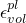 | 0.0 |
|  | 0.01 |
| hardening | (20.96, 0) |
|  | ... ... |
|  | (655.6, 0.00249) |
| Porous metal plasticity(density=7.7 107) | E | 2.0 1011 |
|  | 0.33 |
|  | 7.5 108 |
| H | 0.0 |
|  | 1.0 |
|  | 1.25 |
|  | 1.0 |
|  | 0.1 |
|  | 0.06 |
|  | 0.04 |
|  | 0.8 |
|  | 0.5 |

### Figures

**Figure 2.2.33–1** Simple expansion test for elastic materials.

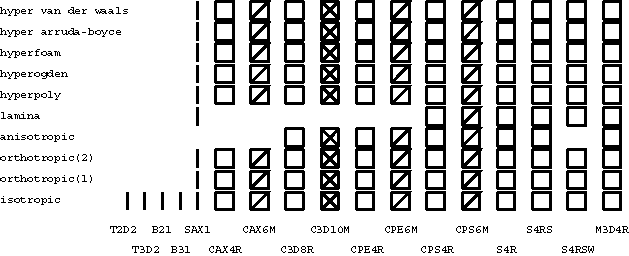

**Figure 2.2.33–2** Simple expansion test for inelastic materials.

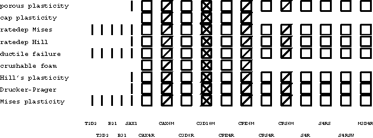

**Figure 2.2.33–3** Simple expansion test for viscoelastic materials.

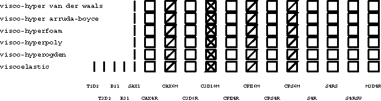

**Figure 2.2.33–4** Mises stress versus time for isotropic elasticity.

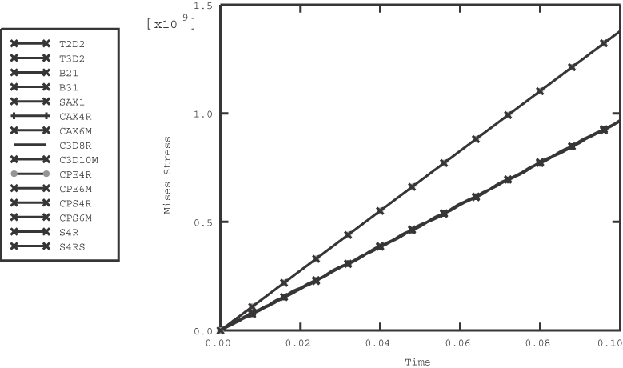

**Figure 2.2.33–5** Mises stress versus time for Mises plasticity.

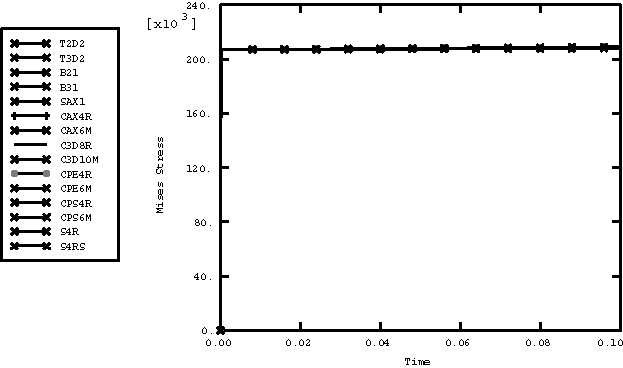

**Figure 2.2.33–6** Mises stress versus time for viscoelasticity.

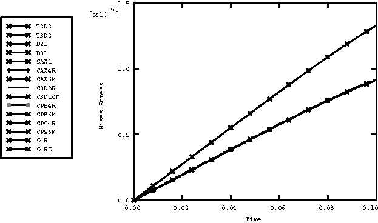

