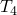

# 2.3.1 热性能

**产品：** Abaqus/Standard   Abaqus/Explicit   

### I. 场变量相关电导率

### 测试单元

C3D8HT    C3D8RHT    C3D8RT    C3D8T    C3D10MHT    C3D10MT    C3D20HT    C3D20RHT    C3D20RT    C3D20T    CAX4HT    CAX4RHT    CAX4RT    CAX4T    CAX6MHT    CAX6MT    CGAX4HT    CGAX4RHT    CGAX4RT    CGAX4T    CGAX6MHT    CGAX6MT    CPE4HT    CPE4RHT    CPE4RT    CPE4T    CPE6MHT    CPE6MT    CPE8HT    CPE8RHT    CPE8RT    CPE8T    CPEG3T    CPEG4HT    CPEG4RHT    CPEG4RT    CPEG4T    CPEG6MHT    CPEG6MT    CPEG8HT    CPEG8RHT    CPEG8T    CPS4RT    CPS4T    CPS6MT    DC3D8    DC3D10    DC3D20    DC2D3    DC2D4    DC2D6    DC2D8    DC1D2    

### 问题描述

执行了具有场变量相关电导率的一维稳态热传导分析。在其电导率是预定义场变量函数的导热棒两侧放置具有恒定电导率的导热棒。这些场变量在分析的四个增量过程中线性变化。

**模型：**

单元 1：长度 = 1.0，面积 = 3.0，电导率 = 150.0

单元 2：长度 = 2.0，面积 = 3.0，电导率 = 场变量相关（见下文）

单元 3：长度 = 3.0，面积 = 3.0，电导率 = 150.0

在 Abaqus/Standard 中，使用耦合温度-位移单元和纯热传导单元对棒进行建模，执行稳态模拟。在 Abaqus/Explicit 中，使用 CPE4RT 单元对导热棒进行建模（假设每个导热棒的单位宽度），并执行瞬态分析。总模拟时间为 1.40 × 10⁶。这为瞬态解达到此问题的稳态条件提供了足够的时间。

**边界条件：**

 = 1000.0， = 0.0

### 结果与讨论

下面报告了棒两端（节点 2 和 3）的温度。这些温度与精确结果相符。

### 输入文件

##### **Abaqus/Standard 输入文件**

[fvdepcond_std_c3d8ht.inp](../eif/fvdepcond_std_c3d8ht.inp)

场变量相关电导率；C3D8HT 单元。

[fvdepcond_std_c3d8rht.inp](../eif/fvdepcond_std_c3d8rht.inp)

场变量相关电导率；C3D8RHT 单元。

[fvdepcond_std_c3d8rt.inp](../eif/fvdepcond_std_c3d8rt.inp)

场变量相关电导率；C3D8RT 单元。

[fvdepcond_std_c3d8t.inp](../eif/fvdepcond_std_c3d8t.inp)

场变量相关电导率；C3D8T 单元。

[fvdepcond_std_c3d10mht.inp](../eif/fvdepcond_std_c3d10mht.inp)

场变量相关电导率；C3D10MHT 单元。

[fvdepcond_std_c3d10mt.inp](../eif/fvdepcond_std_c3d10mt.inp)

场变量相关电导率；C3D10MT 单元。

[fvdepcond_std_c3d20ht.inp](../eif/fvdepcond_std_c3d20ht.inp)

场变量相关电导率；C3D20HT 单元。

[fvdepcond_std_c3d20rht.inp](../eif/fvdepcond_std_c3d20rht.inp)

场变量相关电导率；C3D20RHT 单元。

[fvdepcond_std_c3d20rt.inp](../eif/fvdepcond_std_c3d20rt.inp)

场变量相关电导率；C3D20RT 单元。

[fvdepcond_std_c3d20rt_post.inp](../eif/fvdepcond_std_c3d20rt_post.inp)

场变量相关电导率；[*POST OUTPUT](../key/key-link.md#usb-kws-hpostoutput) 分析。

[fvdepcond_std_c3d20t.inp](../eif/fvdepcond_std_c3d20t.inp)

场变量相关电导率；C3D20T 单元。

[fvdepcond_std_cax4ht.inp](../eif/fvdepcond_std_cax4ht.inp)

场变量相关电导率；CAX4HT 单元。

[fvdepcond_std_cax4rht.inp](../eif/fvdepcond_std_cax4rht.inp)

场变量相关电导率；CAX4RHT 单元。

[fvdepcond_std_cax4rt.inp](../eif/fvdepcond_std_cax4rt.inp)

场变量相关电导率；CAX4RT 单元。

[fvdepcond_std_cax4t.inp](../eif/fvdepcond_std_cax4t.inp)

场变量相关电导率；CAX4T 单元。

[fvdepcond_std_cax6mht.inp](../eif/fvdepcond_std_cax6mht.inp)

场变量相关电导率；CAX6MHT 单元。

[fvdepcond_std_cax6mt.inp](../eif/fvdepcond_std_cax6mt.inp)

场变量相关电导率；CAX6MT 单元。

[fvdepcond_std_cgax4ht.inp](../eif/fvdepcond_std_cgax4ht.inp)

场变量相关电导率；CGAX4HT 单元。

[fvdepcond_std_cgax4rht.inp](../eif/fvdepcond_std_cgax4rht.inp)

场变量相关电导率；CGAX4RHT 单元。

[fvdepcond_std_cgax4rt.inp](../eif/fvdepcond_std_cgax4rt.inp)

场变量相关电导率；CGAX4RT 单元。

[fvdepcond_std_cgax4t.inp](../eif/fvdepcond_std_cgax4t.inp)

场变量相关电导率；CGAX4T 单元。

[fvdepcond_std_cgax6mht.inp](../eif/fvdepcond_std_cgax6mht.inp)

场变量相关电导率；CGAX6MHT 单元。

[fvdepcond_std_cgax6mt.inp](../eif/fvdepcond_std_cgax6mt.inp)

场变量相关电导率；CGAX6MT 单元。

[fvdepcond_std_cpe4ht.inp](../eif/fvdepcond_std_cpe4ht.inp)

场变量相关电导率；CPE4HT 单元。

[fvdepcond_std_cpe4rht.inp](../eif/fvdepcond_std_cpe4rht.inp)

场变量相关电导率；CPE4RHT 单元。

[fvdepcond_std_cpe4rt.inp](../eif/fvdepcond_std_cpe4rt.inp)

场变量相关电导率；CPE4RT 单元。

[fvdepcond_std_cpe4t.inp](../eif/fvdepcond_std_cpe4t.inp)

场变量相关电导率；CPE4T 单元。

[fvdepcond_std_cpe6mht.inp](../eif/fvdepcond_std_cpe6mht.inp)

场变量相关电导率；CPE6MHT 单元。

[fvdepcond_std_cpe6mt.inp](../eif/fvdepcond_std_cpe6mt.inp)

场变量相关电导率；CPE6MT 单元。

[fvdepcond_std_cpe8ht.inp](../eif/fvdepcond_std_cpe8ht.inp)

场变量相关电导率；CPE8HT 单元。

[fvdepcond_std_cpe8rht.inp](../eif/fvdepcond_std_cpe8rht.inp)

场变量相关电导率；CPE8RHT 单元。

[fvdepcond_std_cpe8rt.inp](../eif/fvdepcond_std_cpe8rt.inp)

场变量相关电导率；CPE8RT 单元。

[fvdepcond_std_cpe8t.inp](../eif/fvdepcond_std_cpe8t.inp)

场变量相关电导率；CPE8T 单元。

[fvdepcond_std_cpeg3t.inp](../eif/fvdepcond_std_cpeg3t.inp)

场变量相关电导率；CPEG3T 单元。

[fvdepcond_std_cpeg4ht.inp](../eif/fvdepcond_std_cpeg4ht.inp)

场变量相关电导率；CPEG4HT 单元。

[fvdepcond_std_cpeg4rht.inp](../eif/fvdepcond_std_cpeg4rht.inp)

场变量相关电导率；CPEG4RHT 单元。

[fvdepcond_std_cpeg4rt.inp](../eif/fvdepcond_std_cpeg4rt.inp)

场变量相关电导率；CPEG4RT 单元。

[fvdepcond_std_cpeg4t.inp](../eif/fvdepcond_std_cpeg4t.inp)

场变量相关电导率；CPEG4T 单元。

[fvdepcond_std_cpeg6mht.inp](../eif/fvdepcond_std_cpeg6mht.inp)

场变量相关电导率；CPEG6MHT 单元。

[fvdepcond_std_cpeg6mt.inp](../eif/fvdepcond_std_cpeg6mt.inp)

场变量相关电导率；CPEG6MT 单元。

[fvdepcond_std_cpeg8ht.inp](../eif/fvdepcond_std_cpeg8ht.inp)

场变量相关电导率；CPEG8HT 单元。

[fvdepcond_std_cpeg8rht.inp](../eif/fvdepcond_std_cpeg8rht.inp)

场变量相关电导率；CPEG8RHT 单元。

[fvdepcond_std_cpeg8t.inp](../eif/fvdepcond_std_cpeg8t.inp)

场变量相关电导率；CPEG8T 单元。

[fvdepcond_std_cps4rt.inp](../eif/fvdepcond_std_cps4rt.inp)

场变量相关电导率；CPS4RT 单元。

[fvdepcond_std_cps4t.inp](../eif/fvdepcond_std_cps4t.inp)

场变量相关电导率；CPS4T 单元。

[fvdepcond_std_cps6mt.inp](../eif/fvdepcond_std_cps6mt.inp)

场变量相关电导率；CPS6MT 单元。

[mcdisd1nt1.inp](../eif/mcdisd1nt1.inp)

场变量相关电导率；DC1D2 单元。

[fvdepcond_std_dc3d8.inp](../eif/fvdepcond_std_dc3d8.inp)

场变量相关电导率；DC3D8 单元。

[fvdepcond_std_dc3d10.inp](../eif/fvdepcond_std_dc3d10.inp)

场变量相关电导率；DC3D10 单元。

[fvdepcond_std_dc3d20.inp](../eif/fvdepcond_std_dc3d20.inp)

场变量相关电导率；DC3D20 单元。

[fvdepcond_std_dc2d3.inp](../eif/fvdepcond_std_dc2d3.inp)

场变量相关电导率；DC2D3 单元。

[fvdepcond_std_dc2d4.inp](../eif/fvdepcond_std_dc2d4.inp)

场变量相关电导率；DC2D4 单元。

[fvdepcond_std_dc2d6.inp](../eif/fvdepcond_std_dc2d6.inp)

场变量相关电导率；DC2D6 单元。

[fvdepcond_std_dc2d8.inp](../eif/fvdepcond_std_dc2d8.inp)

场变量相关电导率；DC2D8 单元。

##### **Abaqus/Explicit 输入文件**

[fvdepcond_xpl_cpe4rt.inp](../eif/fvdepcond_xpl_cpe4rt.inp)

场变量相关电导率；CPE4RT 单元。

### II. 电导率和比热容

### 测试单元

CPE4T    CPE4RT    CPEG4T    DC1D3    

### 问题描述

在 Abaqus/Standard 中考虑了使用 DC1D3 单元构建的导热链接的简单瞬态热传导分析。在 Abaqus/Explicit 中，使用 CPE4RT 单元对导热链接进行建模。链接一端的温度是固定的，而热通量被施加到另一端。构成导热链接的材料的电导率和比热容随场变量（FV）的规定值而变化。此场变量的值随时间变化。

在 Abaqus/Standard 和 Abaqus/Explicit 中都执行瞬态分析。总模拟时间为 6。

### 结果与讨论

链接的节点温度证实了材料的热性能确实依赖于场变量。因此，作为场变量函数的材料参数的实际值是正确的，因为温度是由 Abaqus 从这些参数计算得出的。

### 输入文件

##### **Abaqus/Standard 输入文件**

[mcsisd1nt1.inp](../eif/mcsisd1nt1.inp)

电导率和比热容分析；DC1D3 单元。

[fvcondspec_std_cpe4t.inp](../eif/fvcondspec_std_cpe4t.inp)

电导率和比热容分析；CPE4T 单元。

[fvcondspec_std_cpeg4t.inp](../eif/fvcondspec_std_cpeg4t.inp)

电导率和比热容分析；CPEG4T 单元。

##### **Abaqus/Explicit 输入文件**

[fvcondspec_xpl_cpe4rt.inp](../eif/fvcondspec_xpl_cpe4rt.inp)

电导率和比热容分析；CPE4RT 单元。

### III. 间隙电导

### 测试单元

CPEG4T    C3D8RT    C3D8T    DC3D8    DC3D10    DCC3D8    SC8RT    S4RT    

### 问题描述

本节的测试设置为一维均匀热通量情况，使用广义平面应变（仅 Abaqus/Standard）和三维单元。在所有 Abaqus/Standard 情况下执行稳态热传导分析。在 Abaqus/Explicit 中，对每个情况执行瞬态分析，选择的模拟时间确保在此问题中达到稳态条件。特定值（间隙间隙、预定义场变量等）在求解过程中变化，这反过来又影响界面上的电导率，从而影响解。

### 结果与讨论

结果与精确解相符。

### 输入文件

##### **Abaqus/Standard 输入文件**

[mgcgco1ctug.inp](../eif/mgcgco1ctug.inp)

间隙间隙相关电导率，CPEG4T 单元。

[mgcgpo1ctug.inp](../eif/mgcgpo1ctug.inp)

间隙压力相关电导率，CPEG4T 单元。

[mgcgco1ctus.inp](../eif/mgcgco1ctus.inp)

间隙间隙相关电导率，C3D8T 单元。

[mgcgpo1ctus.inp](../eif/mgcgpo1ctus.inp)

间隙压力相关电导率，C3D8T 单元。

[mgcgcd1ctus.inp](../eif/mgcgcd1ctus.inp)

场变量相关电导率，DC3D8 单元。

[mgcoot1hts.inp](../eif/mgcoot1hts.inp)

间隙温度相关电导率，DC3D8 单元。

[mgcood1hts.inp](../eif/mgcood1hts.inp)

间隙场变量相关电导率，DC3D8 单元。

[mgcmfo1hts.inp](../eif/mgcmfo1hts.inp)

间隙质量流率相关电导率，DCC3D8 单元。

[mdc3d10_tdgc_stos_hts.inp](../eif/mdc3d10_tdgc_stos_hts.inp)

间隙温度相关电导率，DC3D10 单元。

##### **Abaqus/Explicit 输入文件**

[gapclearcond_x_c3d8rt.inp](../eif/gapclearcond_x_c3d8rt.inp)

间隙间隙相关电导率，C3D8RT 单元。

[gapclearcond_x_sc8rt.inp](../eif/gapclearcond_x_sc8rt.inp)

间隙间隙相关电导率，SC8RT 单元。

[gappresscond_x_c3d8rt.inp](../eif/gappresscond_x_c3d8rt.inp)

间隙压力相关电导率，C3D8RT 单元。

[gappresscond_x_sc8rt.inp](../eif/gappresscond_x_sc8rt.inp)

间隙压力相关电导率，SC8RT 单元。

[gapfvcond_x_c3d8rt.inp](../eif/gapfvcond_x_c3d8rt.inp)

使用接触对进行场变量相关电导率，C3D8RT 单元。

[gapfvcond_x_gcont_c3d8rt.inp](../eif/gapfvcond_x_gcont_c3d8rt.inp)

使用通用接触进行场变量相关电导率，C3D8RT 单元。

[gapclearcond_x_c3d8t.inp](../eif/gapclearcond_x_c3d8t.inp)

间隙间隙相关电导率，C3D8T 单元。

[gappresscond_x_c3d8t.inp](../eif/gappresscond_x_c3d8t.inp)

使用接触对进行间隙压力相关电导率，C3D8T 单元。

[gappresscond_x_gcont_c3d8t.inp](../eif/gappresscond_x_gcont_c3d8t.inp)

使用通用接触进行间隙压力相关电导率，C3D8T 单元。

[gapfvcond_x_c3d8t.inp](../eif/gapfvcond_x_c3d8t.inp)

场变量相关电导率，C3D8T 单元。

[gapclearanl_x_gcont_c3d8rt.inp](../eif/gapclearanl_x_gcont_c3d8rt.inp)

使用通用接触和解析刚性表面进行间隙间隙相关电导率，C3D8RT 单元。

[gapclearcond_x_gcont_s4rt.inp](../eif/gapclearcond_x_gcont_s4rt.inp)

使用通用接触进行间隙间隙相关电导率，S4RT 单元。
