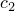
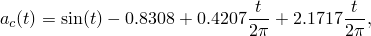
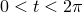
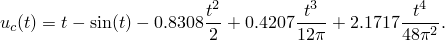

# 3.2.1 具有基准校正的模态动态分析

**产品：** Abaqus/Standard   

### 测试单元

B23    CAX4H    

### 测试功能

简单加速度记录的基准校正。

一次和二次基础运动。

### 问题描述

第一个示例（[pmodbase.inp](../eif/pmodbase.inp)、[pmodbas2.inp](../eif/pmodbas2.inp) 和 [pmodbas2a.inp](../eif/pmodbas2a.inp)）是使用 B23 单元对一单元悬臂结构执行的模态动态时程分析。作为基础运动记录，假设在一个正弦周期时间内使用简单的正弦形加速度记录。记录针对记录持续的总时间进行校正。将基础运动记录选择为正弦函数允许使用 ["加速度记录的基准校正，" Abaqus 理论指南第 6.1.2 节](../stm/stm-link.md#stm-ldc-baselinecorr) 中的公式对记录进行抛物线校正的解析计算。抛物线校正的三个常数值为  = 0.8308， = 0.4207，和  = 2.1717；校正后的加速度记录为

其中 。积分两次得到相应的位移记录：

第二个示例（[pmodbas3.inp](../eif/pmodbas3.inp) 和 [pmodbas4.inp](../eif/pmodbas4.inp)）说明在部分结构固定而另一部分承受激励的时程模态动态分析中多次基础运动的应用。分析的结构是橡胶材料圆柱体的四分之一对称轴对称模型。分析采用 8×8 网格的 CAX4H 单元。结构首先通过刚性压板在轴向静态预压缩，在 [pmodbas3.inp](../eif/pmodbas3.inp) 中建模为刚性表面，在 [pmodbas4.inp](../eif/pmodbas4.inp) 中建模为刚体；假设压板和圆柱体顶面之间完美粘合。寻求刚性表面参考节点处施加的轴向（加速度）激励的响应。加速度记录与第一个问题中使用的记录相同。由于在结构的不同部分中，固定边界条件和施加的加速度边界条件都发生在相同的全局（轴向）方向上，我们将固定边界条件视为一次基础运动，将施加的加速度视为二次基础运动。

### 结果与讨论

第一个示例的结果通过运行输入文件 [pmodbase.inp](../eif/pmodbase.inp)、[pmodbas2.inp](../eif/pmodbas2.inp) 和 [pmodbas2a.inp](../eif/pmodbas2a.inp) 并后处理结果文件输出来确认。尽管三个模型的"基础"组织不同——即第一个输入文件中的基础作为*一次*基础处理，而第二个和第三个输入文件中的基础作为*二次*基础处理——它们产生的结果是相同的。悬臂端总位移的图将显示未校正和校正记录之间的显著差异。

第二个示例通过两个不同输入文件 [pmodbas3.inp](../eif/pmodbas3.inp) 和 [pmodbas4.inp](../eif/pmodbas4.inp) 获得的结果是相同的。

### 输入文件

[pmodbase.inp](../eif/pmodbase.inp)

调用 [*BASE MOTION](../key/key-link.md#usb-kws-hbasemotion) 但不使用 BASE NAME 参数。

[pmodbas2.inp](../eif/pmodbas2.inp)

使用 BASE NAME 参数调用 [*BASE MOTION](../key/key-link.md#usb-kws-hbasemotion)。

[pmodbas2a.inp](../eif/pmodbas2a.inp)

使用 TYPE=DISPLACEMENT 调用 [*BASE MOTION](../key/key-link.md#usb-kws-hbasemotion)。

[pmodbas3.inp](../eif/pmodbas3.inp)

测试多次基础运动和刚性表面。

[pmodbas4.inp](../eif/pmodbas4.inp)

测试多次基础运动和刚性单元。
