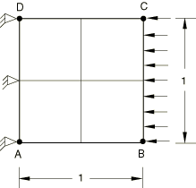
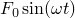
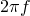

# 3.2.2 二维单元的稳态动态分析

**产品：** Abaqus/Standard   

### 测试单元

CPE3    CPE3H    CPE4    CPE4H    CPE4I    CPE4IH    CPE4R    CPE4RH    CPE6    CPE6H    CPE6M    CPE6MH    CPE8    CPE8H    CPE8R    CPE8RH    CPS3    CPS4    CPS4I    CPS4R    CPS6    CPS6M    CPS8    CPS8R    

### 测试功能

具有阻尼的二维单元的直接求解和基于子空间的稳态动态分析。

### 问题描述

模型由一个固定在边缘  的方形结构组成，在边缘  施加谐波压力。材料阻尼以质量和刚度比例阻尼的形式提供。

**材料：**

弹性模量 = 20 GPa，泊松比 = 0，密度 = 8000 kg/m³。

**边界条件：**

在端部  处  =  = 0。

**阻尼：**

 = 5.36， = 7.46 × 10⁻⁵。

**激励函数：**

（稳态谐波）

*F* = 

 = 30,000 N/m，在边缘  上

 =  Hz

*f* = 10 至 15 Hz

### 参考解

通过与使用 CPS4 单元的基于模态的稳态动态分析进行比较来确认结果。

### 结果与讨论

|  | 峰值位移 | 峰值应力 | 频率 |
| --- | --- | --- | --- |
|  | (mm) | (N/mm²) | (Hz) |
| 参考解 | 16.90 | 0.478 | 12.18 |
| 3节点单元 | 17.55 | 0.481 | 12.07 |
| 6节点单元 | 16.46 | 0.539 | 12.47 |
| 6节点修正单元 | 16.85 | 0.536 | 12.37 |
| 4节点单元 | 16.92 | 0.478 | 12.17 |
| 8节点单元 | 16.45 | 0.540 | 12.47 |

### 输入文件

[pssdce3sf.inp](../eif/pssdce3sf.inp)

CPE3 单元。

[pssdce3sh.inp](../eif/pssdce3sh.inp)

CPE3H 单元。

[pssdce4sf.inp](../eif/pssdce4sf.inp)

CPE4 单元。

[pssdce4sh.inp](../eif/pssdce4sh.inp)

CPE4H 单元。

[pssdce4si.inp](../eif/pssdce4si.inp)

CPE4I 单元。

[pssdce4sj.inp](../eif/pssdce4sj.inp)

CPE4IH 单元。

[pssdce4sr.inp](../eif/pssdce4sr.inp)

CPE4R 单元。

[pssdce4sy.inp](../eif/pssdce4sy.inp)

CPE4RH 单元。

[pssdce6sf.inp](../eif/pssdce6sf.inp)

CPE6 单元。

[pssdce6sh.inp](../eif/pssdce6sh.inp)

CPE6H 单元。

[pssdce6sk.inp](../eif/pssdce6sk.inp)

CPE6M 单元。

[pssdce6sl.inp](../eif/pssdce6sl.inp)

CPE6MH 单元。

[pssdce8sf.inp](../eif/pssdce8sf.inp)

CPE8 单元。

[pssdce8sh.inp](../eif/pssdce8sh.inp)

CPE8H 单元。

[pssdce8sr.inp](../eif/pssdce8sr.inp)

CPE8R 单元。

[pssdce8sy.inp](../eif/pssdce8sy.inp)

CPE8RH 单元。

[pssdcs3sf.inp](../eif/pssdcs3sf.inp)

CPS3 单元。

[pssdcs4sf.inp](../eif/pssdcs4sf.inp)

CPS4 单元。

[pssdcs4si.inp](../eif/pssdcs4si.inp)

CPS4I 单元。

[pssdcs4sr.inp](../eif/pssdcs4sr.inp)

CPS4R 单元。

[pssdcs6sf.inp](../eif/pssdcs6sf.inp)

CPS6 单元。

[pssdcs6sk.inp](../eif/pssdcs6sk.inp)

CPS6M 单元。

[pssdcs8sf.inp](../eif/pssdcs8sf.inp)

CPS8 单元。

[pssdcs8sr.inp](../eif/pssdcs8sr.inp)

CPS8R 单元。

[pssdmcs4sf.inp](../eif/pssdmcs4sf.inp)

参考基于模态的稳态动态分析。
