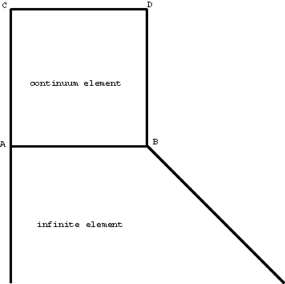
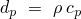
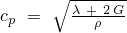
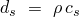
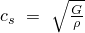

# 3.2.3 无限单元的稳态动态分析

**产品：** Abaqus/Standard   

### 测试单元

CIN3D8    CIN3D12R    CIN3D18R    CINAX4    CINAX5R    CINPE4    CINPE5R    CINPS4    CINPS5R    

### 测试功能

无限单元的直接求解稳态动态分析。

### 问题描述

模型由连接到一块规则连续体有限元的单个无限单元组成。该模型承受平面波和剪切波。将此分析的结果与将无限单元替换为在 A 和 B 点连接到规则连续体单元的阻尼器的参考解进行比较。与平面波相对应的阻尼系数  计算为 ，其中  是平面波速度。类似地，与剪切波相对应的阻尼系数  计算为 ，其中  是剪切波速度。

**材料：**

弹性模量 = 1.0，泊松比 = 0.1，密度 = 0.01。

**边界条件：**

平面波：沿边缘 CD 的  = 1.0 × 10⁴，整个模型中  = 0。

剪切波：沿边缘 CD 的  = 1.0 × 10⁴，整个模型中  = 0。

### 结果与讨论

通过与将无限单元替换为阻尼器的模型的直接求解稳态动态分析进行比较来确认结果。在所有情况下，位移和相位角都与参考解匹配。

### 输入文件

[ec38ifxw.inp](../eif/ec38ifxw.inp)

CIN3D8 单元。

[ec38ifxt.inp](../eif/ec38ifxt.inp)

被阻尼器替换的 CIN3D8 单元。

[ec3dirxw.inp](../eif/ec3dirxw.inp)

CIN3D12R 单元。

[ec3dirxt.inp](../eif/ec3dirxt.inp)

被阻尼器替换的 CIN3D12R 单元。

[ec3eirxw.inp](../eif/ec3eirxw.inp)

CIN3D18R 单元。

[ec3eirxt.inp](../eif/ec3eirxt.inp)

被阻尼器替换的 CIN3D18R 单元。

[eca4ifxw.inp](../eif/eca4ifxw.inp)

CINAX4 单元。

[eca4ifxt.inp](../eif/eca4ifxt.inp)

被阻尼器替换的 CINAX4 单元。

[eca5irxw.inp](../eif/eca5irxw.inp)

CINAX5R 单元。

[eca5irxt.inp](../eif/eca5irxt.inp)

被阻尼器替换的 CINAX5R 单元。

[ece4ifxw.inp](../eif/ece4ifxw.inp)

CINPE4 单元。

[ece4ifxt.inp](../eif/ece4ifxt.inp)

被阻尼器替换的 CINPE4 单元。

[ece5irxw.inp](../eif/ece5irxw.inp)

CINPE5R 单元。

[ece5irxt.inp](../eif/ece5irxt.inp)

被阻尼器替换的 CINPE5R 单元。

[ecs4ifxw.inp](../eif/ecs4ifxw.inp)

CINPS4 单元。

[ecs4ifxt.inp](../eif/ecs4ifxt.inp)

被阻尼器替换的 CINPS4 单元。

[ecs5irxw.inp](../eif/ecs5irxw.inp)

CINPS5R 单元。

[ecs5irxt.inp](../eif/ecs5irxt.inp)

被阻尼器替换的 CINPS5R 单元。
