# 3.3.1 时间精确的层流涡旋脱落

**产品：** Abaqus/CFD   

### 测试单元

FC3D8

### 测试功能

时间精度、层流、表面输出、时间历史数据、空间和时间精度。

### 问题描述

圆柱体上的二维层流是一个文献丰富的流体力学问题，使其适合验证。此问题的特征是由圆柱体几何形状引起的逆压梯度导致的边界层分离。流动由雷诺数 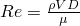 表征，使用自由流速度 *V* 和圆柱体直径 *D* 定义，其中  和  分别是流体的动力粘度和密度。在足够高的雷诺数 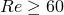 下，流动变得非稳态，其特征是涡旋以交替方式从圆柱体两侧脱落。产生的下游尾流模式称为卡门涡街。涡旋脱落的频率由称为斯特劳哈尔数的无量纲参数表征 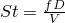，其中 *f* 是涡旋脱落频率。实验研究表明斯特劳哈尔数依赖于雷诺数（[Roshko, 1954](ch03s03abv180.md#ver-ref-roshko)），表明尽管几何形状简单，流动却远非简单。

这个问题被选为 Abaqus/CFD 验证问题是因为简单的几何形状、非稳态动力学以及可用于比较的实验和数值结果。具体来说，我们考虑  流动的情况作为基准问题，其中斯特劳哈尔数 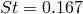 是使用 [Roshko, 1954](ch03s03abv180.md#ver-ref-roshko) 给出的关联公式从实验数据中获得的。研究的目的是重现流动的非稳态结构，并测量 Abaqus/CFD 的收敛率。

**模型：**

模型由矩形域中的二维圆柱体组成，如图 3.3.1--1 所示（[Figure 3.3.1--1](ch03s03abv180.md#ver-vortexcyl-geom-nls)）。入口边界位于圆柱体轴线上游 8*D* 处，出口边界表面位于圆柱体轴线下游 25*D* 处，顶部和底部表面位于离圆柱体轴线 8*D* 处。圆柱体在跨度方向的厚度为 0.2*D*。

**图 3.3.1–1** 模型几何形状。

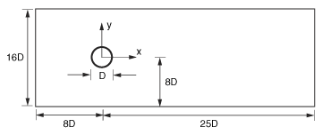

**网格：**

域拓扑（见图 3.3.1--2（[Figure 3.3.1--2](ch03s03abv180.md#ver-vortexcyl-mesh-topology-nls)）被划分为两个区域：圆柱体区域——即由 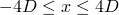 和 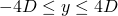 限定的框，原点位于圆柱体中心（圆）——以及覆盖域补集的远场和尾流区域。

**图 3.3.1–2** 网格拓扑。

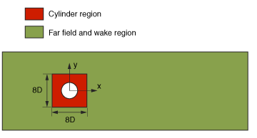

在这项研究中，采用五种具有不同单元尺寸的网格，总结于表 3.3.1--1（[Table 3.3.1--1](ch03s03abv180.md#table-vortexcyl-mesh-desc)）中。网格细化在整个计算域中均匀进行（见图 3.3.1--3（[Figure 3.3.1--3](ch03s03abv180.md#ver-vortexcyl-mesh)））。为了测量网格细化，使用网格度量 *h*（来自 [ASME V V 20-2009](ch03s03abv180.md#ver-prc-ref-asme)）来比较网格之间的结果：

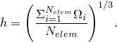

这里，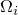 表示给定单元 *i* 的体积，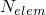 是网格中单元的数量。

**表 3.3.1–1** 网格描述。
| 网格 | 单元数量 | *h/D* |
| --- | --- | --- |
| 1 | 2,520 | 0.3471 |
| 2 | 4,068 | 0.2959 |
| 3 | 5,902 | 0.2614 |
| 4 | 7,630 | 0.2399 |
| 5 | 10,080 | 0.2187 |

**图 3.3.1–3** 网格 1。

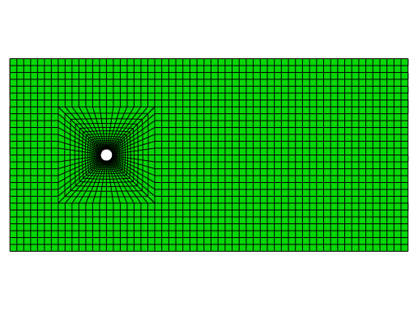

**边界条件：**

施加在模型上的边界条件如图 3.3.1--4 所示（[Figure 3.3.1--4](ch03s03abv180.md#ver-vortexcyl-bc-nls)）。

**图 3.3.1–4** 边界条件。

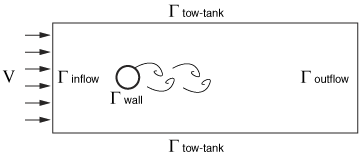

在入口表面（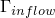）上，流体速度以分量形式指定为（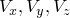）=（*V*, 0, 0）。在顶部和底部表面（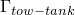）上，指定水槽速度条件为（）=（*V*, 0, 0）。在出口表面（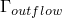）上，通过设置压力 *p* = 0 来指定出口边界条件（牵引自由）（速度梯度自动设置为零用于此边界）。在圆柱体表面（）上，强制执行无滑移/无穿透边界条件，由（）=（0, 0, 0）给出。最后，通过规定域表面上所有位置的平面外速度  为零，并沿圆柱体轴线仅使用一个单元通过厚度，来强制问题的二维特性。

**初始条件：**

速度 *V* 在流场中处处设置为零。通过将边界条件插入规定的初始速度场，然后投影到无散度子空间，获得满足不可压缩 Navier-Stokes 方程可解性条件的速度初始条件。对速度初始条件的这种质量调整是保证流动问题良好提出的必要条件。

**问题设置：**

流体密度、圆柱体直径、入口速度和动力粘度值分别指定为  = 1 kg/m³、*D* = 1 m、*V* = 1 m/s 和  = 0.01 kg/ms。这些值产生雷诺数为 100。对于所有网格，使用 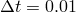 的固定步长和总模拟时间 *t* = 350 s 执行瞬态流动模拟。使用的固定  小于为所有网格计算的固定 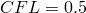 数。对于扩散和对流项使用 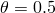 的时间权重；求解器选项设置为默认值，但压力泊松方程（PPE）求解器容差设置为 10⁻⁸（默认 10⁻⁵）。

### 结果与讨论

本验证研究旨在评估 Abaqus/CFD 对于 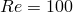 流动的时间精度，其中霍普夫分岔导致稳态周期性涡旋脱落。实验数据和成熟的数值计算被用作基准解来与这里获得的结果进行比较。

涡旋脱落首次发育的时间取决于网格质量。对于本研究中使用的所有网格，大约在 225 个时间单位后建立完整的周期性涡旋脱落系统，此后进行 125 个时间单位的数值计算，以收集所有网格的阻力系数（）、升力系数（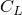）和速度（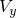）的时间历史数据。使用数值离散快速傅里叶变换分析  时间历史信号以提取主频率。对于这个中等 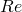 情况，只有一个主频率（对应于霍普夫分岔），也可以通过在时间样本期间计算零交叉次数直接计算。两种方法产生了有效相同的结果。

图 3.3.1--5（[Figure 3.3.1--5](ch03s03abv180.md#ver-vortexcyl-probes)）指示了四个位置，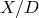 = (4, 8, 12, 16)，大约在中心线上方 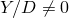，用红色标记，在网格 5 中收集 *y* 速度的时间历史。

**图 3.3.1–5** 网格 5 中历史探头的位置。

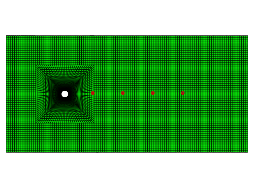

图 3.3.1--6（[Figure 3.3.1--6](ch03s03abv180.md#ver-vortexcyl-velocity-hist)）显示了在这四个位置的速度时间历史。时间历史结果表明，随着采样点远离圆柱体，速度振幅减小，部分由粘性耗散引起，部分由涡旋结构的放大/合并引起。

**图 3.3.1–6** 网格 5 的  时间历史。

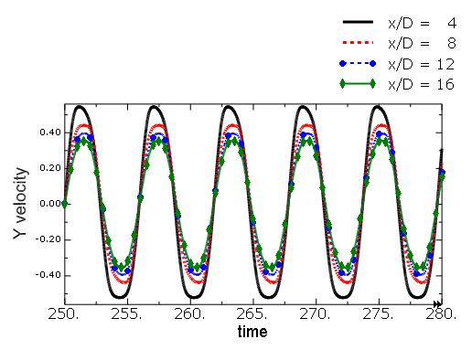

然而，振荡频率在所有位置保持恒定。图 3.3.1--7（[Figure 3.3.1--7](ch03s03abv180.md#ver-vortexcyl-clvstime)）显示了网格 5 的  系数演变：结果显示了升力的渐进增加，然后在涡旋脱落动力学建立后达到稳态。计算的平

均升力系数等于 0。

**图 3.3.1–7** 网格 5 的升力系数时间历史。

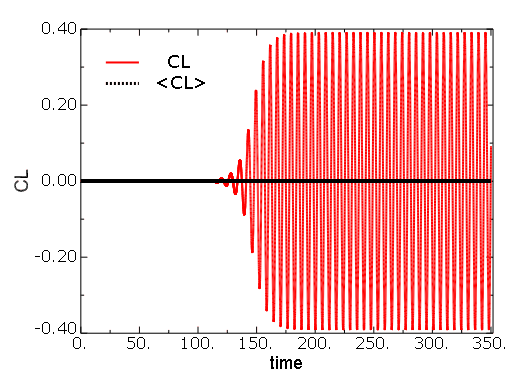

图 3.3.1--8（[Figure 3.3.1--8](ch03s03abv180.md#ver-vortexcyl-cdvstime)）显示了网格 5 的  时间历史数据的 50 秒跨度，揭示了由涡旋脱落引起的阻力周期性变化。涡旋脱落周期的频率等于阻力信号频率的一半。

**图 3.3.1–8** 网格 5 的阻力系数时间历史。

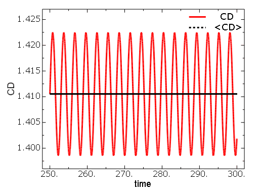

其他网格的结果表现出相同的行为；因此，这些结果不在这里呈现。为了计算涡旋脱落频率，计算阻力系数的频谱为

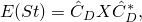

其中 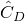 是阻力系数的傅里叶变换，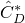 是其复共轭。阻力系数定义为

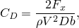

其中  是阻力（流动方向上的积分力），*b* 是圆柱体的跨度尺寸。图 3.3.1--9（[Figure 3.3.1--9](ch03s03abv180.md#ver-vortexcyl-spect-coarse)）显示了为网格 5 计算的相对于斯特劳哈尔数的频谱，表明主频率位于 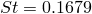。

**图 3.3.1–9** 网格 4 的阻力系数频谱与斯特劳哈尔数的关系。

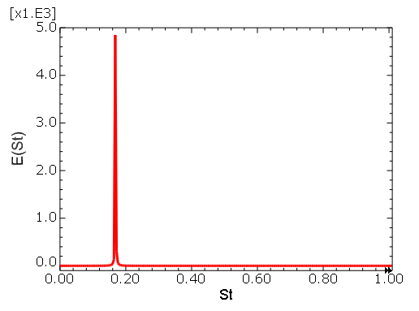

遵循相同的过程，本研究中使用的所有网格计算的斯特劳哈尔数总结于表 3.3.1--2（[Table 3.3.1--2](ch03s03abv180.md#table-calc-st-number)）中。

**表 3.3.1–2** 计算的斯特劳哈尔数。
| 网格 |  | 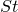 | 每周期样本数 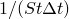 |
| --- | --- | --- | --- |
| 1 | 0.01 | 0.1559 | 641 |
| 2 | 0.01 | 0.1639 | 610 |
| 3 | 0.01 | 0.1639 | 610 |
| 4 | 0.01 | 0.1679 | 600 |
| 5 | 0.01 | 0.1679 | 600 |

最细网格（网格 5）的结果与实验结果 *St* = 0.167（0.5% 差异）和 [Engelman and Jamnia, 1990](ch03s03abv180.md#ver-ref-engelman) 的结果（3.0% 差异）良好一致，比较总结于表 3.3.1--3（[Table 3.3.1--3](ch03s03abv180.md#table-benchmark-st-number)）中。在与基准计算比较时观察到的较高差异对应于涡旋脱落周期被解析的保真度；而 [Engelman and Jamnia, 1990](ch03s03abv180.md#ver-ref-engelman) 每涡旋脱落周期解析了 20 个样本点，Abaqus/CFD 每周期解析了 600 个样本点。这里每周期样本数计算为 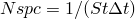。

**表 3.3.1–3** 基准计算计算的斯特劳哈尔数（[Engelman and Jamnia, 1990](ch03s03abv180.md#ver-ref-engelman)）。
| 网格 |  |  | 每周期样本数  |
| --- | --- | --- | --- |
| 粗 | 0.269 | 0.172 | 22 |
| 中 | 0.264 | 0.172 | 22 |
| 细 | 0.266 | 0.173 | 22 |

为了进一步评估代码的空间精度，使用对  时间信号平均获得的平均阻力系数与 Richardson 外推法一起使用来估计收敛率。结果总结于表 3.3.1--4（[Table 3.3.1--4](ch03s03abv180.md#table-calc-mean-cd)）中，图 3.3.1--10（[Figure 3.3.1--10](ch03s03abv180.md#ver-vortexcyl-cdvsh)）显示了阻力系数作为网格度量（*h*）函数的收敛。此外，从 [Engelman and Jamnia, 1990](ch03s03abv180.md#ver-ref-engelman) 获取的基准解显示在表 3.3.1--5（[Table 3.3.1--5](ch03s03abv180.md#table-benchmark-mean-cd)）中。

**表 3.3.1–4** 计算的平均阻力系数。
| 网格 | *h/D* | 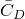 |
| --- | --- | --- |
| 1 | 0.3471 | 1.3848 |
| 2 | 0.2959 | 1.4000 |
| 3 | 0.2614 | 1.4065 |
| 4 | 0.2399 | 1.4078 |
| 5 | 0.2187 | 1.4105 |

**图 3.3.1–10** 阻力系数作为网格度量 *h* 的函数。

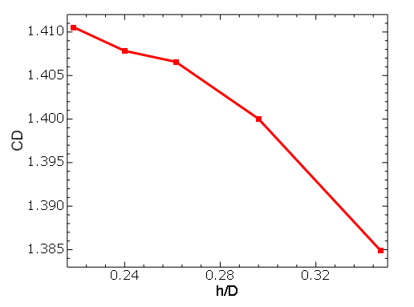

**表 3.3.1–5** 基准计算的平均阻力系数（[Engelman and Jamnia, 1990](ch03s03abv180.md#ver-ref-engelman)）。
| 网格 | *h/D* |  |
| --- | --- | --- |
| 粗 | 0.7791 | 1.405 |
| 中 | 0.6930 | 1.410 |
| 细 | 0.6128 | 1.411 |

Abaqus/CFD 的空间收敛率可以使用四个网格的结果进行估计。遵循 [ASME V V 20-2009](ch03s03abv180.md#ver-prc-ref-asme)，数值解中的误差可计算为

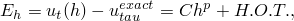

其中 *H.O.T.* 代表高阶项，*h* 表示表 3.3.1--1（[Table 3.3.1--1](ch03s03abv180.md#table-vortexcyl-mesh-desc)）中给出的特征网格度量大小。为了估计收敛率，需要知道阻力系数的精确值。作为第一种方法，对 [Engelman and Jamnia, 1990](ch03s03abv180.md#ver-ref-engelman) 数据进行二阶 Richardson 外推，表 3.3.1--5（[Table 3.3.1--5](ch03s03abv180.md#table-benchmark-mean-cd)）中提供了这些数据。阻力系数精确值的高阶近似 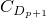 获得为

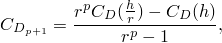

其中 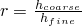，使得  = 1.4207。这个值接近 [Wieselsberger, 1922](ch03s03abv180.md#ver-ref-wieselsberger) 报告的实验数据 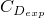 = 1.422。因此，使用实验阻力系数来计算计算中的误差。图 3.3.1--11（[Figure 3.3.1--11](ch03s03abv180.md#ver-vortexcyl-pvsh)）显示了阻力预测误差的绝对值。

**图 3.3.1–11** 阻力系数作为网格度量 *h* 的函数的收敛。

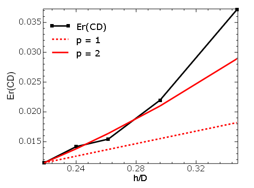

结果表明误差以与 Abaqus/CFD 二阶空间精度一致的速度衰减，图上绘制了斜率 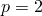 的线来说明这一点。然而，收敛速度的非单调性是由网格生成过程中缺乏控制引起的。并非总是能够一致地细化网格的所有区域，特别是在圆柱体区域，这略微影响了网格度量 *h*，从而影响了收敛速度。

遵循 [ASME V V 20-2009](ch03s03abv180.md#ver-prc-ref-asme)，两个计算之间的观测收敛可以近似为

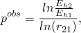

其中 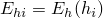 和 ，且 。表 3.3.1--6（[Table 3.3.1--6](ch03s03abv180.md#table-calc-conv-rate)）显示了使用上述方程计算的收敛速度。

**表 3.3.1–6** 计算的收敛速度。
| 网格 | *h*/*D* |  |
| --- | --- | --- |
| 1 | 0.3758 | --- |
| 2 | 0.2959 | 2.1324 |
| 3 | 0.2614 | 2.84 |
| 4 | 0.2399 | 1.00 |
| 5 | 0.2187 | 2.28 |

### 总结

使用 Abaqus/CFD 成功计算了圆柱体上的非稳态不可压缩流动。计算的涡旋脱落频率与实验数据和之前的数值计算良好一致。此外，测量了 Abaqus/CFD 阻力系数的估计总体收敛率，发现与代码的理论二阶精度密切一致。

### 输入文件

[vortex_shedding_mesh_1_VER.inp](../eif/vortex_shedding_mesh_1_VER.inp)

网格 1：具有 2520 个单元的网格。

[vortex_shedding_mesh_2_VER.inp](../eif/vortex_shedding_mesh_2_VER.inp)

网格 2：具有 4068 个单元的网格。

[vortex_shedding_mesh_3_VER.inp](../eif/vortex_shedding_mesh_3_VER.inp)

网格 3：具有 5902 个单元的网格。

[vortex_shedding_mesh_4_VER.inp](../eif/vortex_shedding_mesh_4_VER.inp)

网格 4：具有 7630 个单元的网格。

[vortex_shedding_mesh_5_VER.inp](../eif/vortex_shedding_mesh_5_VER.inp)

网格 5：具有 10080 个单元的网格。

### 参考

ASME V V 20-2009，"Computational Fluid Dynamics and Heat Transfer 验证和确认标准，"美国机械工程师协会。

Engelman, M. S., and M. A. Jamnia，"圆柱体瞬态流动：基准解，"国际数值方法在流体中的应用，vol. 11，pp. 985–1000，1990。

Roshko, A.，"关于从涡街发展而来的湍流尾流，"美国国家航空咨询委员会，华盛顿 D. C.，报告 1191，1954。

Wieselsberger, C.，"流体阻力定律的新数据，"NACA-TN-84，1922。
