# 3.3.2 Two-dimensional turbulent channel flow

**Product: **Abaqus/CFD  

### Element tested

FC3D8

### Features tested

Spalart-Allmaras turbulence model.

### Problem description

 Two-dimensional turbulent flow in a plane channel is used to verify the Spalart-Allmaras model.  This canonical problem uses a simple geometry and permits direct comparison with the “law of the wall.”

 Experimental evidence and dimensional analysis on flat-plate boundary layers and channel flows indicate that the hydrodynamically fully developed velocity profile collapses to a universal velocity profile when normalized with appropriated viscous units. This result is known as the law of the wall and is composed of three main regions in channel flows explained by [Pope (2000)](ch03s03abv181.md#ver-ref-pope).

| The inner layer: | In this region the viscous stress dominates and the mean velocity profile exhibits a linear profile. |
| --- | --- |
| The outer layer: | In this region the turbulent stresses dominate and the mean velocity profile exhibits a logarithmic profile. |
| The buffer layer: | In this region---a transition zone---both the viscous and turbulent stresses are important. The velocity profile exhibits a smooth transition that connects the linear and logarithmic regions. |

The inner and outer profiles are described below.  The nondimensional velocity, 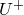, and wall-normal distance, , are defined as

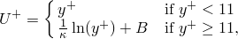

 where

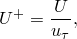

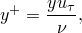

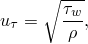

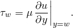

 Here, *U* is the streamwise velocity, *y* is the wall-normal direction,  is the kinematic viscosity,  is the dynamic viscosity,  is the fluid density, 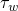 is the shear stress at the wall, and 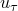 is the friction velocity or characteristic velocity of the shear stress at the wall. Finally,  and 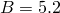 are constants.

 The turbulent flow in a plane channel is characterized by a Reynolds number that uses the friction velocity and the channel half-width  (*H*/2).   The Reynolds number based on friction velocity is

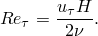

In this study a channel flow with 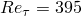 is selected as our test case since it is sufficiently high to warrant a fully turbulent flow without requiring excessively high mesh resolution to resolve the inner layer of the flow.

**Model: **

The model consists of a two-dimensional rectangular domain of dimension 10*H* in the *x*-direction, *H* in the *y*-direction, and 0.2*H* in the spanwise (out-of-plane) *z*-direction. Here, the channel height, *H*, is used to parameterize the domain geometry (see [Figure 3.3.2--1](ch03s03abv181.md#ver-ifluid-turb-channel-domain-nls)).

**Figure 3.3.2–1** Model geometry.

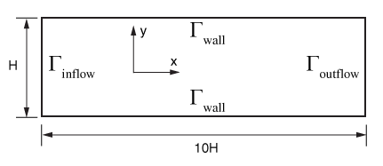

**Mesh: **

 Due to the complexity of turbulent flows, the meshes need to be designed carefully to capture all the relevant turbulent scales of the problem and to satisfy the requirements of the turbulent model. For wall-bounded flows it is required that the wall-normal resolution () reach the inner layer of the flow. Here, the near-wall resolution is defined as the location of the cell center of the first element cell adjacent to the wall. This constraint also applies to the Spalart-Allmaras model, which needs to resolve the inner layer requiring a near-wall resolution in the order of 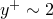 to provide accurate predictions. Consequently, the meshes used in this study are designed keeping this restriction in mind.  The finest mesh uses a near-wall resolution of 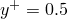 with a streamwise and spanwise resolution of 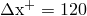 and 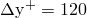, respectively. The resolution in the streamwise direction could be relaxed more, but it was desired to maintain a relatively fine resolution to eliminate any dependence on the *x*-direction from the convergence study.

Five meshes, summarized in [Table 3.3.2--1](ch03s03abv181.md#table-mesh-details), were created. 

**Table 3.3.2–1** Mesh description.
| Mesh | Number of nodes () | Number of elements | *h*/*H* |  |
| --- | --- | --- | --- | --- |
| 1 | 50, 23, 2 | 1078 | 1.013 102 | 4.00 |
| 2 | 50, 45, 2 | 2156 | 5.063 103 | 2.00 |
| 3 | 50, 91, 2 | 4410 | 2.532 103 | 1.00 |
| 4 | 50, 135, 2 | 6566 | 1.687 103 | 0.66 |
| 5 | 50, 181, 2 | 8820 | 1.266 103 | 0.50 |

The meshes are designed by defining the distance of the first node away from the wall, 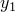, and the number of nodes in the wall-normal direction, 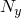. Mesh refinement is conducted by modifying  and  in the same proportion. Starting from a base mesh with 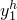 and 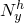, a refined mesh, 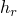, is obtained by refinement where the refinement ratio, *r*, is defined as 

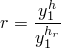

 or as

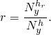

Here, the refinement ratio is always 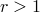. Similarly, a coarser mesh, 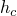, is obtained by defining a coarsening factor, *c*, which is defined as

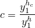

 or as

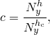

 with 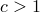. In the streamwise direction the number of nodes is kept constant for all meshes in this study.

 The node distribution is accomplished in the following form. The nodes in the streamwise direction are uniformly distributed, while the nodes in the wall-normal direction from the walls to the middle of the channel are distributed using a hyperbolic-tangent distribution:

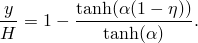

 Here,  is the stretching factor and is computed by making the first grid point corresponding to the prescribed  value, and  is a normalized variable uniformly. To accommodate the node position using the equation above, it was necessary to develop an in-house FORTRAN mesh generator to accommodate all the mesh requirements with high accuracy. At this time Abaqus/CAE does not support hyperbolic tangent mesh distribution. [Figure 3.3.2--2](ch03s03abv181.md#ver-ifluid-turb-channel-mesh) shows the grading used in Mesh 2.  Since the refinement is conducted only in the wall-normal direction, the mesh metric—used to measure the convergence rate—is chosen to be the near-wall resolution, 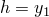. 

**Figure 3.3.2–2** Mesh grading in wall-normal direction for Mesh 2.

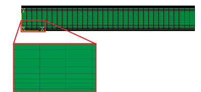

**Boundary conditions: **

The boundary conditions applied to the model are shown schematically in [Figure 3.3.2--1](ch03s03abv181.md#ver-ifluid-turb-channel-domain-nls). At the inflow surface, , the fluid pressure 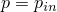 is specified. At the top and bottom surfaces, 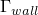, the no-slip/no-penetration boundary conditions 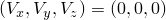 are specified. For the turbulence model the Spalart-Allmaras turbulent viscosity  is set to zero, and the wall-normal distance is set to zero as well. At the outflow surface, , an outflow boundary condition (traction-free) is specified by setting the pressure 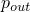 to zero. The normal gradients of velocities and Spalart-Allmaras viscosity, , are automatically set to zero for this boundary. These conditions correspond to the well-known natural or “do-nothing” boundary condition. Finally, the two-dimensional nature of the problem is enforced by prescribing the out-of-plane velocity, 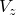, to be zero everywhere on the domain surface and by using only one element through the thickness (along the spanwise direction). 

**Initial conditions: **

The initial velocity, *V*, is set to zero everywhere in the flow domain. The Spalart-Allmaras turbulent viscosity is initialized to five times the kinematic viscosity, 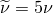.

**Problem setup: **

To set up the turbulent channel flow problem for the desired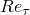, the following steps need to be conducted:

1. Using the law of the wall estimate for the velocity at the center of the channel (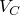), the friction velocity can be calculated: 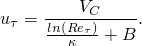
2. The kinematic viscosity can be obtained from the Reynolds number since the friction velocity and channel height are available: 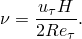
3. The mesh can be created for the specified near-wall resolution since all the information is available: 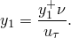
4. The inflow pressure is computed from the balance of mean *x*-momentum (see [Pope, 2000](ch03s03abv181.md#ver-ref-pope)): 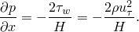 For this turbulent channel flow the boundary conditions are consistent with a hydrodynamically fully developed flow so that the pressure gradient is constant. Thus, the mean *x*-momentum equation above can be integrated to obtain the pressure at the inflow 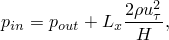 where 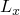 is the length of the channel; in the present calculation the pressure at the outflow is set to zero (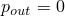). After following Steps 1--4, the flow parameters obtained are  =1 kg/m3, 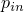 = 0.4783 101, and  =0.6190 104. The total execution time was set to *t* = 1000 s to reach steady state in all meshes. The solver options are set to the defaults with the exception of the pressure Poisson equation (PPE) and momentum solver tolerance, which is set to 10 8 (default = 105).

### Results and discussion

The mean velocity profiles normalized with wall units are presented for the five meshes in [Figure 3.3.2--3](ch03s03abv181.md#ver-ifluid-turb-channel-meshlaw-1) through [Figure 3.3.2--7](ch03s03abv181.md#ver-ifluid-turb-channel-meshlaw-5). The velocity profiles are shifted on the *y*-axis to improve the presentation of the results. For the present calculations the friction coefficient is computed directly from the mean velocity profile

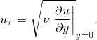

The law of the wall is presented in red (linear profile) and black (logarithmic profile) lines. As can be expected, the agreement with the law of the wall improves as the mesh is refined. [Table 3.3.2--2](ch03s03abv181.md#table-friction-velocity) presents the computed friction velocities for all meshes using the friction velocity equation above.

**Figure 3.3.2–3** Mesh 1, 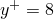 and 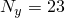.

**Figure 3.3.2–4** Mesh 2,  and .

**Figure 3.3.2–5** Mesh 3,  and .

**Figure 3.3.2–6** Mesh 4,  and .

**Figure 3.3.2–7** Mesh 5,  and .

**Table 3.3.2–2** Calculated friction velocity.
| Mesh |  |
| --- | --- |
| 1 | 0.04881 |
| 2 | 0.04875 |
| 3 | 0.04856 |
| 4 | 0.04711 |
| 5 | 0.03875 |

 The rate of spatial convergence of the code can be estimated using the results computed on the five meshes. Following [ASME V&V 20-2009](ch03s03abv181.md#ver-ref-asme), the error in the numerical solution can be computed as

 where *H.O.T.* are the Higher Order Terms and *h* denotes the characteristic mesh metric size as given in [Table 3.3.2--1](ch03s03abv181.md#table-mesh-details). 

To estimate the convergence rate, we use the computed friction velocity obtained from the law of the wall equation (Step 1 in the problem setup) as the exact value to estimate the error of the simulations. Following [ASME V&V 20-2009](ch03s03abv181.md#ver-ref-asme), the observed convergence between the two calculations can be approximated as

 where  and , with .

 The observed convergence rates computed using the above equation are presented in [Table 3.3.2--3](ch03s03abv181.md#table-convergence-rate) and [Figure 3.3.2--8](ch03s03abv181.md#ver-ifluid-turb-channel-errorvsh). The observed convergence rates tend to a value of  in excellent agreement with the theoretical accuracy of the code.

**Table 3.3.2–3** Calculated convergence rate.
| Mesh | *p* |
| --- | --- |
| 1 | --- |
| 2 | 2.50 |
| 3 | 2.39 |
| 4 | 1.99 |
| 5 | 1.92 |

**Figure 3.3.2–8** Convergence of the friction velocity, , as function of the mesh metric, *h*.

### Summary

The steady incompressible turbulent flow in a planar channel was successfully computed using  Abaqus/CFD. The mean velocity profiles were found to be in good agreement with the well-known law of the wall solution. Furthermore, the estimated convergence rate for the Abaqus/CFD friction velocity was measured and found to be in close agreement with the theoretical second-order spatial accuracy of the code.

### Input files

[turbchannel_mesh_1_VER.inp](../eif/turbchannel_mesh_1_VER.inp)

Mesh 1: coarser mesh with 1078 elements.

[turbchannel_mesh_2_VER.inp](../eif/turbchannel_mesh_2_VER.inp)

Mesh 2: coarse mesh with 2156 elements.

[turbchannel_mesh_3_VER.inp](../eif/turbchannel_mesh_3_VER.inp)

Mesh 3: mesh with 4410 elements.

[turbchannel_mesh_4_VER.inp](../eif/turbchannel_mesh_4_VER.inp)

Mesh 4: fine mesh with 6566 elements.

[turbchannel_mesh_5_VER.inp](../eif/turbchannel_mesh_5_VER.inp)

Mesh 5: finer mesh with 8820 elements.

### References

ASME V&V 20-2009, “Standard for Verification and Validation in Computational Fluid Dynamics and Heat Transfer,” American Society of Mechanical Engineers.

Pope,  S. B., *Turbulent Flows, *Cambridge University Press, 2000.

