# 3.3.3 Lid-driven flow in square and skewed cavities

**Product: **Abaqus/CFD  

### Element tested

FC3D8

### Feature tested

Laminar shear driven flow.

### Problem description

 The lid-driven cavity flow is solved to evaluate the accuracy, stability, and efficiency of the numerical methods developed for the resolution of the incompressible Navier-Stokes equations. The driven cavity problem displays many fundamental flow features in the simplest geometrical setting. Some of these features include a large rotating eddy at the center of the cavity, counter-rotating corner eddies, and corner singularities (near-singular pressures).  

In this study a series of two-dimensional laminar incompressible lid-driven cavity flow problems are solved. The two-dimensional problems are represented by a planar cavity in which the flow is generated by a steady, uniform motion of one of the walls, usually, the lid. Both square and skewed cavities (parallelogram), as shown in [Figure 3.3.3--1](ch03s03abv182.md#ver-ifluid-lidcavity-geom), are considered. For the skewed cavity, skew angles of  = 15, 30, 45, and 60 are calculated.   In [Figure 3.3.3--1](ch03s03abv182.md#ver-ifluid-lidcavity-geom) the lid is represented by the top surface of the domain. The length of the cavity is denoted by *L*, and the specified tangential velocity of the lid is denoted by .  The following scaling is used to obtain a nondimensionalized form of the governing Navier-Stokes equations:

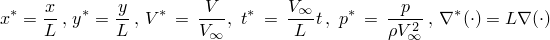

Here, 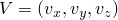 is the velocity vector with components 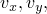 and , along the *x-*, *y-*, and *z-* directions, respectively; *p* is the pressure; and the superscript * is used to identify the nondimensional variables. These scales are used throughout this study for the presentation of the results.

Using the above scaling, the incompressible Navier-Stokes equations in a nondimensional form are

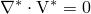

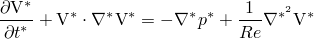

 Here, the characteristic Reynolds number of the flow, *Re*, is given by

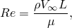

where  is the mass density and  is the dynamic viscosity of the fluid. For the problem the cases of *Re* =100 and 1000 are considered. For these values of *Re*, the flow has been observed to be steady. Tabulated data provided by [Ghia et al. (1982)](ch03s03abv182.md#ver-ref-ghia) and [Erturk et al. (2007)](ch03s03abv182.md#ver-ref-erturk) are used to benchmark results for the square cavity, while only those of [Erturk et al. (2007)](ch03s03abv182.md#ver-ref-erturk) are used for the skewed cavity cases.

**Figure 3.3.3–1** Computational domain and boundary conditions for the lid-driven two-dimensional cavity problem: (a) square cavity and (b) skewed cavity with skew angle . 

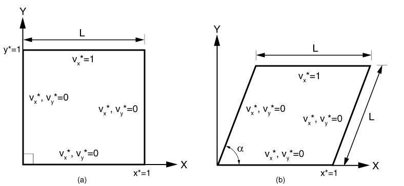

**Model: **

The two-dimensional cavity model consists of a planar domain with edge length *L*, as shown in [Figure 3.3.3--1](ch03s03abv182.md#ver-ifluid-lidcavity-geom). Since the two-dimensional problem is solved as an abstraction of the three-dimensional version, an out-of-plane thickness equal to 0.025*L* is specified. For the skewed cavity  denotes the skew angle.

**Mesh: **

For all the cases considered, a mesh sensitivity study was performed, and the following conclusions were drawn:

1. For the case of *Re* = 100 and for all skew angles (including the square cavity), a 128 128 uniform mesh was found to be sufficient to obtain mesh independent results.
2. For the case of *Re* = 1000 and for all skew angles (including the square cavity), a 256 256 uniform mesh was necessary to obtain mesh independent results.

The out-of-plane dimension is meshed with only one element to enforce the two-dimensional nature of the problem. In [Figure 3.3.3--2](ch03s03abv182.md#ver-ifluid-lidcavity-mesh) a representative 128  128 uniform mesh for the skewed cavity problem with  = 45 is shown. 

**Figure 3.3.3–2** Skewed cavity 45 with 128  128 elements.

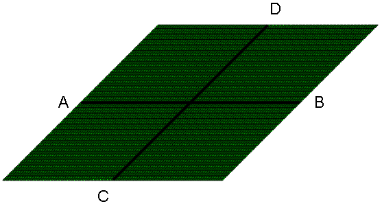

**Boundary conditions: **

The prescribed boundary conditions are shown in [Figure 3.3.3--1](ch03s03abv182.md#ver-ifluid-lidcavity-geom). No-slip/no-penetration boundary conditions are applied on side walls 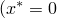, and 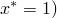 and the base 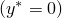 of the cavity by setting 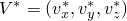 = (0, 0, 0). A constant velocity  =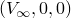 = (1, 0, 0) is prescribed at the cavity lid 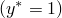. Furthermore, the two-dimensional nature of the problem is enforced by specifying the *z*-velocity 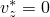 in the front and back surfaces.  

 If all the flow boundary conditions are prescribed for velocity alone and not for pressure, the solution to the governing equation becomes singular for the pressure unknown. The pressure singularity occurs because any additive constant to pressure would still satisfy the governing equations since only the gradient of pressure is involved and the boundary conditions do not directly involve pressure. This additive constant for pressure is the hydrostatic pressure mode and is removed by fixing the value of pressure (either to an arbitrary constant or to a value obtained from experiments) for a single point in the domain. In this case 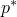 is set to a value of zero for the point 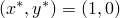.

**Initial conditions: **

At t = 0, the velocity 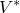 is set to zero everywhere in the flow domain.

**Problem setup: **

The following values are used for the flow problem—the fluid density  = 1 kg/m3, cavity edge length L = 1 m, and lid velocity 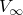 = 1 m/s. To vary the Reynolds number, the dynamic viscosity  is changed as shown in [Table 3.3.3--1](ch03s03abv182.md#ver-table-renumber). 

**Table 3.3.3–1** Values of viscosities used to vary the Reynolds number.
| Re |  |
| --- | --- |
| 100 | 0.01 |
| 1000 | 0.001 |

The calculations presented here are conducted using a time weight of  = 1 for the diffusion terms and  = 0 for the advection terms. All other solver options are set to the default values.

### Results and discussion

To compare current calculations against the benchmark data, it is important that you verify that the solution has reached a steady state. In this work the evolution of the global kinetic energy and the velocity components at a given location are examined to assess the unsteadiness of the calculations. [Figure 3.3.3--3](ch03s03abv182.md#ver-ifluid-lidcavity-velconv) and [Figure 3.3.3--4](ch03s03abv182.md#ver-ifluid-lidcavity-kenergy) show, respectively, the time history of the global kinetic energy and velocity for the  = 100,  = 45 skewed cavity case on a 128  128 uniform mesh. These results confirm that a steady-state solution has been obtained. The steady state of the global kinetic energy and the flow velocity are verified in the rest of the calculations, but these results are not presented here. 

**Figure 3.3.3–3** Time history of velocity components at location (1.2, 0.4) for the  =  45 cavity case at* Re* = 100.

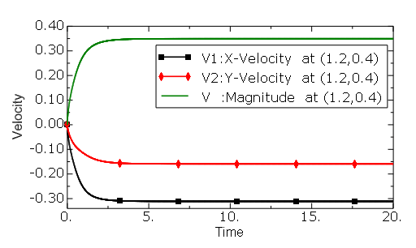

**Figure 3.3.3–4** Time history of the global kinetic energy for the  =  45 cavity case at *Re* = 100.

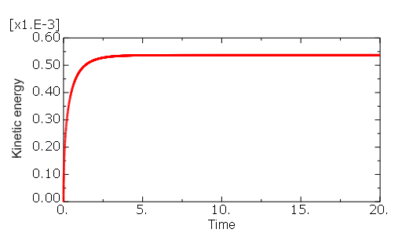

[Erturk et al. (2007)](ch03s03abv182.md#ver-ref-erturk) reported the computed velocity components along the horizontal centerline (line AB) and the slanted centerline (line CD) for all skewed cavities and the square cavity (see [Figure 3.3.3--2](ch03s03abv182.md#ver-ifluid-lidcavity-mesh)). In particular, the horizontal component of velocity 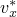, is reported along the line CD, while the vertical component 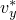 is reported along line AB. These results are used as benchmark data for the verification of the present numerical calculations. For the square cavity at a *Re* = 100, the calculations conducted by [Ghia et al. (1982)](ch03s03abv182.md#ver-ref-ghia)  are also used to compare with the Abaqus/CFD predictions.

 The results of the comparisons for all the cases are plotted in [Figure 3.3.3--5](ch03s03abv182.md#ver-ifluid-lidcavity-90deg-xvel) through [Figure 3.3.3--15](ch03s03abv182.md#ver-ifluid-lidcavity-deg60-yvel). For all cases calculations are found to be in excellent agreement with the data published by [Erturk et al. (2007)](ch03s03abv182.md#ver-ref-erturk). For the square cavity ( = 90) at *Re* = 100 a slight mismatch between the present results, the results of [Erturk et al. (2007)](ch03s03abv182.md#ver-ref-erturk), and those of [Ghia et al. (1982)](ch03s03abv182.md#ver-ref-ghia) (see [Figure 3.3.3--5](ch03s03abv182.md#ver-ifluid-lidcavity-90deg-xvel) and [Figure 3.3.3--6](ch03s03abv182.md#ver-ifluid-lidcavity-90deg-yvel)) is observed.

**Figure 3.3.3–5** Square cavity ( = 90): comparison of  velocity along line CD (see [Figure 3.3.3--2](ch03s03abv182.md#ver-ifluid-lidcavity-mesh)) at *Re* = 100.

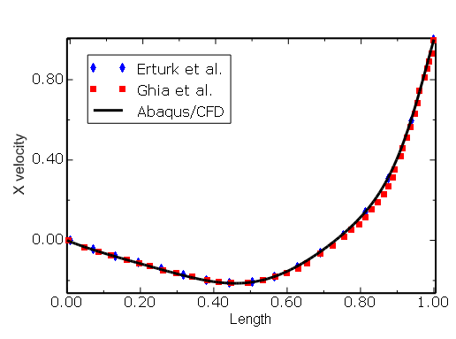

**Figure 3.3.3–6** Square cavity ( = 90): comparison of  velocity along line AB (see [Figure 3.3.3--2](ch03s03abv182.md#ver-ifluid-lidcavity-mesh)) at *Re* = 100. 

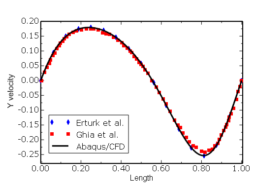

**Figure 3.3.3–7** Square cavity ( = 90): comparison of  and  velocity along line AB and line CD (see [Figure 3.3.3--2](ch03s03abv182.md#ver-ifluid-lidcavity-mesh)) at *Re* = 1000 with the results of [Erturk et al. (2007)](ch03s03abv182.md#ver-ref-erturk). 

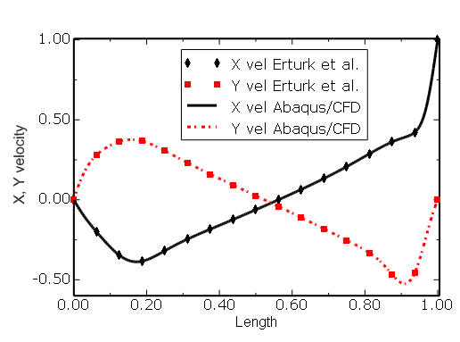

**Figure 3.3.3–8** Skewed cavity ( = 15): comparison of  velocity along line AB (see [Figure 3.3.3--2](ch03s03abv182.md#ver-ifluid-lidcavity-mesh))  with the results of [Erturk et al. (2007)](ch03s03abv182.md#ver-ref-erturk).

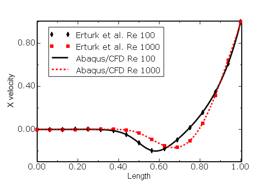

**Figure 3.3.3–9** Skewed cavity ( = 15): comparison of  velocity along line CD (see [Figure 3.3.3--2](ch03s03abv182.md#ver-ifluid-lidcavity-mesh))  with the results of [Erturk et al. (2007)](ch03s03abv182.md#ver-ref-erturk).

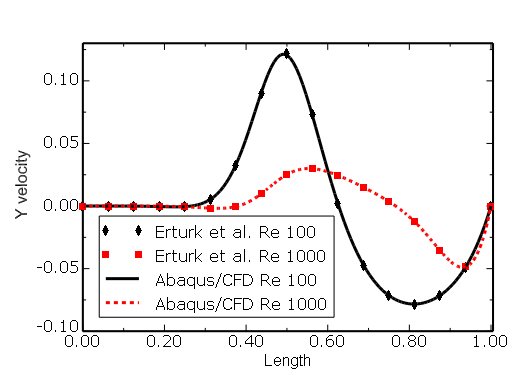

**Figure 3.3.3–10** Skewed cavity ( = 30): comparison of  velocity along line AB (see [Figure 3.3.3--2](ch03s03abv182.md#ver-ifluid-lidcavity-mesh))  with the results of [Erturk et al. (2007)](ch03s03abv182.md#ver-ref-erturk).

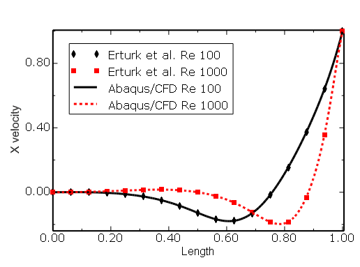

**Figure 3.3.3–11** Skewed cavity ( = 30): comparison of  velocity along line CD (see [Figure 3.3.3--2](ch03s03abv182.md#ver-ifluid-lidcavity-mesh))  with the results of [Erturk et al. (2007)](ch03s03abv182.md#ver-ref-erturk).

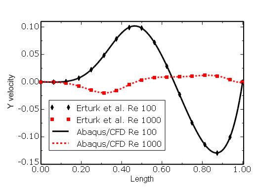

**Figure 3.3.3–12** Skewed cavity ( = 45): comparison of  velocity along line AB (see [Figure 3.3.3--2](ch03s03abv182.md#ver-ifluid-lidcavity-mesh))  with the results of [Erturk et al. (2007)](ch03s03abv182.md#ver-ref-erturk).

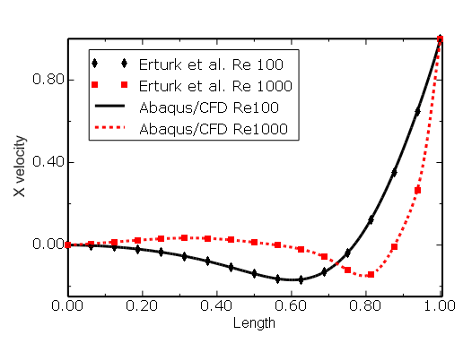

**Figure 3.3.3–13** Skewed cavity ( = 45): comparison of  velocity along line CD (see [Figure 3.3.3--2](ch03s03abv182.md#ver-ifluid-lidcavity-mesh))  with the results of [Erturk et al. (2007)](ch03s03abv182.md#ver-ref-erturk).

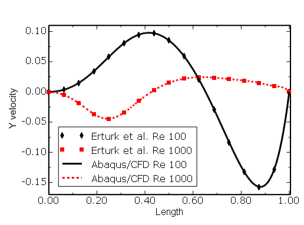

**Figure 3.3.3–14** Skewed cavity ( = 60): comparison of  velocity along line AB (see [Figure 3.3.3--2](ch03s03abv182.md#ver-ifluid-lidcavity-mesh))  with the results of [Erturk et al. (2007)](ch03s03abv182.md#ver-ref-erturk).

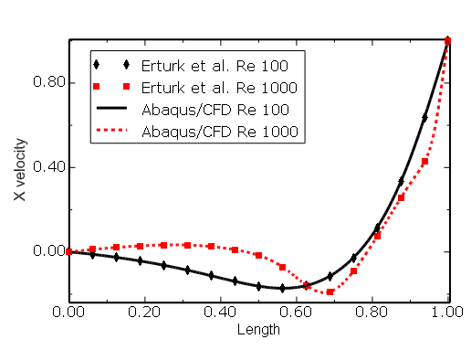

**Figure 3.3.3–15** Skewed cavity ( = 60): comparison of  velocity along line CD (see [Figure 3.3.3--2](ch03s03abv182.md#ver-ifluid-lidcavity-mesh))  with the results of [Erturk et al. (2007)](ch03s03abv182.md#ver-ref-erturk).

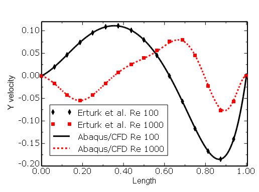

### Summary

The steady-state laminar flow analysis for a series of two-dimensional lid-driven cavities was successfully completed for *Re* = 100 and *Re* = 1000 square and skewed cavity cases. The velocity components along the geometric centerlines of the cavity were compared against published benchmark data. Results were found to be in excellent agreement for all cases, thereby validating the accuracy of Abaqus/CFD.

### Input files

[cavity15_128x128_R100_BE_VER.inp](../eif/cavity15_128x128_R100_BE_VER.inp)

Skewed cavity  = 15 mesh with 16384 elements.

[cavity30_128x128_R100_BE_VER.inp](../eif/cavity30_128x128_R100_BE_VER.inp)

Skew cavity  = 30 mesh with 16384 elements.

[cavity45_128x128_R100_BE_VER.inp](../eif/cavity45_128x128_R100_BE_VER.inp)

Skew cavity  = 45 mesh with 16384 elements.

[cavity60_128x128_R100_BE_VER.inp](../eif/cavity60_128x128_R100_BE_VER.inp)

Skew cavity  = 60 mesh with 16384 elements.

[cavity90_128x128_R100_BE_VER.inp](../eif/cavity90_128x128_R100_BE_VER.inp)

Square cavity  = 90 mesh with 16384 elements.

[cavity15_256x256_R1000_BE_VER.inp](../eif/cavity15_256x256_R1000_BE_VER.inp)

Skew cavity  = 15 mesh with 65536 elements.

[cavity30_256x256_R1000_BE_VER.inp](../eif/cavity30_256x256_R1000_BE_VER.inp)

Skew cavity  = 30 mesh with 65536 elements.

[cavity45_256x256_R1000_BE_VER.inp](../eif/cavity45_256x256_R1000_BE_VER.inp)

Skew cavity  = 45 mesh with 65536 elements.

[cavity60_256x256_R1000_BE_VER.inp](../eif/cavity60_256x256_R1000_BE_VER.inp)

Skew cavity  =60 mesh with 65536 elements.

[cavity90_256x256_R1000_BE_VER.inp](../eif/cavity90_256x256_R1000_BE_VER.inp)

Square cavity  = 90 mesh with 65536 elements.

### References

Erturk,  E., and B. Dursun,  “Numerical Solutions of 2-D Steady Incompressible Flow in a Driven Skewed Cavity,” Journal of Applied Mathematics and Mechanics, vol. 87, pp. 377–392, 2007.

Ghia,  U., K. N. Ghia, and S. T. Shin, “High-Re Solutions for Incompressible Flow Using the Navier-Stokes Equations and a Multigrid Method,” Journal of Computational Physics, vol. 48, pp. 387–411, 1982.

