# 3.3.4 雷诺数800下后向台阶流动

**产品：**Abaqus/CFD  

### 测试的单元

FC3D8

### 测试的功能

出口边界条件、隐式对流和用于动量传输的ILU分解预条件FGMRES方法。

### 问题描述

后向台阶上稳态粘性等温不可压缩流动问题是众多研究人员用于评估各种解决方案的典型计算流体动力学测试问题。该流动问题测试解决方案处理台阶后方大规模分离的能力，随后是层流边界层的再附着，同时提供了一个基本上不干扰流动问题主要物理特征的无源出口边界条件。此外，台阶角部的压力奇异性在压力求解策略效率方面提出了挑战。

在本验证算例中，使用[Gartling（1990）](ch03s03abv183.md#ver-ifluid-ref-gartling)提出的问题定义来定义几何形状和相关的边界条件，用于=800的流动。[Gartling（1990）](ch03s03abv183.md#ver-ifluid-ref-gartling)描述的流动域如图[图3.3.4-1](ch03s03abv183.md#ver-ifluid-bfs-geom)所示。本研究使用一系列五个网格来计算流动场，比较上游和下游壁面的主要分离和再附着点。此外，将速度、压力和涡量分布与[Gartling（1990）](ch03s03abv183.md#ver-ifluid-ref-gartling)的基准结果进行比较。

**图3.3.4-1** 雷诺数Re=800后向台阶的计算域和边界条件。

**模型：**

后向台阶模型由平面域组成，通道高度为H，台阶高度为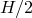，从入口到出口的总通道长度为30H或60个台阶高度。由于二维问题是作为三维版本的抽象求解，因此使用了等于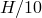的平面外厚度。

**网格：**

后向台阶的网格设计遵循[Gartling（1990）](ch03s03abv183.md#ver-ifluid-ref-gartling)和[Christon（1997）](ch03s03abv183.md#ver-ifluid-ref-christon)的建议。矩形通道分为两个不同的区域：上游段和下游段。上游段在区域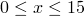中使用均匀网格，下游段在区域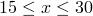中的流动方向平滑渐变，使得出口边界处的单元大小约为入口通道处单元大小的两倍。

五个网格的网格特征如[表3.3.4-1](ch03s03abv183.md#ver-ifluid-laminarbfs-meshes)所示。这里，单元大小指的是均匀上游区域中的网格间距，其中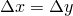。

**表3.3.4-1** 本研究中使用的特征网格。
| 网格 | 单元数量 | 单元大小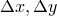 |
| --- | --- | --- |
| A | 8000 | 0.06 |
| B | 32000 | 0.03 |
| C | 72000 | 0.020 |
| D | 128000 | 0.015 |
| E | 512000 | 0.0075 |

**边界条件：**

后向台阶问题规定的边界条件包括通道壁面的无滑移/无渗透条件，如图[图3.3.4-1](ch03s03abv183.md#ver-ifluid-bfs-geom)所示。在入口处，速度场假定为流体动力学完全发展，水平速度分量为抛物线分布；即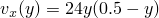。该速度分布产生平均水平速度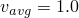和最大值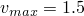。流动问题的二维性质要求将z速度指定为入口处的前平面/后平面上的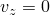。在出口处，流动假定为平行且零应力条件；即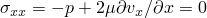。x动量传输方程上的"不做任何事情"边界条件自动强制剪应力项为零，而出口压力在出口边界处规定为零。

**初始条件：**

在t=0时，速度在流动域中设置为零。为保证适定的不可压缩Navier-Stokes问题，将规定的边界条件插入初始条件，并投影到无散度子空间。这种投影确保初始速度场满足规定的边界条件，也是无散度的。在初始速度调整之后，计算与无散度初始速度一致初始压力。

**问题设置：**

流动问题使用以下值：流体密度=1 kg/m3，流体粘度=1.25×10^-3 kg/m·s，通道高度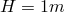，平均入口速度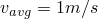。雷诺数定义为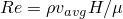，因此对于这些参数，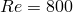。

为使问题快速达到稳态状态，下面所有计算使用时间权重用于对流和粘性项；即对流被隐式处理。这种选择对应于后向Euler时间积分方法。压力的收敛准则指定为=1.0×10^-8。动量传输求解器指定为带ILU预条件的FGMRES。时间步长选项指定CFL稳定性条件等于40，终止时间为400个时间单位。不施加最大时间步长限制。所有其他求解器选项使用默认值。

### 结果与讨论

为与Re=800后向台阶问题的已发表结果进行比较，评估了分离/再附着长度。此外，将沿流动方向和 cross-flow方向的压力、速度和涡量分布与[Gartling（1990）](ch03s03abv183.md#ver-ifluid-ref-gartling)发布的基准数据进行比较。本验证研究使用一系列五个网格进行。

对于每个网格上的每次计算，检查水平和垂直速度分量以及全局动能的时间历程数据。速度和动能时间历程在400个时间单位的终止时间达到稳定值，表明每个网格都获得了有效的稳态解。初步测试改变CFL数从1到40。在每个CFL数下获得相同的结果，表明解决方案对时间步长大小不敏感。[图3.3.4-2](ch03s03abv183.md#ver-ifluid-laminarbfs-vx_512_hist)显示了台阶后方三点的水平速度时间历程，[图3.3.4-3](ch03s03abv183.md#ver-ifluid-laminarbfs-vy_512_hist)显示了垂直速度时间历程。单元12294位于（3.7988,0.4781,0.05），504812位于（5.9138,0.4844,0.05），505366位于（1.7588,0.4844,0.05）。[图3.3.4-4](ch03s03abv183.md#ver-ifluid-laminarbfs-ke_512)显示了网格E的全局动能时间历程。

**图3.3.4-2** 台阶后方位置的水平速度时间历程，网格E有512,000个单元。

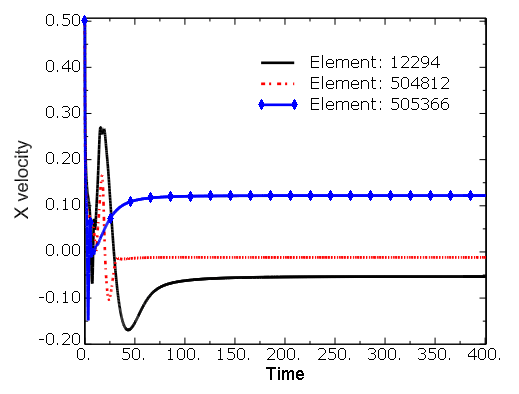

**图3.3.4-3** 台阶后方位置的垂直速度时间历程，网格E有512,000个单元。

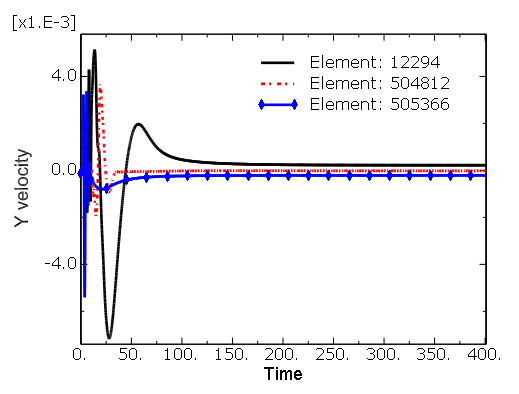

**图3.3.4-4** 网格E的全局动能时间历程，有512,000个单元。

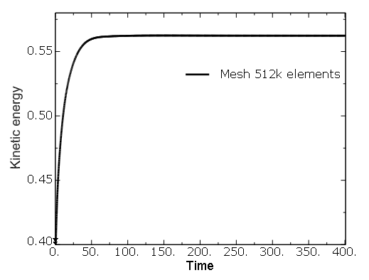

主要分离和再附着长度在[表3.3.4-2](ch03s03abv183.md#ver-ifluid-laminarbfs-lengths)中给出。这里，是从台阶面到底部再附着点的距离。在通道上部壁面，标记从入口到通道的第一个分离点，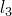定位再附着点，也是从入口到通道测量。与[Gartling（1990）](ch03s03abv183.md#ver-ifluid-ref-gartling)和[Christon（1997）](ch03s03abv183.md#ver-ifluid-ref-christon)提供的基准结果相比，计算的分离和再附着长度显示出非常好的一致性。最粗网格（网格A）的结果表明，仅使用8,000个单元的流场非常未解析。[Gartling（1990）](ch03s03abv183.md#ver-ifluid-ref-gartling)使用的网格分辨率与使用双二次速度和不连续线性压力近似的[Christon（1997）](ch03s03abv183.md#ver-ifluid-ref-christon)使用的双线性速度和不连续压力近似大致对应。相比之下，网格D相对于[Christon（1997）](ch03s03abv183.md#ver-ifluid-ref-christon)使用的128,000单元网格提供更少的速度自由度，而网格E提供略多的速度自由度。网格E结果与[Gartling（1990）](ch03s03abv183.md#ver-ifluid-ref-gartling)结果之间的误差小于1%。

**表3.3.4-2** 后向台阶问题的主要分离和再附着长度。
| 网格 | 下部再附着（）| 上部分离（）| 上部再附着（）|
| --- | --- | --- | --- |
| A | 4.47 | 3.89 | 8.93 |
| B | 5.67 | 4.76 | 10.06 |
| C | 5.89 | 4.87 | 10.24 |
| D | 5.97 | 4.89 | 10.32 |
| E | 6.06 | 4.90 | 10.41 |
| Gartling | 6.10 | 4.85 | 10.48 |
| Christon | 6.03 | 4.90 | 10.37 |

[图3.3.4-5](ch03s03abv183.md#ver-ifluid-laminarbfs-pressure_512)显示了台阶后方区域中的压力等值线。

**图3.3.4-5** 网格E的压力等值线。等值线级别为–0.1757、–0.1657、–0.1557、–0.1457、–0.1357、–0.1257、–0.1157、–0.1057、–0.0957、–0.0857、–0.0757、–0.0557、–0.0357、–0.0157、0.0043、0.0243、0.0443、0.0643。

这里使用的等值线与[Gartling（1990）](ch03s03abv183.md#ver-ifluid-ref-gartling)呈现的相同，但已通过静水压力0.1747进行调整，以强制出口压力完全为零。有必要进行此调整以允许与[Gartling（1990）](ch03s03abv183.md#ver-ifluid-ref-gartling)呈现的结果进行直接比较，其中静水压力调整使入口处台阶角点的压力完全为零。[图3.3.4-6](ch03s03abv183.md#ver-ifluid-laminarbfs-vorticity_512)和[图3.3.4-7](ch03s03abv183.md#ver-ifluid-laminarbfs-fluidspeed_512)显示了相同下游区域中的涡量和流体速度。

**图3.3.4-6** 网格E的涡量等值线。等值线级别为10.0、8.0、4.0、2.0、0.0、–2.0、–4.0、–6.0、–8.0。

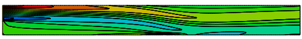

**图3.3.4-7** 网格E的流体速度等值线。等值线级别为0.05、0.10、0.15、0.20、0.40、0.60、0.80、1.0、1.20、1.40。

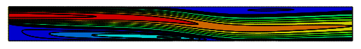

这里，等值线级别与[Gartling（1990）](ch03s03abv183.md#ver-ifluid-ref-gartling)使用的相同。与[Gartling（1990）](ch03s03abv183.md#ver-ifluid-ref-gartling)中的[图3.3.4-4](ch03s03abv183.md#ver-ifluid-laminarbfs-ke_512)、[图3.3.4-5](ch03s03abv183.md#ver-ifluid-laminarbfs-pressure_512)和[图3.3.4-6](ch03s03abv183.md#ver-ifluid-laminarbfs-vorticity_512)的直接比较显示出非常好的定性一致性。

[图3.3.4-8](ch03s03abv183.md#ver-ifluid-laminarbfs-streamwisepressure_512)显示了相对于[Gartling（1990）](ch03s03abv183.md#ver-ifluid-ref-gartling)呈现的结果，通道上部和下部壁面沿流动方向的压力分布。

**图3.3.4-8** 通道上部和下部壁面沿流动方向的压力分布。

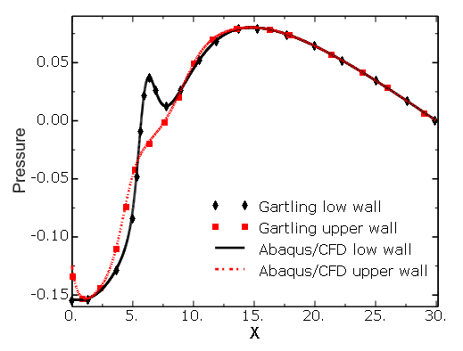

这里，[Gartling（1990）](ch03s03abv183.md#ver-ifluid-ref-gartling)提供的结果已进行调整以通过强制压力在出口平面完全为零来允许直接比较。显然，压力分布非常一致。[图3.3.4-9](ch03s03abv183.md#ver-ifluid-laminarbfs-velxdist)到[图3.3.4-12](ch03s03abv183.md#ver-ifluid-laminarbfs-channelwisevorticity_512)显示了对应于x=7和x=15的两个位置的通道横截面上的水平速度、垂直速度、压力和涡量分布。同样，与[Gartling（1990）](ch03s03abv183.md#ver-ifluid-ref-gartling)的基准结果观察到非常好的一致性。然而，[图3.3.4-10](ch03s03abv183.md#ver-ifluid-laminarbfs-velydist)中x=7处的垂直速度分布表明，[Gartling（1990）](ch03s03abv183.md#ver-ifluid-ref-gartling)使用的双二次速度/不连续线性压力单元在该区域略准确。

**图3.3.4-9** x=7和x=15处通道横截面的水平速度分布。

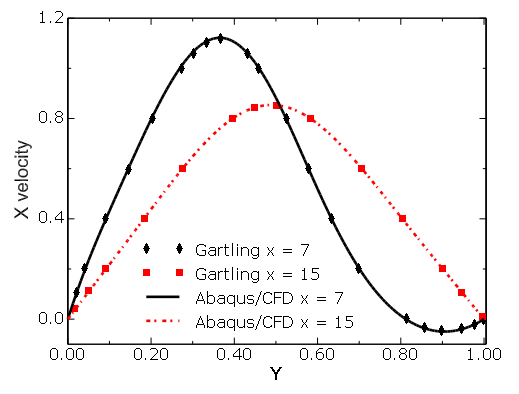

**图3.3.4-10** x=7和x=15处通道横截面的垂直速度分布。

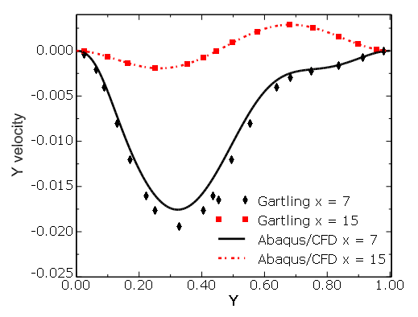

**图3.3.4-11** x=7和x=15处通道横截面的压力分布。

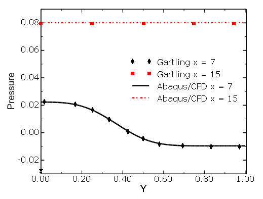

**图3.3.4-12** x=7和x=15处通道横截面的涡量分布。

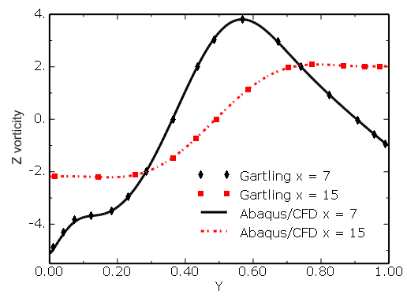

### 总结

使用一系列五个网格计算雷诺数Re=800下后向台阶上的层流。使用固定CFL=40和后向Euler时间积分的隐式对流在400个时间单位达到稳态流动条件。通过Abaqus/CFD生成的结果与已发布基准数据的直接详细比较表明了非常好的一致性。

### 输入文件

[bfs_re800_A_VER.inp](../eif/bfs_re800_A_VER.inp)

后向台阶，8,000个单元。

[bfs_re800_B_VER.inp](../eif/bfs_re800_B_VER.inp)

后向台阶，32,000个单元。

[bfs_re800_C_VER.inp](../eif/bfs_re800_C_VER.inp)

后向台阶，72,000个单元。

[bfs_re800_D_VER.inp](../eif/bfs_re800_D_VER.inp)

后向台阶，128,000个单元。

[bfs_re800_E_VER.inp](../eif/bfs_re800_E_VER.inp)

后向台阶，512,000个单元。

### 参考文献

Christon, M. A., "A Domain-Decomposition Message-Passing Approach to Transient Viscous Incompressible Flow Using Explicit Time Integration," Computer Methods in Applied Mechanics and Engineering, vol. 148, pp. 329–352, 1997.

Gartling, D. K., "A Test Problem for Outflow Boundary Conditions—Flow over a Backward-Facing Step," International Journal for Numerical Methods in Fluids, vol. 11, pp. 953–967, 1990.