# 3.3.5 Flow through porous media

**Product: **Abaqus/CFD  

### I. Steady flow in a planar channel partially filled with a layer of porous medium

### Element tested

FC3D8

### Feature tested

Laminar flow through a porous medium.

### Problem description

 The continuity and the Brinkman-Forchheimer equations governing the flow of an incompressible fluid in a fluid-saturated porous media can be written as follows ([Nield and Bejan, 2010](ch03s03abv184.md#ver-ref-nield)): 

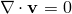

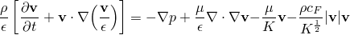

  Here,  is the extrinsic average or the superficial velocity vector, where the average is taken over a representative volume incorporating both the solid (matrix) and the fluid phases;  is the intrinsic average of the pressure (average taken only over the fluid phase);  and  are the density and viscosity of the fluid; and  and  are the porosity (volume fraction of the fluid phase) and permeability of the porous medium. The second term on the right hand side of the momentum equation is the Brinkmann term accounting for the presence of solid boundaries, the third term represents the Darcy drag term (linear-in-velocity), and the last term represents the inertial (quadratic-in-velocity) or the Forchheimer drag. The parameter  is the inertial drag coefficient (also referred to as the form drag coefficient). Based on Ergun's equation ([Nield and Bejan, 2010](ch03s03abv184.md#ver-ref-nield)), , where  is a constant that is set to a default value of 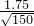 = 0.142887.

Thus, the porous media flow problem requires the specification of the porosity  and the permeability  of the porous medium. The default value of  ( = 0.142887) can also be changed in the material property definition. For the case of turbulent flow within a porous medium, the fluid viscosity  includes the contribution of both the molecular and the turbulent eddy viscosities.

If we define a length scale , a velocity scale , and a time scale 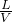, the above governing equations can be cast in a nondimensional form: 

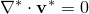

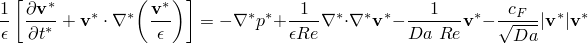

The superscript * denotes a nondimensional quantity. Furthermore, the pressure is scaled using the dynamic pressure 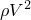. In addition, 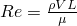 is the Reynolds number that denotes the ratio of the inertial to viscous force, and 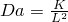 is the Darcy number that denotes the ratio of the viscous to the Darcy drag force.

This verification problem is used to evaluate the accuracy of the Abaqus/CFD porous media model for the case of a porous interface placed parallel to the flow direction.  The geometry consists of a channel partially filled with a horizontal layer of porous medium, as shown in [Figure 3.3.5--1](ch03s03abv184.md#ver-ifluid-porous-chnl-geom). Steady flow is considered for the following two cases: 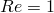, ; and , . The Reynolds number is based on the average outflow velocity of the pure fluid region (see [Figure 3.3.5--1](ch03s03abv184.md#ver-ifluid-porous-chnl-geom)) under fully developed conditions and the height, *H*, of the porous medium. Two values of 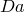 equal to 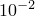 and  are used for the present problem and are based on *H*. The results provided by [Betchen et al. (2006)](ch03s03abv184.md#ver-ref-betchen), are used as the reference solution. The value of the porosity, , is set to 0.7 for all the cases.

**Model: **

The geometry of the two-dimensional problem is shown in [Figure 3.3.5--1](ch03s03abv184.md#ver-ifluid-porous-chnl-geom). The height of the pure fluid domain is given by *H*, which is set equal to that of the porous medium. The length of the channel is set equal to 8*H*. Since the two-dimensional problem is solved as an abstraction of the three-dimensional version, an out-of-plane thickness equal to 0.2*H* is specified.

**Figure 3.3.5–1** Geometry of the planar channel partially filled with a layer of porous media.

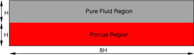

**Mesh: **

For both values of *Da*, a mesh sensitivity study was performed by comparing the value of the axial velocity at the interface between the porous and pure fluid region across a cross-section of the channel where fully developed flow conditions exist (near the outlet of the domain). Based on the analysis, the following conclusion was drawn:
- For both the cases of  and , a 100 40 mesh (length height) was found to be sufficient to obtain mesh independent results.

A grid sensitivity study was also performed using a Richardson extrapolation technique. The out-of-plane dimension is meshed with only one element to enforce the two-dimensional nature of the problem. 

**Boundary conditions: **

At the inlet a constant horizontal velocity, 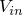, is specified. An outflow boundary condition with the pressure  is prescribed at the outflow boundary. A no-slip/no-penetration boundary condition is prescribed at the lower and upper walls. Furthermore, the two-dimensional nature of the problem is enforced by specifying the *z*-velocity component to be zero at all the boundaries of the domain. The summary of the prescribed boundary conditions is given in [Table 3.3.5--1](ch03s03abv184.md#ver-ifluid-porous-chnl-bc).

**Table 3.3.5–1** Boundary conditions for the porous channel problem.
| Surface | Boundary Condition |
| --- | --- |
| Inlet | 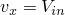, such that 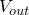 = 1 for the pure fluid region and  = 0, 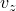 = 0 |
| Outlet | Outflow boundary conditions with *p* = 0 |
| Top and bottom walls | No-slip/no-penetration |

**Initial conditions: **

At , the velocity components are set to zero everywhere in the flow domain.

**Problem setup: **

The following values are used for the flow problem: fluid density  = 1 kg/m3 and height of the pure fluid and porous domains  = 1 m. The latter implies that the permeability 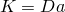, and the values of *K* are set accordingly. At the inlet a constant horizontal velocity  is determined a priori such that the average outflow velocity for the pure fluid region is equal to 1. For the porous region,  = 0.7.

To achieve a steady state, a backward Euler time integration scheme (the time weights 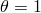 for all the discretized terms) is used with the implicit advection scheme and the Courant-Friedrichs-Lewy (CFL) number set to 40. All other solver options are set to the default values. Various smaller CFL numbers down to 0.45 were also tested with both the backward Euler and the Crank-Nicolson time integration schemes and with an explicit advection scheme. The steady-state solutions were found to be invariant with respect to these settings.

### Results and discussion

A grid sensitivity study using the Richardson extrapolation procedure was also done on three successively refined meshes with a refinement ratio of 2: a 50  20 mesh, a 100  40 mesh, and a 200  80 mesh. The axial component of the nodal velocity at the interface between the pure fluid and porous media was chosen for the grid convergence study. In addition, the two fine grids were used to estimate the value of the interface velocity at zero-grid spacing (Richardson extrapolate). [Figure 3.3.5--2](ch03s03abv184.md#ver-ifluid-porous-err-d1em2) and [Figure 3.3.5--3](ch03s03abv184.md#ver-ifluid-porous-err-d1em3) show the plots of the interface velocities with varying (normalized) grid spacings for the cases of  and , respectively. The zero-grid spacing Richardson extrapolate is also indicated. The normalization is done by the spacing of the finest grid. As the grid spacing reduces, the interface velocities approach the asymptotic zero-grid spacing values. The orders of convergence observed from these results were also determined to be 1.866 for the case of  and 1.832 for the case of 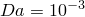. The theoretical order of convergence is 2.0, and the differences can be attributed to the nonlinearities in the problem.

**Figure 3.3.5–2** Interface velocity versus grid spacing(). 

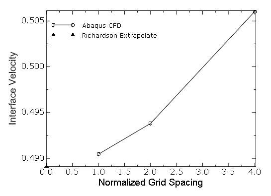

**Figure 3.3.5–3** Interface velocity versus grid spacing().

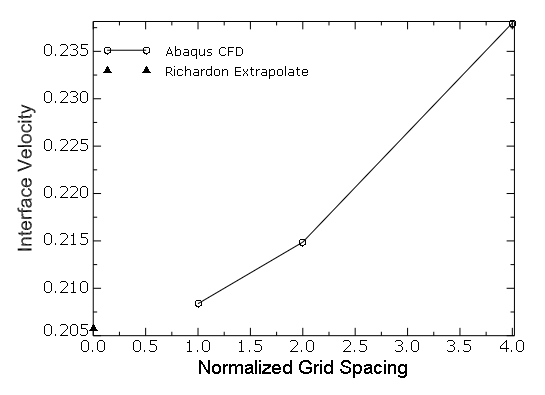

The results of all the cases generated using Abaqus/CFD are compared with the published results of [Betchen et al. (2006)](ch03s03abv184.md#ver-ref-betchen). In [Figure 3.3.5--4](ch03s03abv184.md#ver-ifluid-porous-chnl-d1em2) and [Figure 3.3.5--5](ch03s03abv184.md#ver-ifluid-porous-chnl-d1em3) the axial component of the velocity under fully developed flow conditions existing near the outlet boundary (the specific location was chosen to be at *x* = 7.84) are plotted for the cases of *Da* =  and . The results are seen to be in good agreement with the published results. However, in [Betchen et al. (2006)](ch03s03abv184.md#ver-ref-betchen), only a first-order accurate upwind scheme is used for the advection terms, while Abaqus/CFD uses an advection scheme that is spatially second-order accurate for smoothly varying flows.

**Figure 3.3.5–4** Comparison of the results for the developed velocity profile across a vertical cross-section near the outlet (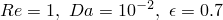).

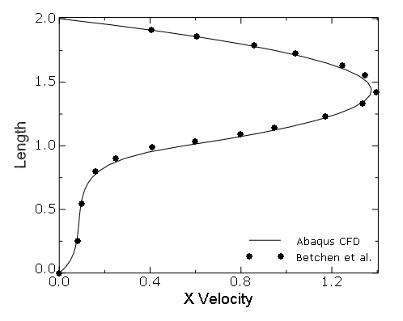

**Figure 3.3.5–5** Comparison of the results for the developed velocity profile across a vertical cross-section near the outlet (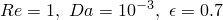).

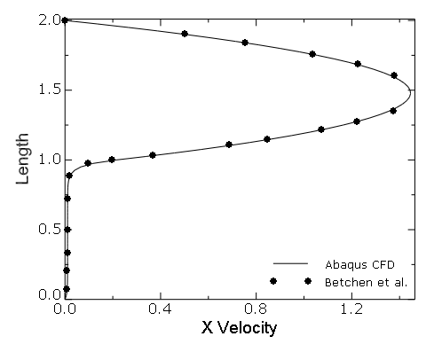

### Input files

[porouschannel_50x20_R1Da1em2_BE_VER.inp](../eif/porouschannel_50x20_R1Da1em2_BE_VER.inp)

Porous channel: 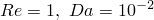,  with a 50  20 mesh (length  height).

[porouschannel_100x40_R1Da1em2_BE_VER.inp](../eif/porouschannel_100x40_R1Da1em2_BE_VER.inp)

Porous channel: ,  with a 100  40 mesh (length  height).

[porouschannel_200x80_R1Da1em2_BE_VER.inp](../eif/porouschannel_200x80_R1Da1em2_BE_VER.inp)

Porous channel: ,  with a 200  80 mesh (length  height).

[porouschannel_50x20_R1Da1em3_BE_VER.inp](../eif/porouschannel_50x20_R1Da1em3_BE_VER.inp)

Porous channel: 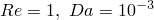,  with a 50  20 mesh (length  height).

[porouschannel_100x40_R1Da1em3_BE_VER.inp](../eif/porouschannel_100x40_R1Da1em3_BE_VER.inp)

Porous channel: ,  with a 100  40 mesh (length  height).

[porouschannel_200x80_R1Da1em3_BE_VER.inp](../eif/porouschannel_200x80_R1Da1em3_BE_VER.inp)

Porous channel: ,  with a 200  80 mesh (length  height).

### References

Betchen,  L., A. G. Straatman, and B. E. Thompson,  “A Nonequilibrium Finite-Volume Model for Conjugate Fluid/Porous/Solid Domains,” Numerical Heat Transfer, Part A, vol. 49, pp. 543–565, 2006.

Nield,  D. A., and A. Bejan,  “Convection in Porous Media,” 3rd Edition, Springer, New York, 2010.

### II. Flow through a porous plug in a channel

### Element tested

FC3D8

### Feature tested

Laminar flow through a porous medium.

### Problem description

 This verification problem is used to evaluate the accuracy of the Abaqus/CFD porous media model for the case of a porous interface placed perpendicular to the flow direction.  The geometry consists of a channel partially filled with a porous plug, as shown in [Figure 3.3.5--6](ch03s03abv184.md#ver-ifluid-porous-pluggeomr1) and [Figure 3.3.5--7](ch03s03abv184.md#ver-ifluid-porous-pluggeor1k). 

**Figure 3.3.5–6** Geometry of the porous plug problem for .

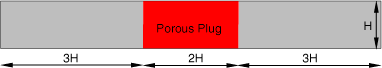

**Figure 3.3.5–7** Geometry of the porous plug problem for 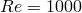.

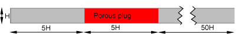

Steady flow solutions are considered for the following three cases: , ; , ; and , . Here, *Re* is based on the average velocity at the inlet, 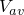, and the channel height *H*; and *Da* is based on *H*. The porosity  is set to 0.7 for all cases. In addition, for the case of , as given in [Betchen et al. (2006)](ch03s03abv184.md#ver-ref-betchen), the dynamic pressure scale for the flow, 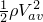, is set to a value of 500. The results provided by [Betchen et al. (2006)](ch03s03abv184.md#ver-ref-betchen), are compared to the Abaqus/CFD results.

**Model: **

For , the length of the channel is set equal to 8*H*. As shown in [Figure 3.3.5--6](ch03s03abv184.md#ver-ifluid-porous-pluggeomr1), a porous plug of length 2 is placed starting at a distance of 3*H* from the inlet. For the case of , the channel length is 60*H*. As shown in [Figure 3.3.5--7](ch03s03abv184.md#ver-ifluid-porous-pluggeor1k),  a porous plug of length 5*H* is placed at a distance of 5*H* from the inlet. The two-dimensional problem is solved as an abstraction of the three-dimensional version, so an out-of-plane thickness equal to 0.2*H* is specified.

**Mesh: **

A mesh sensitivity study was performed for all cases based on the comparison of the axial centerline velocity profile at steady-state conditions. The following conclusions were drawn:

1. For the case of , a 100 40 mesh (length height) was found to be sufficient to obtain mesh independent results for both  and .
2. For the case of , a 200 80 mesh was necessary to obtain mesh independent results.

As with the previous problem, a grid sensitivity study is performed using a Richardson extrapolation technique. The out-of-plane dimension is meshed with only one element to enforce the two-dimensional nature of the problem. 

**Boundary conditions: **

At the inlet a fully developed parabolic velocity profile with a mean velocity, , is prescribed. An outflow boundary condition with the pressure  is prescribed at the channel outlet. No-slip/no-penetration boundary conditions are prescribed at the lower and upper walls. Furthermore, the two-dimensional nature of the problem is enforced by specifying the *z*-velocity component to zero everywhere in the domain.  The summary of the boundary conditions is given in [Table 3.3.5--2](ch03s03abv184.md#ver-ifluid-porous-plug-bc).

**Table 3.3.5–2** Boundary conditions for the porous plug problem. 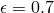 for all the cases.
| Surface | Boundary Condition |
| --- | --- |
| Inlet | 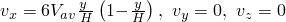 |
| Outlet | Outflow boundary condition with  |
| Top and bottom walls | No-slip/no-penetration |

**Initial conditions: **

At , the velocity components are set to zero everywhere in the flow domain.

**Problem setup: **

The channel height *H* = 1 m, and the inlet mean velocity  = 1 m/s. To vary the Reynolds number, the density  and the dynamic viscosity  are changed as given in [Table 3.3.5--3](ch03s03abv184.md#ver-ifluid-porous-plug-re). Since *H* = 1, the permeability  and the values of *K* are set accordingly.

**Table 3.3.5–3**  Values of the density  and the dynamic viscosity  used for the various *Re* cases.
| Re |  |  (kg/m/s) |
| --- | --- | --- |
| 1 | 1 | 1 |
| 1000 | 0.4 | 0.02 |

To achieve a steady state, use a backward Euler time integration scheme (the time weights  for all the discretized terms) with the implicit advection scheme and the CFL  number set to 40. All other solver options are set to the default values. Various smaller CFL numbers down to 0.45 were also tested with both the backward Euler and the Crank-Nicolson time integration schemes and with an explicit advection scheme. The steady-state solutions were found to be invariant with respect to these settings.

### Results and discussion

A grid sensitivity study using the Richardson extrapolation procedure is done for the case of  on three successively refined meshes with a refinement ratio of 2: a 100  40 mesh, a 200  80 mesh, and a 400  160 mesh. The axial component of the nodal velocity at the center of the plug was chosen for the grid convergence study. In addition, the two fine grids were used to estimate the value of the interface velocity at zero-grid spacing (Richardson extrapolate). [Figure 3.3.5--8](ch03s03abv184.md#ver-ifluid-porous-plg-errd1em2) and [Figure 3.3.5--9](ch03s03abv184.md#ver-ifluid-porous-plg-errd1em3) show the plots of the velocities at the center of the plug along the channel axis as a function of (normalized) grid spacings for the cases of  and , respectively.  The zero-grid spacing Richardson extrapolate is also indicated in the figures. The normalization is done by the spacing of the finest grid. As the grid spacing reduces, the velocities approach the asymptotic zero-grid spacing values. The orders of convergence observed from these results are also determined to be 1.977 for the case of  and 1.894 for the case of . 

**Figure 3.3.5–8** Velocity at the center of the plug along the channel axis versus grid spacing (, ).

**Figure 3.3.5–9** Velocity at the center of the plug along the channel axis versus grid spacing (, ).

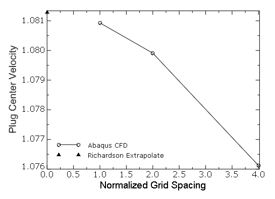

The results of all the cases generated using Abaqus/CFD are compared with the published results of [Betchen et al. (2006)](ch03s03abv184.md#ver-ref-betchen). For the case of  and , the axial centerline velocity and pressure profiles are shown in [Figure 3.3.5--10](ch03s03abv184.md#ver-ifluid-porous-plg-vr1d1em2) and [Figure 3.3.5--11](ch03s03abv184.md#ver-ifluid-porous-plg-pr1d1em2) along with the numerical results of [Betchen et al. (2006)](ch03s03abv184.md#ver-ref-betchen). For  and , the comparison of the centerline velocity and pressure profiles are shown in [Figure 3.3.5--12](ch03s03abv184.md#ver-ifluid-porous-plg-vr1d1em3) and [Figure 3.3.5--13](ch03s03abv184.md#ver-ifluid-porous-plg-pr1d1em3). In [Figure 3.3.5--14](ch03s03abv184.md#ver-ifluid-porous-plg-r1kd1em2) the centerline velocity profile for the case of  is compared with that of [Betchen et al. (2006)](ch03s03abv184.md#ver-ref-betchen). 

**Figure 3.3.5–10** Axial centerline velocity profile ( and 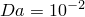).

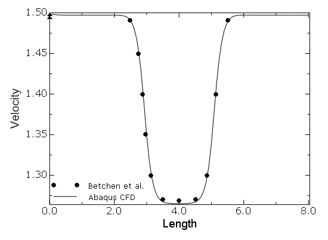

**Figure 3.3.5–11** Axial centerline pressure profile ( and ).

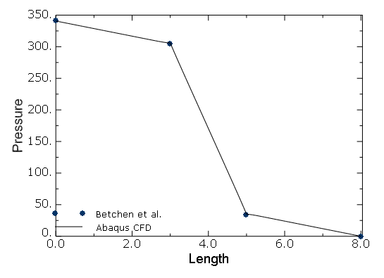

**Figure 3.3.5–12** Axial centerline velocity profile ( and ).

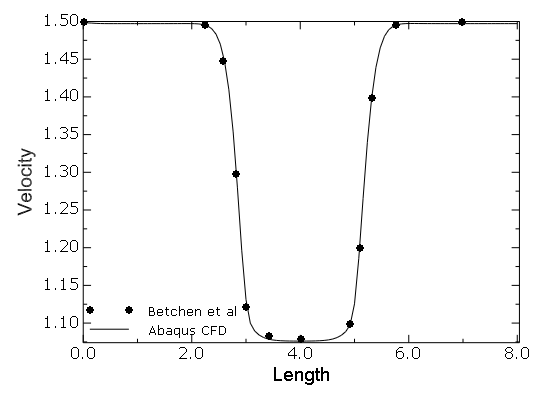

**Figure 3.3.5–13** Axial centerline pressure profile ( and ).

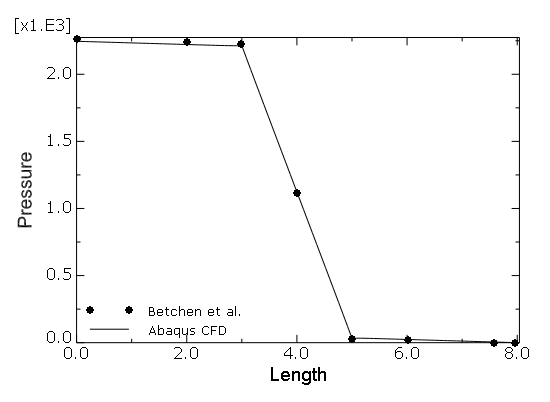

**Figure 3.3.5–14** Axial centerline velocity profile ( and ).

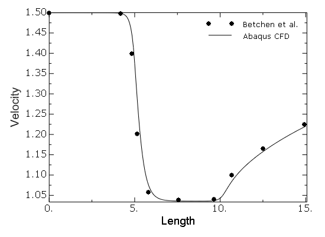

For all the cases the results compare very well. However, as seen in [Figure 3.3.5--14](ch03s03abv184.md#ver-ifluid-porous-plg-r1kd1em2), for the case of  there is a slight deviation between the Abaqus/CFD results and those of [Betchen et al. (2006)](ch03s03abv184.md#ver-ref-betchen). As noted earlier, in [Betchen et al. (2006)](ch03s03abv184.md#ver-ref-betchen), a first-order upwind scheme is used for the advection terms, which results in lower accuracy for higher ; Abaqus/CFD uses an advection scheme that is spatially second-order accurate for smoothly varying flows.

### Input files

[porousplug_100x40_R1Da1em2_BE_VER.inp](../eif/porousplug_100x40_R1Da1em2_BE_VER.inp)

Porous plug: ,  with a 100  40 mesh (length  height).

[porousplug_200x80_R1Da1em2_BE_VER.inp](../eif/porousplug_200x80_R1Da1em2_BE_VER.inp)

Porous plug: ,  with a 200  80 mesh (length  height).

[porousplug_100x40_R1Da1em3_BE_VER.inp](../eif/porousplug_100x40_R1Da1em3_BE_VER.inp)

Porous plug: ,  with a 100  40 mesh (length  height).

[porousplug_200x80_R1Da1em3_BE_VER.inp](../eif/porousplug_200x80_R1Da1em3_BE_VER.inp)

Porous plug: ,  with a 200  80 mesh (length  height).

[porousplug_200x80_R1KDa1em2_BE_VER.inp](../eif/porousplug_200x80_R1KDa1em2_BE_VER.inp)

Porous plug: 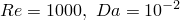,  with a 200  80 mesh (length  height).

[porousplug_400x160_R1KDa1em2_BE_VER.inp](../eif/porousplug_400x160_R1KDa1em2_BE_VER.inp)

Porous plug: ,  with a 400  160 mesh (length  height).

### III. Fully porous lid-driven cavity

### Element tested

FC3D8

### Feature tested

Laminar shear driven flow through a porous medium.

### Problem description

 The accuracy of the porous media model is further evaluated using the steady-state flow results for the cases of both orthogonal and skewed fully porous two-dimensional lid-driven cavities at Reynolds numbers of 10 and 1000.  The results provided by [Krishna et al. (2008)](ch03s03abv184.md#ver-ref-krishna), are compared to the Abaqus/CFD results.

The porosity, , is assumed to be a constant for all the cases; and the aspect ratios for the cavities are set to unity. The Reynolds number, *Re*, is based on the specified horizontal velocity of the cavity lid, 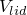, and the cavity length, *L*. For , only orthogonal cavities are considered. Furthermore, *Da* is set to , , and 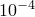. The porosity  is set to 0.1. For the case of , both orthogonal and skewed cavities are considered. The skewed angle is set to 60. In addition, 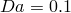 and 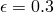.

**Model: **

The schematics of the skewed and orthogonal two-dimensional cavities used are shown in [Figure 3.3.5--15](ch03s03abv184.md#ver-ifluid-porous-ldcgeom). The two-dimensional problem is solved as an abstraction of the three-dimensional version, and an out-of-plane thickness equal to 0.025 *L* is specified.

**Figure 3.3.5–15** Schematics of the fully porous skewed and orthogonal lid-driven cavity.

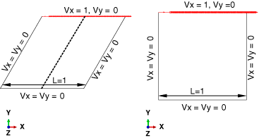

**Mesh: **

For all the cases a detailed mesh sensitivity analysis is performed by comparing the results of the horizontal and vertical velocity component profiles along the vertical and horizontal geometric centerlines of the cavities, respectively. For *Re* = 1000, a nonuniform mesh graded near the no-slip/no-penetration boundaries, as shown in [Figure 3.3.5--16](ch03s03abv184.md#ver-ifluid-porous-ldcmesh90), was used to resolve the boundary layer and porous media dynamics accurately while reducing the computational time. For the skewed cavity cases the results were particularly sensitive to the boundary layer resolution; a coarser mesh was found to yield incorrect solutions, as shown in [Figure 3.3.5--17](ch03s03abv184.md#ver-ifluid-porous-ldcvmag60). Based on these observations, the following conclusions are drawn:

1. For the cases of *Re* = 10 and *Da* =  and , a 64 64 uniform mesh was found to be sufficient to obtain mesh independent results.
2. For the case of *Re* = 10 and *Da* = , a 128 128 uniform mesh was found to be necessary to obtain mesh independent results.
3. For the case of *H* = 1000 orthogonal cavity, a 64 256 nonuniform mesh was necessary to obtain grid independent results.
4. Similarly, for the case of *Re* = 1000 and 60 skewed cavity, a 64 256 nonuniform mesh was necessary to obtain grid independent results.

**Figure 3.3.5–16** Graded mesh used for  orthogonal cavity case. A similar mesh is also used for the 60 skewed cavity case.

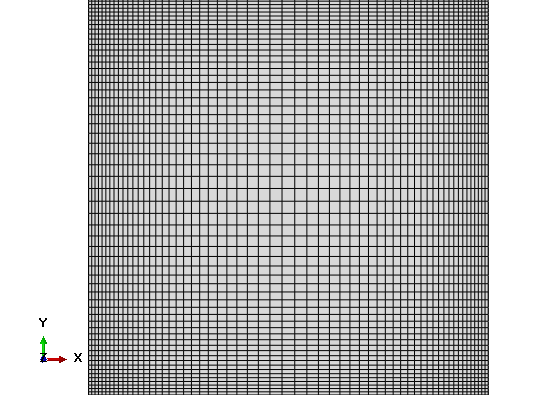

**Figure 3.3.5–17** Plot of the steady-state velocity magnitude contours for the case of ,  skewed cavity (60).  Result for a 32  128 nonuniform mesh (left) and for a 64  256 mesh (right).

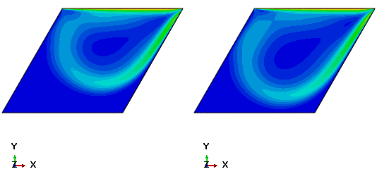

The out-of-plane dimension (*z*-axis) is meshed with only one element to enforce the two-dimensional nature of the problem. 

**Boundary conditions: **

The prescribed boundary conditions are shown in [Figure 3.3.5--15](ch03s03abv184.md#ver-ifluid-porous-ldcgeom). No-slip/no-penetration boundary conditions are applied on the side walls and the base of the cavity by setting the in-plane velocity components  = (0, 0). A constant velocity  =  = (1, 0) is prescribed at the cavity lid. Furthermore, the two-dimensional nature of the problem is enforced by specifying the out-of-plane *z*-velocity  on all the boundaries.  

 If all the flow boundary conditions are prescribed for velocity alone and not for pressure, the solution to the governing equation becomes singular for the pressure unknown. The singularity occurs because any additive constant to pressure would still satisfy both the governing equations (since only the gradient of pressure is involved) and the boundary conditions (since pressure is not involved in their specification). This undetermined additive constant for pressure is the hydrostatic pressure mode and is removed by fixing the value of pressure (either to an arbitrary constant or to a value obtained from experiments) for at least a single point in the domain. In this case *p* is set to a value of zero at the bottom right corner of the cavity [].

**Initial conditions: **

At *t* = 0, the velocity components are set to zero everywhere in the flow domain.

**Problem setup: **

The following values are used for the flow problem: fluid density  = 1 kg/m3, cavity edge length *L* = 1 m, and lid velocity  = 1 m/s. To vary the Reynolds number, the dynamic viscosity  is changed, as given in [Table 3.3.5--4](ch03s03abv184.md#ver-ifluid-porous-ldc-re). Since the length scale , the permeability . Thus, for the case of , , , and . For the case of , .

**Table 3.3.5–4**  Values of the density  used for the various *Re* cases.
| Re |  (kg/m/s) |
| --- | --- |
| 10 | 0.1 |
| 1000 | 0.001 |

To achieve a steady state, a backward Euler time integration scheme (the time weights  for all the discretized terms) is used with the implicit advection scheme and the CFL  number set to 40. It is observed that for such high CFL numbers, the default momentum solver—the Diagonally Scaled Flexible Generalized Minimum Residual linear solver (DSFGMRES)—results either in poor convergence or in some cases nonconvergence. Hence, the momentum solver type is set to the Incomplete LU factorization preconditioned Flexible Generalized Minimum Residual linear solver (ILUFGMRES), which results in good convergence for all cases. All other solver options are set to the default values. Various smaller CFL numbers down to 0.45 are also tested with both the backward Euler and the Crank-Nicolson time integration schemes and with an explicit advection scheme. The steady-state solutions are found to be invariant with respect to these settings.

### Results and discussion

The results of Abaqus/CFD are compared with the published results of [Krishna et al. (2008)](ch03s03abv184.md#ver-ref-krishna). In [Figure 3.3.5--18](ch03s03abv184.md#ver-ifluid-porous-ldcr10-vx) and [Figure 3.3.5--19](ch03s03abv184.md#ver-ifluid-porous-ldcr10-vy) the comparison results of the horizontal and vertical velocity component profiles along the vertical and horizontal geometric centerlines of the cavities for the cases of  and  and  are shown. The results are in excellent agreement with the published results. These results are also in very good agreement with the Lattice-Boltzmann simulation results of [Guo and Zhao (2002)](ch03s03abv184.md#ver-ref-guo) (results not shown). The comparison results of the horizontal component of the velocity profile along the vertical centerline for the case of the  orthogonal cavity and  are shown in [Figure 3.3.5--20](ch03s03abv184.md#ver-ifluid-porous-ldcr1k-90), along with the results obtained using different meshes. For the 60 skewed cavity and , the results for the horizontal component of the velocity profile along the geometric centerline (see [Figure 3.3.5--15](ch03s03abv184.md#ver-ifluid-porous-ldcgeom)) are shown in [Figure 3.3.5--21](ch03s03abv184.md#ver-ifluid-porous-ldcr1k-60), along with the results obtained using different meshes. The results for  are seen to deviate slightly from those of [Krishna et al. (2008)](ch03s03abv184.md#ver-ref-krishna), near the bottom of the cavity, although the grid independence study in [Krishna et al. (2008)](ch03s03abv184.md#ver-ref-krishna), considers the maximum streamline value, which occurs near the top of the cavity, as the convergence metric. Based on such a metric, a uniform 120  120 mesh was used in their simulations. A better metric would have been to use the minimum horizontal component of the velocity along the geometric centerline since it was noted from Abaqus/CFD simulations that this quantity is slower to converge than the maximum streamline values that converge even on coarser meshes.

**Figure 3.3.5–18** Comparison of profiles for the horizontal component of velocity along the vertical centerline of the orthogonal cavity ( and  and ).

**Figure 3.3.5–19** Comparison of profiles for the vertical component of velocity along the horizontal centerline of the orthogonal cavity ( and  and ).

**Figure 3.3.5–20** Comparison of profiles for the horizontal component of velocity along the vertical centerline ( and ; orthogonal cavity).

**Figure 3.3.5–21** Comparison of profiles for the horizontal component of velocity along the geometric centerline ( and  ; skewed cavity)—see [Figure 3.3.5--15](ch03s03abv184.md#ver-ifluid-porous-ldcgeom).

### Input files

[porouscavity90_64x64_R10Da1em2_BE_VER.inp](../eif/porouscavity90_64x64_R10Da1em2_BE_VER.inp)

Fully porous orthogonal lid-driven cavity: ,  with a 64  64 uniform mesh.

[porouscavity90_64x64_R10Da1em3_BE_VER.inp](../eif/porouscavity90_64x64_R10Da1em3_BE_VER.inp)

Fully porous orthogonal lid-driven cavity: ,  with a 64  64 uniform mesh.

[porouscavity90_64x64_R10Da1em4_BE_VER.inp](../eif/porouscavity90_64x64_R10Da1em4_BE_VER.inp)

Fully porous orthogonal lid-driven cavity: ,  with a 64  64 uniform mesh.

[porouscavity90_128x128_R10Da1em4_BE_VER.inp](../eif/porouscavity90_128x128_R10Da1em4_BE_VER.inp)

Fully porous orthogonal lid-driven cavity: ,  with a 128  128 uniform mesh.

[porouscavity90_32x128_R1KDa0p1_BE_VER.inp](../eif/porouscavity90_32x128_R1KDa0p1_BE_VER.inp)

Fully porous orthogonal lid-driven cavity: ,  with 3481 elements nonuniform mesh.

[porouscavity90_64x256_R1KDa0p1_BE_VER.inp](../eif/porouscavity90_64x256_R1KDa0p1_BE_VER.inp)

Fully porous orthogonal lid-driven cavity: ,  with 13924 elements nonuniform mesh.

[porouscavity90_128x512_R1KDa0p1_BE_VER.inp](../eif/porouscavity90_128x512_R1KDa0p1_BE_VER.inp)

Fully porous orthogonal lid-driven cavity: ,  with 56169 elements nonuniform mesh.

[porouscavity60_32x128_R1KDa0p1_BE_VER.inp](../eif/porouscavity60_32x128_R1KDa0p1_BE_VER.inp)

Fully porous 60 skewed lid-driven cavity: ,  with 3481 elements nonuniform mesh.

[porouscavity60_64x256_R1KDa0p1_BE_VER.inp](../eif/porouscavity60_64x256_R1KDa0p1_BE_VER.inp)

Fully porous 60 skewed lid-driven cavity: ,  with 13924 elements nonuniform mesh.

[porouscavity60_128x512_R1KDa0p1_BE_VER.inp](../eif/porouscavity60_128x512_R1KDa0p1_BE_VER.inp)

Fully porous 60 skewed lid-driven cavity: ,  with 56169 elements nonuniform mesh.

### References

Guo,  Z., and T. S. Zhao,  “Lattice Boltzmann Model for Incompressible Flows through Porous Media,” Physical Review E, vol. 66, pp. 036304 (1–9), 2002.

Krishna,  J. D., T. Basak, and S. K. Das,  “Numerical Study of Lid-Driven Flow in Orthogonal and Skewed Porous Cavity,” Communication in Numerical Methods in Engineering, vol. 24, pp. 815–831, 2008.

### IV. Partially porous lid-driven cavity

### Element tested

FC3D8

### Feature tested

Laminar shear driven flow through a porous medium.

### Problem description

The accuracy of the porous media model is further evaluated using the steady-state flow results for the cases of an orthogonal partially porous two-dimensional lid-driven cavity at  and , , and .  The results provided by [Bai et al. (2009)](ch03s03abv184.md#ver-ref-bai), are compared to the Abaqus/CFD results.

The porosity  for all the cases considered, and the aspect ratio of the orthogonal cavity is set to unity. The Reynolds number, *Re*, is based on the specified horizontal velocity of the cavity lid, , and the cavity length, *L*.

**Model: **

The geometry of the two-dimensional partially porous orthogonal cavity used is shown in [Figure 3.3.5--22](ch03s03abv184.md#ver-ifluid-porous-pldc-geom). The length of the domain, *L*, is set equal to 1. The pure fluid region occupies the top quarter of the domain, while the remaining volume is occupied by the porous medium. The two-dimensional problem is solved as an abstraction of the three-dimensional version, and an out-of-plane thickness equal to 0.01*L* is specified.

**Figure 3.3.5–22** Schematic of the partially porous orthogonal lid-driven cavity.

**Mesh: **

For all the cases considered, a detailed mesh sensitivity analysis is performed by comparing the horizontal and vertical velocity component profiles along the vertical and horizontal geometric centerlines of the cavities. For all the cases a 64  64 uniform mesh was found sufficient to produce mesh independent results. The out-of-plane dimension (*z*-axis) is meshed with only one element to enforce the two-dimensional nature of the problem. 

**Boundary conditions: **

The prescribed boundary conditions are shown in [Figure 3.3.5--22](ch03s03abv184.md#ver-ifluid-porous-pldc-geom). No-slip/no-penetration boundary conditions are applied on the side walls and the base of the cavity by setting the in-plane velocity components  = (0, 0). A constant velocity  =  = (1, 0) is prescribed at the cavity lid. Furthermore, the two-dimensional nature of the problem is enforced by specifying the out-of-plane *z*-velocity  everywhere in the domain.  

 If all the flow boundary conditions are prescribed for velocity alone and not for pressure, the solution to the governing equation becomes singular for the pressure unknown because any additive constant to pressure would still satisfy both the governing equations (since only the gradient of pressure is involved) and the boundary conditions (since pressure is not involved in their specification). This undetermined additive constant for pressure is the hydrostatic pressure mode and is removed by fixing the value of pressure (either to an arbitrary constant or to a value obtained from experiments) for at least a single point in the domain. In this case *p* is set to a value of zero at the bottom right corner of the cavity [].

**Initial conditions: **

At *t* = 0, the velocity components are set to zero everywhere in the flow domain.

**Problem setup: **

The following values are used for the flow problem: fluid density  1 kg/m3, dynamic viscosity,  kg/m/s, cavity edge length *L* = 1 m, and lid velocity  =1 m/s. Since the length scale , the permeability  and, hence, , , and .

To achieve a steady state, a backward Euler time integration scheme (the time weights  for all the discretized terms) is used with the implicit advection scheme and the CFL  number set to 40. It was observed that for such high CFL numbers, the default momentum solver (DSFGMRES) resulted either in poor convergence or in some cases nonconvergence. Hence, the momentum solver type was set to ILUFGMRES, which resulted in good convergence for all cases. All other solver options are set to the default values. Various smaller CFL numbers down to 0.45 were also tested with both the backward Euler and the Crank-Nicolson time integration schemes and with an explicit advection scheme. The steady-state solutions were found to be invariant with respect to these settings.

### Results and discussion

The results of Abaqus/CFD are compared with the published results of [Bai et al. (2009)](ch03s03abv184.md#ver-ref-bai). In [Figure 3.3.5--23](ch03s03abv184.md#ver-ifluid-porous-pldcr1-vx) and [Figure 3.3.5--24](ch03s03abv184.md#ver-ifluid-porous-pldcr1-vy) the comparison results of the horizontal and vertical velocity component profiles along the vertical and horizontal geometric centerlines of the cavities for the cases of  and  and  are shown. The results are in excellent agreement with the published results. 

**Figure 3.3.5–23** Comparison of profiles for the horizontal component of velocity along the vertical centerline of the orthogonal cavity ( and  and ).

**Figure 3.3.5–24** Comparison of profiles for the vertical component of velocity along the horizontal interface between the porous and pure fluid region ( and  and )—see [Figure 3.3.5--22](ch03s03abv184.md#ver-ifluid-porous-pldc-geom).

### Input files

[porous_partcavity90_64x64_R1Da5em2_BE_VER.inp](../eif/porous_partcavity90_64x64_R1Da5em2_BE_VER.inp)

Partially porous orthogonal lid-driven cavity: ,  with a 64  64 uniform mesh.

[porous_partcavity90_64x64_R1Da1em2_BE_VER.inp](../eif/porous_partcavity90_64x64_R1Da1em2_BE_VER.inp)

Partially porous orthogonal lid-driven cavity: ,  with a 64  64 uniform mesh.

[porous_partcavity90_64x64_R1Da1em3_BE_VER.inp](../eif/porous_partcavity90_64x64_R1Da1em3_BE_VER.inp)

Partially porous orthogonal lid -driven cavity: ,  with a 64  64 uniform mesh.

### Reference

Bai,  H., P. Yu, S. H. Winoto, and H. T. Low,  “Lattice Boltzmann Method for Flows in Porous and Homogenous Fluid Domains Coupled at the Interface by Stress Jump,” International Journal for Numerical Methods in Fluids, vol. 60, pp. 691–708, 2009.

