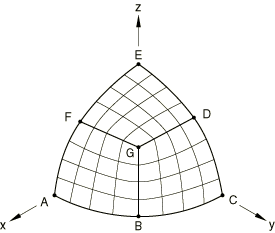
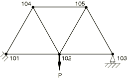
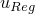
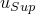
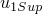
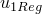
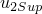
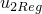

# 3.5.1 子结构旋转、镜像、变换和约束

**产品：**Abaqus/Standard  

### I. 子结构旋转、变换和运动约束

### 测试的功能

子结构旋转以及节点和单元变量、材料方向和积分点坐标的恢复。验证了方程约束、多点约束和节点变换。

### 问题描述

形成长度为10.0、厚度和宽度为1.0的矩形子结构，并在一端施加200.0的压力载荷。子结构旋转30度，并在与压力载荷相对的一端固定。实体和壳单元使用2×5网格，梁单元使用10单元网格。

第二个网格定义在旋转位置，并以与第一个网格相同的方式加载，但不使用子结构。子结构中的单元和未使用子结构定义的单元的位移、应变和应力，以及积分点坐标和材料方向应该是相同的。对于连续体单元，子结构应力和应变在全球系统中报告。在所有其他情况下，子结构应力和应变在旋转系统中报告。

在由CPE4单元组成的子结构上测试了方程约束、多功能约束和节点变换的使用。节点变换在使用和创建级别都进行了测试。为这个特定分析创建了三个级别的子结构。最低级别是CPE4单元的2×1网格。下一级包含两个一级子结构，第三级是实际结构。在创建级别测试了未排序保留自由度集的使用。

### 结果与讨论

子结构中的所有结果与常规网格中的结果相同，并且在解析单轴解的0.05%范围内。

### 输入文件

[psupsol1.inp](../eif/psupsol1.inp)

不含[*ORIENTATION](../key/key-link.md#usb-kws-morientation)的CPE4单元。

[psupsol1_gen.inp](../eif/psupsol1_gen.inp)

psupsol1.inp中引用的子结构生成文件。

[psupsol1or.inp](../eif/psupsol1or.inp)

含[*ORIENTATION](../key/key-link.md#usb-kws-morientation)的CPE4单元。

[psupsol1or_gen.inp](../eif/psupsol1or_gen.inp)

psupsol1or.inp中引用的子结构生成文件。

[psupsol1mi.inp](../eif/psupsol1mi.inp)

含[*TRANSFORM](../key/key-link.md#usb-kws-mtransform)、[*MPC](../key/key-link.md#usb-kws-mmpc)、[*EQUATION](../key/key-link.md#usb-kws-mequation)和未排序保留DOF的CPE4单元。

[psupsol1mi_gen1.inp](../eif/psupsol1mi_gen1.inp)

psupsol1mi.inp中引用的子结构生成文件。

[psupsol1mi_gen2.inp](../eif/psupsol1mi_gen2.inp)

psupsol1mi.inp中引用的子结构生成文件。

[psupsol1mi_gen3.inp](../eif/psupsol1mi_gen3.inp)

psupsol1mi.inp中引用的子结构生成文件。

[psupcontshl.inp](../eif/psupcontshl.inp)

含[*SHELL SECTION](../key/key-link.md#usb-kws-mshellsection)且不含[*ORIENTATION](../key/key-link.md#usb-kws-morientation)的SC8R单元。

[psupcontshl_gen.inp](../eif/psupcontshl_gen.inp)

psupcontshl.inp中引用的子结构生成文件。

[psupshl1.inp](../eif/psupshl1.inp)

含[*SHELL SECTION](../key/key-link.md#usb-kws-mshellsection)且不含[*ORIENTATION](../key/key-link.md#usb-kws-morientation)的S4R单元。

[psupshl1_gen.inp](../eif/psupshl1_gen.inp)

psupshl1.inp中引用的子结构生成文件。

[psupshl1or.inp](../eif/psupshl1or.inp)

含[*SHELL SECTION](../key/key-link.md#usb-kws-mshellsection)和[*ORIENTATION](../key/key-link.md#usb-kws-morientation)的S4R单元。

[psupshl1or_gen.inp](../eif/psupshl1or_gen.inp)

psupshl1or.inp中引用的子结构生成文件。

[psupsfl1.inp](../eif/psupsfl1.inp)

含[*SHELL SECTION](../key/key-link.md#usb-kws-mshellsection)且不含[*ORIENTATION](../key/key-link.md#usb-kws-morientation)的S4单元。

[psupsfl1_gen.inp](../eif/psupsfl1_gen.inp)

psupsfl1.inp中引用的子结构生成文件。

[psupsfl1or.inp](../eif/psupsfl1or.inp)

含[*SHELL SECTION](../key/key-link.md#usb-kws-mshellsection)和[*ORIENTATION](../key/key-link.md#usb-kws-morientation)的S4单元。

[psupsfl1or_gen.inp](../eif/psupsfl1or_gen.inp)

psupsfl1or.inp中引用的子结构生成文件。

[psupshl2.inp](../eif/psupshl2.inp)

含[*SHELL GENERAL SECTION](../key/key-link.md#usb-kws-mshellgensect)且不含[*ORIENTATION](../key/key-link.md#usb-kws-morientation)的S4R单元。

[psupshl2_gen.inp](../eif/psupshl2_gen.inp)

psupshl2.inp中引用的子结构生成文件。

[psupshl2or.inp](../eif/psupshl2or.inp)

含[*SHELL GENERAL SECTION](../key/key-link.md#usb-kws-mshellgensect)和[*ORIENTATION](../key/key-link.md#usb-kws-morientation)的S4R单元。

[psupshl2or_gen.inp](../eif/psupshl2or_gen.inp)

psupshl2or.inp中引用的子结构生成文件。

[psupsfl2.inp](../eif/psupsfl2.inp)

含[*SHELL GENERAL SECTION](../key/key-link.md#usb-kws-mshellgensect)且不含[*ORIENTATION](../key/key-link.md#usb-kws-morientation)的S4单元。

[psupsfl2_gen.inp](../eif/psupsfl2_gen.inp)

psupsfl2.inp中引用的子结构生成文件。

[psupsfl2or.inp](../eif/psupsfl2or.inp)

含[*SHELL GENERAL SECTION](../key/key-link.md#usb-kws-mshellgensect)和[*ORIENTATION](../key/key-link.md#usb-kws-morientation)的S4单元。

[psupsfl2or_gen.inp](../eif/psupsfl2or_gen.inp)

psupsfl2or.inp中引用的子结构生成文件。

[psupbm1.inp](../eif/psupbm1.inp)

含[*BEAM SECTION](../key/key-link.md#usb-kws-mbeamsection)的B31单元。

[psupbm1_gen.inp](../eif/psupbm1_gen.inp)

psupbm1.inp中引用的子结构生成文件。

[psupbm2.inp](../eif/psupbm2.inp)

含[*BEAM GENERAL SECTION](../key/key-link.md#usb-kws-mbeamgensect)的B31单元。

[psupbm2_gen.inp](../eif/psupbm2_gen.inp)

psupbm2.inp中引用的子结构生成文件。

### II. 子结构旋转和镜像

### 测试的功能

多级子结构的平移、旋转和镜像以及节点和单元变量的恢复。这些功能在两个不同的模型上测试：半球壳和简单吊车模型。半球壳模型与["LE3: 带点载荷的半球壳，"Abaqus基准指南第4.2.3节](../bmk/bmk-link.md#bmk-nfm-le3)中所述相同。

### 问题描述

下面讨论两个模型。

#### 半球壳模型

["LE3: 带点载荷的半球壳，"Abaqus基准指南第4.2.3节](../bmk/bmk-link.md#bmk-nfm-le3)中半球壳问题的网格由S4R5单元组成。在该示例中，对球体的八分之一进行了建模。在这个示例中，网格被分成三个相等的部分，如图[图3.5.1-1](ch03s05abv187.md#versuperrotate-hemishell)所示，每个部分用4×4壳单元网格建模。

**图3.5.1-1** 半球壳模型。

定义了三个部分中的一个（A-B-G-F），并创建了子结构。然后通过分别相对于F-G和G-B线镜像子结构获得球体的八分之一。重现了["LE3: 带点载荷的半球壳，"Abaqus基准指南第4.2.3节](../bmk/bmk-link.md#bmk-nfm-le3)的结果。

在第二个示例中，通过使用该子结构两次来建模球体的四分之一，第二次将其绕z轴旋转90度。

在第三个示例中，通过使用新子结构两次来建模球体的一半，第二次在x-z平面中镜像。

#### 头顶吊车模型

如图[图3.5.1-2](ch03s05abv187.md#versuperrotate-hoistmodel)所示的头顶吊车用于测试多级子结构的平移、旋转和镜像。吊车是一个简单的销接梁和桁架模型，左端受约束，右端安装在滚轮上。构件可以在节点处自由旋转。每个构件长度为1 m，直径为5 mm。结构在中心承受10 kN载荷。构件的杨氏模量和泊松比分别取200 GPa和0.3。该结构使用七个T2D2单元建模，每个构件一个单元。

**图3.5.1-2** 头顶吊车模型。

连接到固定端的水平构件用于形成第一级子结构。然后通过旋转和平移第一级子结构形成代表吊车三角形部分的第二级子结构。通过镜像或平移较低级子结构创建代表实际结构的第三级子结构。

还创建了一个使用常规T2D2单元的结构独立模型来验证获得的结果。

### 结果与讨论

每个模型的结果在下面讨论。

#### 半球壳模型

所有单元输出都在子结构形成期间定义的局部方向上。

| 网格 | 单元 | 截面点 |  |  |  |
| --- | --- | --- | --- | --- | --- |
| psuplev1 | 3000 < 1 | 1 | 377. | 2148. | 2581. |
| psuplev1 | 3000 < 2 | 1 | 377. | 2148. | 2581. |
| psuplev1 | 3000 < 3 | 1 | 1. | 1. | 700. |
| psuplev2 | 3000 < 1 < 101 | 1 | 377. | 2148. | 2581. |
| psuplev2 | 3000 < 2 < 101 | 1 | 378. | 2149. | 2580. |
| psuplev2 | 3000 < 3 < 101 | 1 | 2. | 1. | 699. |
| psuplev2 | 3000 < 1 < 102 | 1 | 377. | 2147. | 2581. |
| psuplev2 | 3000 < 2 < 102 | 1 | 378. | 2149. | 2580. |
| psuplev2 | 3000 < 3 < 102 | 1 | 2. | 1. | 700. |
| psuplev3 | 3000 < 1 < 101 < 1001 | 1 | 377. | 2148. | 2581. |
| psuplev3 | 3000 < 3 < 101 < 1001 | 1 | 2. | 1. | 699. |
| psuplev3 | 3000 < 1 < 102 < 1001 | 1 | 377. | 2147. | 2581. |
| psuplev3 | 3000 < 1 < 101 < 1002 | 1 | 377. | 2148. | 2581. |
| psuplev3 | 3000 < 2 < 101 < 1002 | 1 | 378. | 2149. | 2580. |
| psuplev3 | 3000 < 1 < 102 < 1002 | 1 | 377. | 2147. | 2581. |
| psuplev3 | 3000 < 2 < 102 < 1002 | 1 | 378. | 2149. | 2580. |
| psuplev3 | 3000 < 3 < 102 < 1002 | 1 | 2. | 1. | 700. |

#### 头顶吊车模型

多级子结构分析获得的结果与常规单元模型获得的结果相同。常规单元模型的节点位移和子结构模型的节点位移在下表中给出：

| 节点 |  |  |  |  |
| --- | --- | --- | --- | --- |
| 102 | 7.456E04 | 7.456E04 | 4.735E03 | 4.735E03 |
| 103 | 1.491E03 | 1.491E03 | 0.000E00 | 0.000E00 |
| 104 | 1.491E03 | 1.491E03 | 2.583E03 | 2.583E03 |
| 105 | 0.000E00 | 0.000E00 | 2.583E03 | 2.583E03 |

### 输入文件

[psuplev1.inp](../eif/psuplev1.inp)

这是球体八分之一的分析。

[psuplev1_gen.inp](../eif/psuplev1_gen.inp)

形成第一级子结构；在分析psuplev1.inp中引用。

[psuplev2.inp](../eif/psuplev2.inp)

通过使用两个子结构执行球体四分之一的分析，第二个旋转90度。

[psuplev2_gen.inp](../eif/psuplev2_gen.inp)

通过使用三个第一级子结构形成第二级子结构：一个在原始几何位置，两个通过镜像单元；在分析psuplev2.inp中引用。

[psuplev3.inp](../eif/psuplev3.inp)

通过使用两个子结构副本执行全局分析：一个在原始位置，一个通过镜像。

[psuplev3_gen.inp](../eif/psuplev3_gen.inp)

通过使用两个第二级子结构形成第三级子结构：一个在原始几何位置，另一个通过将子结构旋转90度；在分析psuplev3.inp中引用。

[psuphoi1.inp](../eif/psuphoi1.inp)

使用子结构对简单头顶吊车模型进行分析。

[psuphoi1_gen1.inp](../eif/psuphoi1_gen1.inp)

psuphoi1.inp中引用的子结构生成文件。

[psuphoi1_gen2.inp](../eif/psuphoi1_gen2.inp)

psuphoi1.inp中引用的子结构生成文件。

[psuphoi2.inp](../eif/psuphoi2.inp)

不使用子结构的头顶吊车模型分析。

### III. 激活非保留DOF的子结构旋转

### 测试的功能

激活在子结构生成期间未保留的自由度的子结构旋转。

### 问题描述

通过保留T2D2单元两个节点处的x位移自由度，沿全局x轴定义子结构。使用子结构属性定义将子结构在x-y平面中旋转45度。子结构的一端固定，而在自由端施加对应于轴向拉伸的位移边界条件。

### 结果与讨论

子结构分析的结果与未使用子结构时获得的结果完全匹配。在子结构生成期间未保留的自由度通过子结构属性定义的使用被正确激活。

### 输入文件

[psuptr1.inp](../eif/psuptr1.inp)

使用一个T2D2单元。

[psuptr1_gen.inp](../eif/psuptr1_gen.inp)

psuptr1.inp中引用的子结构生成文件。

### IV. 包含声明为刚性的可变形单元

### 测试的功能

验证在子结构生成和后续使用期间声明为刚性的可变形单元的包含。

### 问题描述

在子结构生成级别和使用级别测试声明为刚性的可变形单元的使用。子结构网格由10个梁单元组成，其中一个单元声明为刚性。在一端施加200.0的压力载荷。子结构旋转30度，并在与压力载荷相对的一端固定。第二个网格定义在旋转位置，并以与子结构网格相同的方式加载。该网格由梁单元组成，其中一个单元声明为刚性。此网格中不包括子结构。子结构中的单元和未使用子结构定义的单元的位移、应变和应力应该是相同的。

### 结果与讨论

子结构中的所有结果与常规网格中的结果相同。

### 输入文件

[psupbm11.inp](../eif/psupbm11.inp)

在子结构生成级别和使用级别将可变形单元声明为刚性。

[psupbm11_gen.inp](../eif/psupbm11_gen.inp)

psupbm11.inp中引用的子结构生成文件。

