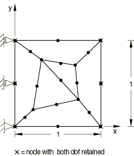

# 3.5.3 子结构中的退化单元

**产品：**Abaqus/Standard  

### 测试的单元

CPS8

### 测试的功能

测试将退化单元纳入子结构定义的能力。

### 问题描述

由标准CPS8单元和退化为6节点三角形的CPS8单元形成平面子结构。在如图所示约束的子结构的选定节点处保留两个位移自由度，并在x=1.0沿线三个节点规定0.2的x方向位移。

### 结果与讨论

结果与解析结果相同，其中沿拉伸方向产生6×10^6的应力。

### 输入文件

[psupdgn1.inp](../eif/psupdgn1.inp)

使用CPS8和退化CPS8单元。

[psupdgn1_gen.inp](../eif/psupdgn1_gen.inp)

在分析psupdgn1.inp中引用的子结构生成文件。

