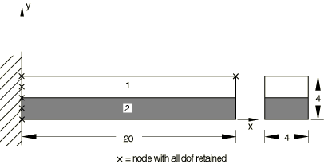

# 3.5.5 Thermal-stress analysis with substructures

**Product: **Abaqus/Standard  

### Elements tested

B21    CPS4R    

### Features tested

The ability to perform thermal stress analysis using substructures is tested.

### Problem description

In the first analysis a cantilevered bimetallic beam is discretized using CPS4R elements. Both displacement degrees of freedom are retained for all nodes at the fixed end and for the tip of the beam. A substructure load case is used to define a temperature load over all nodes comprising the substructure, and a uniform increase in temperature is subsequently prescribed on the usage level.

In the second analysis a substructure is generated from a single B21 element and is used to test thermal preloading of substructures. All degrees of freedom are constrained at one end of the beam, whereas the other end is allowed to expand axially. In the preload step the beam is raised to a temperature of 100. During the analysis the substructure load case is used to apply a temperature of 100 over the entire beam.

In the third analysis a cantilevered bimetallic beam is discretized using CPS4R elements. Both displacement degrees of freedom are retained for all nodes at the fixed end and for the tip of the beam. The substructure load case is used to define a temperature load over all nodes comprising the substructure, and a uniform increase in temperature is prescribed subsequently on the usage level. During substructure generation, controls are set to specify that output of element or nodal information will not be required within the substructure, which reduces the size of the substructure library file.

### Results and discussion

The results for the first and third analyses are identical for the analyses performed with and without substructures. The tip deflection of the beam (Node 511) is 2.060 in the vertical direction. In the third analysis the size of the substructure library file is reduced.

The displacements reported on the global level for node 2 in the second analysis are identical to those reported on the substructure level.

### Input files

[psupthm1.inp](../eif/psupthm1.inp)

CPS4R elements.

[psupthm1_gen.inp](../eif/psupthm1_gen.inp)

Substructure generation file referenced in the analysis psupthm1.inp.

[psupthm2.inp](../eif/psupthm2.inp)

B21 elements.

[psupthm2_gen.inp](../eif/psupthm2_gen.inp)

Substructure generation file referenced in the analysis psupthm2.inp.

[psupthm3.inp](../eif/psupthm3.inp)

CPS4R elements.

[psupthm3_gen.inp](../eif/psupthm3_gen.inp)

Substructure generation file with [*SUBSTRUCTURE GENERATE](../key/key-link.md#usb-kws-ssubgenerate), RECOVERY MATRIX=NO, referenced in the analysis psupthm3.inp.

