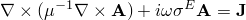
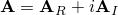
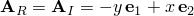
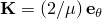
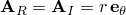
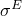
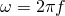
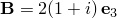

# 3.6.1 Eddy current analysis

**Product: **Abaqus/Standard  

### Elements tested

EMC2D3    EMC2D4    EMC3D4    EMC3D8    

### Features tested

Time-harmonic and transient responses of eddy current boundary value problems with excitations due to volume or body current density  or surface current density .

### Problem description

Two types of problems are solved corresponding to two types of excitations. Both problems result in a constant magnetic flux density  in the domain. The input files with body current excitation  are categorized as CCBL (constant curl body load) problems, and the input files with surface current excitation  are categorized as CCSC (constant curl surface current) problems.

**CCBL problems: **

Only time-harmonic eddy current problems have been tested within this category. The domain in the two-dimensional problems is a square lying in the first quadrant of the plane; in the three-dimensional problems the domain is a cuboid lying in the first octant in space. For the differential equation , the solution sought is , where . For this solution the first term in the differential equation vanishes. Therefore, a nonuniform body load (CJNU) of  is applied everywhere in the domain. Nonzero boundary conditions (distributed surface magnetic vector potential) on the outer boundary and symmetry boundary conditions on the symmetry planes are also specified.

**CCSC problems: **

Both time-harmonic and transient eddy current problems have been tested within this category. The domain for some of the two-dimensional problems is a quarter of a circle lying in the first quadrant of the plane; in the three-dimensional problems the domain is a quarter of a cylinder lying in the first octant in space, with the axis of the cylinder aligned along the global -direction. Surface current loads  are specified on the outer boundary as a Neumann-type boundary condition. Symmetry boundary conditions are specified on the symmetry planes. The analytical solution in this case is  for the time-harmonic problem, which is the same as that of the CCBL problems. The solution (real only) for the transient problem is identical. 

The problems testing the transient eddy current procedure have similar domains (except for the two-dimensional problems with input file names beginning with ccsc_2d_, which consist of stand-alone electromagnetic elements subjected to boundary conditions/loading). In some of the problems the magnetic properties are defined to be different in different regions of the model; in particular, linear properties are used in one region while nonlinear properties are used in another region. The surface current loading results in a constant magnetic field within the domain, but the magnetic flux density varies based on the material behavior. Both isotropic and orthotropic magnetic behavior have been tested.

A few problems also test motional effects on the solution. In all cases a uniform translational velocity is applied. The magnetic field remains the same as the problem without motion, but the electric fields are modified due to the motional effects.

**Material properties: **

Magnetic permeability of  H/m or N/A2 for free space is used throughout for all the time-harmonic problems and in the regions with linear magnetic behavior for the transient problems. For regions with nonlinear magnetic behavior, the response is defined in terms of a B–H curve describing the strength of the magnetic flux density as a function of the strength of the magnetic field. [Table 3.6.1--1](ch03s06abv200.md#table-bh-curve) provides the B–H curve used in these tests. 

**Table 3.6.1–1** Nonlinear B–H response.
| B | H |
| --- | --- |
| 0 | 0 |
| 1000 | 7.9577 105 |
| 1500 | 1.5915 106 |
| 1700 | 2.3873 106 |

A small electrical conductivity (compared to that of a metal) of  = 1.0 or 0.58 S/m is used.

**Excitation frequency for time-harmonic problems: **

 rad/s,  50 or 60 Hz.

**Loading for transient problems: **

Transient problems are loaded with a surface current magnitude that varies with time. Some of the problems use a sinusoidal time variation.

### Results and discussion

For the time-harmonic problems, the results  and  are verified for all the problems everywhere in the domain. For the transient problems, the solutions (after a number of cycles) are typically verified against corresponding time-harmonic solutions; the solutions are often verified by hand calculations.

### Input files

##### **Time-harmonic problems**

[ccbl_8emc2d3_rnd.inp](../eif/ccbl_8emc2d3_rnd.inp)

8 EMC2D3 elements with nonuniform .

[ccbl_8emc2d3_rnd.f](../eif/ccbl_8emc2d3_rnd.f)

User subroutine [`UDECURRENT`](../sub/sub-link.md#sub-xsl-udecurrent) used in ccbl_8emc2d3_rnd.inp.

[ccbl_4emc2d4_rnd.inp](../eif/ccbl_4emc2d4_rnd.inp)

4 EMC2D4 elements with nonuniform  in a cylindrical system and temperature-dependent material properties.

[ccbl_4emc2d4_rnd.f](../eif/ccbl_4emc2d4_rnd.f)

User subroutine [`UDECURRENT`](../sub/sub-link.md#sub-xsl-udecurrent) used in ccbl_4emc2d4_rnd.inp.

[ccbl_24emc3d4_rnd.inp](../eif/ccbl_24emc3d4_rnd.inp)

24 EMC3D4 elements with nonuniform .

[ccbl_24emc3d4_rnd.f](../eif/ccbl_24emc3d4_rnd.f)

User subroutine [`UDECURRENT`](../sub/sub-link.md#sub-xsl-udecurrent) used in ccbl_24emc3d4_rnd.inp.

[ccbl_4emc3d8_rnd.inp](../eif/ccbl_4emc3d8_rnd.inp)

4 EMC3D8 elements with nonuniform .

[ccbl_4emc3d8_rnd.f](../eif/ccbl_4emc3d8_rnd.f)

User subroutine [`UDECURRENT`](../sub/sub-link.md#sub-xsl-udecurrent) used in ccbl_4emc3d8_rnd.inp.

[ccbl_8emc3d6_rnd.f](../eif/ccbl_8emc3d6_rnd.f)

User subroutine [`UDECURRENT`](../sub/sub-link.md#sub-xsl-udecurrent) used in ccbl_8emc3d6_rnd.inp.

[ccbl_200emc2d3_rnd.inp](../eif/ccbl_200emc2d3_rnd.inp)

200 EMC2D3 elements with nonuniform .

[ccbl_200emc2d3_rnd.f](../eif/ccbl_200emc2d3_rnd.f)

User subroutine [`UDECURRENT`](../sub/sub-link.md#sub-xsl-udecurrent) used in ccbl_200emc2d3_rnd.inp.

[ccbl_100emc2d4_reg.inp](../eif/ccbl_100emc2d4_reg.inp)

100 EMC2D4 elements with nonuniform .

[ccbl_100emc2d4_reg.f](../eif/ccbl_100emc2d4_reg.f)

User subroutine [`UDECURRENT`](../sub/sub-link.md#sub-xsl-udecurrent) used in ccbl_100emc2d4_reg.inp.

[ccbl_100emc3d8_reg.inp](../eif/ccbl_100emc3d8_reg.inp)

100 EMC3D8 elements with nonuniform .

[ccbl_100emc3d8_reg.f](../eif/ccbl_100emc3d8_reg.f)

User subroutine [`UDECURRENT`](../sub/sub-link.md#sub-xsl-udecurrent) used in ccbl_100emc3d8_reg.inp.

[ccbl_4emc2d4_rnd_mot.f](../eif/ccbl_4emc2d4_rnd_mot.f)

Same setting as in ccbl_4emc2d4_rnd.inp, with the addition of translational velocity.

[ccbl_200emc2d3_rnd_mot.f](../eif/ccbl_200emc2d3_rnd_mot.f)

Same setting as in ccbl_200emc2d3_rnd.inp, with the addition of translational velocity.

[ccbl_24emc3d4_rnd_mot.inp](../eif/ccbl_24emc3d4_rnd_mot.inp)

Same setting as in ccbl_24emc3d4_rnd.inp, with the addition of translational velocity.

[ccbl_100emc3d8_reg_mot.inp](../eif/ccbl_100emc3d8_reg_mot.inp)

Same setting as in ccbl_100emc3d8_reg.inp, with the addition of translational velocity.

[ccsc_emc2d3.inp](../eif/ccsc_emc2d3.inp)

 EMC2D3 elements with circumferentially uniform  on the outer boundary.

[ccsc_emc2d3_nu.inp](../eif/ccsc_emc2d3_nu.inp)

 EMC2D3 elements with circumferential  specified on the outer boundary using user subroutine [`UDSECURRENT`](../sub/sub-link.md#sub-xsl-udsecurrent).

[ccsc_emc2d3_nu.f](../eif/ccsc_emc2d3_nu.f)

User subroutine [`UDSECURRENT`](../sub/sub-link.md#sub-xsl-udsecurrent) used in ccsc_emc2d3_nu.inp.

[ccsc_emc2d3_ortho.inp](../eif/ccsc_emc2d3_ortho.inp)

 EMC2D3 elements with circumferentially uniform  on the outer boundary and orthotropic material properties.

[ccsc_triquad.inp](../eif/ccsc_triquad.inp)

 EMC2D3 and EMC2D4 elements with circumferentially uniform  on the outer boundary.

##### **Transient problems**

[ccsc_solenoid_hex8_tdsine.inp](../eif/ccsc_solenoid_hex8_tdsine.inp)

 EMC3D8 elements with circumferentially uniform  on the outer boundary.

[ccsc_solenoid_tet4_tdsine.inp](../eif/ccsc_solenoid_tet4_tdsine.inp)

 EMC3D4 elements with circumferentially uniform  on the outer boundary.

[ccsc_solenoid_tet4_td_stb.inp](../eif/ccsc_solenoid_tet4_td_stb.inp)

 EMC3D4 elements with circumferentially uniform  on the outer boundary; also uses stabilization.

[ccsc_2d_nlbh_td.inp](../eif/ccsc_2d_nlbh_td.inp)

 EMC2D3 and EMC2D4 elements with uniform  on the outer boundary.

[ccsc_2d_nlbh_tdsine.inp](../eif/ccsc_2d_nlbh_tdsine.inp)

 EMC2D3 and EMC2D4 elements with uniform  on the outer boundary.

[ccsc_2d_nlbh_td_temp_dep.inp](../eif/ccsc_2d_nlbh_td_temp_dep.inp)

 EMC2D3 and EMC2D4 elements with uniform  on the outer boundary; temperature-dependent material properties.

[ccbl_4emc2d4_rnd_tr_mot.inp](../eif/ccbl_4emc2d4_rnd_tr_mot.inp)

 Same general setting as ccbl_4emc2d4_rnd.inp, but a transient analysis with translational velocity specified. The analysis assumes the same general form of the magnetic vector potential as ccbl_4emc2d4_rnd.inp, but one that is exponentially decreasing with time. User subroutines [`UDECURRENT`](../sub/sub-link.md#sub-xsl-udecurrent) and [`UDEMPOTENTIAL`](../sub/sub-link.md#sub-xsl-udempotential) are utilized.

