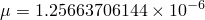

# 3.6.2 静磁分析

**产品：**Abaqus/Standard  

### 测试的单元

EMC2D3    EMC2D4    EMC3D4    EMC3D8

### 测试的功能

承受表面电流密度的电磁域的静磁响应。

### 问题描述

这些问题涉及矩形或圆柱形域，在边界处承受规定的表面电流密度，使得产生的磁场均匀。在其中一个模型中，磁特性不均匀（模型不同区域具有不同磁行为）；因此，磁通密度相应地不均匀。对于不均匀情况，使用线性和非线性材料特性。

**材料特性：**

在具有线性磁行为的区域中，使用自由空间的磁导率 H/m或N/A^2。对于具有非线性磁行为的区域，响应以B-H曲线的形式定义，描述磁通密度强度作为磁场强度的函数。[表3.6.2-1](ch03s06abv201.md#table-bh-curve-magneto)提供了这些测试中使用的B-H曲线。

**表3.6.2-1** 非线性B-H响应。
| B | H |
| --- | --- |
| 0 | 0 |
| 1000 | 7.9577×10^5 |
| 1500 | 1.5915×10^6 |
| 1700 | 2.3873×10^6 |

### 结果与讨论

磁场在域中均匀。对于具有不均匀磁材料行为的问题，磁通密度相应地不均匀。

### 输入文件

[ccsc_4emc2d4_rnd.inp](../eif/ccsc_4emc2d4_rnd.inp)

矩形域，四个EMC2D4单元，在边界上具有均匀。

[ccsc_solenoid_tet4_mqs_stb.inp](../eif/ccsc_solenoid_tet4_mqs_stb.inp)

四分之一圆柱形域，EMC3D4单元，在边界上具有均匀。

