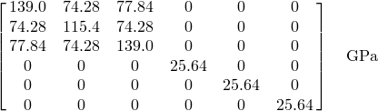
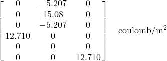
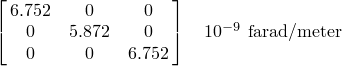
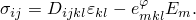
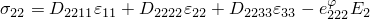
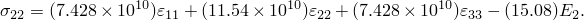
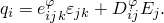
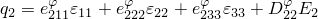
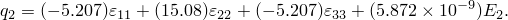

# 3.7.1 压电材料的静态分析

**产品：**Abaqus/Standard  

### 测试的单元

CAX4E

### 测试的功能

讨论并说明了包含压电耦合的材料的静态分析能力。施加了机械载荷和电表面电荷。在[Mercer, Reddy, and Eve (1987)](ch03s07abv202.md#ver-ref-mercerreddyeve)中，分析了承受正弦载荷的问题。使用该问题的模型定义来说明由于恒定施加载荷而产生的静态响应。在以下章节中讨论了适用的线性动力学能力。

### 问题描述

压电陶瓷圆柱同时承受压力载荷和分布式电荷载荷。圆柱体厚度为20 mm，内半径为5 mm，外半径为25 mm。圆柱体在第一步中在顶面承受压力载荷。第二步在顶面施加分布式电荷。顶面和底面都有电极。底面的电势规定为零。电极通过将所有电势设置为相同值的方程生成。

圆柱体建模为轴对称问题，仅使用一个CAX4E单元。PZT4材料的材料特性给出如下：

**弹性矩阵：**

**压电耦合矩阵（应力系数）：**

**介电矩阵：**

材料在2方向极化。

### 结果与讨论

在第一步中，值应等于并相反于施加的垂直压力。它被正确计算为1.0×10^6。其他方向的应力可以忽略。应力计算为：

项计算为（忽略零项）：

或

可以从结果验证这种关系。对于压力载荷，两个方向的电通量密度都可以忽略。考虑到通量守恒方程，这是正确的。电势梯度在垂直方向是恒定的。最大垂直位移1.65×10^-7发生在顶面。

在第二步中，代替压力载荷，将分布式电荷施加到模型的顶面。值应等于并相反于施加到顶面的电荷密度。它被正确计算为1.0×10^-3。另一个方向的通量密度可以忽略。通量密度计算为：

项计算为（忽略零项）：

或

可以从结果验证这种关系。从平衡考虑，此问题应产生无应力状态。应变场使得上述应力方程给出可以忽略的值。

### 输入文件

[ppzostat.inp](../eif/ppzostat.inp)

此分析的输入文件。

### 参考文献

Mercer, C. D., B. D. Reddy, and R. A. Eve, "Finite Element Method for Piezoelectric Media," UCT/CSIR Applied Mechanics Research Unit Technical Report, no.92, April 1987.

